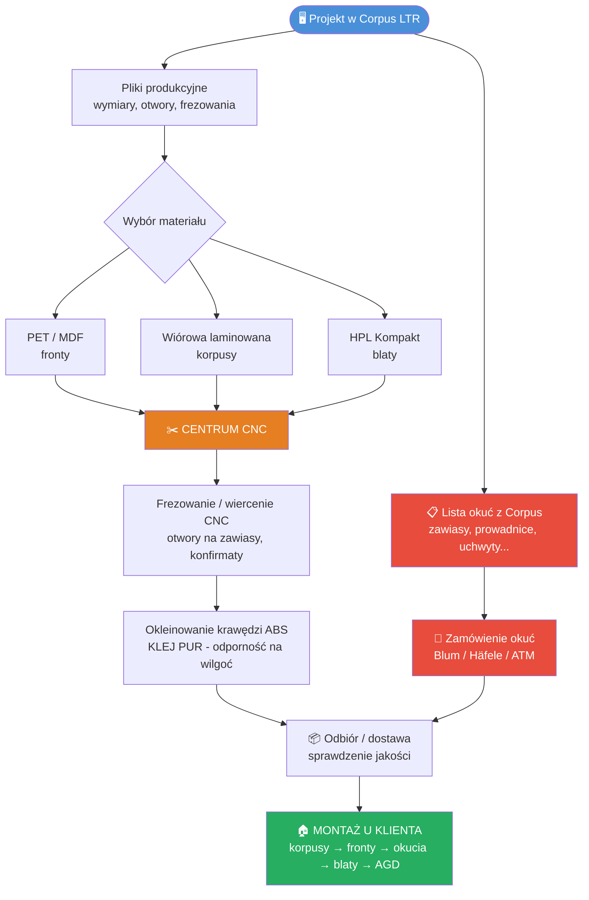

# PROJEKTOWANIE (Corpus LTR) I WSPÓŁPRACA Z CNC

## 1. ZASADY PROJEKTOWE W CORPUS LTR
*   **Blendy maskujące:** Nigdy nie projektuj "na styk". Zawsze zostawiaj min. 3-5 cm po bokach i pod sufitem na blendy docinane na miejscu.
*   **Pułapka "Boków Widocznych":** Jeśli bok szafki (np. słupka lodówkowego) jest widoczny z salonu, MUSI być wykonany z materiału frontowego (np. Egger U702 PM), a nie z taniej płyty korpusowej (ST9).
*   **Omijanie rur:** Zamiast wycinać dziury w plecach u klienta, zmniejsz głębokość konkretnej szafki w Corpusie i zastosuj głębszy blat.
*   **Plecy szafek:** Projektuj plecy z HDF wpuszczane w nut (frez), aby zapewnić sztywność.
*   **Wentylacja:** Pamiętaj o kratkach w cokole i przestrzeni z tyłu dla lodówek w zabudowie. Inaczej sprzęt się spali.

## 2. ZASADY ZLECEŃ NA CNC
*   **Nawierty to podstawa:** Zlecaj nie tylko cięcie i okleinowanie, ale ZAWSZE nawiercanie otworów (pod konfirmaty, mimośrody, zawiasy). Składaj jak klocki IKEA.
*   **Klej PUR:** Wymagaj oklejania krawędzi klejem poliuretanowym (PUR). Jest wodoodporny i termoodporny.
*   **Kontrola:** Sprawdzaj pliki z Corpusa 3 razy przed wysłaniem (uwaga na usłojenie drewna w pionie/poziomie).
*   **Formaty plików:** DXF (rysunki CAD), e-Rozkrój / e-Rozrys (systemy online hurtowni).

## 3. PROCES PRODUKCYJNY (Model Podwykonawstwa)

