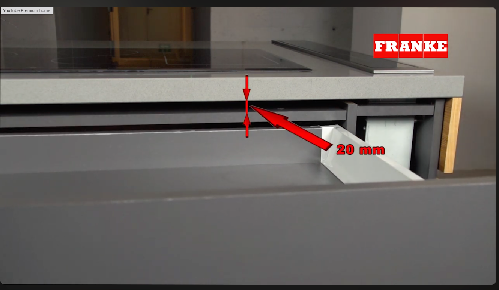
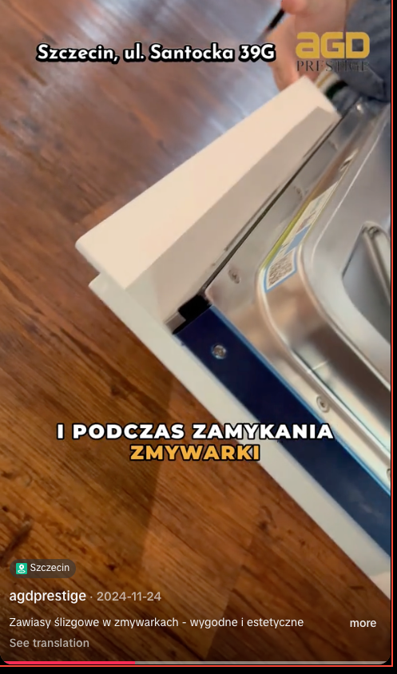
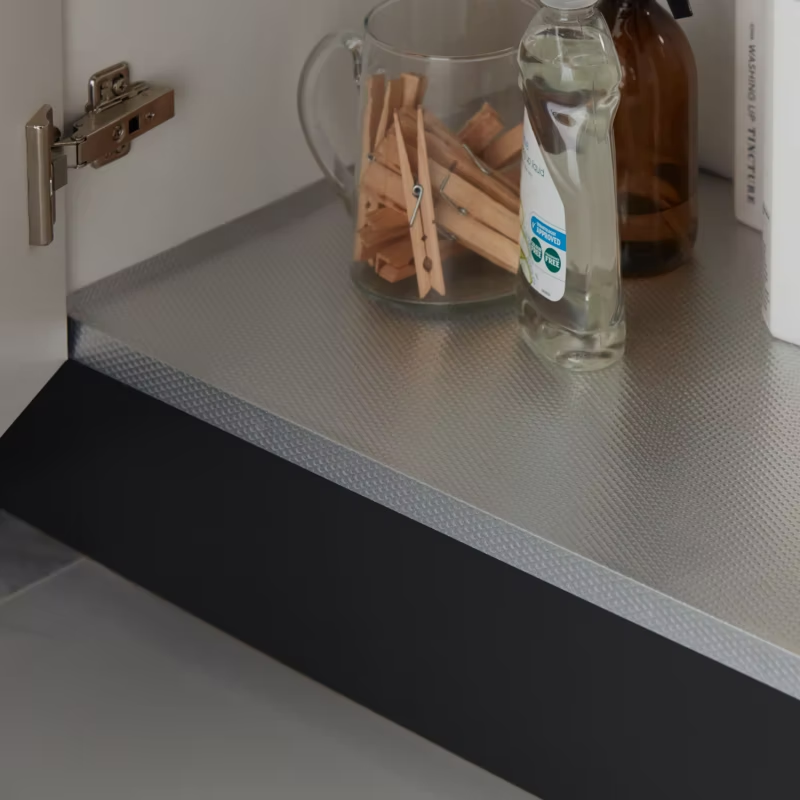
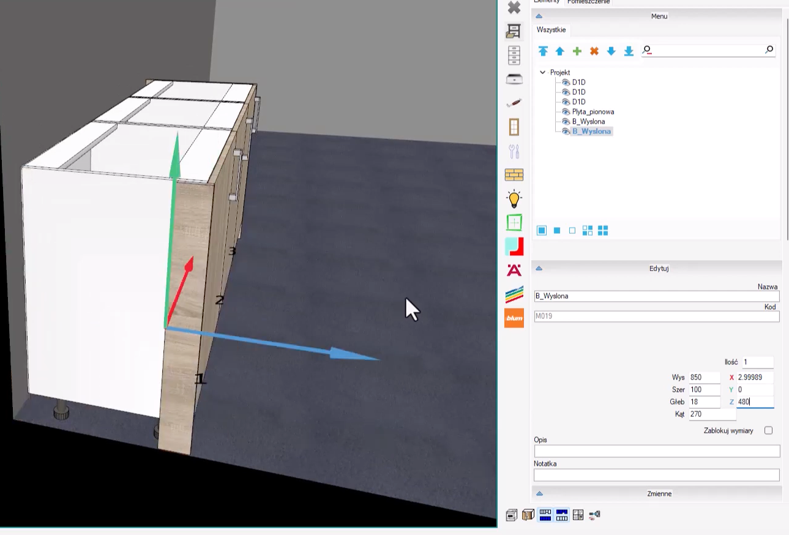
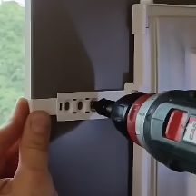

To doskonały pomysł. Zrobienie z tego "ściągi procesowej" to klucz do tego, żebyś na żadnym etapie nie popełnił błędu, który będzie Cię kosztował tysiące złotych. 

Oto Twoja kompletna ściąga, ułożona chronologicznie – od pierwszego spotkania z klientem, aż po oddanie gotowej kuchni.

---

# ŚCIĄGA PROCESOWA: ANEKSY KUCHENNE (Wrocław 2026)
**Standard:** Fronty PET (Egger PerfectSense) + Korpusy (Egger ST9) + Blat Kompaktowy HPL (12 mm)

### ETAP 1: POMIAR I INWENTARYZACJA (U klienta)
*Cel: Przenieść rzeczywistość do komputera i uniknąć "Mitu Prostych Ścian".*

1.  **Sprzęt:** Poziomica laserowa (krzyżowa 360°), dalmierz laserowy, kątownik.
2.  **Złota zasada pomiaru:** Mierz szerokość i wysokość wnęki w **minimum 3 punktach** (przy podłodze, w połowie, pod sufitem). Zapisz najmniejszy wymiar.
3.  **Piony i poziomy:** Sprawdź laserem, czy podłoga jest w poziomie, a ściany trzymają pion. Zaznacz odchyłki.
4.  **Instalacje:** Zmierz dokładnie (co do centymetra) położenie odpływu wody, zaworów, gniazdek elektrycznych i kratki wentylacyjnej.
5.  **Zdjęcia:** Zrób dziesiątki zdjęć wnęki, najlepiej z przyłożoną miarką w newralgicznych punktach.

### ETAP 2: PROJEKTOWANIE (W programie Corpus LTR)
*Cel: Stworzyć bezbłędny projekt, wygenerować pliki na CNC i zamówić materiał.*

1.  **Marginesy bezpieczeństwa (Blendy):** Nigdy nie projektuj szafek "od ściany do ściany". Zostaw **3-5 cm luzu** po bokach i pod sufitem na blendy maskujące.
2.  **Dobór materiałów w Corpusie:**
    *   **Fronty i boki widoczne:** Egger U702 PM (PerfectSense Kaszmir) – *lub inny wybrany kolor PET*.
    *   **Korpusy (wnętrza):** Egger U702 ST9 (Kaszmir mat) – *tania płyta wiórowa 18 mm*.
    *   **Blat:** Kompaktowy HPL (10-12 mm).
3.  **Pułapka "Boków Widocznych":** Upewnij się, że zewnętrzne boki skrajnych szafek (np. słupka na lodówkę) są zaprojektowane z drogiego materiału frontowego (PM), a nie z taniej płyty korpusowej (ST9).
4.  **Konstrukcja szafek:**
    *   Plecy szafek wpuszczane w nut (frez), a nie przybijane na gwoździe (jak w IKEA).
    *   **Szafki pod zlew i indukcję:** Zamiast wiórowych wieńców przednich, zaplanuj **metalowe trawersy** (wymóg przy cienkich blatach HPL).
5.  **Wentylacja:** Zaprojektuj kratki w cokole i przestrzeń z tyłu dla lodówki i piekarnika.
6.  **Generowanie plików na CNC:** Zleć cięcie, okleinowanie (koniecznie **klejem PUR**) oraz **nawiercanie otworów** (pod konfirmaty, zawiasy, podpórki półek). Sprawdź pliki 3 razy przed wysłaniem!

### ETAP 3: LOGISTYKA I PRZYGOTOWANIE DO MONTAŻU
*Cel: Bezpiecznie dowieźć materiał i przygotować narzędzia.*

1.  **Odbiór z CNC:** Sprawdź, czy wszystkie formatki są oklejone właściwym obrzeżem (szczególnie boki widoczne).
2.  **Transport blatów HPL:** Płyty kompaktowe przenoś **zawsze w pionie**. Nigdy nie szuraj płytą o płytę (kurz zarysuje matową powłokę).
3.  **Aklimatyzacja:** Zawieź materiał do klienta dzień wcześniej (lub rano), aby płyty nabrały temperatury pokojowej (18-25°C). Nie tnij zmarzniętego blatu HPL!
4.  **Narzędzia na montaż:** Zagłębiarka z szyną (tarcza z węglika HM do laminatów/aluminium), frezarka, wiertła (w tym 10 mm do rogów blatu), odkurzacz przemysłowy, poziomica laserowa.

### ETAP 4: MONTAŻ KORPUSÓW I FRONTÓW (U klienta)
*Cel: Złożyć szafki w poziomie i dopasować je do krzywych ścian.*

1.  **Składanie:** Złóż korpusy jak klocki LEGO (dzięki nawiertom z CNC).
2.  **Poziomowanie:** Ustaw szafki dolne na nóżkach, używając lasera. To najważniejszy etap – jeśli dół będzie krzywy, blat HPL pęknie.
3.  **Blendy maskujące:** Dotnij blendy boczne i górne zagłębiarką, dopasowując je do krzywizny ścian dewelopera.
4.  **Zabezpieczenia przed wilgocią:** Przykręć aluminiowe listwy ochronne nad zmywarką i blaszki termiczne przy piekarniku.
5.  **Uchwyty:** Zamontuj uchwyty krawędziowe (nakładane na rant frontu). Unikaj systemów Tip-On w dolnych szafkach.

### ETAP 5: OBRÓBKA I MONTAŻ BLATU KOMPAKTOWEGO (HPL 12 mm)
*Cel: Dociąć twardy blat, wyciąć otwory bez pęknięć i zamontować go elastycznie.*

1.  **Cięcie zagłębiarką:** Tnij powoli, zawsze **dekorem (ładną stroną) do góry**. Używaj tarczy do laminatów (HM).
2.  **Wycięcia pod zlew i indukcję (Krytyczny moment!):**
    *   Zaznacz otwór (zachowaj min. 300 mm od krawędzi blatu).
    *   **Wywierć 4 otwory w rogach** wiertłem 10 mm (promień 5 mm). **Nigdy nie zostawiaj ostrych kątów 90 stopni!**
    *   Połącz otwory tnąc zagłębiarką/frezarką. Krawędzie muszą być gładkie.
3.  **Wiercenie od spodu (np. pod zmywarkę):** Używaj wiertła z ogranicznikiem. Zostaw minimum 1,5 mm grubości materiału (wierć max na 10,5 mm).
4.  **Mocowanie blatu:** Nie przykręcaj blatu na sztywno! Użyj elastycznego kleju (np. Ottocoll M500 lub Mamut) punktowo do korpusów/trawersów. Blat musi mieć możliwość pracy (rozszerzania się).
5.  **Zlew podwieszany (opcja):** Użyj dedykowanego zestawu mocującego EGGER (szyny klejone od spodu).

### ETAP 6: PANEL ŚCIENNY (Splashback)
*Cel: Zabezpieczyć ścianę nad blatem (zamiast ryzykownego szkła).*

1.  **Materiał:** Użyj płyty kompaktowej HPL (8-10 mm) lub płyty laminowanej (10 mm) w kolorze blatu/frontów.
2.  **Kierunek słojów:** Upewnij się, że wzór na panelu idzie w tym samym kierunku co na blacie (kierunek maszynowy).
3.  **Otwory na gniazdka:** Wytnij otwornicą na miejscu, idealnie pod wymiar puszek elektrycznych.
4.  **Montaż:** Przyklej panel do ściany elastycznym klejem montażowym. Uszczelnij styk z blatem silikonem.

### ETAP 7: ODBIÓR I EDUKACJA KLIENTA
*Cel: Zakończyć zlecenie, wziąć pieniądze i zabezpieczyć się przed niesłusznymi reklamacjami.*

1.  **Sprzątanie:** Odkurz całą kuchnię (wnętrza szafek też!). Czystość to Twoja wizytówka.
2.  **Instrukcja użytkowania (Wydrukuj i daj do podpisu!):**
    *   Fronty PET (PerfectSense): Myć tylko miękką ściereczką i wodą z mydłem. Zakaz używania mleczek z mikrogranulkami (Cif) i ostrych gąbek!
    *   Blat HPL: Nie kroić nożem bezpośrednio na blacie. Nie stawiać gorących garnków prosto z kuchenki (używać podkładek). Rozlane płyny wycierać na bieżąco.
3.  **Zdjęcia:** Zrób profesjonalne zdjęcia do portfolio (zgodnie z umową z klientem).

## Indukcja - zasady projektowe

https://www.youtube.com/watch?v=LxsZxeljh60

*   **Płyta indukcyjna, która "oddycha":** Indukcja generuje ogromne ilości ciepła od spodu. Jeśli pod nią dasz szufladę na sztućce i zamkniesz ją szczelnie, płyta się przegrzeje i spali (a serwis odrzuci gwarancję).
    *   *Rozwiązanie:* W projekcie CNC obniżam przednią listwę spinającą korpus o 1-2 cm i robię wycięcie w tylnej ściance. Powietrze musi wchodzić pod blatem i uchodzić tyłem.

## Zmywarka  - zasady projektowe
### Zmywarka musi mieć zawiasy ślizgowe!
> https://www.tiktok.com/@agdprestige/video/7440929987374386454

## Szafka pod zlewem
* Szafka zlewowa – strefa podwyższonego ryzyka: Przeciekający syfon to kwestia czasu. Woda na płycie wiórowej to wyrok śmierci dla szafki.
Rozwiązanie: Na dno szafki zlewowej zawsze wklejam **aluminiową matę ociekową**. Kosztuje grosze (ok. 50 zł), a jeśli coś kapnie, woda zostaje na aluminium, nie wsiąkając w płytę.

### Listwa przy ścianie kończąca
https://www.youtube.com/watch?v=0waVo4zKUGM&t=136s

### Narożnik kuchenny / ślepy narożnik

https://www.youtube.com/watch?v=6lN7PfFfOcQ

### Montaż lodówki - zawiasy suwakowe 
https://www.youtube.com/watch?v=Z596L5vUU_8

