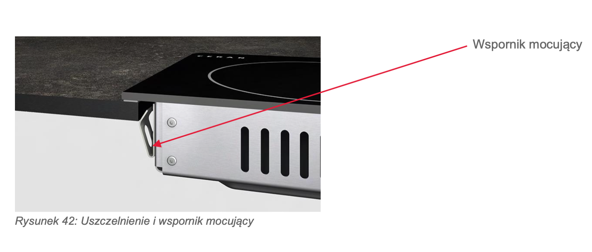
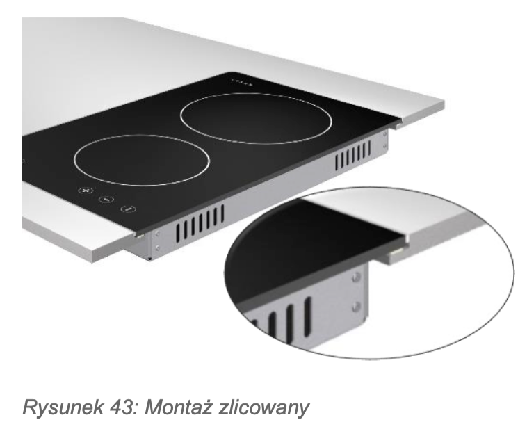
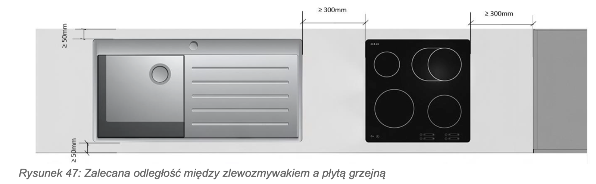
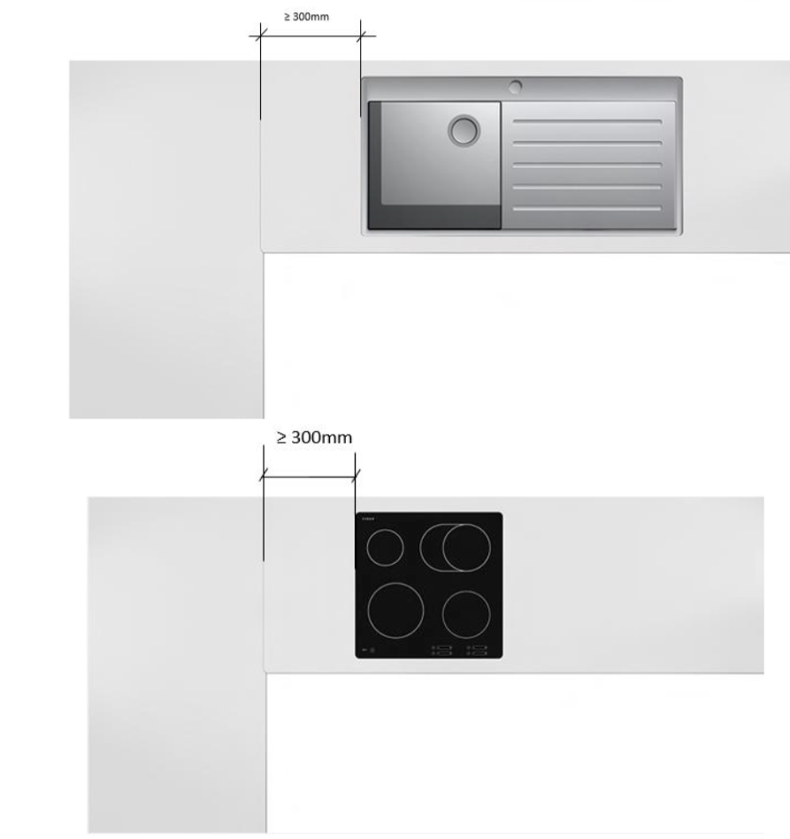

Zgodnie z wytycznymi Eggera dla blatów kompaktowych, mamy do dyspozycji następujące metody montażu płyty grzewczej:

### 1. Montaż standardowy (nakładany) ze wspornikiem mocującym
To najczęstsza sytuacja (pokazana na **Rysunku 42**). Płytę wpuszcza się w wycięty otwór, a jej krawędź opiera się na blacie. 
*   **Haczyk od producenta (bardzo ważny!):** Instrukcja wyraźnie ostrzega, że płyta grzewcza **nie może opierać się bezpośrednio na krawędzi cięcia blatu**. Dlaczego? Bo podczas gotowania temperatura może tam skoczyć nawet do 150°C, co mogłoby uszkodzić laminat. 
*   **Rozwiązanie:** Stosuje się specjalne wsporniki mocujące (blaszki) i fabryczne uszczelki "suche" dostarczone przez producenta płyty. Płyta wisi na wspornikach/uszczelce, zachowując bezpieczny dystans od rdzenia blatu.

### 2. Montaż zlicowany z blatem (na płasko)
Pokazany na **Rysunku 43**. To rozwiązanie premium, które klienci uwielbiają, bo nie ma rantu, o który haczą garnki.
*   Wymaga to ode mnie wyfrezowania precyzyjnego "schodka" (felcu) na krawędzi otworu, tak aby po wklejeniu płyty jej tafla była idealnie w jednej płaszczyźnie z powierzchnią blatu kompaktowego. 

### 3. Montaż z użyciem stelaża
Instrukcja wspomina o tym w tekście jako o opcji alternatywnej, stosowanej w specyficznych przypadkach konstrukcyjnych.

---

### Żelazne zasady stolarza przy wycinaniu otworu pod płytę (według Eggera):

Żeby blat nie pękł i był bezpieczny w użytkowaniu, muszę pilnować kilku wymiarów, które Egger rygorystycznie określa:

1.  **Zabezpieczenie krawędzi:** Choć kompakt jest wodoodporny, Egger zaleca zabezpieczenie wyciętej krawędzi przed wilgocią (profilaktyka nigdy nie zaszkodzi).
2.  **Minimum 50 mm "mięsa":** Pozostała grubość blatu (ramka wokół wycięcia) w żadnym miejscu nie może być węższa niż 5 cm.
3.  **Zasada 300 mm (Rys. 47, 48, 49):** Otwór pod płytę musi znajdować się:
    *   Minimum 300 mm od szafki pionowej (kominowej) / ściany bocznej.
    *   Minimum 300 mm od zlewozmywaka.
    *   **Minimum 300 mm od łączenia blatów!** (Nigdy nie robimy łączenia na wycięciu pod płytę, bo blat tam po prostu pęknie).
4.  **Wzmocnienie szafki (Rys. 50, 51):** Ponieważ wycięcie ogromnego otworu na płytę w cienkim (np. 12 mm) blacie mocno go osłabia, szafka pod płytą **musi mieć zamontowane metalowe trawersy** (poprzeczki). Zapobiega to uginaniu się blatu w najsłabszym punkcie.

Rysunek 48.

Podsumowując: z płytami grzewczymi w kompakcie trzeba uważać głównie na temperaturę (brak bezpośredniego styku z krawędzią) i odpowiednie podparcie szafki metalowymi trawersami. Zlew wybaczy więcej, płyta grzewcza nie.