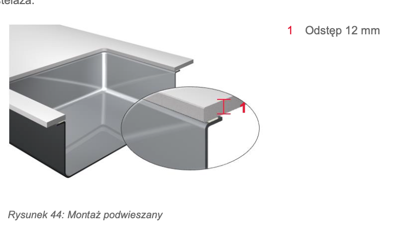
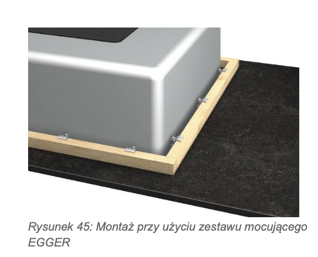
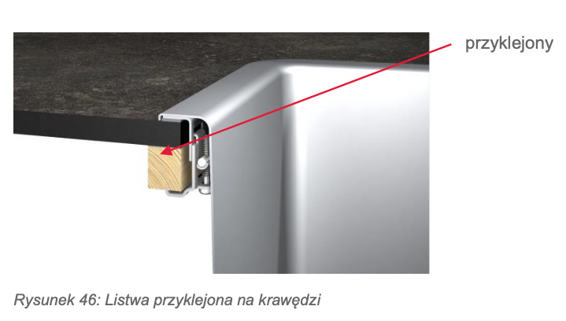

# 1. Budowa laminatu kompaktowego (Z czego to jest zrobione?)

Laminat kompaktowy to w uproszczeniu bardzo gruby laminat HPL. Powstaje w procesie prasowania pod ogromnym ciśnieniem i w wysokiej temperaturze (ok. 150°C). Składa się z trzech głównych warstw:

1.  **Rdzeń (Serce blatu):** Stanowi 90% grubości. Składa się z **kilkudziesięciu** warstw specjalnego papieru kraftowego (celulozowego), który jest nasączony **żywicami** fenolowymi. To właśnie ten proces sprawia, że po sprasowaniu materiał staje się twardy jak kamień i całkowicie odporny na wodę.
2.  **Warstwa dekoracyjna:** To arkusz papieru nasączony żywicą melaminową, na którym nadrukowany jest wzór (np. imitacja dębu, marmuru, betonu lub jednolity kolor).
3.  **Warstwa ochronna (Overlay):** Przezroczysta powłoka na samej górze (często wzbogacona korundem lub utwardzana wiązką elektronów). To ona odpowiada za odporność na zarysowania, ścieranie, uderzenia i wysoką temperaturę.

---

# 2. Rodzaje laminatów kompaktowych

Jako montażysta dzielę kompakty na kilka kategorii, głównie ze względu na to, jak wyglądają po obróbce (czyli jak wygląda ich krawędź) oraz jaką mają powłokę.

#### A. Podział ze względu na kolor rdzenia (Najważniejsze przy projektowaniu!)
Kiedy wyfrezuję krawędź blatu lub wytnę otwór na zlew podwieszany, rdzeń staje się widoczny. Dlatego wyróżniamy:
*   **Kompakty z czarnym rdzeniem:** Najpopularniejsze i najtańsze. Niezależnie od tego, czy blat z wierzchu jest biały, czy w kolorze drewna, jego krawędź będzie czarna. Wygląda to bardzo nowocześnie i tworzy fajny, graficzny obrys kuchni.
*   **Kompakty z białym rdzeniem:** Idealne do białych, minimalistycznych kuchni. Rdzeń jest śnieżnobiały, co daje efekt jednolitej bryły. Są trudniejsze w produkcji, więc zazwyczaj droższe.
*   **Kompakty z rdzeniem barwionym w masie (Monocolor / Color Core):** Rdzeń ma kolor zbliżony do warstwy dekoracyjnej. Jeśli blat jest szary, rdzeń też jest szary. Jeśli blat jest beżowy, rdzeń jest beżowy. Daje to efekt przypominający naturalny kamień lub konglomerat.

#### B. Podział ze względu na wykończenie powierzchni
*   **Standardowe (Mat, Półmat, Struktura):** Powierzchnie imitujące pory drewna, chropowatość łupka czy gładki beton.
*   **Powłoki Anti-Fingerprint (AF) / Nanotechnologiczne (np. Fenix NTM, Forner Velvet):** To obecnie absolutny hit. Powierzchnia jest głęboko matowa, aksamitna w dotyku i nie zostają na niej odciski palców. Co więcej, dzięki nanotechnologii, jeśli klient zrobi na blacie mikrorysy, można je "naprawić" termicznie (np. za pomocą żelazka i wilgotnej szmatki lub magicznej gąbki).

#### C. Podział ze względu na grubość
*   **10 mm i 12 mm:** To standard w blatach kuchennych. Wystarczająco sztywne, by położyć je na szafkach, a jednocześnie dają efekt niesamowitej lekkości.
*   *(Cieńsze, np. 4-8 mm, stosuje się raczej na panele ścienne (tzw. splashbacki) między szafkami).*

---

# 3. Żelazne zasady 

Żeby blat nie pękł i był bezpieczny w użytkowaniu, muszę pilnować kilku wymiarów, które Egger rygorystycznie określa:

1.  **Zabezpieczenie krawędzi:** Choć kompakt jest wodoodporny, Egger zaleca zabezpieczenie wyciętej krawędzi przed wilgocią (profilaktyka nigdy nie zaszkodzi).
2.  **Minimum 50 mm "mięsa":** Pozostała grubość blatu (ramka wokół wycięcia) w żadnym miejscu nie może być węższa niż 5 cm.
3.  **Zasada 300 mm (Rys. 47, 48, 49):** Otwór pod płytę musi znajdować się:
    *   Minimum 300 mm od szafki pionowej (kominowej) / ściany bocznej.
    *   Minimum 300 mm od zlewozmywaka.
    *   **Minimum 300 mm od łączenia blatów!** (Nigdy nie robimy łączenia na wycięciu pod płytę, bo blat tam po prostu pęknie).
4.  **Wzmocnienie szafki (Rys. 50, 51):** Ponieważ wycięcie ogromnego otworu na płytę w cienkim (np. 12 mm) blacie mocno go osłabia, szafka pod płytą **musi mieć zamontowane metalowe trawersy** (poprzeczki). Zapobiega to uginaniu się blatu w najsłabszym punkcie.

Rysunek 48.

### ⚠️ Ważna zasada transportowa (Rada stolarza)
Po wykonaniu wycięcia na zlew, blat należy **zawsze przenosić w pozycji pionowej** (na sztorc), aby uniknąć złamania płyty w najwęższym miejscu.

# 4. Montaż Zlewozmywaków

*   **Dopuszczalne rodzaje montażu:**
    *   **Zlicowany** (na płasko z blatem) – **Rys. 43**.
    *   **Podwieszany** (od spodu) – **Rys. 44**.
*   **System montażu zlewów podwieszanych (Egger):**
    *   Wymaga użycia **specjalnego zestawu montażowego Egger**.
    *   Polega na **przyklejeniu listew mocujących** bezpośrednio do spodu/krawędzi blatu (**Rys. 45 i 46**).

*   **Wymagany klej:**
    *   Należy bezwzględnie użyć **kleju wyrównującego naprężenia** (elastycznego).
    *   Zalecany produkt: **Ottocoll M500** firmy **Otto Chemie**.
*   **Zabezpieczenie przed wilgocią:**
    *   Mimo wodoodpornego rdzenia, **krawędzie wycięcia należy dokładnie zabezpieczyć** przed wnikaniem wilgoci.
*   **Minimalne odległości (Krytyczne!):**
    *   Minimum **300 mm** od **płyty grzewczej** (**Rys. 47**).
    *   Minimum **300 mm** od **połączenia blatów w narożniku**.

---

###  Montaż Metalowych Trawersów (Wzmocnień szafek)

*   **Funkcja trawersów:**
    *   **Zastępują standardowe wieńce** w szafkach pod zlewem/płytą.
    *   **Stabilizują blat** w miejscu osłabienia (wycięcia) i **zapobiegają jego wygięciu** (**Rys. 50**).
    *   Służą do **fizycznego przykręcenia blatu** do szafki.
*   **Parametry nawierceń w bokach korpusu szafki (**Rys. 51 i 52**):**
    *   **Dwa otwory ustalające:** średnica **8 mm**, głębokość **7 mm**.
    *   **Otwór na wkręt Euro (6,3 x 13 mm):** średnica **5 mm**, głębokość **13 mm**.
*   **Mocowanie blatu:**
    *   **Śrubę mocującą** przykręca się od spodu, przez otwór w **metalowym trawersie**.
*   **Dostępne szerokości trawersów Egger:**
    *   Dla szafek: **600, 800, 900, 1000 i 1200 mm**.

---

# 5. Montaż płyty grzewczej

### 1. Montaż standardowy (nakładany) ze wspornikiem mocującym
To najczęstsza sytuacja (pokazana na **Rysunku 42**). Płytę wpuszcza się w wycięty otwór, a jej krawędź opiera się na blacie. 
*   **Haczyk od producenta (bardzo ważny!):** Instrukcja wyraźnie ostrzega, że płyta grzewcza **nie może opierać się bezpośrednio na krawędzi cięcia blatu**. Dlaczego? Bo podczas gotowania temperatura może tam skoczyć nawet do 150°C, co mogłoby uszkodzić laminat. 
*   **Rozwiązanie:** Stosuje się specjalne wsporniki mocujące (blaszki) i fabryczne uszczelki "suche" dostarczone przez producenta płyty. Płyta wisi na wspornikach/uszczelce, zachowując bezpieczny dystans od rdzenia blatu.

### 2. Montaż zlicowany z blatem (na płasko)
Pokazany na **Rysunku 43**. To rozwiązanie premium, które klienci uwielbiają, bo nie ma rantu, o który haczą garnki.
*   Wymaga to ode mnie wyfrezowania precyzyjnego "schodka" (felcu) na krawędzi otworu, tak aby po wklejeniu płyty jej tafla była idealnie w jednej płaszczyźnie z powierzchnią blatu kompaktowego. 

### 3. Montaż z użyciem stelaża
Instrukcja wspomina o tym w tekście jako o opcji alternatywnej, stosowanej w specyficznych przypadkach konstrukcyjnych.

---
