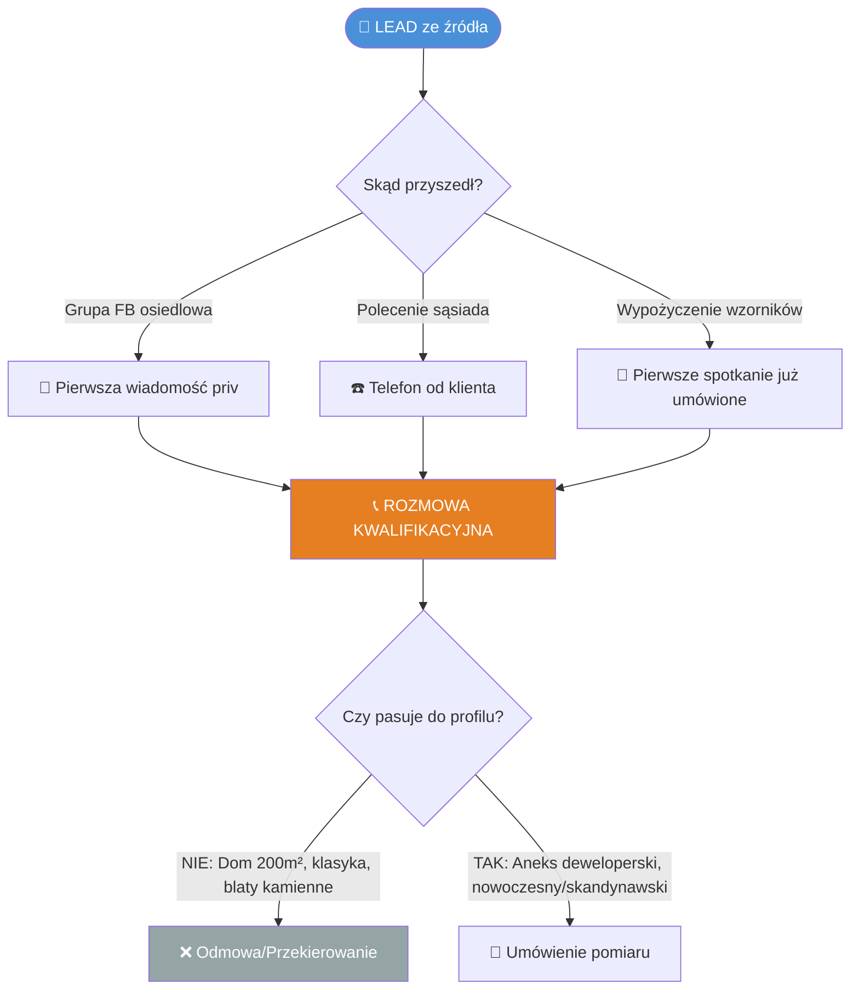
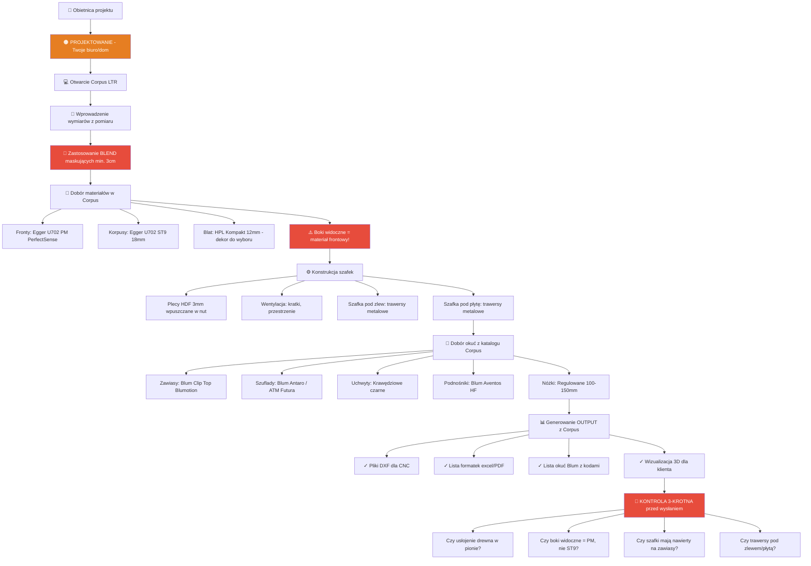
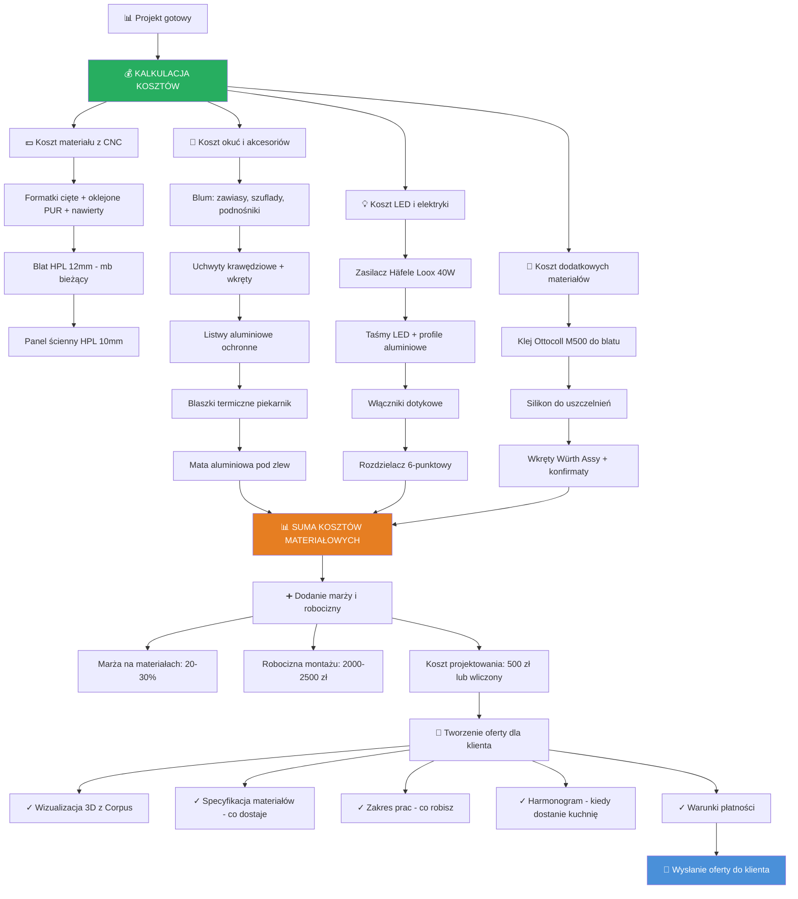
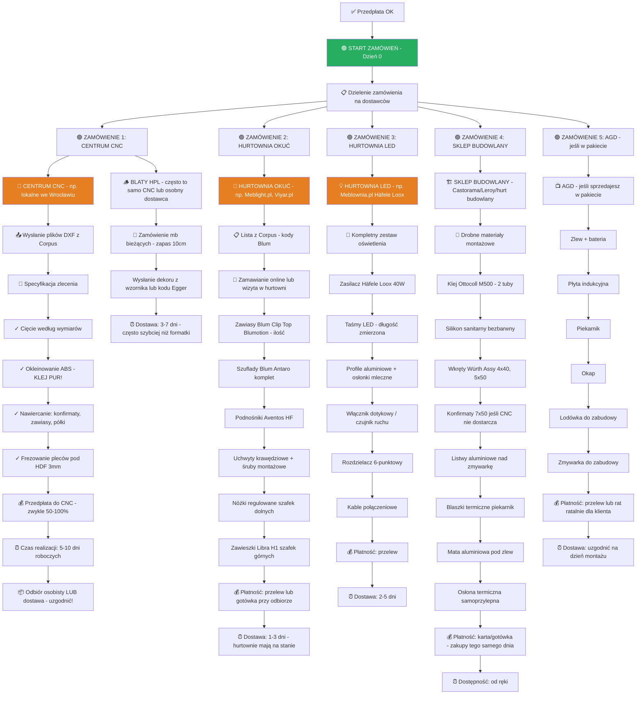

# FLOWCHART: PEŁNY PROCES REALIZACJI KUCHNI (Model Fabless - Polska 2026)

## 🎯 LEGENDA KOLORÓW
- 🔵 **NIEBIESKI** = Działania u klienta
- 🟠 **POMARAŃCZOWY** = Praca biurowa / Projektowanie
- 🟢 **ZIELONY** = Zamówienia / Logistyka
- 🔴 **CZERWONY** = Punkty krytyczne (ryzyko błędu)
- ⚫ **CZARNY** = Płatności

---

## ETAP 1: POZYSKANIE KLIENTA (Lead Generation)



**🎯 CEL ETAPU:** Wykluczyć klientów, którzy chcą stylów/rozwiązań poza Twoją niszą (klasyka, lakiery, granity).

**📋 DOKUMENTY:**
- Skrypt rozmowy telefonicznej (Pytania kwalifikacyjne)
- Lista "Red Flags" (np. "Chcę białą kuchnię high-gloss jak u sąsiada")

---

## ETAP 2: POMIAR I INWENTARYZACJA

```mermaid
flowchart TD
    E[📅 Umówiony pomiar] --> F[🔵 WIZYTA U KLIENTA - Dzień H]
    
    F --> G[📦 Sprzęt do pomiaru]
    G --> G1[✓ Poziomica laserowa 360°]
    G --> G2[✓ Dalmierz laserowy]
    G --> G3[✓ Kątownik]
    G --> G4[✓ Aparat/telefon na zdjęcia]
    G --> G5[✓ Formularz pomiarowy wydrukowany]
    G --> G6[✓ Walizka wzorników Egger]
    
    G6 --> H[🔴 KRYTYCZNY MOMENT: Pomiar 3-punktowy]
    
    H --> H1[📏 Szerokość wnęki: DÓŁ/ŚRODEK/GÓRA]
    H --> H2[📏 Wysokość wnęki: LEWO/ŚRODEK/PRAWO]
    H --> H3[🔍 Sprawdzenie pionu ścian laserem]
    H --> H4[🔍 Sprawdzenie poziomu podłogi]
    H --> H5[📸 Lokalizacja: gniazdka, zawory, odpływ, wentylacja]
    
    H5 --> I[💬 Rozmowa o preferencjach]
    I --> I1[Pokazanie wzorników - fronty PET]
    I --> I2[Pokazanie próbek blatów HPL]
    I --> I3[Omówienie AGD i zabudowy]
    
    I3 --> J[🟠 Wstępna wycena ustna]
    J --> K{Klient zainteresowany?}
    K -->|NIE| STOP2[❌ Podziękowanie za czas]
    K -->|TAK| L[📧 Mail: "Projekt i wycena w 3-5 dni"]
    
    style F fill:#4A90D9,color:#fff
    style H fill:#E74C3C,color:#fff
    style J fill:#E67E22,color:#fff
    style STOP2 fill:#95A5A6,color:#fff
```

**🔴 PUŁAPKI DO UNIKNIĘCIA:**
- Zaufanie wymiarom od klienta ("Deweloper powiedział 260cm") ❌
- Pominięcie sprawdzenia poziomu/pionu ❌
- Brak zdjęć instalacji (będziesz zgadywał później) ❌

**📋 DOKUMENTY DO UTWORZENIA:**
- Formularz pomiarowy (PDF do druku) - checklist
- Arkusz "Lokalizacja instalacji" (szablon do zaznaczania)

---

## ETAP 3: PROJEKTOWANIE W CORPUS LTR



**🔴 NAJCZĘSTSZE BŁĘDY PROJEKTOWE:**
1. Projektowanie "na styk" bez blend (ściana nie jest prosta!) ❌
2. Bok słupka lodówkowego z taniej płyty ST9 zamiast PM ❌
3. Brak trawersów pod płytą indukcyjną (blat się ugnie!) ❌
4. Zapomnienie o kratce wentylacyjnej w cokole lodówki ❌

**📋 DOKUMENTY:**
- Checklist przed wysyłką do CNC (wydruk A4)

---

## ETAP 4: WYCENA DLA KLIENTA



**💰 STRUKTURA WYCENY (Przykład aneks 2,6mb):**

| Pozycja | Koszt zakupu | Cena dla klienta |
|---------|--------------|------------------|
| Materiał z CNC (formatki) | 2800 zł | 3600 zł |
| Blat HPL 3mb | 600 zł | 900 zł |
| Panel ścienny HPL | 300 zł | 450 zł |
| Okucia Blum komplet | 1500 zł | 2000 zł |
| LED Häfele zestaw | 400 zł | 600 zł |
| Akcesoria (kleje, listwy) | 370 zł | 450 zł |
| **RAZEM materiały** | **5970 zł** | **8000 zł** |
| Robocizna montaż 2 dni | - | 2500 zł |
| **RAZEM dla klienta** | - | **10 500 zł** |
| **Twój zysk** | - | **4530 zł** |

---

## ETAP 5: AKCEPTACJA I PRZEDPŁATA

```mermaid
flowchart TD
    W[📧 Oferta wysłana] --> X{Reakcja klienta?}
    
    X -->|Cisza przez 3 dni| X1[📱 Follow-up: "Czy miał Pan czas przejrzeć?"]
    X -->|Pytania/negocjacje| X2[☎️ Rozmowa wyjaśniająca]
    X -->|Akceptacja| Y[✅ KLIENT AKCEPTUJE]
    
    X1 --> X{Reakcja klienta?}
    X2 --> X{Reakcja klienta?}
    
    Y --> Z[📝 Podpisanie umowy]
    Z --> Z1[Umowa zawiera: zakres, materiały, termin, płatności]
    Z1 --> Z2[Klient podpisuje, Ty podpisujesz]
    
    Z2 --> AA[⚫ PRZEDPŁATA 50%]
    AA --> AA1[💳 Przelew na konto]
    AA1 --> AA2[⏰ Oczekiwanie na wpływ - do 2 dni]
    
    AA2 --> AB{Wpłata OK?}
    AB -->|NIE po 3 dniach| AC[📱 Przypomnienie klientowi]
    AB -->|TAK| AD[✅ Można zamawiać materiały!]
    
    style Y fill:#27AE60,color:#fff
    style AA fill:#2C3E50,color:#fff
    style AD fill:#27AE60,color:#fff
```

**📋 DOKUMENTY DO UTWORZENIA:**
- Szablon umowy (konsultacja z prawnikiem!)
- Mail "Follow-up po 3 dniach"
- Mail "Potwierdzenie wpłaty przedpłaty"

---

## ETAP 6: ZAMÓWIENIA MATERIAŁÓW (Orkiestracja 5 dostawców)



**🔴 TYPOWE PROBLEMY I JAK ICH UNIKAĆ:**

### Problem 1: CNC tnie źle bo błąd w pliku
**Rozwiązanie:** 
- Zawsze dzwoń do CNC dzień po wysłaniu plików
- Pytaj: "Czy pliki są OK? Czy coś was zdziwiło?"
- Niektóre CNC mają własnego projektanta - poproś o weryfikację

### Problem 2: Hurtownia okuć nie ma Bluma na stanie
**Rozwiązanie:**
- Zamawiaj okucia NAJPIERW (nawet przed CNC)
- Miej plan B: Häfele / Hettich jako alternatywa
- Dodawaj 10% zapasu (jeden zawias więcej się przyda)

### Problem 3: Klient chce zmienić kolor frontu tydzień przed montażem
**Rozwiązanie:**
- W umowie zapis: "Zmiany po zamówieniu = +30% kosztu materiału"
- Zawsze pytaj przed zamówieniem: "Czy na 100% ten kolor?"

### Problem 4: Blaty HPL przyszły w złym dekorze
**Rozwiązanie:**
- Przy zamówieniu wysyłaj ZDJĘCIE próbki ze wzornika
- Nie polegaj tylko na kodzie (np. F461 - Dąb Halifax)
- Sprawdzaj przy odbiorze - nie podpisuj WZ bez kontroli!

**📋 DOKUMENTY DO UTWORZENIA:**
- Szablon maila do CNC (ze specyfikacją)
- Excel "Tracking zamówień" (kto, co, kiedy, status)
- Checklisty odbioru materiałów

---

## ETAP 7: LOGISTYKA I PRZYGOTOWANIE MONTAŻU

```mermaid
flowchart TD
    H1E[📦 Formatki z CNC gotowe] --> M1{Odbiór czy dostawa?}
    I1D[📦 Okucia dostarczone] --> M2[📍 Magazyn tymczasowy]
    J1C[📦 LED dostarczone] --> M2
    K1C[📦 Drobne materiały kupione] --> M2
    H2C[📦 Blaty HPL dostarczone] --> M2
    
    M1 -->|Odbiór osobisty| M1A[🚗 Jadę po formatki busem/przyczepą]
    M1 -->|Dostawa| M1B[🚚 CNC dowozi pod adres klienta]
    
    M1A --> M3[📦 Kontrola jakości przy odbiorze]
    M1B --> M3
    
    M3 --> M3A[✓ Sprawdzenie każdej formatki]
    M3A --> M3B[✓ Czy okleinowanie równe - brak fug?]
    M3B --> M3C[✓ Czy nawierty w dobrych miejscach?]
    M3C --> M3D[✓ Czy wymiary zgodne z projektem?]
    
    M3D --> M4{Wszystko OK?}
    M4 -->|NIE - błąd CNC| M4A[📱 Reklamacja natychmiastowa!]
    M4A --> M4B[⏰ Czekam na poprawkę - 3-5 dni]
    M4B --> M3
    
    M4 -->|TAK| M5[📦 Pakowanie do transportu]
    
    M2 --> M5
    
    M5 --> M5A[🔴 Blaty HPL - TYLKO W PIONIE!]
    M5A --> M5B[Formatki chronione folią bąbelkową]
    M5B --> M5C[Okucia w pudełkach - segregacja]
    
    M5C --> M6[📅 Kontakt z klientem - ustalenie daty montażu]
    M6 --> M6A[☎️ Telefon: "Materiały kompletne, gotowy montować"]
    M6A --> M6B[📅 Ustalenie terminu - zwykle 2 dni montażu]
    M6B --> M6C[✉️ Potwierdzenie SMS: data, godzina, co przygotować]
    
    M6C --> M7[📋 Checklist do klienta przed montażem]
    M7 --> M7A[Czy wnęka jest pusta?]
    M7A --> M7B[Czy gniazdka elektryczne są sprawne?]
    M7B --> M7C[Czy zawory wody są odkręcone?]
    M7C --> M7D[Czy podłoga chroniona folią?]
    M7D --> M7E[Czy mamy dostęp do toalety i wody?]
    
    M7E --> M8[🚗 Pakowanie samochodu - dzień przed]
    M8 --> M8A[📦 Wszystkie formatki]
    M8A --> M8B[📦 Blaty HPL w pionie!]
    M8B --> M8C[🔧 Narzędzia - kompletny zestaw]
    
    M8C --> N1[🔧 MOBILNY WARSZTAT - Checklist narzędzi]
    N1 --> N1A[✓ Zagłębiarka + szyna prowadząca]
    N1A --> N1B[✓ Tarcze: HM do laminatów, do drewna]
    N1B --> N1C[✓ Frezarka + frezy: 6mm, 8mm, 10mm]
    N1C --> N1D[✓ Wiertarko-wkrętarka + bity Torx]
    N1D --> N1E[✓ Wiertła: 5mm, 8mm, 10mm, 35mm Forstner]
    N1E --> N1F[✓ Poziomica laserowa 360°]
    N1F --> N1G[✓ Poziomica tradycyjna 60cm]
    N1G --> N1H[✓ Kątownik stalowy]
    N1H --> N1I[✓ Dalmierz laserowy]
    N1I --> N1J[✓ Ściski kątowe - min. 4 szt]
    N1J --> N1K[✓ Młotek gumowy]
    N1K --> N1L[✓ Klucze imbusowe - zestaw]
    N1L --> N1M[✓ Nóż tapicerski + ostrza]
    N1M --> N1N[✓ Pistolet do kleju/silikonu]
    N1N --> N1O[✓ Taśma malarska]
    N1O --> N1P[✓ Odkurzacz przemysłowy + worki]
    N1P --> N1Q[✓ Przedłużacze 20m + rozgałęźniki]
    N1Q --> N1R[✓ Latarka czołowa]
    N1R --> N1S[✓ Odzież robocza + ochraniacze kolan]
    
    N1S --> M9[📦 Pakowanie materiałów eksploatacyjnych]
    M9 --> M9A[✓ Klej Ottocoll M500 - 2 tuby]
    M9A --> M9B[✓ Silikon bezbarwny]
    M9B --> M9C[✓ Wkręty Würth Assy - różne długości]
    M9C --> M9D[✓ Konfirmaty zapasowe]
    M9D --> M9E[✓ Tarcza ścierna 120 do szlifowania]
    M9E --> M9F[✓ Ściereczki mikrofibrowe]
    M9F --> M9G[✓ Środek do czyszczenia PET]
    
    M9G --> M10[📄 Dokumenty do zabrania]
    M10 --> M10A[✓ Wydruk projektu 3D]
    M10A --> M10B[✓ Lista formatek i okuć]
    M10B --> M10C[✓ Instrukcje montażu AGD]
    M10C --> M10D[✓ Karta gwarancyjna dla klienta]
    M10D --> M10E[✓ Instrukcja pielęgnacji - Egger PDF]
    
    M10E --> O[✅ GOTOWY DO MONTAŻU!]
    
    style M3 fill:#E74C3C,color:#fff
    style M4 fill:#E74C3C,color:#fff
    style M5A fill:#E74C3C,color:#fff
    style O fill:#27AE60,color:#fff
```

**🔴 KRYTYCZNE ZASADY TRANSPORTU:**

1. **Blaty HPL - ZAWSZE W PIONIE**
   - Poziomo się zarysują od siebie nawzajem
   - Chronić krawędzie pianką

2. **Formatki - segregacja**
   - Dno szafek oddzielnie
   - Fronty oddzielnie (najdelikatniejsze!)
   - Boki i półki razem

3. **Okucia - pudełka opisane**
   - Box 1: Zawiasy
   - Box 2: Prowadnice szuflad
   - Box 3: Uchwyty i drobne

---

## ETAP 8: MONTAŻ DZIEŃ 1 - KORPUSY I INSTALACJE

```mermaid
flowchart TD
    O[✅ Przyjazd na budowę] --> P1[🔵 DZIEŃ 1 - Godzina 8:00]
    
    P1 --> P2[👋 Przywitanie z klientem]
    P2 --> P2A[Pokazanie materiałów]
    P2A --> P2B[Omówienie harmonogramu 2 dni]
    P2B --> P2C[Ustalenie gdzie klient ma być - prośba o spokój]
    
    P2C --> P3[🧹 Przygotowanie wnęki]
    P3 --> P3A[Rozłożenie folii ochronnej na podłodze]
    P3A --> P3B[Sprawdzenie instalacji wod-kan, prądu]
    P3B --> P3C[Ustawienie stołu roboczego składanego]
    
    P3C --> P4[📏 Weryfikacja pomiaru - POWTÓRKA]
    P4 --> P4A[🔴 Pomiar kontrolny laserem]
    P4A --> P4B[Porównanie z projektem Corpus]
    
    P4B --> P5{Wymiary się zgadzają?}
    P5 -->|NIE - odchyłka >5mm| P5A[❌ STOP - Telefon do klienta]
    P5A --> P5B[Decyzja: blendy szersze lub przesunięcie szafek]
    
    P5 -->|TAK| P6[🔧 Montaż szafek DOLNYCH - START]
    
    P6 --> P7[Złożenie pierwszego korpusu dolnego]
    P7 --> P7A[Ułożenie dna szafki]
    P7A --> P7B[Montaż boków - konfirmaty + klej w narożnikach]
    P7B --> P7C[Wpuszczenie pleców HDF w nut]
    P7C --> P7D[Montaż wieńca przedniego / trawersów metalowych]
    P7D --> P7E[Sprawdzenie kąta 90° - kątownik]
    
    P7E --> P8[Montaż nóżek regulowanych]
    P8 --> P8A[4 nóżki pod szafkę - rogi]
    P8A --> P8B[Wstępna regulacja wysokości ~10cm]
    
    P8B --> P9[Ustawienie szafki w linii]
    P9 --> P9A[🔴 Złapanie poziomu - laser + poziomica]
    P9A --> P9B[Regulacja każdej nóżki osobno]
    P9B --> P9C[Sprawdzenie czy szafka nie chwieje się]
    
    P9C --> P10{Jest więcej szafek dolnych?}
    P10 -->|TAK| P11[Składanie następnej szafki]
    P11 --> P12[Łączenie szafek ze sobą]
    P12 --> P12A[Wyrównanie wysokości - laser]
    P12A --> P12B[Spięcie konfirmatami przez boki]
    P12B --> P12C[Doszczelnienie fugą - taśma]
    P12C --> P10
    
    P10 -->|NIE| P13[✅ Wszystkie dolne ustawione i połączone]
    
    P13 --> P14[🔧 Montaż szafek GÓRNYCH]
    P14 --> P15[Złożenie korpusów górnych - tak jak dolne]
    
    P15 --> P16[📏 Wyznaczenie linii montażowej na ścianie]
    P16 --> P16A[Pomiar: dół korpusu 145cm od podłogi - standard]
    P16A --> P16B[Laser poziomy - przeciągnięcie linii]
    P16B --> P16C[Zaznaczenie ołówkiem na ścianie]
    
    P16C --> P17[🔩 Montaż szyny montażowej / zawieszek]
    P17 --> P17A[Przykręcenie szyny do ściany - kołki chemiczne]
    P17A --> P17B[Sprawdzenie poziomu szyny]
    
    P17B --> P18[🪝 Zawieszanie szafek górnych]
    P18 --> P18A[Wkręcenie zawieszek Libra H1 do korpusów]
    P18A --> P18B[Podniesienie szafki - pomoc 2 osoby!]
    P18B --> P18C[Zaczepianie na szynę]
    P18C --> P18D[Regulacja głębokości i pionu]
    
    P18D --> P19{Wszystkie górne powieszone?}
    P19 -->|NIE| P18
    P19 -->|TAK| P20[Spięcie górnych ze sobą]
    
    P20 --> P21[📐 Docinanie BLEND maskujących]
    P21 --> P21A[🔴 Pomiar szczeliny: góra, środek, dół]
    P21A --> P21B[Przeniesienie krzywizny na blendę]
    P21B --> P21C[Docięcie zagłębiarką + szyna]
    P21C --> P21D[Testowe przyłożenie - dopasowanie]
    P21D --> P21E[Montaż blendy - klej + pineski]
    
    P21E --> P22[🚰 Instalacje wodno-kanalizacyjne]
    P22 --> P22A[Wyprowadzenie podłączeń przez otwory w szafce]
    P22A --> P22B[Montaż zlewozmywaka - testowo]
    P22B --> P22C[Podłączenie syfonów, zaworów]
    
    P22C --> P23[⚡ Instalacje elektryczne]
    P23 --> P23A[Sprawdzenie czy gniazdka działają]
    P23A --> P23B[Wyprowadzenie kabli dla: piekarnik, płyta, LED]
    
    P23B --> P24[🧹 Sprzątanie po dniu 1]
    P24 --> P24A[Odkurzenie wnętrz szafek]
    P24A --> P24B[Wyniesienie śmieci - odpady z formatek]
    P24B --> P24C[Zabezpieczenie materiałów na noc]
    
    P24C --> P25[📸 Zdjęcia postępu dla klienta]
    P25 --> P26[🏠 Wyjazd - Dzień 1 zakończony]
    
    style P4A fill:#E74C3C,color:#fff
    style P5 fill:#E74C3C,color:#fff
    style P9A fill:#E74C3C,color:#fff
    style P21A fill:#E74C3C,color:#fff
    style P26 fill:#27AE60,color:#fff
```



**⏰ TYPOWY TIMELINE DZIEŃ 1:**
- 8:00-9:00 - Wnoszenie, przygotowanie
- 9:00-13:00 - Montaż korpusów dolnych + poziomowanie
- 13:00-13:30 - Przerwa obiad
- 13:30-17:00 - Montaż korpusów górnych + blendy
- 17:00-18:00 - Instalacje wod-kan, sprzątanie

---

## ETAP 9: MONTAŻ DZIEŃ 2 - BLATY, FRONTY, AGD, FINALIZACJA

```mermaid
flowchart TD
    P26[🏠 Przyjazd Dzień 2 - 8:00] --> Q1[☕ Przywitanie klienta]
    
    Q1 --> Q2[🔧 Montaż BLATU HPL - NAJWAŻNIEJSZY MOMENT]
    
    Q2 --> Q3[📦 Wniesienie blatu w pionie]
    Q3 --> Q3A[Aklimatyzacja - jeśli blat z zimnego magazynu]
    Q3A --> Q3B[Odczekanie 30 min do temp. pokojowej]
    
    Q3B --> Q4[📏 Pomiar i wyznaczenie cięć]
    Q4 --> Q4A[Pomiar długości blatu nad szafkami]
    Q4A --> Q4B[Zaznaczenie linii cięcia po spodzie - ołówek]
    Q4B --> Q4C[🔴 Pamiętaj: występ blatu 3-4cm przed szafki]
    
    Q4C --> Q5[✂️ Cięcie blatu zagłębiarką]
    Q5 --> Q5A[Ustawienie szyny prowadzącej]
    Q5A --> Q5B[🔴 Tarcza HM do laminatów - 60+ zębów]
    Q5B --> Q5C[Cięcie DEKOREM DO GÓRY - wolno, bez pośpiechu]
    Q5C --> Q5D[Odkurzanie na bieżąco]
    
    Q5D --> Q6[🔴 WYCIĘCIE OTWORU POD ZLEW]
    Q6 --> Q6A[Przyłożenie szablonu zlewu / ręczne zaznaczenie]
    Q6A --> Q6B[⚠️ Min. 50mm ramki wokół otworu!]
    Q6B --> Q6C[⚠️ Min. 300mm od krawędzi bocznych!]
    
    Q6C --> Q6D[🔴 Wiercenie narożników - wiertło 10mm]
    Q6D --> Q6E[⚠️ Koniecznie zaokrąglone - NIE OSTRE KĄTY!]
    Q6E --> Q6F[Połączenie otworów - frezarka / zagłębiarka]
    Q6F --> Q6G[Wygładzenie krawędzi - papier ścierny 120]
    
    Q6G --> Q7[🔴 WYCIĘCIE OTWORU POD PŁYTĘ INDUKCYJNĄ]
    Q7 --> Q7A[Szablon z instrukcji płyty]
    Q7A --> Q7B[⚠️ Min. 300mm od zlewu!]
    Q7B --> Q7C[⚠️ Min. 300mm od ściany bocznej!]
    Q7C --> Q7D[Wiercenie narożników 10mm]
    Q7D --> Q7E[Wycięcie otworu - frezarka]
    
    Q7E --> Q8[🔧 Montaż trawersów metalowych pod blatem]
    Q8 --> Q8A[Przykręcenie do boków szafki]
    Q8A --> Q8B[Sprawdzenie poziomowania szafek pod blatem]
    
    Q8B --> Q9[🧴 Klejenie blatu do korpusów]
    Q9 --> Q9A[⚠️ NIE przykręcać na sztywno!]
    Q9A --> Q9B[Klej elastyczny Ottocoll M500 - punktowo]
    Q9B --> Q9C[Nakładanie kropel co 30cm na trawersy]
    Q9C --> Q9D[Położenie blatu - wyrównanie]
    Q9D --> Q9E[Dociśnięcie obciążnikami - czekanie 2h]
    
    Q9E --> Q10[🚰 Montaż ZLEWOZMYWAKA]
    Q10 --> Q10A[Zlew podwieszany - zestaw Egger]
    Q10A --> Q10B[Klejenie listew mocujących od spodu]
    Q10B --> Q10C[Uszczelnienie krawędzi silikonem]
    Q10C --> Q10D[Podłączenie syfonów i baterii]
    
    Q10D --> Q11[🔌 Montaż PŁYTY INDUKCYJNEJ]
    Q11 --> Q11A[Wsporniki mocujące z kompletu płyty]
    Q11A --> Q11B[Uszczelka sucha - NIE bezpośrednio na HPL]
    Q11B --> Q11C[Wpuszczenie płyty w otwór]
    Q11C --> Q11D[Podłączenie elektryczne - elektryk lub klient]
    
    Q11D --> Q12[🪟 Montaż PANELU ŚCIENNEGO HPL]
    Q12 --> Q12A[Pomiar przestrzeni między blatem a górą]
    Q12A --> Q12B[Docięcie płyty HPL - zagłębiarka]
    Q12B --> Q12C[🔴 Wycięcie otworów na gniazdka - otwornica]
    Q12C --> Q12D[Klejenie do ściany - klej montażowy]
    Q12D --> Q12E[Uszczelnienie styku z blatem - silikon]
    
    Q12E --> Q13[🚪 Montaż FRONTÓW]
    Q13 --> Q14[Zawiasy Blum Clip Top]
    Q14 --> Q14A[Montaż zawiasów do frontów - nawierty z CNC]
    Q14A --> Q14B[Nawierty pod blaszki zawiasów - 35mm Forstner]
    Q14B --> Q14C[Przykręcenie zawiasów do frontów]
    
    Q14C --> Q15[Montaż frontów do korpusów]
    Q15 --> Q15A[Zaczepianie frontów na zawiasach korpusu]
    Q15A --> Q15B[🔴 Regulacja fugi - równe odstępy 3mm]
    Q15B --> Q15C[Regulacja głębokości - fronty w linii]
    
    Q15C --> Q16[🔩 Montaż UCHWYTÓW krawędziowych]
    Q16 --> Q16A[Przykręcanie od wewnątrz szafki]
    Q16A --> Q16B[Sprawdzenie czy dobrze trzymają]
    
    Q16B --> Q17[📦 Montaż SZUFLAD Blum Antaro]
    Q17 --> Q17A[Montaż prowadnic do boków korpusu]
    Q17A --> Q17B[Osadzenie szuflad - kliknięcie]
    Q17B --> Q17C[Regulacja wysokości szuflady]
    Q17C --> Q17D[Test cichego domyku Blumotion]
    
    Q17D --> Q18[📺 Montaż AGD]
    Q18 --> Q18A[🧊 Lodówka w zabudowie - PLAYBOOK osobny]
    Q18A --> Q18B[🍽️ Zmywarka - zawiasy ślizgowe!]
    Q18B --> Q18C[🔥 Piekarnik - osłony termiczne]
    Q18C --> Q18D[💨 Okap - montaż, podłączenie]
    
    Q18D --> Q19[💡 Montaż OŚWIETLENIA LED]
    Q19 --> Q19A[Przyklejenie profili aluminiowych pod górnymi]
    Q19A --> Q19B[Wpuszczenie taśm LED w profile]
    Q19B --> Q19C[Podłączenie do zasilacza Häfele Loox]
    Q19C --> Q19D[Routing kabli - ukrycie w szafkach]
    Q19D --> Q19E[Montaż włącznika dotykowego]
    Q19E --> Q19F[Test - włączenie oświetlenia]
    
    Q19F --> Q20[🔧 Montaż AKCESORIÓW ochronnych]
    Q20 --> Q20A[Listwa aluminiowa nad zmywarką]
    Q20A --> Q20B[Blaszki termiczne boki piekarnika]
    Q20B --> Q20C[Mata aluminiowa dno szafki zlewowej]
    Q20C --> Q20D[Osłona termiczna pod płytą indukcyjną]
    
    Q20D --> Q21[🧹 FINALNE SPRZĄTANIE]
    Q21 --> Q21A[Odkurzenie wszystkich wnętrz szafek]
    Q21A --> Q21B[Przetarcie frontów PET - mikrofiber + woda]
    Q21B --> Q21C[Wypolerowanie blatu HPL]
    Q21C --> Q21D[Usunięcie śmieci i folii ochronnej]
    Q21C --> Q21E[Posprzątanie narzędzi do samochodu]
    
    Q21E --> Q22[📸 Sesja ZDJĘCIOWA dla portfolio]
    Q22 --> Q22A[Zdjęcia całości + zbliżenia detali]
    Q22A --> Q22B[Wideo panoramiczne dla social media]
    
    Q22B --> Q23[📋 ODBIÓR z klientem]
    Q23 --> Q23A[Wspólne przejście przez kuchnię]
    Q23A --> Q23B[Test wszystkich frontów, szuflad]
    Q23B --> Q23C[Test AGD - czy działa]
    Q23C --> Q23D[Test oświetlenia LED]
    
    Q23D --> Q24[📄 Edukacja klienta]
    Q24 --> Q24A[Wydruk: Instrukcja pielęgnacji Egger]
    Q24A --> Q24B[⚠️ Fronty PET - tylko miękka ścierka!]
    Q24B --> Q24C[⚠️ Blat HPL - nie kroić, nie gorące garnki]
    Q24C --> Q24D[⚠️ Gdzie są zawory, bezpieczniki AGD]
    
    Q24D --> Q25[🔧 Karta gwarancyjna]
    Q25 --> Q25A[24 miesiące na montaż]
    Q25A --> Q25B[Gwarancje producentów: Egger, Blum, AGD]
    Q25B --> Q25C[Kontakt serwisowy - Twój numer]
    
    Q25C --> Q26[⚫ PŁATNOŚĆ KOŃCOWA 50%]
    Q26 --> Q26A[💳 Przelew lub gotówka]
    Q26A --> Q26B[Wystawienie faktury]
    
    Q26B --> Q27[⭐ Prośba o REKOMENDACJĘ]
    Q27 --> Q27A[Opinia Google Maps]
    Q27A --> Q27B[Post na grupę osiedlową FB]
    Q27B --> Q27C[Wizytówki dla sąsiadów - 10 szt.]
    
    Q27C --> Q28[✅ PROJEKT ZAKOŃCZONY!]
    
    style Q6 fill:#E74C3C,color:#fff
    style Q7 fill:#E74C3C,color:#fff
    style Q9A fill:#E74C3C,color:#fff
    style Q12C fill:#E74C3C,color:#fff
    style Q15B fill:#E74C3C,color:#fff
    style Q26 fill:#2C3E50,color:#fff
    style Q28 fill:#27AE60,color:#fff
```



**⏰ TYPOWY TIMELINE DZIEŃ 2:**
- 8:00-10:00 - Cięcie i montaż blatu
- 10:00-12:00 - Otwory pod zlew i płytę
- 12:00-12:30 - Przerwa obiad
- 12:30-15:00 - Fronty, szuflady, AGD
- 15:00-16:30 - LED, akcesoria, sprzątanie
- 16:30-17:30 - Odbiór, płatność, fotki

---

## ETAP 10: POST-REALIZACJA

```mermaid
flowchart TD
    Q28[✅ Kuchnia odebrana] --> R1[📱 Follow-up po 7 dniach]
    
    R1 --> R1A[SMS: "Jak się sprawuje kuchnia?"]
    R1A --> R1B{Klient odpowiada?}
    
    R1B -->|Problem| R1C[☎️ Wizyta serwisowa]
    R1B -->|Wszystko OK| R1D[😊 Dodanie do bazy zadowolonych]
    
    R1D --> R2[📸 Publikacja realizacji]
    R2 --> R2A[Instagram - before/after]
    R2A --> R2B[Facebook - grupa osiedlowa - dzięki klientowi]
    R2B --> R2C[Portfolio na stronie www]
    
    R2C --> R3[🎁 Program poleceń]
    R3 --> R3A[Karta: "Poleć mnie = 500 zł zniżki dla sąsiada"]
    R3A --> R3B[Tracking skąd przychodzą leady]
    
    R3B --> R4[📊 Analiza projektu]
    R4 --> R4A[Czy zmieściłem się w budżecie czasu?]
    R4A --> R4B[Czy materiały były OK?]
    R4B --> R4C[Co poszło nie tak - lekcje]
    R4C --> R4D[Update Playbooków]
    
    R4D --> R5[💰 Księgowość]
    R5 --> R5A[Zaksięgowanie kosztów]
    R5A --> R5B[Zaksięgowanie przychodu]
    R5B --> R5C[Analiza marży]
    
    R5C --> R6[🔄 GOTOWY NA KOLEJNEGO KLIENTA]
    
    style R1C fill:#E74C3C,color:#fff
    style R6 fill:#27AE60,color:#fff
```

---

## 📊 PODSUMOWANIE PROCESU

### KLUCZOWI DOSTAWCY (WROCŁAW):

1. **CNC:** [Do research - lokalne centra]
2. **Okucia:** Meblight.pl, Viyar.pl, lokalne hurtownie
3. **LED:** Meblownia.pl (Häfele Loox), Intar.pl
4. **Materiały budowlane:** Castorama, Leroy Merlin
5. **AGD:** [Do ustalenia - czy w pakiecie]

### TIMELINE TYPOWEGO PROJEKTU:

| Etap | Czas |
|------|------|
| Lead → Pomiar | 2-7 dni |
| Projektowanie + Wycena | 3-5 dni |
| Akceptacja + Przedpłata | 2-3 dni |
| Zamówienie materiałów | 1 dzień |
| Produkcja CNC | 7-10 dni |
| Dostawa okuć/LED | 2-5 dni |
| Montaż | 2 dni |
| **RAZEM** | **3-4 tygodnie** |

---

## 🎯 NASTĘPNY KROK

Teraz na bazie tego procesu stworzę **SYSTEM PLAYBOOKÓW** - czyli konkretne checklisty dla każdego krytycznego momentu.

Zaczynam od najważniejszych?

