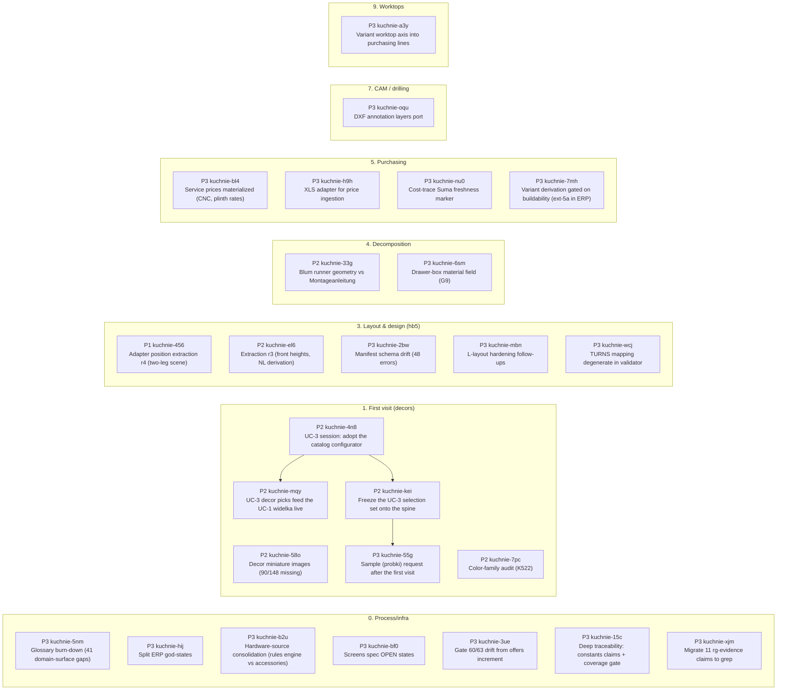
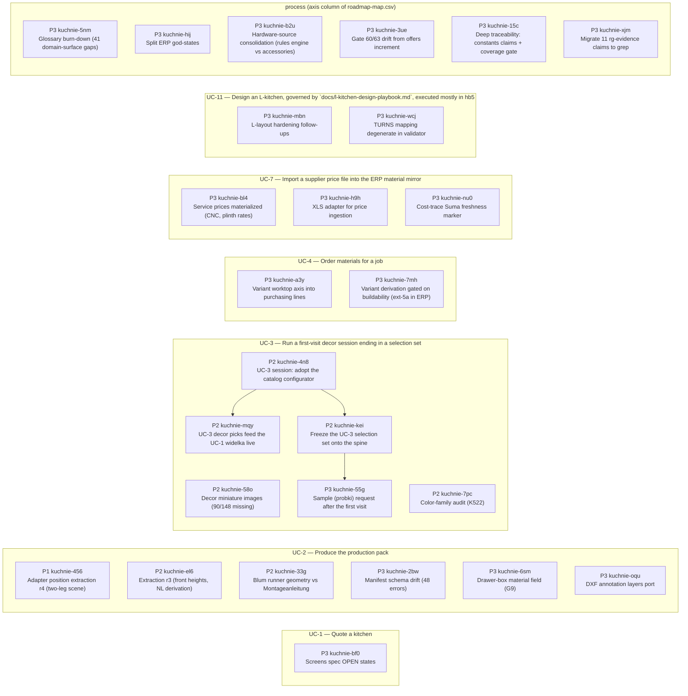

# STATUS — generated dashboard (v2)

> Reader: Michał asking one of five PM questions (can I sell it / what's on me / what's next / where's the mass / machine ok) | Enables: each section answers its question AND carries the command that moves the needle | Update-trigger: GENERATED by `scripts/dashboard.py` — never hand-edit; freshness gated by `session-gates.d/30-dashboard-fresh.sh`

> Generated: 2026-08-02T16:00:09+00:00

## 1 · Can I sell it? — capability & feature progress

- **UC-1** █████████░░░ 5/7 steps · 0/0 extensions — open: `wk-593a317b` `wk-59b943b1`
- **UC-2** ██████████░░ 7/8 steps · 4/6 extensions — open: `wk-593a317b`
- **UC-3** ███░░░░░░░░░ 2/7 steps · 1/3 extensions — open: `wk-54bde4be` `wk-6b516fdf` `wk-9faa9de0`
- **UC-4** ███░░░░░░░░░ 2/7 steps · 0/0 extensions — open: `wk-593a317b`
- **UC-11** ██░░░░░░░░░░ 2/10 steps · 2/7 extensions — open: —
- **UC-12** ██░░░░░░░░░░ 1/6 steps · 0/1 extensions — open: —
- **UC-6** ░░░░░░░░░░░░ not dressed — Open a project and thread its artifacts through stages 1→11 (see § 2)

**Acceptance gauge (R7, all specs): 23/38 LIVE.** Denominator = pre-written intent, numerator = demonstrated fact; it can go DOWN when a commit stales a completion claim.

| Spec | UC | Acceptance item | State | Claim |
|---|---|---|---|---|
| conformance-join | — | docs/specs/conformance-join.md is the Phase 1 umbrella spec of the two… | LIVE | tr-76876cfc (live) |
| conformance-join | — | scripts/test-health.sh sweeps the component, harness and scripts test … | LIVE | tr-461fe482 (live) |
| conformance-join | — | scripts/dashboard.py renders a Completeness (R7) section classifying t… | LIVE | tr-ff921e00 (live) |
| conformance-join | — | scripts/code-inventory.py emits a deterministic, sorted docs/code-inve… | LIVE | tr-affdfc6f (live) |
| conformance-join | — | docs/reviews/upstream-drafts-2026-07/ holds five upstream issue drafts… | LIVE | tr-09ea12aa (live ← tr-6fc8515b) |
| conformance-join | — | scripts/spec-coverage.py re-cuts the R2 join along the two axes the da… | LIVE | tr-15aaf595 (live) |
| process-coverage | — | kitchen-erp defines a Project/Order entity with customer, status, date… | PRE-WRITTEN | — |
| process-coverage | — | kitchen-erp imports a supplier price file (CSV/XLS) updating Material … | PRE-WRITTEN | — |
| process-coverage | — | kitchen_bom output includes a worktop position computed from WorktopSe… | LIVE | tr-17905dae (live) |
| process-coverage | — | TYPE_REGISTRY contains a corner-blind decomposer emitting filler and r… | PRE-WRITTEN | — |
| process-coverage | — | adapter extraction carries drawer-stack data from hb5 scenes into Cabi… | PRE-WRITTEN | — |
| purchasing-variants | — | kitchen-erp Variants hold parameter overrides on a project and re-deri… | LIVE | tr-6692cbe7 (live) |
| purchasing-variants | — | Offers record against variants with optional line itemization, archive… | LIVE | tr-c87a68f9 (live) |
| purchasing-variants | — | Per-dealer hardware order CSVs emit net top-up quantities (required mi… | LIVE | tr-6d1f8951 (live ← tr-611a8240) |
| purchasing-variants | — | Supplier price rows enter through the landing schema with verbatim sou… | LIVE | tr-4afef6fb (live ← tr-d0610cb4) |
| use-cases | UC-2 | docs/specs/use-cases.md defines six actor-hats with goals, marks five … | LIVE | tr-239065a8 (live ← tr-f5ac5904) |
| use-cases | UC-4 | UC-4 (order materials) is fully dressed in docs/specs/use-cases.md bef… | LIVE | tr-36fc2a2d (live) |
| use-cases | UC-3 | roadmap-map.csv carries a uc column consumed by scripts/dashboard.py a… | LIVE | tr-544e72ca (live ← tr-4f3217dc) |
| use-cases | UC-3 | UC-3 (first-visit decor session) is fully dressed in docs/specs/use-ca… | FILED | tr-c30f62a7 (stale) |
| use-cases | — | the catalog configurator marks a decor with no price-book entry and a … | PRE-WRITTEN | — |
| use-cases | — | a kitchen-erp project carries a named decor-selection ArtifactRef kind… | PRE-WRITTEN | — |
| use-cases | — | a decor pick with no price-book entry raises the canvas unpriced flag … | PRE-WRITTEN | — |
| walking-skeleton-d60 | — | exercises/walking-skeleton-d60/reference/ contains hand-computed cutli… | LIVE | tr-c413667b (live) |
| walking-skeleton-d60 | — | exercises/walking-skeleton-d60/generated/ contains pipeline-produced r… | PRE-WRITTEN | — |
| walking-skeleton-d60 | — | exercises/walking-skeleton-d60/GAP-REPORT.md lists every reference-vs-… | PRE-WRITTEN | — |
| adapter-position-extraction | — | home-builder-adapter extraction carries per-cabinet world position and… | PRE-WRITTEN | — |
| adapter-position-extraction | — | a one-wall scene still extracts into a single Run with unchanged downs… | PRE-WRITTEN | — |
| height-parameter-set | — | ProjectDefaults carries elbow_height_mm, worktop_height_mm, wall_line_… | LIVE | tr-b259df94 (live) |
| height-parameter-set | — | validate_rows consumes a supplied height parameter set and G1 reports … | LIVE | tr-799057da (live) |
| screens | — | the Canvas screen flags a module line with no price-book entry as unpr… | LIVE | tr-e469bec3 (live) |
| screens | — | the comparison board's owner-only cost-without-labor view is gated beh… | PRE-WRITTEN | — |
| screens | — | the purchasing screen's ACCEPT control is disabled (not merely advisor… | PRE-WRITTEN | — |
| screens | — | the purchasing screen surfaces an unknown/unmapped supplier SKU as a f… | PRE-WRITTEN | — |
| survey-pack | — | kitchen-erp defines REQUIRED_SURVEY_KINDS (survey_dims, survey_media, … | LIVE | tr-ab60ea2b (live) |
| survey-pack | — | Project.transition_stage from 2_pomiar to 3_layout_design raises Stage… | LIVE | tr-baf3d053 (live) |
| survey-pack | — | a forward transition_stage move crossing into 3_layout_design or beyon… | LIVE | tr-1676fcde (live) |
| l-layout-model | — | kuchnie_core Run carries start/end position, direction and corner part… | LIVE | tr-233368c2 (live) |
| l-layout-model | — | a legacy flat-Kitchen JSON without positions still loads and validates… | LIVE | tr-8977770e (live) |

| Type | rozrys | drills | DXF | BOM | 3D | Note |
|---|---|---|---|---|---|---|
| `dolna_legrabox` | ✅ | ✅ | ✅ | ✅ | ◐ | flagship — walking-skeleton validated, 3D carries envelope only |
| `dolna_narozna_slepa` | ✅ | ✅ | ✅ | ✅ | ✗ | new (ADR-014) — no e2e golden yet, unreachable from a scene |
| `dolna_drzwiowa` | ◐ | ✗ | ✗ | ◐ | ◐ | no top stretchers, no machining ops |
| `dolna_szufladowa` | ◐ | ✗ | ✗ | ◐ | ✗ | runner accessories only, box parts not decomposed |
| `gorna_drzwiowa` | ✅ | ◐ | ◐ | ✅ | ◐ | cam appliers (system32/hinges) exist, decomposer emits no ops |
| `sink/cargo/oven/karuzela` | ✗ | ✗ | ✗ | ✗ | ✗ | typed configs model-only, no decomposers |

Legend: ✅ trusted (id-cited) · ◐ works with caveats · ✗ absent (`docs/capability-map.csv`).

**⚠ cells citing non-live facts:** dolna_legrabox: tr-b485d74c — move the needle: `scripts/truth queue` then re-verify or re-map the cell.

## 2 · Blocked on Michał — the owner lane

- retractions: none pending ✅
- **UC-6 needs dressing** — Open a project and thread its artifacts through stages 1→11. Move the needle: say *“Dress UC-6 with me”* (interview per docs/spec-convention.md).
- **1 claim(s) for an agent verifier** (not you — but only you start sessions). Move the needle: say *“dispatch a verifier sweep”*.

## 3 · What's next — ready lane, product | process

**Open 6 product / 9 process · closed 7d 5 product / 3 process (5 classified by keyword)**

### PRODUCT

| P | Work | Title | Premise health |
|---|---|---|---|
| P2 | wk-54bde4be / kuchnie-4n8 | Adopt the catalog configurator as the UC-3 first-visit decor session: iPad-driven six-role flow (front/carcass/worktop/edge/side_panel/plinth) where unpriced and image-less decors stay selectable behind visible brak-ceny / brak-zdjecia badges, 2-3 candidate sets run side by side, and a session left undecided stays open and resumable at a later visit | live |
| P2 | wk-6716e9c8 / kuchnie-58o | Acquire missing decor miniature images (90/148 decors, incl. all 35 wood decors) | live |
| P2 | wk-c67ffaa1 / kuchnie-7pc | Audit color_family assignments (K522 misclassified as jesion; szary holds 56 decors) | live |
| P2 | wk-cd815fba / kuchnie-el6 | Extraction r3: front-height write-path translation (B5), NL/height-code derivation, verify material extraction against the decor-split e2e scene | live |
| P3 | wk-3141488c / kuchnie-a3y | Variant worktop axis cascades into purchasing lines via core worktop_bom_items | live |
| P3 | wk-6011d8bf / kuchnie-oqu | Port DXF annotation layers (title block, dimension text, edgebanding marks) from attic/legrabox_side_panel.py into kitchen_cam.dxf.panel_dxf as an opt-in pass reading Panel/MachiningOp values from core, never re-deriving geometry | live |

Move the needle: `scripts/truth start wk-54bde4be` · `bd update kuchnie-4n8 --claim` — then say *“continue Adopt the catalog configurator as the UC…”*

### PROCESS

| P | Work | Title | Premise health |
|---|---|---|---|
| P3 | wk-075803aa / kuchnie-wcj | Degenerate TURNS mapping in validator.py check_run_continuity: left and right turns map to the same next direction per from-direction (east+left and east+right both give south), so a geometrically-wrong turn label passes the direction check -- fix the mapping to true plan-geometry semantics in lockstep across validator, l-layout-model spec invariant 3, and adapter r4 extraction | live |
| P3 | wk-8908bacc / kuchnie-xjm | Migrate 11 rg-evidence claims to grep (ADR-040 aftermath: tr-de2e32ab tr-d053a05c tr-0c33b232 tr-7bed9678 tr-4d1d4ba9 tr-66f75050 tr-848f3f36 tr-43ab6d49 tr-88fd9681 tr-df1e70db tr-5a94302e cannot recheck with rg off the allowlist) | live |
| P3 | wk-a1898db5 / kuchnie-15c | Selective deep traceability: claim-per-external-constant (Blum/edging/supplier dims, ~40 constants) and a branch-coverage floor gate on kuchnie-core as the condition-level proxy trace (DO-178C-style coverage-not-links) | live |
| P3 | wk-b29f670a / kuchnie-5nm | Glossary burn-down: 41 accepted domain-surface gaps in docs/glossary-baseline.txt — owner+agent write real entries (or demote non-domain classes from the surface rule) and shrink the baseline | live |
| P3 | wk-b440d8bb / kuchnie-b2u | Consolidate hardware sources: rules-engine tags (BOMGenerator) vs decomposer accessories (variant lines) - pick one hardware source, make the other a view | live |
| — | wk-4fc28a19 | Correct surface-structure codes for ten postformed decors: kronospan_full.yaml hardcodes structure RS on PF-U-600 variants while the 2026 manufacturer table (blaty-postformed-spec.md section 5.1) says UE for 4298 and 4299, PE for K210, GG for K217 and K218, PN for K698, K699, K703, K704, K705; fix upstream YAML, re-import, and extend the U-U seeder tests with structure-fidelity asserts | live |
| — | wk-bca0a74b | Represent the U-U profile in worktop_specs for the 36 seeded variants (profile U-U, widths 900 and 1200, edge material and pallet data per the packing table) so v_worktops_full and the catalog worktops endpoint expose them; today the configurator role fallback offers them while the worktops endpoint hides them | live |
| P3 | wk-b669f4f5 / kuchnie-hij | Split the ERP god-states: AdminState (36 methods) and KitchenState (32) — extract row-layout math into a testable core module, group setters into substates; add_module (12 params) gets a module spec | HELD — tr-87282b5d (stale) |
| — | wk-a898481e / kuchnie-b30 | DrawerBoxSpec parameter object: decompose_drawer_box (11/10 params) and make_runner_accessory (8) collapse their drawer-box arguments into one spec consumed by the DrawerSystem ABC, catalog decomposer and variant_derivation | HELD — tr-87282b5d (stale) |

Move the needle: `scripts/truth start wk-075803aa` · `bd update kuchnie-wcj --claim` — then say *“continue Degenerate TURNS mapping in validator.py…”*

## 4 · Where's the mass — concentration & won ground

| L1 stage | open | weight |
|---|---|---|
| 1 · First visit (decors) | 6 | ████████████ |
| 3 · Layout & design (hb5) | 5 | ██████████ |
| 4 · Decomposition | 2 | ████ |
| 5 · Purchasing | 4 | ████████ |
| 7 · CAM / drilling | 1 | ██ |
| 9 · Worktops | 1 | ██ |
| 0 · Process/infra | 7 | ██████████████ |

**Gap register (walking skeleton): 12/13 closed** — G1✅ G2✅ G3✅ G4✅ G5✅ G6✅ G7✅ G8✅ G9⚠(kuchnie-6sm) G10✅ G11✅ G12✅ G13✅

Buildability's parked design gates (playbook G2–G5, G7) count inside the UC-2 bar in § 1, not here.

### Roadmap by L1 stage (order = bd priority; arrows = bd deps)

### Roadmap by use case (goals from `docs/specs/use-cases.md`)

**⚠ unmapped open bd issues** (both views above lie by omission until mapped): kuchnie-05p, kuchnie-27b, kuchnie-2pl, kuchnie-3lo, kuchnie-4q8, kuchnie-5q3, kuchnie-8be, kuchnie-8ky, kuchnie-c6z, kuchnie-g0p, kuchnie-h45, kuchnie-lm8, kuchnie-n74, kuchnie-qrs, kuchnie-ubc.1, kuchnie-zae — move the needle: add a row with stage+uc+axis to `docs/roadmap-map.csv`.

## 5 · Is the machine OK? — regime health

| Signal | State |
|---|---|
| spec-health | 🟢 spec-health: 0 failure(s), 59 warning(s) across 21 spec(s) |
| doc-health | 🟢 doc-health: 0 failure(s) across 126 live doc(s) |
| flagship baseline | guarded by `scripts/exercise-gate.sh` (runs at session-close) |
| claims | cannot_verify 2 · live 131 · retracted 75 · stale 8 |
| verdict queue | 0 human (§ 2) + 1 verifier |
| backward trace (R2) | TRACED 50 · MENTIONED 29 · DARK 0 |
| R4 tests | `scripts/test-health.sh` — cited ids swept at close |
| R7 acceptance | 23/38 LIVE (§ 1) |
| last exercise run | 2026-07-13T14:38:15+00:00 · Blender 5.1.2 · repo `7c42aed` · hb5 `1428e55` |

**Closed in 14 days: 8** — latest:

- 2026-08-02 `wk-224f3712` Rough-quote canvas (UC-1 prog 1): tier-based od-do widelek from the ERP canvas —…
- 2026-08-01 `wk-1af1a49e` Spec-coverage matrix: per-component and per-spec trace re-cut of the R2 join (co…
- 2026-07-29 `wk-3fd0fac4` Survey pack: named ArtifactRef kinds + completeness checklist, 2->3 transition r…
- 2026-07-29 `wk-5b929a7c` Height parameter set on ProjectDefaults: worktop/wall-line/tall-line with elbow …
- 2026-07-29 `wk-fc3aba75` Widen the design-entry guard: a forward stage move crossing into 3_layout_design…

Full log: `git log --grep wk-` · every id above is one grep from its proof (dev-process §4).

