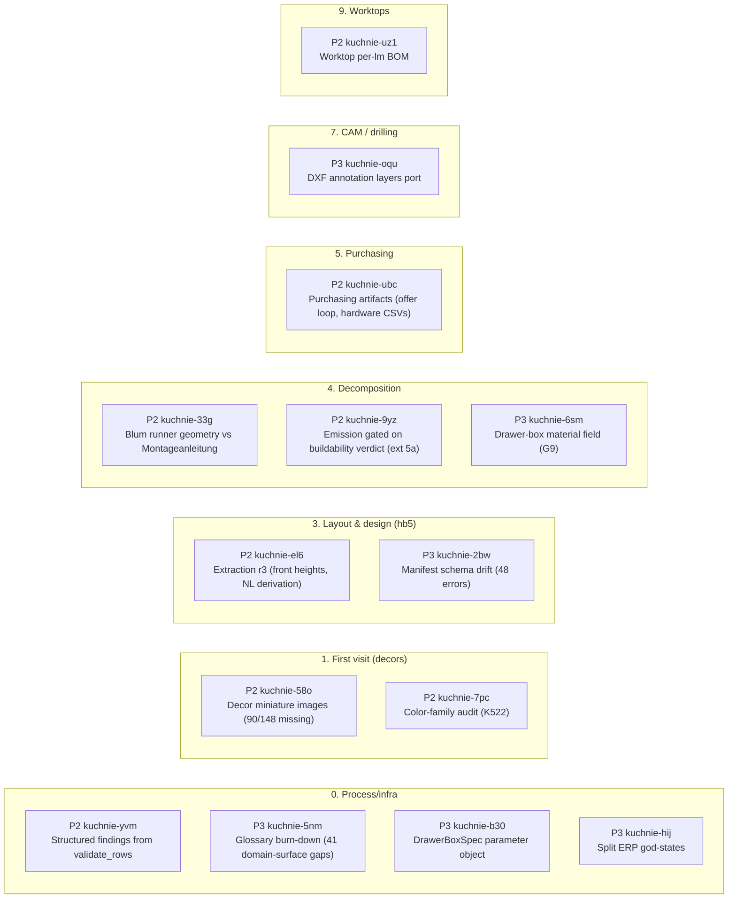
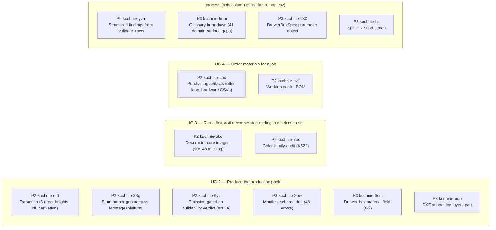

# STATUS — generated dashboard (v2)

> Reader: Michał asking one of five PM questions (can I sell it / what's on me / what's next / where's the mass / machine ok) | Enables: each section answers its question AND carries the command that moves the needle | Update-trigger: GENERATED by `scripts/dashboard.py` — never hand-edit; freshness gated by `session-gates.d/30-dashboard-fresh.sh`

> Generated: 2026-07-17T20:38:03+00:00

## 1 · Can I sell it? — capability & feature progress

- **UC-2** ██████████░░ 7/8 steps · 3/6 extensions — open: `wk-593a317b` `wk-cb6a17c8`
- **UC-4** ███░░░░░░░░░ 2/7 steps · 0/0 extensions — open: `wk-593a317b`
- **UC-1** ░░░░░░░░░░░░ not dressed — Quote a kitchen (see § 2)
- **UC-3** ░░░░░░░░░░░░ not dressed — Run a first-visit decor session ending in a selection set (see § 2)
- **UC-6** ░░░░░░░░░░░░ not dressed — Open a project and thread its artifacts through stages 1→11 (see § 2)

**Acceptance gauge (R7, all specs): 9/20 LIVE.** Denominator = pre-written intent, numerator = demonstrated fact; it can go DOWN when a commit stales a completion claim.

| Spec | UC | Acceptance item | State | Claim |
|---|---|---|---|---|
| conformance-join | — | docs/specs/conformance-join.md is the Phase 1 umbrella spec of the two… | LIVE | tr-76876cfc (live) |
| conformance-join | — | scripts/test-health.sh sweeps the component, harness and scripts test … | LIVE | tr-461fe482 (live) |
| conformance-join | — | scripts/dashboard.py renders a Completeness (R7) section classifying t… | LIVE | tr-ff921e00 (live) |
| conformance-join | — | scripts/code-inventory.py emits a deterministic, sorted docs/code-inve… | LIVE | tr-affdfc6f (live) |
| conformance-join | — | docs/reviews/upstream-drafts-2026-07/ holds five upstream issue drafts… | FILED | tr-6fc8515b (retracted) |
| process-coverage | — | kitchen-erp defines a Project/Order entity with customer, status, date… | PRE-WRITTEN | — |
| process-coverage | — | kitchen-erp imports a supplier price file (CSV/XLS) updating Material … | PRE-WRITTEN | — |
| process-coverage | — | kitchen_bom output includes a worktop position computed from WorktopSe… | PRE-WRITTEN | — |
| process-coverage | — | TYPE_REGISTRY contains a corner-blind decomposer emitting filler and r… | PRE-WRITTEN | — |
| process-coverage | — | adapter extraction carries drawer-stack data from hb5 scenes into Cabi… | PRE-WRITTEN | — |
| purchasing-variants | — | kitchen-erp Variants hold parameter overrides on a project and re-deri… | LIVE | tr-6692cbe7 (live) |
| purchasing-variants | — | Offers record against variants with optional line itemization, archive… | LIVE | tr-c87a68f9 (live) |
| purchasing-variants | — | Per-dealer hardware order CSVs emit net top-up quantities (required mi… | PRE-WRITTEN | — |
| purchasing-variants | — | Supplier price rows enter through the landing schema with verbatim sou… | FILED | tr-d0610cb4 (retracted) |
| use-cases | UC-2 | docs/specs/use-cases.md defines six actor-hats with goals, marks five … | FILED | tr-f5ac5904 (retracted) |
| use-cases | UC-4 | UC-4 (order materials) is fully dressed in docs/specs/use-cases.md bef… | LIVE | tr-36fc2a2d (live) |
| use-cases | — | roadmap-map.csv carries a uc column consumed by scripts/dashboard.py a… | LIVE | tr-af9fb1d3 (live) |
| walking-skeleton-d60 | — | exercises/walking-skeleton-d60/reference/ contains hand-computed cutli… | LIVE | tr-c413667b (live) |
| walking-skeleton-d60 | — | exercises/walking-skeleton-d60/generated/ contains pipeline-produced r… | PRE-WRITTEN | — |
| walking-skeleton-d60 | — | exercises/walking-skeleton-d60/GAP-REPORT.md lists every reference-vs-… | PRE-WRITTEN | — |

| Type | rozrys | drills | DXF | BOM | 3D | Note |
|---|---|---|---|---|---|---|
| `dolna_legrabox` | ✅ | ✅ | ✅ | ✅ | ◐ | flagship — walking-skeleton validated, 3D carries envelope only |
| `dolna_narozna_slepa` | ✅ | ✅ | ✅ | ✅ | ✗ | new (ADR-014) — no e2e golden yet, unreachable from a scene |
| `dolna_drzwiowa` | ◐ | ✗ | ✗ | ◐ | ◐ | no top stretchers, no machining ops |
| `dolna_szufladowa` | ◐ | ✗ | ✗ | ◐ | ✗ | runner accessories only, box parts not decomposed |
| `gorna_drzwiowa` | ✅ | ◐ | ◐ | ✅ | ◐ | cam appliers (system32/hinges) exist, decomposer emits no ops |
| `sink/cargo/oven/karuzela` | ✗ | ✗ | ✗ | ✗ | ✗ | typed configs model-only, no decomposers |

Legend: ✅ trusted (id-cited) · ◐ works with caveats · ✗ absent (`docs/capability-map.csv`).

**⚠ cells citing non-live facts:** dolna_legrabox: tr-3bb325f8 — move the needle: `scripts/truth queue` then re-verify or re-map the cell.

## 2 · Blocked on Michał — the owner lane

- **2 retraction(s) ready** (human-only; every diverged claim's verdict names its live successor). Paste:

  ```
  for id in tr-0d0b090b tr-d59194ea; do TRUTH_HUMAN=1 TRUTH_HUMAN_ACK=$id scripts/truth verdict $id retracted --basis "superseded; successor in verdict trail"; done
  ```
- **UC-1 needs dressing** — Quote a kitchen. Move the needle: say *“Dress UC-1 with me”* (interview per docs/spec-convention.md).
- **UC-3 needs dressing** — Run a first-visit decor session ending in a selection set. Move the needle: say *“Dress UC-3 with me”* (interview per docs/spec-convention.md).
- **UC-6 needs dressing** — Open a project and thread its artifacts through stages 1→11. Move the needle: say *“Dress UC-6 with me”* (interview per docs/spec-convention.md).
- **4 claim(s) for an agent verifier** (not you — but only you start sessions). Move the needle: say *“dispatch a verifier sweep”*.

## 3 · What's next — ready lane, product | process

**Open 7 product / 5 process · closed 7d 21 product / 27 process (34 classified by keyword) ⚠ swing back to product**

### PRODUCT

| P | Work | Title | Premise health |
|---|---|---|---|
| P2 | wk-4c37f4ee / kuchnie-uz1 | kitchen_bom consumes WorktopSegment: laminate per-lm position with cutout count | live |
| P2 | wk-593a317b / kuchnie-ubc | Purchasing artifacts: board-order + hardware-order generation (incl. edge-band identity G11, hardware BOM completeness G13) | live |
| P2 | wk-6716e9c8 / kuchnie-58o | Acquire missing decor miniature images (90/148 decors, incl. all 35 wood decors) | live |
| P2 | wk-c67ffaa1 / kuchnie-7pc | Audit color_family assignments (K522 misclassified as jesion; szary holds 56 decors) | live |
| P2 | wk-cb6a17c8 / kuchnie-9yz | Gate artifact emission on the buildability verdict: a FAILED verdict must block rozrys/CNC/BOM emission (UC-2 ext 5a wiring) | live |
| P2 | wk-cd815fba / kuchnie-el6 | Extraction r3: front-height write-path translation (B5), NL/height-code derivation, verify material extraction against the decor-split e2e scene | live |
| P3 | wk-6011d8bf / kuchnie-oqu | Port DXF annotation layers (title block, dimension text, edgebanding marks) from attic/legrabox_side_panel.py into kitchen_cam.dxf.panel_dxf as an opt-in pass reading Panel/MachiningOp values from core, never re-deriving geometry | live |

Move the needle: `scripts/truth start wk-4c37f4ee` · `bd update kuchnie-uz1 --claim` — then say *“continue kitchen_bom consumes WorktopSegment: lam…”*

### PROCESS

| P | Work | Title | Premise health |
|---|---|---|---|
| P2 | wk-acc8e094 / kuchnie-yvm | validate_rows returns structured findings (gate id, severity, ref) consumed by buildability directly; strings become its display layer | live |
| P3 | wk-a898481e / kuchnie-b30 | DrawerBoxSpec parameter object: decompose_drawer_box (11/10 params) and make_runner_accessory (8) collapse their drawer-box arguments into one spec consumed by the DrawerSystem ABC, catalog decomposer and variant_derivation | warn: tr-0e812e80: premise not yet independently verified |
| P3 | wk-b29f670a / kuchnie-5nm | Glossary burn-down: 41 accepted domain-surface gaps in docs/glossary-baseline.txt — owner+agent write real entries (or demote non-domain classes from the surface rule) and shrink the baseline | live |
| P3 | wk-b669f4f5 / kuchnie-hij | Split the ERP god-states: AdminState (36 methods) and KitchenState (32) — extract row-layout math into a testable core module, group setters into substates; add_module (12 params) gets a module spec | warn: tr-0e812e80: premise not yet independently verified |
| — | wk-b440d8bb | Consolidate hardware sources: rules-engine tags (BOMGenerator) vs decomposer accessories (variant lines) - pick one hardware source, make the other a view | live |

Move the needle: `scripts/truth start wk-acc8e094` · `bd update kuchnie-yvm --claim` — then say *“continue validate_rows returns structured finding…”*

## 4 · Where's the mass — concentration & won ground

| L1 stage | open | weight |
|---|---|---|
| 1 · First visit (decors) | 2 | ████ |
| 3 · Layout & design (hb5) | 2 | ████ |
| 4 · Decomposition | 3 | ██████ |
| 5 · Purchasing | 1 | ██ |
| 7 · CAM / drilling | 1 | ██ |
| 9 · Worktops | 1 | ██ |
| 0 · Process/infra | 4 | ████████ |

**Gap register (walking skeleton): 10/13 closed** — G1✅ G2✅ G3✅ G4✅ G5✅ G6✅ G7✅ G8✅ G9⚠(kuchnie-6sm) G10✅ G11⚠(wk-593a317b) G12✅ G13⚠(wk-593a317b)

Buildability's parked design gates (playbook G2–G5, G7) count inside the UC-2 bar in § 1, not here.

### Roadmap by L1 stage (order = bd priority; arrows = bd deps)



### Roadmap by use case (goals from `docs/specs/use-cases.md`)



**⚠ unmapped open bd issues** (both views above lie by omission until mapped): kuchnie-b2u, kuchnie-bl4, kuchnie-h9h, kuchnie-nu0 — move the needle: add a row with stage+uc+axis to `docs/roadmap-map.csv`.

## 5 · Is the machine OK? — regime health

| Signal | State |
|---|---|
| spec-health | 🟢 spec-health: 0 failure(s), 46 warning(s) across 16 spec(s) |
| doc-health | 🟢 doc-health: 0 failure(s) across 100 live doc(s) |
| flagship baseline | guarded by `scripts/exercise-gate.sh` (runs at session-close) |
| claims | cannot_verify 2 · diverged 2 · live 78 · retracted 42 · unverified 4 |
| verdict queue | 2 human (§ 2) + 0 verifier |
| backward trace (R2) | TRACED 40 · MENTIONED 33 · DARK 0 |
| R4 tests | `scripts/test-health.sh` — cited ids swept at close |
| R7 acceptance | 9/20 LIVE (§ 1) |
| last exercise run | 2026-07-13T14:38:15+00:00 · Blender 5.1.2 · repo `7c42aed` · hb5 `1428e55` |

**Closed in 14 days: 52** — latest:

- 2026-07-17 `wk-68b32f3b` Wire assess_quote_freshness into the UI quote path: total_price in ui/state.py r…
- 2026-07-17 `wk-64266e86` Consolidate the three BOM folds to one source (core calculate_bom or ERP BOMGene…
- 2026-07-17 `wk-5bf6845f` Consume template v0.7.0 (ADR-014 acceptance oracles) via copier; set accept-allo…
- 2026-07-17 `wk-aa3e159c` BOM edge-band cost ignores the chosen material: hardcoded 0.80 zl/lm Generic ABS…
- 2026-07-17 `wk-dedf52c4` Consume template v0.7.1 (impact --inverse) via copier

Full log: `git log --grep wk-` · every id above is one grep from its proof (dev-process §4).

