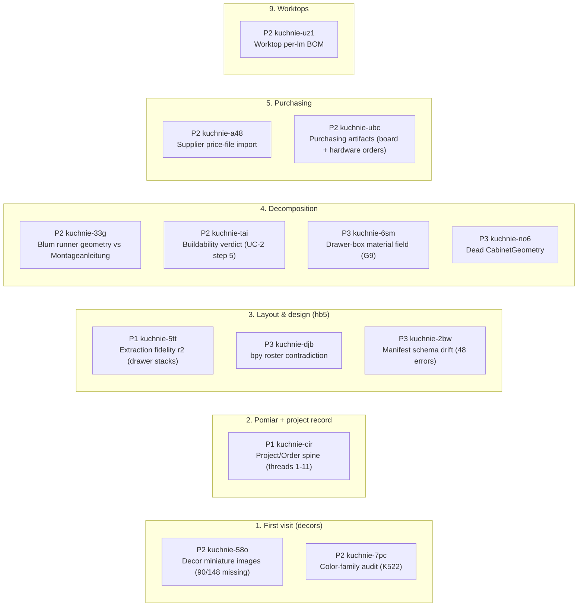
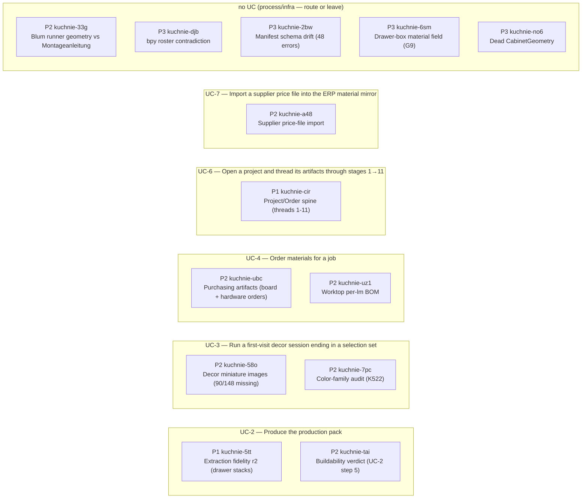

# STATUS — generated dashboard

> Reader: Michał in any of his five moments (client call, session start, grooming, quality glance, retro) | Enables: answering each moment's question from one page instead of five commands | Update-trigger: GENERATED by `scripts/dashboard.py` — never hand-edit; freshness gated by `session-gates.d/30-dashboard-fresh.sh`

> Generated: 2026-07-15T19:43:29+00:00

## Health

| Signal | State |
|---|---|
| spec-health | 🟢 spec-health: 0 failure(s), 68 warning(s) across 27 spec(s) |
| doc-health | 🟢 doc-health: 0 failure(s) across 94 live doc(s) |
| flagship baseline | guarded by `scripts/exercise-gate.sh` (runs at session-close) |
| claims | diverged 15 · live 41 · retracted 8 · stale 16 · unverified 7 |
| verdict queue | 23 awaiting triage |
| backward trace (R2) | TRACED 34 · MENTIONED 19 · DARK 23 (`scripts/coverage-audit.py`; DARK triage = product-owner verb) |
| last exercise run | 2026-07-13T14:38:15+00:00 · Blender 5.1.2 · repo `7c42aed` · hb5 `1428e55` |

## Completeness (R7) — use-cases Acceptance vs ledger

Pre-written acceptance items of `docs/specs/use-cases.md` classified against claim texts (lexical match, no NLP): PRE-WRITTEN = no claim yet · FILED = claim exists, not live · LIVE = claim live.

| UC | Acceptance item | State | Claim |
|---|---|---|---|
| UC-2 | docs/specs/use-cases.md defines six actor-hats with goals, marks five use cases for full d… | LIVE | tr-f5ac5904 (live) |
| UC-4 | UC-4 (order materials) is fully dressed in docs/specs/use-cases.md before wk-593a317b impl… | PRE-WRITTEN | — |
| (spec-wide) | roadmap-map.csv carries a uc column consumed by scripts/dashboard.py as a by-goal roadmap … | FILED | tr-4f3217dc (stale) |

**Gauge: 1/3 acceptance items LIVE.** The denominator is intent (pre-written claims), the numerator is demonstrated fact — the gauge can go down when a commit stales a completion claim.

## Ready lane (`truth ready` × bd priority)

| P | Work | Title | Premise health |
|---|---|---|---|
| P1 | wk-02a62298 / kuchnie-cir | Project/Order spine in kitchen-erp: customer, status, dates, artifact references threading stages 1-11 | live |
| P2 | wk-39ed9155 / kuchnie-a48 | Supplier price-file import (CSV/XLS) updating ERP Material prices; catalog stays price-free | live |
| P2 | wk-4c37f4ee / kuchnie-uz1 | kitchen_bom consumes WorktopSegment: laminate per-lm position with cutout count | live |
| P2 | wk-593a317b / kuchnie-ubc | Purchasing artifacts: board-order + hardware-order generation (incl. edge-band identity G11, hardware BOM completeness G13) | live |
| P2 | wk-6716e9c8 / kuchnie-58o | Acquire missing decor miniature images (90/148 decors, incl. all 35 wood decors) | live |
| P2 | wk-89a668a2 / kuchnie-tai | Buildability verdict: ordered validation gate runner over the scattered checks (UC-2 step 5) | live |
| P2 | wk-c67ffaa1 / kuchnie-7pc | Audit color_family assignments (K522 misclassified as jesion; szary holds 56 decors) | live |
| P1 | wk-81a47ab8 / kuchnie-5tt | Adapter extraction fidelity round 2: drawer stacks, corner cabinets, worktops from hb5 scenes | HELD — tr-5e160a9a (stale) |
| P3 | wk-5cb8c45e / kuchnie-no6 | Delete or wire dead CabinetGeometry in construction.py | HELD — tr-8e25dd76 (stale) |
| P3 | wk-99b51e00 / kuchnie-djb | Resolve bpy contradiction: gen_kitchen.py vs AGENTS.md only-bpy-component roster line | HELD — tr-1394f4d8 (stale) |

## Roadmap by L1 stage (order = bd priority; arrows = bd deps)

## Roadmap by use case (order = bd priority; goals from `docs/specs/use-cases.md`)

## Capability board (what you can promise a client)

| Type | rozrys | drills | DXF | BOM | 3D | Note |
|---|---|---|---|---|---|---|
| `dolna_legrabox` | ✅ | ✅ | ✅ | ✅ | ◐ | flagship — walking-skeleton validated, 3D carries envelope only |
| `dolna_narozna_slepa` | ✅ | ✅ | ✅ | ✅ | ✗ | new (ADR-014) — no e2e golden yet, unreachable from a scene |
| `dolna_drzwiowa` | ◐ | ✗ | ✗ | ◐ | ◐ | no top stretchers, no machining ops |
| `dolna_szufladowa` | ◐ | ✗ | ✗ | ◐ | ✗ | runner accessories only, box parts not decomposed |
| `gorna_drzwiowa` | ✅ | ◐ | ◐ | ✅ | ◐ | cam appliers (system32/hinges) exist, decomposer emits no ops |
| `sink/cargo/oven/karuzela` | ✗ | ✗ | ✗ | ✗ | ✗ | typed configs model-only, no decomposers |

Legend: ✅ trusted (id-cited) · ◐ works with caveats · ✗ absent. Source: `docs/capability-map.csv` (each row cites its evidence).

## Closed in the last 14 days

- **2026-07-15** wk-ea10d199 — Ledger hygiene: claims watching generated STATUS.md restale perpetually — supersede with source-only paths  
  Filed source-only replacement claims (tr-ecd97fee, tr-af9fb1d3, tr-45750046) for the STATUS.md-watch…
- **2026-07-14** wk-cde2e8b7 — Process codified: session-close gate, flagship exercise-gate, priority-as-data + docs/development-process.md  
  Scripts smoke-tested both ways (exercise-gate OK on clean baseline; session-close correctly FAILED m…
- **2026-07-14** wk-985a7dc2 — Generated dashboard STATUS.md: capability board, ready lane, roadmap graph, truth health, delta log — wired into session-close  
  Dashboard generated, gated and proven both ways (fresh=0, tampered=1); ready lane joins truth ready …
- **2026-07-14** wk-33342f9e — Sea-level requirements: docs/specs/use-cases.md (actor table, casual UC list, UC-2 fully dressed) + archive user-context transcript  
  Spec written per the review's migration step 1, transcript archived, buildability wk filed from the …
- **2026-07-14** wk-844f5a9f — G8: drawer-stack order made explicit and validated at loader/schema (UC-2 step 3 / extension 3a)  
  Implemented at loader/schema with 8 pinned tests incl. golden end-to-end (top-down M,C,C -> runner r…
- **2026-07-14** wk-bae72832 — Playbook wired to UCs + first buildability rules: G1 heights, G6 line continuity, standard widths in validate_rows (adopts KitchenStandards)  
  Implemented with 8 pinned tests (component KitchenStandards + integration validate_rows); core 713, …
- **2026-07-14** wk-f3ce63bf — G12 decided: front side-reveal is a shop setting — 2mm default, 3mm auto for edge-pull handles (ConstructionMethod)  
  G12 implemented per PO decision; decision test pinned, cascades updated (core 714, erp 84, cam/harne…
- **2026-07-14** wk-a9212b40 — Dashboard increment 1: by-goal roadmap (uc column) + Serves: UC- spec-health warn  
  Implemented in commit 4d2b466: uc column (9 assignments derived from the use-cases.md inventory), da…
- **2026-07-14** wk-382ddd32 — Conformance-join spec: Phase 1 umbrella of the two-ledger concept (docs/specs/conformance-join.md)  
  Spec written per docs/spec-convention.md; spec-health 0 failures at commit 843a571
- **2026-07-14** wk-0d7a80d2 — test-health satellite (R4/ISO 29119): sweep test-cited tr-/wk- ids against the ledger + session gate 40-test-health  
  Shipped at commit db570bc; test-health 0 failures at HEAD; pinned pytest demonstrates fabricated-cit…
- **2026-07-14** wk-9d77de94 — Dashboard Completeness (R7) view: use-cases.md Acceptance items classified PRE-WRITTEN/FILED/LIVE with live/total gauge  
  Shipped at commit 9cb370e; STATUS.md renders the R7 table; hand count over docs/specs/use-cases.md A…
- **2026-07-14** wk-9fb28a32 — Backward-trace slice (R2-lite/ISO 24765): code inventory + coverage audit TRACED/MENTIONED/DARK + 50-new-dark warn gate  
  Shipped at commit d33d388; inventory 96 modules committed; audit at HEAD: TRACED 34 / MENTIONED 19 /…
- **2026-07-14** wk-3894b44c — Upstream filing drafts (Phases 2-3, DRAFT ONLY): accept-cmd two-oracle, baseline, contradicts/DISPUTED, impact --inverse, nd-/satisfies RFC  
  Five draft bodies committed at 6d3027a under docs/reviews/upstream-drafts-2026-07/, each with a thre…
- **2026-07-13** wk-8527c57c — Harness r2: machine-diff CNC ops + hardware vs golden, one-command runner with toolchain manifest, env-configurable paths  
  All 7 architect-review findings implemented, commit a395200; 20 harness self-tests + core 697 green;…
- **2026-07-12** wk-42b43c6d — Successor claim for tr-e1b14049 with narrower --paths (drop answers file)  
  successor tr-88f12036 filed with --paths scripts/truth only; tr-e1b14049 queued for human retraction…
- **2026-07-12** wk-2e2e9947 — Upstream machinery diagrams doc to template/docs/ (counts softened, kuchnie pre-aligned)  
  shipped upstream as truth-ledger 1d7b652 (template/docs/truth-ledger-machinery.md); counts softened …
- **2026-07-12** wk-03434168 — Route krono-compositor CATALOG dict to catalog service (ADR-008)  
  shipped in 870157e: catalog routed to catalog service; live smoke 145 decors, render 200 with real d…
- **2026-07-12** wk-c9e848a3 — Assign PanelRoles to drawer-box panels and price drawer-box material distinctly in kitchen-erp quantities  
  commit 6831a31: roles added in model.py/legrabox.py/blum_drawers.py, erp buckets drawer_box_m2 (ADR-…
- **2026-07-12** wk-9347cbb5 — Unify the two LEGRABOX implementations into one LW-formula source (ADR-006)  
  commit 0c03679: Legrabox class delegates heights/NL matrix/clearance/panel formulas to legrabox modu…
- **2026-07-12** wk-dc12464e — Fix broken home-builder-adapter validate_manifest.py entry point (route to kuchnie_core.validator or restore module)  
  commit 91ed65f: import routed to kuchnie_core.validator with monorepo fallback; jsonschema except-cl…
- **2026-07-12** wk-9f1ad053 — Walking skeleton: D60/3xLEGRABOX through full pipeline (hb5 -> adapter -> decompose -> rozrys/BOM/CNC); log every gap  
  commits a2529ac + HEAD: reference/, generated/ (both legs run: hb5 headless scene, shimmed extractio…
- **2026-07-12** wk-ee28c3dd — Fix adapter extraction contract: read dims from evaluated bbox + Toe Kick Height ID prop  
  1b4681b: bbox+toe-kick contract; adapter 14 tests green; blender leg re-run — extraction OK unmodifi…
- **2026-07-12** wk-c3d0a0f0 — Emit top stretchers (trawersy) and plinth panel in dolna_legrabox  
  1b4681b: trawersy+cokol emitted; K02 panel count 13; skeleton rozrys 16 panels incl Cokol 596x97
- **2026-07-12** wk-7341700c — Runner screw ops: blind depth 12 and Blum axis offset  
  1b4681b: RUNNER_AXIS_OFFSET_MM=37 + blind D5x12 constants in legrabox.py; K02 y=55/232 asserted
- **2026-07-12** wk-38c32190 — Emit confirmat drilling and HDF groove ops in dolna_legrabox  
  1b4681b: confirmat side drills (joinery-gated) + groove ops; positions match reference cnc-d60.txt e…
- **2026-07-12** wk-090ed9f4 — Fix back-panel formula: groove-seated back with 2mm clearance (698x578 for D60), single formula in ConstructionMethod  
  Back formula corrected and consolidated; suites green (core 687, erp 83, adapter 14, cam 57); regene…
- **2026-07-12** wk-5dc557d6 — Panel.grain field wired: decomposers set vertical grain on fronts, exporters emit Uslojenie  
  Panel.grain wired end to end; suites green (core 687 incl. new test_grain.py, erp 83, adapter 14, ca…
- **2026-07-12** wk-31467921 — Corner-blind decomposer (dolna narozna slepa) in TYPE_REGISTRY with filler + reduced back  
  Decomposer implemented per ADR-014, commit 2b1b334; suites green (core 697, erp 84, cam 57, adapter …
- **2026-07-12** wk-641a80a8 — E2E exercise: design-golden D60 3xLEGRABOX, hb5 headless build with drawer stack + decor split, dev_tools visual verify, pipeline compare  
  Exercise complete: golden authored first, hb5 headless build with drawer stack + decor split, dev_to…
- **2026-07-12** wk-d9f5dae7 — E2E exercise convention doc + reusable harness (golden diff, writers, hb5 bootstrap, scaffold) under exercises/harness/  
  Convention doc + harness package shipped, commit 9edfb88; 9 harness self-tests + core 697 green; sca…
- **2026-07-09** wk-3aa847c8 — Feature-spec convention: ledger-wired specs + spec-health tripwire + agent discovery  
  convention doc + pilot + spec-health + governance check 5 shipped; both cold reviews' blocking findi…
- **2026-07-09** wk-9941d99f — doc-cleanup: archive pre-ledger stale docs, fix live entry points, install doc-health tripwire  
  sweep executed: 6 archives, 15 live docs repaired, doc-health gate installed (fault-injection: A cau…
- **2026-07-09** wk-d5df7e30 — ADR-011 phase 3: kitchen_erp.Material becomes cache/mirror of catalog service  
  mirror shipped: catalog_client + material_mirror + 6 tests + live smoke (134 variants); hand-seeded …
- **2026-07-09** wk-6fa75612 — Ship INV-M: intake check refusing dead evidence-path tripwires  
  shipped in truth-ledger v0.5.4 (INV-M), synced via copier update, commits 8789815/568e726

