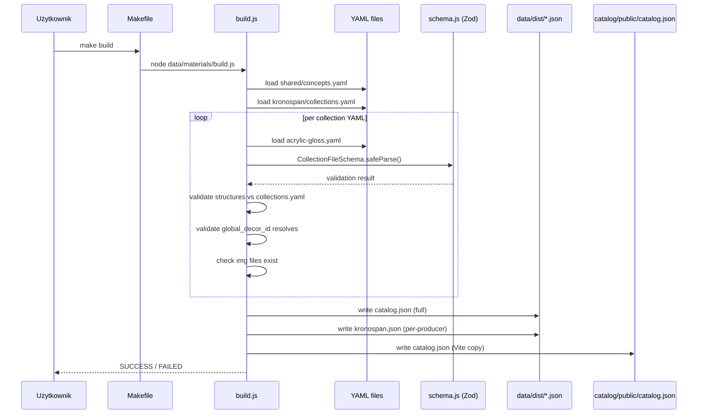
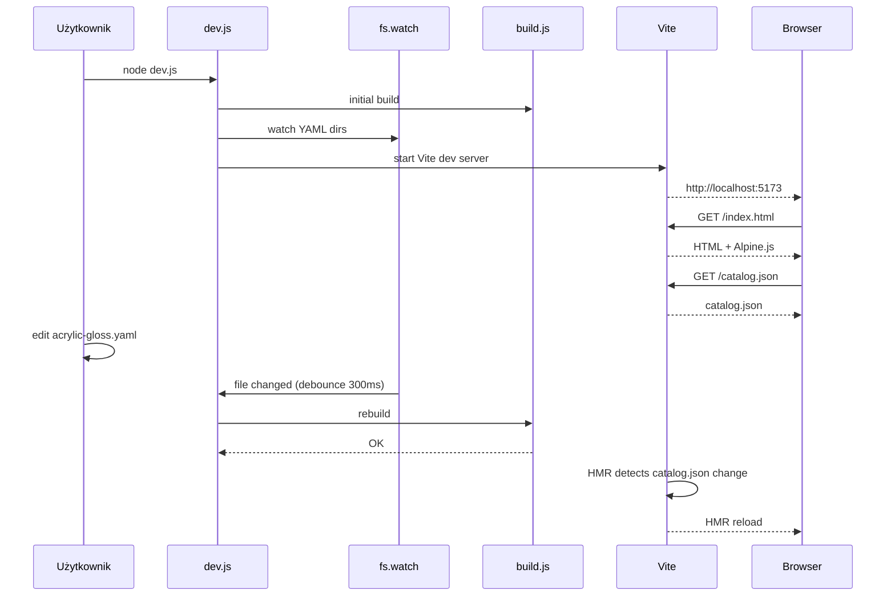
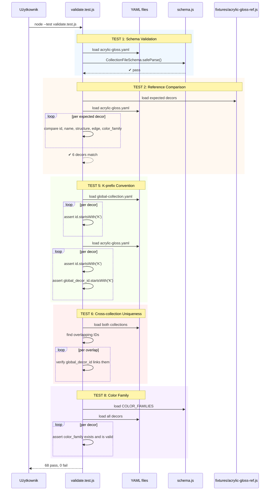
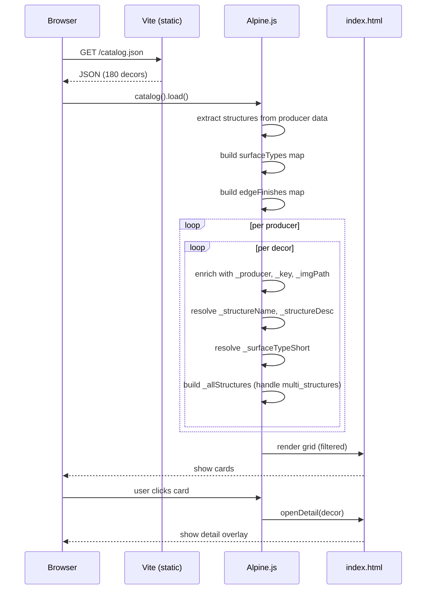

## Co robiliśmy

Zbudowaliśmy system katalogu materiałów meblowych (płyty, obrzeża, blaty) z YAML → JSON → Vite frontend. Główna kolekcja: Kronospan Global Collection (174 dekorów) + Acrylic Gloss (6 dekorów).

---

## Architektura danych (co gdzie mieszka)

```
data/materials/
├── shared/
│   ├── concepts.yaml       ← wspólne tagi, typy powierzchni, kolorystyka
│   └── schema.js           ← Zod walidacja (GlobalDecorSchema + SpecializedDecorSchema)
├── kronospan/
│   ├── collections.yaml    ← metadane kolekcji + definicje 18 struktur (SM, PE, BS...)
│   ├── acrylic-gloss.yaml  ← 6 dekorów (ręcznie tworzony)
│   ├── global-collection.yaml ← 174 dekorów (generowany skryptem)
│   └── img/                ← (puste, obrazy są w catalog/public/)
├── tests/
│   ├── validate.test.js    ← 55 testów
│   └── fixtures/
│       └── acrylic-gloss-ref.js ← dane referencyjne z MD (porównanie YAML vs PDF)
└── build.js                ← YAML → catalog.json + walidacja

catalog/
├── public/
│   ├── catalog.json        ← generowany (gitignored)
│   ├── kronospan/img/      ← zdjęcia dekorów (K8685.jpg, K0190.jpg...)
│   ├── kronospan/struktury/ ← zdjęcia struktur (SM.jpg, PE.jpg, BS.jpg...)
│   └── swiss-krono/img/    ← (puste, na przyszłość)
│   └── egger/img/          ← (puste, na przyszłość)
├── index.html              ← frontend Alpine.js
├── vite.config.mjs
├── dev.js                  ← watch YAML + rebuild + Vite HMR
├── Makefile                ← make dev / test / build / validate
└── package.json            ← vite, js-yaml, zod (własne deps, nie root)
```

---

## Źródło prawdy (co jest kanoniczne względem czego)

```
PDF katalog producenta          ← ULTIMATE SOURCE (nieedytowalny, zewnętrzny)
  │
  ▼  ręcznie, jednorazowo
MD w docs/materials-boards/     ← dokumentacja pomocnicza (nie dla aplikacji)
  │
  ▼  skrypt konwersji lub ręcznie
YAML w data/materials/          ← KANONICZNE ŹRÓDŁO DLA APLIKACJI
  │
  ▼  build.js
JSON w data/dist/               ← generowane, nigdy nie edytować
  │
  ▼  fetch()
Frontend catalog/index.html     ← czyta JSON, wyświetla
```

### Per typ danych:

| Co | Ultimate source | Kanoniczne źródło | Co jest generowane |
|---|---|---|---|
| Dekory (nazwy, kody, grupy) | PDF katalogu | YAML | catalog.json |
| Struktury (definicje, opisy) | PDF katalogu | `collections.yaml` | catalog.json |
| Tagi / typy powierzchni | — (nasza konwencja) | `shared/concepts.yaml` | catalog.json |
| Zdjęcia dekorów | PDF / strona producenta | `catalog/public/*/img/` | — |
| Zdjęcia struktur | PDF 02-struktury.pdf | `catalog/public/*/struktury/` | — |
| Obrzeża (kody) | PDF katalogu | YAML | catalog.json |
| Cross-collection refs | PDF (kolumna „dopasowanie") | YAML | catalog.json |
| Substitutions (zamienniki) | Wiedza własna | `substitutions.yaml` (jeszcze nie istnieje) | catalog.json |
| Ceny | Hurtownia / telefon | YAML (jeszcze nie ma pól) | catalog.json |
| Walidacja (reguły) | — (nasz kod) | `shared/schema.js` | — |

### Reguły:

1. **Nigdy nie edytuj plików generowanych** (`data/dist/*.json`, `catalog/public/catalog.json`)
2. **Zawsze edytuj YAML** a potem `make build`
3. **YAML jest kanoniczny** wobec JSON
4. **PDF jest kanoniczny** wobec YAML (gdy YAML różni się od PDF → popraw YAML)
5. **MD jest dokumentacją** — pomocniczy, nie źródło danych dla aplikacji
6. **Zdjęcia są kanoniczne** same w sobie — nie generowane, nie edytowane

---

## Procesy (diagramy)

### 1. Build pipeline (`make build`)



### 2. Dev server (`make dev`)



### 3. Walidacja testów (`make test`)



### 4. Frontend — ładowanie danych



---

## Kluczowe decyzje (które mogą nie być oczywiste)

### 1. Konwencja nazewnictwa obrazów
- Dekory: `{ID}.jpg` gdzie ID = dokładnie to co w YAML, zawsze z prefixem K (np. `K8685.jpg`, `K0190.jpg`, `K0514.jpg`)
- Struktury: `{CODE}.jpg` gdzie CODE = kod struktury (np. `SM.jpg`, `PE.jpg`, `AG.jpg`)
- **WAŻNE**: Wszystkie ID w Kronospan mają prefix K. `K0514` to jedyny poprawny ID dla dekoru 0514. Nie istnieje `0514` bez prefixu.

### 2. Jeden dekor = wiele struktur
Dekor K8685 (Biel Alpejska) ma struktury `SM/BS/PD`. W YAML zapisane jako:
```yaml
structure: SM           # struktura główna (pierwsza)
multi_structures: BS, PD  # dodatkowe struktury
```
Frontend pokazuje `_allStructures` = "SM, BS, PD" na karcie i w szczegółach.

### 3. Dwa typy dekorów w schemacie
- **GlobalDecorSchema** — płyty wiórowe (Global Collection): mają `express`, `countertop`, `hdf_laminate`, `cross_collections`, NIE mają `thickness_mm`/`format`/`sidedness`
- **SpecializedDecorSchema** — MDF/Compact (Acrylic Gloss): mają `thickness_mm`, `format`, `sidedness`, `global_decor_id`

### 4. Mapowanie cross-collection
Pole `cross_collections` w Global Collection mówi gdzie jeszcze jest ten dekor:
```yaml
cross_collections: [acrylic_gloss, acrylic_matt, mirror_gloss, compact_interior]
```
To jest.lista ID kolekcji, nie pełne dane. Pełne dane są w osobnych plikach YAML per kolekcja.

### 5. Obrzeża
Każdy dekor ma `edge.code` (np. `K-8685-SM/BS/PD`). Format: `K-{ID}-{STRUCTURE}`. Dostawca: Schilsner/Spander. Acrylic Gloss ma inne obrzeże (HG/AG, UM/AG).

---

## Co działa

- [x] YAML → JSON build (180 dekorów)
- [x] Walidacja Zod (68 testów)
- [x] Wszystkie ID z prefixem K (konwencja globalna)
- [x] color_family na każdym dekorze (23 kategorie)
- [x] Frontend: karta dekoru ze zdjęciem
- [x] Frontend: filtry (producent, powierzchnia, struktura, tagi, szukaj)
- [x] Frontend: szczegóły dekoru (parametry, obrzeże, NCS/RAL, blat, HDF)
- [x] Frontend: zdjęcie struktury w szczegółach
- [x] Frontend: informacja o wielu strukturach
- [x] Skrypt konwersji Global Collection (174 dekory)
- [x] Makefile (dev/test/build/validate)

## Co NIE działa / brakuje

- [ ] Konfigurator (Front → Korpus → Blat → Ścianka → BOM) — cały widok 3
- [ ] Zdjęcia dekorów Global Collection (tylko 55 z 174 ma pliki img)
- [ ] Swiss Krono i Egger (puste, czekają na dane)
- [ ] Substitutions.yaml (zamienniki między producentami)
- [ ] Eksport do CSV / druk
- [ ] Podobne dekory (rekomendacje)
- [ ] Ceny materiałów (pole `price_m2` nie istnieje jeszcze)

---

## Znane problemy / edge cases

1. **Dekory K8685, K0514, K7045 występują w dwóch kolekcjach** — Global Collection (chipboard) i Acrylic Gloss (MDF). To ten sam dekor w róznych materiałach. Testy walidują powiązanie przez `global_decor_id`.
2. **Tagi mogą być puste** — niektóre dekory nie mają żadnych tagów (np. Aluminium Flash K522)
3. **Nazwy plików img są case-sensitive** — `K096.jpg` ≠ `k096.jpg`
4. **PDF nie jest czytelny jako tekst** — `02-struktury.pdf` to obraz, nie text. Nie da się go sparsować automatycznie.
5. **Struktury w concepts.yaml mają mapowanie per producent** — `smooth_matt` → Kronospan [SM, BS, SU], Swiss Krono [VL, SM], Egger [ST9, ST15]. Ten sam kod SM u Kronospana i Swiss Krono to INNE struktury.
6. **Global Collection nie ma `thickness_mm`** — bo to chipboard zawsze 12/16/18mm (info w collections.yaml), nie w każdym dekorze.

---

## Jak dodać nową kolekcję (checklist)

1. Utwórz `data/materials/{producer}/{collection}.yaml`
2. Dodaj metadane w `{producer}/collections.yaml` (struktury, formaty)
3. Uruchom `make build` z `catalog/`
4. Stwórz fixture w `tests/fixtures/` jeśli dane z nowego PDF
5. Dodaj obrazy dekorów do `catalog/public/{producer}/img/`
6. Uruchom `make test`
7. Jeśli nowa struktura → dodaj obraz do `catalog/public/{producer}/struktury/`
8. Zaktualizuj `shared/concepts.yaml` jeśli nowy typ powierzchni

---

## Komendy

```bash
cd catalog
make dev         # dev server (watch + HMR) → http://localhost:5173
make build       # YAML → catalog.json
make test        # 68 testów
make validate    # build + test
```

---

## Pliki których NIE edytować ręcznie

- `data/dist/catalog.json` — generowany
- `catalog/public/catalog.json` — kopia generowana
- `data/materials/kronospan/global-collection.yaml` — generowany skryptem `scripts/convert-global-collection.js`

## Pliki które edytować ręcznie

- `data/materials/kronospan/acrylic-gloss.yaml` — mały, ręcznie zarządzany
- `data/materials/kronospan/collections.yaml` — metadane + struktury
- `data/materials/shared/concepts.yaml` — tagi, typy powierzchni
- `catalog/index.html` — frontend
