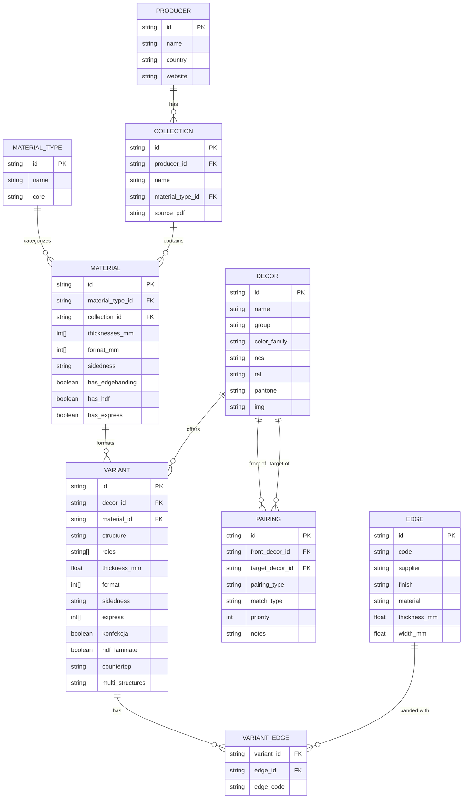

# Data Model — ERP Design

## Warstwa 1: Czym jest "dopasowanie"?

W kuchni mamy 3 typy parowania:

```
FRONT → KORPUS      "biały front na biały korpus"
FRONT → BLAT        "dębowy front na dębowy blat"  
FRONT → SPLASHBACK  "ten sam dekor za kuchenką"
```

To NIE jest relacja variant → variant. To relacja **decor → decor**:

```
K8685 (Biel Alpejska) → K110 (Biały Korpusowy)    # front → korpus
K8685 (Biel Alpejska) → K8685 (Biel Alpejska)      # front → ten sam dekor w chipboard
K8685 (Biel Alpejska) → 868S RS (blat)             # front → blat
```

**Wniosek:** `pairings` to tabela relacji między **dekory**, nie między wariantami.

---

## Warstwa 2: Co jest encją, co atrybutem?

| Element | Encja? | Dlaczego |
|---------|--------|----------|
| Material Type (chipboard, MDF) | ✅ TAK | ma własne properties,WithMany variants |
| Collection (Global, AG) | ✅ TAK | metadata, source_pdf, producent |
| Decor (K8685) | ✅ TAK | tożsamość wizualna,WithMany variants |
| Variant (K8685-CH) | ✅ TAK | purchasable SKU |
| Structure (SM, AG) | ❌ atrybut | nie jest purchasable, jest property variantu |
| Edge (K-8685-SM) | ✅ TAK | osobny purchasable item, nie embedded |
| Color (NCS S 0500-N) | ❌ atrybut | property decoru, nie osobna encja |
| Pairing (K8685→K110) | ✅ TAK | many-to-many relacja |

---

## Warstwa 3: Pełny model ERP

### Diagram ER



### Opis encji

#### PRODUCER
Producent materiałów (Kronospan, Egger, Swiss Krono).

#### MATERIAL_TYPE
Typ materiałowy — grupuje produkty o podobnych właściwościach fizycznych.

| Typ | Rdzeń | Przykład |
|-----|-------|---------|
| `chipboard` | płyta wiórowa | Global Collection |
| `mdf_acrylic` | MDF + akryl | Acrylic Gloss |
| `mdf_lacquered` | MDF + lakier | (przyszłość) |
| `mdf_foil` | MDF + folia | (przyszłość) |
| `compact` | compact HPL | Compact Interior |
| `hpl` | HPL na chipboard | (przyszłość) |
| `worktop` | blat roboczy | (przyszłość) |
| `splashback` | panel ścienny | (przyszłość) |

#### COLLECTION
Linia produktowa w ramach producenta. Każda kolekcja ma własny PDF źródłowy, struktury, formaty.

#### MATERIAL
Konkretny kupowalny format (arkusz). Odpowiada jednej kolekcji + typowi materiałowemu.

#### DECOR
Abstrakcyjna tożsamość wizualna — kolor, wzór, nazwa. **Niezależna od materiału.**

Kluczowe pola:
- `id` — unikalny identyfikator (np. `K8685`)
- `color_family` — rodzina kolorystyczna (27 kategorii)
- `ncs`, `ral`, `pantone` — referencje kolorystyczne

#### VARIANT
Konkretny wariant materiałowy dekoru. **Purchasable SKU.**

Kluczowe pola:
- `id` — `{decor_id}-{material_suffix}` (np. `K8685-CH`)
- `decor_id` → Decor
- `material_id` → Material
- `structure` — kod struktury (SM, PE, AG, ST9...)
- `roles` — zastosowania: `carcass`, `front`, `worktop`, `splashback`, `plinth`, `side_panel`, `housing`

#### EDGE
Obrzeże — osobny kupowalny element. Powiązany z variantem przez tabelę `VARIANT_EDGE`.

#### PAIRING
Relacja parowania między dekorami. Definiuje jakie dekory pasują do siebie w kontekście kuchni.

---

## Warstwa 4: Jak działa pairing w praktyce

### Typy parowania

| Typ | Opis | Przykład |
|-----|------|---------|
| `carcass` | front → korpus | K8685 → K110 (biały) |
| `worktop` | front → blat | K8685 → 868S RS |
| `splashback` | front → panel ścienny | K8685 → K8685 (HPL) |

### Typy dopasowania

| Typ | Znaczenie | Priorytet |
|-----|-----------|-----------|
| `exact` | ten sam dekor w innym materiale | 1 |
| `close` | kolorystycznie zbliżony | 2 |
| `default` | uniwersalny (biały korpus) | 99 |

### Scenariusz: Projektant wybiera front K8685

```sql
SELECT * FROM pairing
WHERE front_decor_id = 'K8685' AND pairing_type = 'carcass';
```

Wynik:

| target | match_type | priority | notes |
|--------|------------|----------|-------|
| K8685  | exact      | 1        | ten sam dekor, chipboard |
| K110   | default    | 2        | biały korpusowy, uniwersalny |
| K101   | close      | 3        | biały frontowy, droższy |

Następnie dla każdego target:

```sql
SELECT * FROM variant
WHERE decor_id = 'K8685' AND 'carcass' = ANY(roles);
```

Wynik: `K8685-CH` (chipboard 18mm)

### Scenariusz: Biały korpus jako default

K110 (Biały Korpusowy) pasuje do WSZYSTKIEGO jako `default`. Nie trzeba dodawać K110 do każdego frontu — wystarczy jedna reguła:

```yaml
- front: "*"
  target: K110
  type: carcass
  match: default
  priority: 99
```

---

## Warstwa 5: Co to zmienia w YAML

### Nowy plik: `pairings.yaml`

```yaml
# pairings.yaml
# Reguły parowania dekorów (front → korpus, front → blat, front → splashback)

pairings:
  # K8685 Biel Alpejska
  - front: K8685
    target: K8685
    type: carcass
    match: exact
    priority: 1
    notes: "ten sam dekor w chipboard"

  - front: K8685
    target: K110
    type: carcass
    match: default
    priority: 2
    notes: "biały korpusowy"

  # K0190 Czarny
  - front: K0190
    target: K0190
    type: carcass
    match: exact
    priority: 1

  - front: K0190
    target: K110
    type: carcass
    match: default
    priority: 2

  # Globalna reguła: K110 pasuje do wszystkiego jako default
  - front: "*"
    target: K110
    type: carcass
    match: default
    priority: 99
    notes: "biały korpusowy = uniwersalny default"
```

### Zmiana w `decors.yaml`

Pole `roles` przenosi się z variantu na decor (lub zostaje na wariancie — do decyzji). Na razie zostaje na wariancie.

---

## Warstwa 6: Co NIE jest potrzebne teraz

| Element | Czy teraz? | Dlaczego nie |
|---------|-----------|--------------|
| NCS_COLOR tabela | ❌ | NCS/RAL jest na Decor, wystarczy |
| PAIRING_RULES (algorytmiczne) | ❌ | Za wcześnie, ręczne pairings wystarczą |
| Price | ❌ | Brak danych |
| Inventory | ❌ | To nie ERP, to katalog |
| BOM | ❌ | kuchnie-core ma swój model |
| Customer/Order | ❌ | Poza zakresem |

---

## Podsumowanie: co dodać

1. **`pairings.yaml`** — osobny plik, relacje front → target
2. **`pairing_type`** — `carcass | worktop | splashback`
3. **`match_type`** — `exact | close | default`
4. **`priority`** — kolejność wyświetlania
5. **Wildcard `*`** — K110 jako default dla wszystkich frontów

To jest **minimum viable** które daje sensowne dopasowanie bez over-engineering.

---

## Porównanie: Kronospan vs Egger

| Aspekt | Kronospan | Egger |
|--------|-----------|-------|
| Kod dekoru | `K8685` | `H3303` |
| Kod struktury | `SM` (Super Mat) | `ST9` (Smooth Matt) |
| Struktura = tekstura? | nie — SM to wykończenie | tak — ST9 to fizyczna tekstura |
| Dopasowanie cross-material | `cross_collections` | implicit — ten sam kod = ten sam dekor |
| Front ↔ korpus | osobne dekory (K101 vs K110) | ten sam dekor, inny materiał |

Egger wbudował dopasowanie w nazewnictwo — `H3303 ST10` jest tym samym dekorem w chipboard, MDF i HPL. Kronospan wymaga ręcznego parowania.
