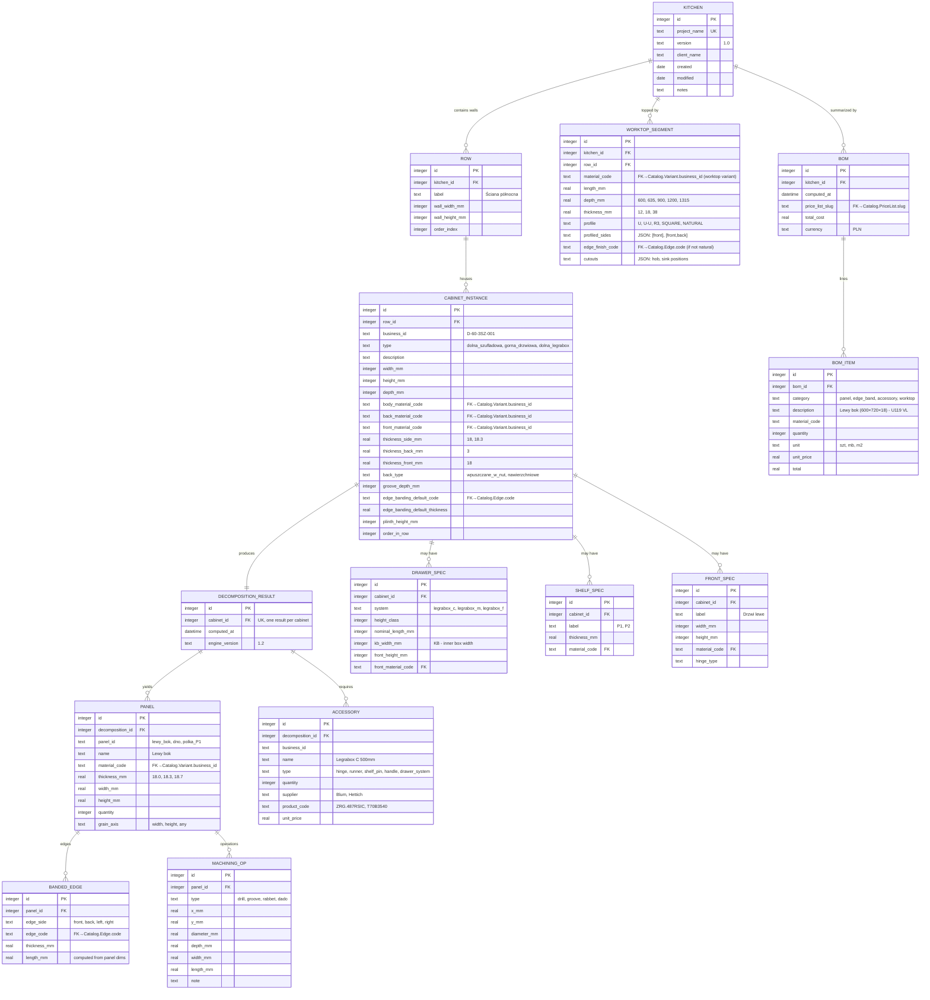
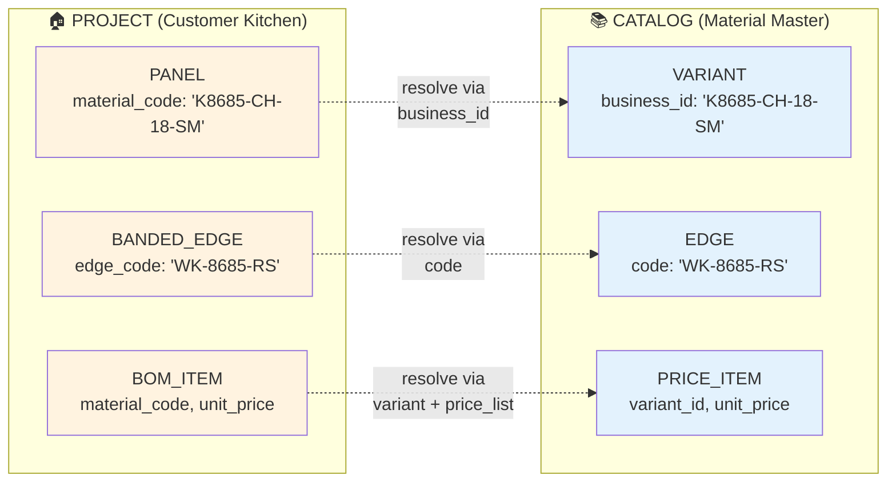

# ER Diagram — Kuchnie System (Catalog + Project)

> **Cel**: Docelowy model danych obsługujący pełną analizę katalogów Kronospan (~570+ SKU) i Swiss Krono (~300+ SKU), oraz dekompozycję projektów kuchennych klientów.
>
> **Architektura**: 2 bounded contexty + bridge.
> - **CATALOG** — statyczne dane producentów (Material Master)
> - **PROJECT** — konkretna kuchnia klienta (kitchen → cabinets → panels → BOM)
> - **BRIDGE** — Project.Panel odwołuje się do Catalog.Variant przez `business_id` (string), nie przez FK (stabilność serializacji)

---

## 1. CATALOG — Material Master (producenci, dekory, warianty)

```mermaid
erDiagram
    PRODUCER ||--o{ COLLECTION : has
    PRODUCER ||--o{ DECOR : owns
    PRODUCER ||--o{ STRUCTURE : "defines (optional)"
    COLLECTION ||--o{ SUBCOLLECTION : "contains"
    COLLECTION ||--o{ MATERIAL : "groups"
    SUBCOLLECTION ||--o{ MATERIAL : "groups"
    MATERIAL_TYPE ||--o{ MATERIAL : "categorizes"

    DECOR ||--o{ VARIANT : "produced as"
    MATERIAL ||--o{ VARIANT : "physical form of"
    STRUCTURE ||--o{ VARIANT : "surface of"
    SHEET_FORMAT ||--o{ VARIANT : "sized as"
    COLOR_FAMILY ||--o{ DECOR : categorizes

    VARIANT ||--o| WORKTOP_SPEC : "(if role=worktop)"
    WORKTOP_PROFILE ||--o{ WORKTOP_SPEC : "shape"
    WORKTOP_CONSTRUCTION ||--o{ WORKTOP_SPEC : "method"

    VARIANT ||--o{ VARIANT_AVAILABILITY : "stock status"
    VARIANT ||--o{ TECHNICAL_SPEC : "lab params"
    VARIANT ||--o{ PROPERTY_FLAG : "tagged with"

    VARIANT ||--o{ VARIANT_EDGE : "compatible with"
    EDGE ||--o{ VARIANT_EDGE : applies
    EDGE_SUPPLIER ||--o{ EDGE : supplies

    DECOR ||--o{ PAIRING : "front of"
    DECOR ||--o{ PAIRING : "target of"
    DECOR ||--o{ DECOR_TAG : tagged
    TAG ||--o{ DECOR_TAG : "applied to"

    VARIANT ||--o{ PRICE_ITEM : "priced as"
    PRICE_LIST ||--o{ PRICE_ITEM : "contains"

    PRODUCER {
        integer id PK
        text slug UK "kronospan, swiss_krono"
        text name "Kronospan"
        text country "Polska"
        text website
        datetime created_at
        datetime updated_at
    }

    COLLECTION {
        integer id PK
        integer producer_id FK
        text slug UK "global, kaindl, slim_line, sensesation"
        text name "Global Collection 2026"
        text source_pdf
        text source_pages "1-9, 48"
        text catalog_year "2026"
        boolean is_premium
        datetime created_at
        datetime updated_at
    }

    SUBCOLLECTION {
        integer id PK
        integer collection_id FK
        text slug "slim_line_global, slim_line_plus"
        text name "SlimLine plus"
        text description
    }

    MATERIAL_TYPE {
        integer id PK
        text slug UK "chipboard_laminated, mdf_acrylic, hpl_compact, hdf, splashback"
        text name "Płyta wiórowa laminowana"
        text core "chipboard, mdf, compact, hpl, hdf"
        text role_hint "front, body, back, worktop, splashback"
        text description
    }

    MATERIAL {
        integer id PK
        text slug UK "kronospan-chipboard-global"
        integer producer_id FK
        integer material_type_id FK
        integer collection_id FK
        integer subcollection_id "nullable FK"
        text name "Płyta wiórowa Global Collection 18mm"
        text sidedness "one_sided, two_sided"
        text description
    }

    SHEET_FORMAT {
        integer id PK
        text slug UK "2800x2070, 2800x1300, 4100x600"
        integer length_mm "2800, 4100"
        integer width_mm "2070, 1300, 600"
        text use_hint "board, worktop, slim, acrylic, hdf"
    }

    STRUCTURE {
        integer id PK
        integer producer_id "NULL = shared FK"
        text code "SM, PE, SU, MX, SE, OV"
        text name "Super Mat"
        text name_en "Super Mat"
        text type "smooth, wood_grain, stone, metal, fabric, concrete"
        text finish "matt, gloss, structured, anti_fingerprint"
        boolean fingerprint_resistant
        boolean synchronized_texture "for KronoSwiss SD/SW/CL/SE/OV"
        text description
    }

    COLOR_FAMILY {
        integer id PK
        text slug UK "bialy, czarny, dab, beton, szary, marmur"
        text name "Biały"
        text hex_approx "#FFFFFF"
    }

    DECOR {
        integer id PK
        integer producer_id FK
        integer color_family_id FK
        text business_id UK "K8685, D1861, U10030, 868S"
        text name_pl "Biel Alpejska"
        text name_en "Alpine White"
        text group_name "WHITE FRONT, XIV MAT 1"
        text ncs "S 0500-N"
        text ral "9016"
        text pantone
        boolean one_global "KronoSwiss shared decor"
        boolean new_2024
        boolean discontinued "do wyczerpania zapasow"
        text img_filename
        text notes
    }

    VARIANT {
        integer id PK
        text business_id UK "K8685-CH-18-SM, 868S-PF-600-RS"
        integer decor_id FK
        integer material_id FK
        integer structure_id FK
        integer sheet_format_id FK
        real thickness_mm "12, 16, 18, 18.3, 18.7, 38"
        text roles "JSON: [front, body, worktop, splashback]"
        text notes
    }

    WORKTOP_CONSTRUCTION {
        integer id PK
        text slug UK "postformed, abs_square_edge, slim_line, fitline, black_wood"
        text name "Post-formed"
        text producer_specific "kronospan, swiss_krono"
        text description
    }

    WORKTOP_PROFILE {
        integer id PK
        text code UK "U, U-U, R3, SQUARE, NATURAL"
        text name "Profil U"
        real edge_radius_mm "3.3, 1.5, 0"
        text profiled_sides "front, front+back, none"
    }

    WORKTOP_SPEC {
        integer id PK
        integer variant_id FK "UK, one spec per variant"
        integer construction_id FK
        integer profile_id FK
        integer max_length_mm "4100"
        text available_widths_mm "JSON: [600, 900, 1200]"
        text edge_material "Unoflex, ABS 1.5mm, naturalna"
        text core_color "Biały, Szary, Czarny, Bezowy (Slim Line)"
        boolean splashback_available
        boolean matching_board_available
    }

    TECHNICAL_SPEC {
        integer id PK
        integer variant_id FK
        text fire_class "D-s1,d0, D-s2,d0"
        text formaldehyde_emission "E1 / ED2020"
        integer density_kg_m3 "900 BLACK WOOD"
        real scratch_resistance_n "min 1.5, min 3"
        text abrasion_class "Class 1, Class 3A"
        real impact_resistance_n
        text test_standard "EN 14322, EN 438"
        real edge_swelling_24h_percent
    }

    PROPERTY_FLAG {
        integer id PK
        integer variant_id FK
        text property "antibacterial, waterproof, anti_fingerprint, uv_stable, scratch_resistant"
        boolean value
        text source "datasheet, catalog_page"
    }

    VARIANT_AVAILABILITY {
        integer id PK
        integer variant_id FK
        text channel "express_24h, konfekcja, standard"
        boolean available
        integer min_order_qty "1, palette"
        text warehouse "Mielec, Pustkow"
        text lead_time "24h, 7d, request"
    }

    EDGE_SUPPLIER {
        integer id PK
        text slug UK "schilsner, rehau, spander, kronospan"
        text name "Schilsner"
        text website
    }

    EDGE {
        integer id PK
        integer supplier_id FK
        text code UK "K-8685-SM, WK-8685-RS, 7045"
        text material "ABS, Unoflex, HPL, melamine"
        text finish "HG, UM, ABS, smooth"
        real thickness_mm "0.8, 1.0, 1.2, 1.5"
        real width_mm "23, 42, 43"
        real radius_mm "3.3, 1.5"
        text roll_lengths_mb "JSON: [25, 50, 75]"
        text notes
    }

    VARIANT_EDGE {
        integer variant_id PK
        integer edge_id PK
        text match_type "exact, close, default"
        integer priority "1=preferred"
    }

    PAIRING {
        integer id PK
        integer front_decor_id FK
        integer target_decor_id FK
        text pairing_type "carcass, worktop, splashback, hpl_laminate, acrylic, mirror"
        text match_type "exact, close, default"
        integer priority "1=highest"
        text source "global_collection, postformed_table, slim_line_table"
        text notes
    }

    PRICE_LIST {
        integer id PK
        text slug UK "kronospan-2026-q1"
        text currency "PLN, EUR"
        date valid_from
        date valid_to
        text source "official, dealer, estimated"
    }

    PRICE_ITEM {
        integer id PK
        integer price_list_id FK
        integer variant_id FK
        text unit "m2, mb, szt, sheet"
        real unit_price
        integer qty_break "1, 10, palette"
        real discount_percent
    }

    TAG {
        integer id PK
        text slug UK "frontowy, drewno, marmur, antybakteryjny"
        text name
        text category "use, style, property"
    }

    DECOR_TAG {
        integer decor_id PK
        integer tag_id PK
    }
```

---

## 2. PROJECT — Kuchnia klienta (kitchen → cabinet → panel)

---

## 3. BRIDGE — Jak Project łączy się z Catalog

**Reguła łączenia**: PROJECT przechowuje `material_code` jako **string** (business_id z Catalog). Loader/BOM-calculator robi `catalog.lookup(code)` żeby dostać prawdziwy Variant z parametrami i ceną.

**Dlaczego nie FK (integer ID)?**
1. **Stabilność serializacji** — JSON projektu jest czytelny i nie psuje się przy przeprowadzce DB
2. **Wymiana między systemami** — kuchnia projektowana w jednym katalogu może być wczytana w innym
3. **Wersjonowanie** — Catalog może mieć wiele wersji (2025 vs 2026), Project ma jeden snapshot
4. **YAML-first** — pliki YAML klienta używają czytelnych kodów, nie ID

---

## 4. Mapowanie pól z katalogów producentów

### 4.1. Kronospan — Global Collection (str. 6-31)

| Pole w katalogu | Tabela docelowa | Kolumna |
|---|---|---|
| Grupa wzorów (XII) | `decors` | `group_name` |
| Dekor (K8685) | `decors` | `business_id` |
| Struktura (SM) | `structures` + `variants` | `code` + `structure_id` |
| Nazwa PL (Biel Alpejska) | `decors` | `name_pl` |
| EX 12mm / 16mm / 18mm | `variant_availability` | `channel=express_24h` per thickness |
| Konfekcja (K) | `variant_availability` | `channel=konfekcja` |
| Blaty robocze | `pairings` | `pairing_type=worktop` |
| Laminaty HDF | `variants` (osobny) | `material_type=hdf` |
| Dopasowanie 1:1 (AG, AM, MG, CI, KA) | `pairings` | `pairing_type=acrylic/mirror/...` |
| Obrzeże ABS Schilsner | `edges` + `variant_edges` | `code=WK-8685-RS` |
| Kolory referencyjne (NCS, RAL, Pantone) | `decors` | `ncs, ral, pantone` |

### 4.2. Kronospan — Blaty postformed (str. 48)

| Pole | Tabela | Kolumna |
|---|---|---|
| Grupa (XIV MAT 1) | `decors` | `group_name` |
| Dekor (7045) | `decors` | `business_id` |
| Str. (RS) | `structures` | `code` |
| Nazwa PL (Szampański) | `decors` | `name_pl` |
| Profil U / 2U | `worktop_profiles` | `code=U`, `code=U-U` |
| Szer. 600/900/1200 mm | `worktop_specs` | `available_widths_mm` |
| Laminaty HPL Pustków | `pairings` | `pairing_type=hpl_laminate` |
| Płyta laminowana ● | `pairings` | `pairing_type=carcass` |
| Splashback ● | `worktop_specs` | `splashback_available` |
| Obrzeże ABS Schilsner | `edges` | `supplier=schilsner` |
| Obrzeże HPL (Folmag) | `edges` | `material=HPL` |

### 4.3. Kronospan — Slim Line (str. 65)

| Pole | Tabela | Kolumna |
|---|---|---|
| Global Collection / SlimLine plus | `subcollections` | `name` |
| Dekor (0190, K749) | `decors` | `business_id` |
| Struktura (AF, SL, SU, LV) | `structures` | `code` |
| Rdzeń (Biały/Szary/Czarny/Beżowy) | `worktop_specs` | `core_color` |
| Konfekcja (K) | `variant_availability` | `channel=konfekcja` |
| Laminaty (0190 RS) | `pairings` | `pairing_type=hpl_laminate` |

### 4.4. KronoSwiss — Płyty laminowane (str. 96-98)

| Pole | Tabela | Kolumna |
|---|---|---|
| Symbol (D1861, U10030) | `decors` | `business_id` |
| Struktura (MX, VL, SE, OV, OW) | `structures` | `code` |
| Nazwa / Name | `decors` | `name_pl` / `name_en` |
| 🌐 One Global | `decors` | `one_global=true` |
| Blat/Worktop | `pairings` | `pairing_type=worktop` |
| HPL: V | `pairings` | `pairing_type=hpl_laminate` |
| Black Wood ● | `pairings` | `pairing_type=worktop`, `target=blackwood` |
| Płyta Laminowana ● (niebieski) | `pairings` | `pairing_type=carcass` |
| SYNCHRO | `structures` | `synchronized_texture=true` |
| (*) do wyczerpania | `decors` | `discontinued=true` |

### 4.5. KronoSwiss — BLACK WOOD (str. 60-61)

| Pole | Tabela | Kolumna |
|---|---|---|
| Gęstość 900 kg/m³ | `technical_specs` | `density_kg_m3` |
| D-s1,d0 (trudnozapalny) | `technical_specs` | `fire_class` |
| Klasa 3A ścieranie | `technical_specs` | `abrasion_class` |
| ≥ 3 N zarysowanie | `technical_specs` | `scratch_resistance_n` |
| ≥ 20 N uderzenie | `technical_specs` | `impact_resistance_n` |
| Spęcznienie ≤ 8% | `technical_specs` | `edge_swelling_24h_percent` |
| Format 4100×1315×12 | `sheet_formats` + `variants` | `length=4100, width=1315, thickness=12` |
| Antybakteryjne | `property_flags` | `property=antibacterial` |

---

## 5. Decyzje projektowe (rationale)

### 5.1. Dlaczego `VARIANT` jest zatomizowane (Decor × Material × Structure × Thickness)?

**Przykład**: K8685 "Biel Alpejska" jest dostępna jako:
- Płyta wiórowa SM, 18mm, 2800×2070
- Płyta wiórowa BS, 18mm, 2800×2070 (inna struktura)
- Płyta wiórowa PD, 16mm, 2800×2070 (inna grubość, struktura)
- MDF Acrylic Gloss (AG), 18.3mm, 2800×1300 (inny material+format)
- MDF Mirror Gloss (MG), 18mm, 2800×2050 (inny material+format)
- HPL Laminate, 0.8mm, 3050×1320

Każda to osobny **VARIANT**, ale wszystkie dzielą **ten sam DECOR** (K8685). Pairing K8685→K8685 w innym Material to nie pairing, to wybór wariantu.

### 5.2. Dlaczego `WORKTOP_SPEC` jest opcjonalne (1:0..1 z Variant)?

Tylko warianty z rolą `worktop` mają `worktop_spec`. Warianty z rolą `front`/`body` nie potrzebują pól profile/edge_radius. Czyste rozdzielenie — zapobiega NULL-ach w `variants`.

### 5.3. Dlaczego `SUBCOLLECTION` zamiast hierarchii `parent_id`?

KronoSwiss ma kolekcje płaskie. Kronospan ma głównie płaskie ale Slim Line dzieli się na "Global" + "Plus". Dwupoziomowa hierarchia wystarczy. Hierarchia drzewa byłaby over-engineering.

### 5.4. Dlaczego `PROPERTY_FLAG` zamiast booleanów na `VARIANT`?

Każdy katalog opisuje inne właściwości:
- Kronospan: `anti_fingerprint`, `waterproof`, `synchro_texture`
- KronoSwiss: `antibacterial`, `uv_stable`, `fire_resistant`, `one_global`

Trzymanie wszystkich jako kolumn na VARIANT = sparse table z dziesiątkami nullowych boolean. EAV-style `property_flag` jest elastyczne i nie wymaga migracji przy dodaniu nowej właściwości.

### 5.5. Dlaczego `TECHNICAL_SPEC` osobno?

Dane techniczne są **rzadko wypełnione** (głównie KronoSwiss ma normy EN, Kronospan rzadziej). Trzymanie w osobnej tabeli (1:0..N) zapobiega 20 nullowych kolumn na każdym wariancie.

### 5.6. Dlaczego `PAIRING` symetryczne (front_decor + target_decor)?

Pairing K8685→868S (płyta→blat) i 868S→K8685 (blat→płyta — ten sam dekor jako płyta laminowana) to to samo dopasowanie z różnych perspektyw. Atrybut `pairing_type` mówi co jest czym. Pozwala query "co pasuje do K8685?" w obie strony.

### 5.7. Dlaczego CATALOG ↔ PROJECT przez `business_id` (string), nie FK?

Już omówione w sekcji 3 (Bridge). Krótko: stabilność serializacji JSON i wymiana między systemami.

### 5.8. Dlaczego `PRICE_LIST` osobno od `VARIANT`?

- Ceny zmieniają się w czasie (Q1 2026, Q2 2026, promo)
- Różni dealerzy mają różne cenniki
- Klient kupuje "po cenniku Q1" — projekt musi pamiętać który PriceList użyć

---

## 6. Migracja z obecnego stanu

### Stan obecny
- ✅ `producers, material_types, structures, color_families, edge_suppliers`
- ✅ `collections, materials, decors, variants, edges, variant_edges, pairings`
- ✅ `tags, decor_tags`
- ❌ Brak: `subcollections, sheet_formats, worktop_specs, worktop_profiles, worktop_constructions`
- ❌ Brak: `technical_specs, property_flags, variant_availability`
- ❌ Brak: `price_lists, price_items`
- ❌ Brak: PROJECT bounded context (kitchen, cabinet, panel, bom) — to osobny moduł `kuchnie_core`

### Plan migracji (4 fazy)

| Faza | Co | Wpływ |
|------|-----|-------|
| **Faza 1**: Worktop specs | Dodaj `worktop_constructions, worktop_profiles, worktop_specs, sheet_formats` | Pozwoli zaimportować 4 kolekcje blatów Kronospan + KronoSwiss postformed + BLACK WOOD |
| **Faza 2**: Properties + availability | Dodaj `property_flags, variant_availability` | Pozwoli rozróżnić Express/konfekcja/min_qty, anti-fingerprint, antybakteryjność |
| **Faza 3**: Technical specs | Dodaj `technical_specs` | Pozwoli zaimportować normy EN, klasy ogniowe, gęstości BLACK WOOD |
| **Faza 4**: Pricing | Dodaj `price_lists, price_items` | Pozwoli kalkulować BOM z prawdziwymi cenami z wersjonowanych cenników |

PROJECT bounded context (`kitchen, cabinet, panel, bom`) → osobne ADR i osobny moduł, **nie miesza się** ze schemą CATALOG.

---

## 7. Statystyki docelowego modelu

| BC | Tabele | Cel |
|---|---|---|
| CATALOG | 21 (lookup + main + relations + pricing) | Material Master, source of truth |
| PROJECT | 11 (kitchen → cabinet → panel + BOM) | Customer-specific config |
| **Razem** | **32 tabele** | Pełna obsługa Kronospan + KronoSwiss |

| Wymiar | Pokrycie obecne | Po migracji |
|---|---|---|
| Płyty laminowane (Decor × Material × Structure) | ✅ 90% | ✅ 100% |
| Akrylowe / Mirror / Metal (różne grubości) | ⚠️ częściowo (thickness_mm jako int blokuje 18.3, 18.7) | ✅ 100% (po Phase 3 w model.py) |
| Blaty postformed (profile U, U-U) | ❌ 0% | ✅ 100% |
| Blaty ABS Square Edge / Slim Line / BLACK WOOD | ❌ 0% | ✅ 100% |
| Splashback | ⚠️ jako boolean | ✅ jako osobny Variant role |
| Obrzeża ABS (Schilsner, Rehau, Spander) | ✅ 80% | ✅ 100% |
| Dopasowania (front ↔ blat ↔ HPL ↔ acrylic) | ✅ 70% | ✅ 100% |
| Klasy ogniowe / formaldehyde / gęstość | ❌ 0% | ✅ 100% |
| Cenniki wersjonowane | ❌ 0% | ✅ 100% |
| One Global / Synchro / NEW 2024 / Discontinued flagi | ❌ 0% | ✅ 100% |

---

## 8. Otwarte pytania (do następnych ADR)

1. **Walidacja dopasowań** — czy `pairing.target_decor_id` musi istnieć jako Decor, czy może być "luźny" kod (np. AG, MG bez własnego Decora)? → ADR po imporcie pierwszego pełnego catalogu
2. **Wersjonowanie katalogu** — czy import katalogu 2027 nadpisuje 2026, czy zachowuje obie wersje? → ADR przed pierwszym update
3. **Worktop cutouts** (hob, sink) — modelować jako MachiningOp czy osobno? → ADR w fazie projektu kuchni (po obsłudze blatów w CAM)
4. **Multi-currency pricing** — czy `price_item.unit_price` ma być w jednej walucie + tabela kursów, czy `currency` per item? → ADR przy pierwszej kuchni eksportowanej (DE/AT)

---

*Źródła*:
- Analiza katalogu Kronospan (`docs/materials-boards/Kronospan/*.md`) — 18 plików, ~570 SKU
- Analiza katalogu Swiss Krono (`docs/materials-boards/KronoSwiss/*.md`) — 3 pliki, ~300 SKU
- Obecny model: `catalog/docs/architecture/01-schema.sql` (13 tabel)
- Obecny model: `src/kuchnie_core/model.py` (8 dataklass)

*Data*: 2026-06-27
*Status*: Design — do akceptacji przed implementacją w ADR-008 (Material Master) i ADR-009 (Worktop Construction)
