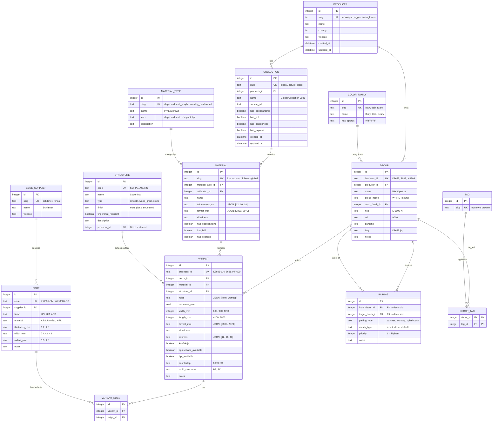
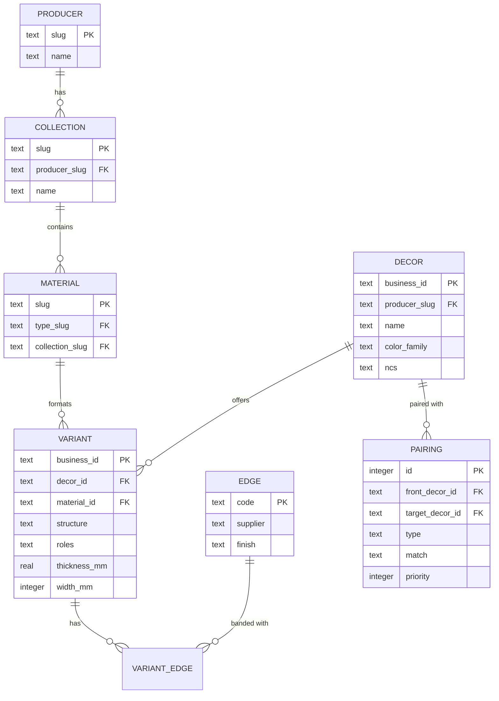

# ER Diagram — Kuchnie Catalog

```mermaid
erDiagram
    PRODUCER ||--o{ COLLECTION : "has"
    PRODUCER ||--o{ DECOR : "owns"
    COLLECTION ||--o{ MATERIAL : "contains"
    MATERIAL_TYPE ||--o{ MATERIAL : "categorizes"
    DECOR ||--o{ VARIANT : "offers"
    MATERIAL ||--o{ VARIANT : "formats"
    STRUCTURE ||--o{ VARIANT : "defines surface"
    COLOR_FAMILY ||--o{ DECOR : "categorizes"
    VARIANT ||--o{ VARIANT_EDGE : "has"
    EDGE ||--o{ VARIANT_EDGE : "banded with"
    EDGE_SUPPLIER ||--o{ EDGE : "supplies"
    DECOR ||--o{ PAIRING : "front of"
    DECOR ||--o{ PAIRING : "target of"
    DECOR ||--o{ DECOR_TAG : "tagged"
    TAG ||--o{ DECOR_TAG : "applied to"

    PRODUCER {
        integer id PK
        text slug UK "kronospan, egger, swiss_krono"
        text name
        text country
        text website
        datetime created_at
        datetime updated_at
    }

    COLLECTION {
        integer id PK
        text slug UK "global, acrylic_gloss"
        integer producer_id FK
        text name "Global Collection 2026"
        text source_pdf
        boolean has_edgebanding
        boolean has_hdf
        boolean has_countertops
        boolean has_express
        datetime created_at
        datetime updated_at
    }

    MATERIAL_TYPE {
        integer id PK
        text slug UK "chipboard, mdf_acrylic, worktop_postformed"
        text name "Plyta wiórowa"
        text core "chipboard, mdf, compact, hpl"
        text description
    }

    MATERIAL {
        integer id PK
        text slug UK "kronospan-chipboard-global"
        integer material_type_id FK
        integer collection_id FK
        text name
        text thicknesses_mm "JSON: [12, 16, 18]"
        text format_mm "JSON: [2800, 2070]"
        text sidedness
        boolean has_edgebanding
        boolean has_hdf
        boolean has_express
    }

    STRUCTURE {
        integer id PK
        text code UK "SM, PE, AG, RS"
        text name "Super Mat"
        text type "smooth, wood_grain, stone"
        text finish "matt, gloss, structured"
        boolean fingerprint_resistant
        text description
        integer producer_id FK "NULL = shared"
    }

    COLOR_FAMILY {
        integer id PK
        text slug UK "bialy, dab, szary"
        text name "Bialy, Deb, Szary"
        text hex_approx "#FFFFFF"
    }

    DECOR {
        integer id PK
        text business_id UK "K8685, 868S, H3303"
        integer producer_id FK
        text name "Biel Alpejska"
        text group_name "WHITE FRONT"
        integer color_family_id FK
        text ncs "S 0500-N"
        text ral "9016"
        text pantone
        text img "K8685.jpg"
        text notes
    }

    VARIANT {
        integer id PK
        text business_id UK "K8685-CH, 868S-PF-600"
        integer decor_id FK
        integer material_id FK
        integer structure_id FK
        text roles "JSON: [front, worktop]"
        real thickness_mm
        integer width_mm "600, 900, 1200"
        integer length_mm "4100, 2800"
        text format_mm "JSON: [2800, 2070]"
        text sidedness
        text express "JSON: [12, 16, 18]"
        boolean konfekcja
        boolean splashback_available
        boolean hpl_available
        text countertop "868S RS"
        text multi_structures "BS, PD"
        text notes
    }

    EDGE {
        integer id PK
        text code UK "K-8685-SM, WK-8685-RS"
        integer supplier_id FK
        text finish "HG, UM, ABS"
        text material "ABS, Unoflex, HPL"
        real thickness_mm "1.2, 1.5"
        real width_mm "23, 42, 43"
        real radius_mm "3.3, 1.5"
        text notes
    }

    EDGE_SUPPLIER {
        integer id PK
        text slug UK "schilsner, rehau"
        text name "Schilsner"
        text website
    }

    VARIANT_EDGE {
        integer id PK
        integer variant_id FK
        integer edge_id FK
    }

    PAIRING {
        integer id PK
        integer front_decor_id FK "FK to decors.id"
        integer target_decor_id FK "FK to decors.id"
        text pairing_type "carcass, worktop, splashback"
        text match_type "exact, close, default"
        integer priority "1 = highest"
        text notes
    }

    TAG {
        integer id PK
        text slug UK "frontowy, drewno"
    }

    DECOR_TAG {
        integer decor_id FK "PK"
        integer tag_id FK "PK"
    }
```

## Simplified (core entities only)

```mermaid
erDiagram
    PRODUCER ||--o{ COLLECTION : has
    COLLECTION ||--o{ MATERIAL : contains
    DECOR ||--o{ VARIANT : offers
    MATERIAL ||--o{ VARIANT : formats
    VARIANT ||--o{ VARIANT_EDGE : has
    EDGE ||--o{ VARIANT_EDGE : "banded with"
    DECOR ||--o{ PAIRING : "paired with"

    PRODUCER {
        text slug PK
        text name
    }

    COLLECTION {
        text slug PK
        text producer_slug FK
        text name
    }

    MATERIAL {
        text slug PK
        text type_slug FK
        text collection_slug FK
    }

    DECOR {
        text business_id PK
        text producer_slug FK
        text name
        text color_family
        text ncs
    }

    VARIANT {
        text business_id PK
        text decor_id FK
        text material_id FK
        text structure
        text roles
        real thickness_mm
        integer width_mm
    }

    EDGE {
        text code PK
        text supplier
        text finish
    }

    PAIRING {
        integer id PK
        text front_decor_id FK
        text target_decor_id FK
        text type
        text match
        integer priority
    }
```
