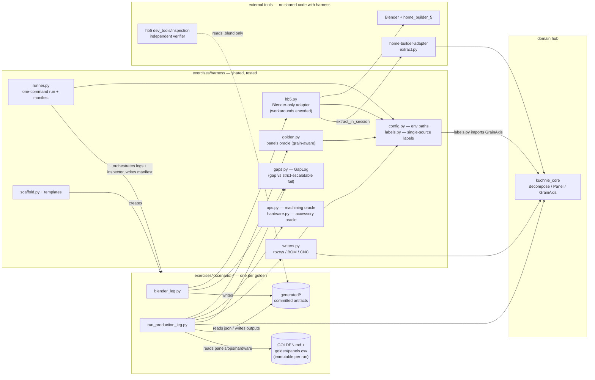
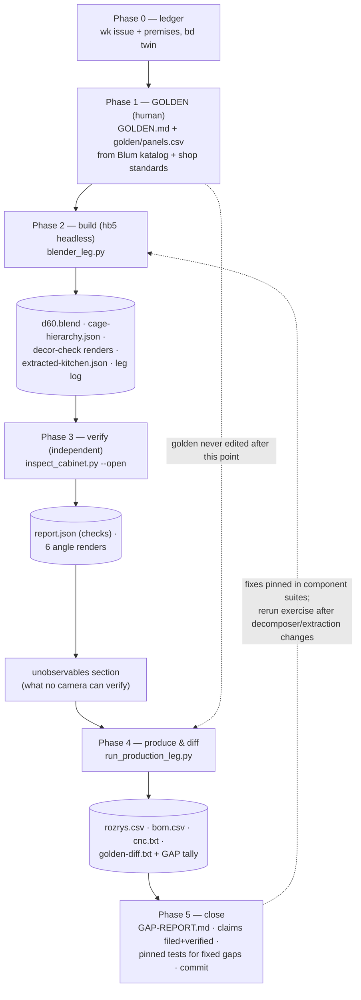
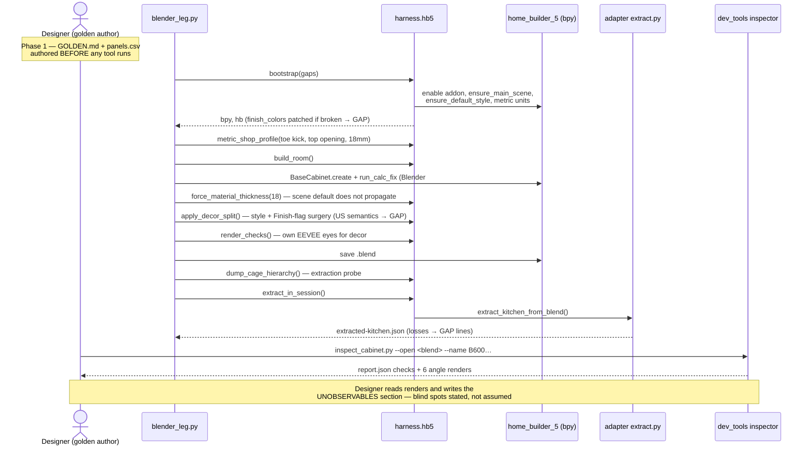

# E2E exercise convention — golden-first walking skeletons

> Reader: anyone (human or agent) about to test the pipeline against a real
> scenario | Enables: designing an exercise that measures the pipeline
> instead of flattering it | Update-trigger: a principle is contradicted by
> a run, or the harness API changes (`exercises/harness/`)

An **exercise** is a golden-first end-to-end run of one realistic cabinet or
kitchen scenario across the whole pipeline (design intent → hb5 scene →
extraction → decompose → rozrys/BOM/CNC), with every distance from intent
measured and filed. Exercises found G1–G13 and E1–E8; the fixes they forced
are pinned in the component test suites. Precedents:
`exercises/walking-skeleton-d60/` (round 1),
`exercises/e2e-d60-legrabox/` (round 2, golden-first + visual verify).

## Principles (the short list)

**Truth & oracles**

1. *Golden first, tool second.* Author the expected cutlist/BOM/CNC by hand
   from the domain (Blum catalog, shop standards) BEFORE running anything.
   A golden derived from the code tests the code against itself.
2. *The golden is immutable per run.* Never edit it to make a diff pass;
   a new design gets a new golden (and a new exercise directory).
3. *Millimetres before pixels.* Numbers (dims, coordinates, areas, counts)
   are the primary oracle; renders corroborate.
4. *Independent second eyes.* Verify with tooling that shares no code with
   the builder (hb5 `dev_tools/inspection`) — shared formulas hide shared
   bugs.

**Determinism & environment**

5. *Headless everything*, with the bootstrap gotchas encoded in the harness
   and commented with WHY (`--enable-autoexec`, `run_calc_fix`,
   addon-before-open — see `exercises/harness/hb5.py`).
6. *Pin the toolchain*: Blender build, addon commit, metric units, locale.
7. *One command from clean* per leg; no manual scene fiddling.
8. *Fixtures are committed artifacts* — .blend, dumps, renders, reports.
   Claims watch these paths; a gap report pointing at deleted files is
   folklore.

**Measure the seams, not just the parts**

9. *Both directions of every boundary*: design intent → tool (can hb5
   express it?) and tool → production (does extraction carry it?). Unit
   tests cannot see seams.
10. *Every hand re-entry is a first-class result* — log it as a `GAP:` line
    via the harness `GapLog`; the count per run is the integration metric.
11. *Report unobservables honestly* — what no camera or check can see
    (grooves, joinery, decor identity in Workbench renders) gets its own
    section, or an unstated blind spot becomes an assumed pass.
12. *Classify deltas*: bug / convention / paradigm. "19.05 vs 18" is trivia;
    "hb5 thinks in opening sizes, the shop thinks in front heights" shapes
    architecture.

**Regression & lifecycle**

13. *Every closed gap becomes a pinned test* in the owning component's
    suite (G6 → `test_back_panel_d60_reference`). The exercise finds; the
    suite holds.
14. *Exercises are rerunnable and cheap* — rerun after any decomposer or
    extraction change (see CLAUDE.md § Build & Test).
15. *Findings live in the truth ledger*, as claims with mechanical evidence
    commands, wired as premises of the work they justify.
16. *Severity = scrap-risk at the saw/CNC*: wrong drill row > missing BOM
    line > naming drift.

**Scope discipline**

17. *One realistic scenario beats ten synthetic ones.* Parameter matrices
    come later, for formulas the skeleton proved live.
18. *Don't perfect the tool inside the harness.* When the tool can't express
    the intent, record the delta — that delta IS the finding.

## Directory contract

Scaffold a new exercise with:

```bash
.venv/bin/python exercises/harness/scaffold.py <scenario-name>
```

```
exercises/<scenario-name>/
  GOLDEN.md                # phase 0-1: the hand design (immutable per run)
  golden/panels.csv        # machine-readable golden cutlist (schema below)
  blender_leg.py           # phase 2: hb5 headless build (+ own EEVEE render)
  run_production_leg.py    # phase 4: extracted JSON -> decompose -> outputs + diff
  GAP-REPORT.md            # findings, phase by phase (template pre-structured)
  generated/               # committed artifacts: .blend, dumps, renders,
                           #   rozrys.csv, bom.csv, cnc.txt, golden-diff.txt,
                           #   inspection/ (dev_tools output)
```

## Phases

0. **File the work item** (`scripts/truth issue … --premise …`, bd twin).
1. **Golden** — GOLDEN.md narrative + `golden/panels.csv`. Include joinery,
   drillings, hardware, edge lm; list deliberate differences from known
   pipeline conventions (G9/G11/G12/G13) so the diff reads clean.
2. **Build** — hb5 headless via `exercises/harness/hb5.py` helpers
   (bootstrap, metric shop profile, decor split, thickness forcing,
   hierarchy dump, check renders). Log every workaround as a GAP.
3. **Verify** — `home_builder_5/dev_tools/inspection/inspect_cabinet.py
   --open <blend> --name <cabinet>`; read the renders yourself; write the
   *unobservables* section.
4. **Produce & diff** — `run_production_leg.py` re-enters (and GAP-logs)
   whatever extraction lost, decomposes, writes rozrys/bom/cnc via
   `harness.writers`, diffs vs golden via `harness.golden.diff_panels`
   (grain-aware: `brak` panels match with free rotation).
5. **Close** — GAP-REPORT.md, claims filed + verified, pinned tests for
   fixed gaps, commit, `done --claim`.

## Running an exercise

```bash
.venv/bin/python exercises/harness/runner.py <scenario> [--strict]
                 [--skip-blender] [--skip-inspect]
```

One command chains blender leg → inspection → production leg and writes
`generated/run-manifest.json` (repo SHA + dirty flag, Blender version, hb5
SHA, per-step exit codes) — rules 6–7 made mechanical. `--strict` turns
tolerated failures (GapLog `fail`) into hard stops for regression/CI runs;
default is exploration mode. Paths are env-overridable: `KUCHNIE_HB5_PATH`,
`BLENDER_BIN` (see `exercises/harness/config.py`).

## Golden CSV schemas (three oracles)

All semicolon-separated with a header row. Panels are mandatory; ops and
hardware diffs run whenever their CSV exists (scaffold ships starters).

**`golden/panels.csv`** — mirrors the pinned rozrys contract:

```
Element;Dlugosc;Szerokosc;Grubosc;Ilosc;Material;Uslojenie
Bok lewy;720;560;18;1;PLYTA_BIALA_18;brak
Front M;140;596;18;1;K5307_18;pion
```

`Uslojenie` ∈ {`brak`, `pion`, `poziom`}. For `brak` the diff treats
Dlugosc/Szerokosc as rotatable; for `pion`/`poziom` the orientation is part
of the contract. Near-misses within ±4 mm pair closest-first and report as
DELTA.

**`golden/ops.csv`** — machining coordinates, where scrap-risk lives (this
oracle catches G8-class wrong-row drilling mechanically):

```
Element;Typ;X;Y;Srednica;Glebokosc;Szerokosc;Dlugosc;DrillType
Bok lewy;drill;46;55;5;12;;;runner_screw
Bok lewy;groove;12;;;8;4;720;
```

Ops match per element (names normalized, Polish diacritics folded) with a
global fallback pool for naming drift; coordinates within ±0.5 mm.

**`golden/hardware.csv`** — accessory completeness (the G13 meter):

```
Typ;Pozycja;Ilosc
runner;LEGRABOX kpl. NL500 40kg;3
confirmat;Konfirmat 7x50;10
```

Matching is by accessory `Typ` with summed quantities; golden types the
pipeline does not emit yet report as MISSING — that IS the measurement.

## Naming

Cabinets in scenes follow the inspection naming discipline
(`B600-3DW-01 <label>` — see `dev_tools/inspection/naming.py`), so kitchen
mode can address them by name and audit the name against measured geometry.

## Architecture

### Components & dependency direction

The dependency rule points inward: scenario legs depend on the harness, the
harness depends on the domain (`kuchnie_core`), and nothing in the domain
knows the harness exists. `hb5.py` is the only module touching Blender; the
inspector shares **no code** with the builder (principle 4) — it reads the
saved `.blend` and nothing else.



### Collaboration — one exercise run, artifact by artifact



### Sequence — build & verify legs



### Sequence — production leg & golden diff

```mermaid
sequenceDiagram
    participant PL as run_production_leg.py
    participant GA as GapLog
    participant KC as kuchnie_core.decompose
    participant WR as harness.writers
    participant GO as harness.golden

    PL->>PL: read generated/extracted-kitchen.json
    PL->>GA: gap(…) per hand re-entry<br/>(type, drawer spec, materials, front heights…)
    PL->>KC: decompose(CabinetInstance)
    KC-->>PL: DecompositionResult (panels, machining ops, accessories)
    PL->>WR: write_rozrys / write_bom / write_cnc
    PL->>GO: read_golden_panels(golden/panels.csv)
    PL->>GO: diff_panels(golden, result)
    Note over GO: grain-aware — 'brak' rotates free,<br/>'pion'/'poziom' pin orientation;<br/>±4mm near-miss → DELTA not MISSING
    GO-->>PL: DiffResult (match / delta / missing / extra)
    PL->>PL: golden-diff.txt + GAP tally
    Note over PL: → GAP-REPORT.md → ledger claims<br/>→ pinned tests for every fixed gap
```
