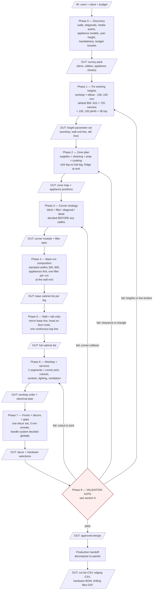
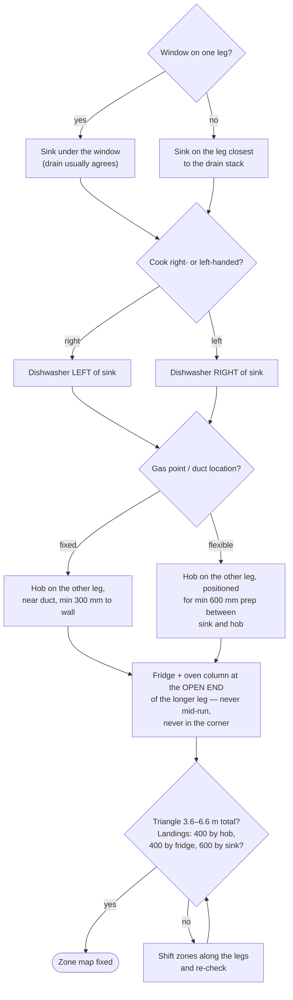
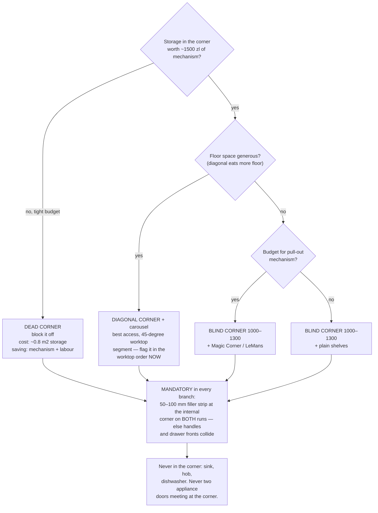
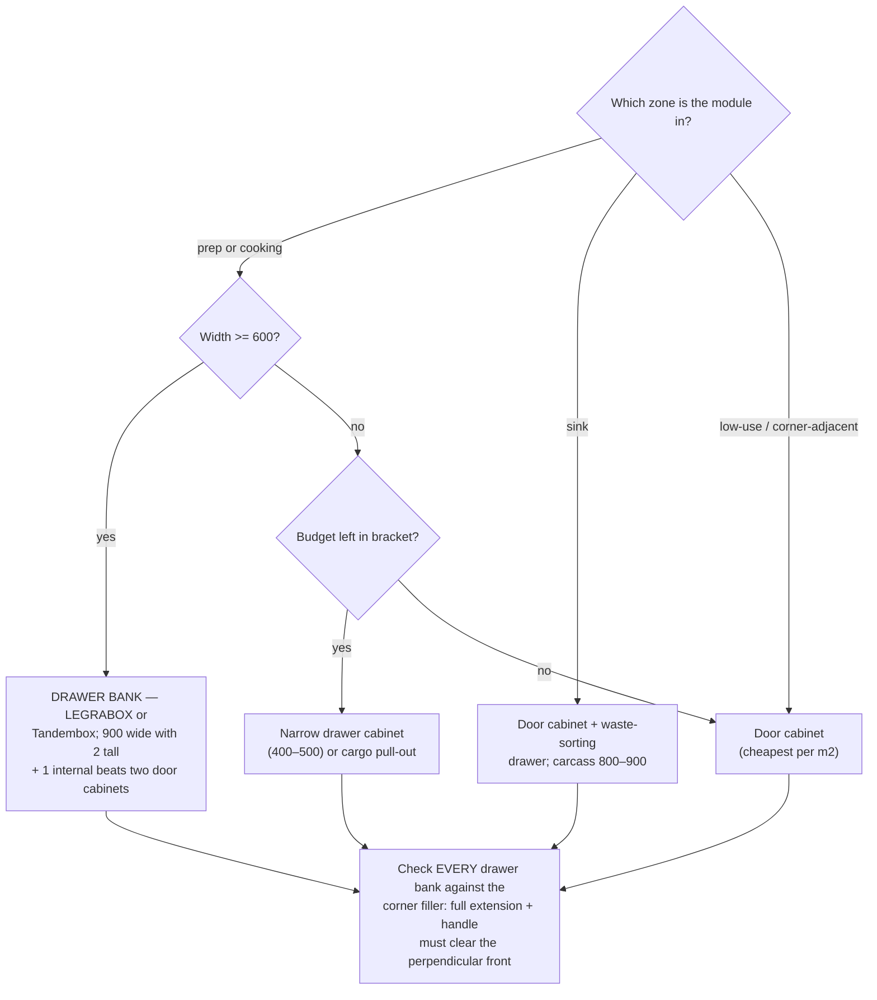
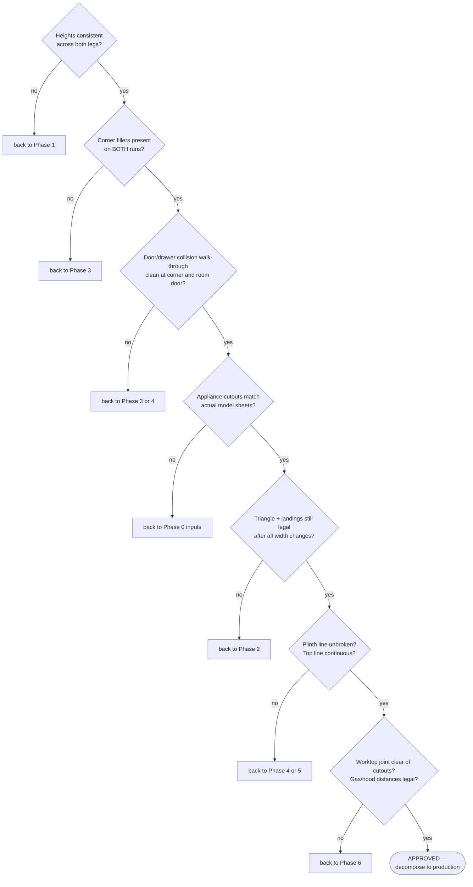

# L-Kitchen Design Playbook — process flow and decision trees

> Reader: designer (human or agent) laying out an L-shaped kitchen from first
> visit to production handoff | Enables: running the same phase sequence with
> the same gates every project, so two designs made months apart come out
> consistent | Update-trigger: a phase, gate number (heights, clearances), or
> decision-tree branch changes in practice

The discipline in one sentence: **heights → zones → corner → widths** — any
process that starts by placing cabinets is decorating, not designing.

---

## 1. Master pipeline

Each phase consumes the artifacts of the previous one. A phase without its
input artifact does not start (Phase 0 rule: missing input = redesign later).

---

## 2. Phase 2 decision tree — zones and appliance placement

**Hard rules encoded above:** sink-to-hob >= 600 mm worktop between them;
hob >= 300 mm from a side wall; dishwasher adjacent to sink on the
dominant-hand side; fridge with >= 400 mm set-down beside it; no traffic
path through the triangle; walkway in front of the L >= 1100 mm.

---

## 3. Phase 3 decision tree — the corner

Decided before dimensioning either run, because the corner consumes width
from **both** legs.

---

## 4. Phase 4 decision tree — drawers vs doors per module

Composition rules: standard widths only (300/400/450/500/600/800/900);
appliances placed first (they are fixed sizes); wall irregularity absorbed
by **one filler per run at the wall end, never mid-run**.

---

## 5. Phase 6 essentials — worktop and services

- Worktop = **two segments joined at the corner**; joint type (mason's mitre
  for laminate) and grain direction decided with the order, not at fitting.
- Cutouts (sink, hob) with >= 50 mm material web around them; the corner
  joint must not land on a cutout.
- Sockets every ~900 mm above worktop, none within 600 mm of the sink edge;
  dedicated circuit for induction; under-cabinet LED over the full prep run.
- Hood height per its spec: >= 650 mm electric / >= 750 mm gas above hob.

---

## 6. Phase 8 — validation gate (run every item, every time)

---

## 7. Mapping to the pipeline in this repo

| Playbook step | Repo home |
|---|---|
| Phase 0/7 decor selection | `krono-compositor-mvp` (first-visit previews), `catalog` (decors, pairings) |
| Phase 2–5 layout | `home_builder_5` (external Blender addon) → `home-builder-adapter` extraction |
| Phase 8 mechanical checks | `kuchnie_core.validator` / `validate_rows` (candidates to encode the gate) |
| Production handoff | `kuchnie_core.decompose()` → cut list / edging CSV → `kitchen-erp` BOM + cost → `kitchen-cam` drilling DXF |

The gate numbers in this playbook (heights, clearances, filler widths) are
design-practice values, not repository facts — they carry no ledger ids by
design. If any of them become encoded in code (e.g. the validator learns the
corner-filler rule), cite the implementing spec from here.
