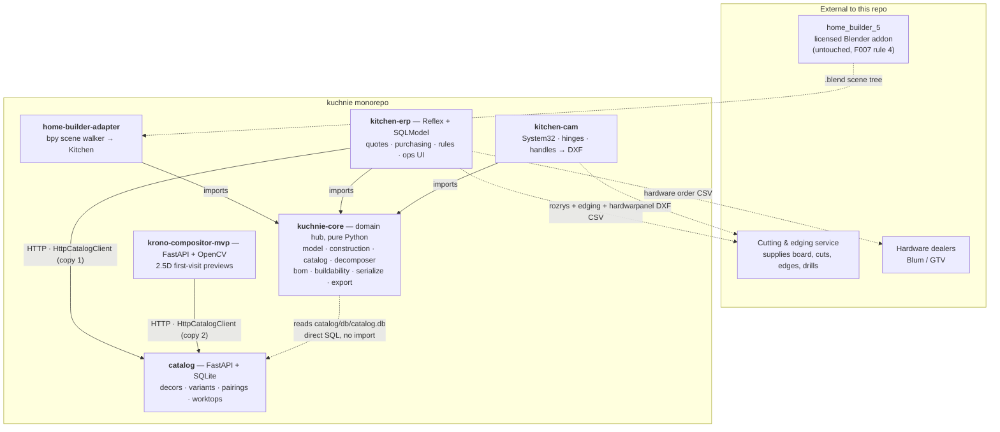
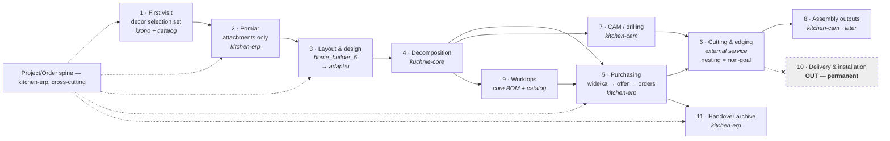
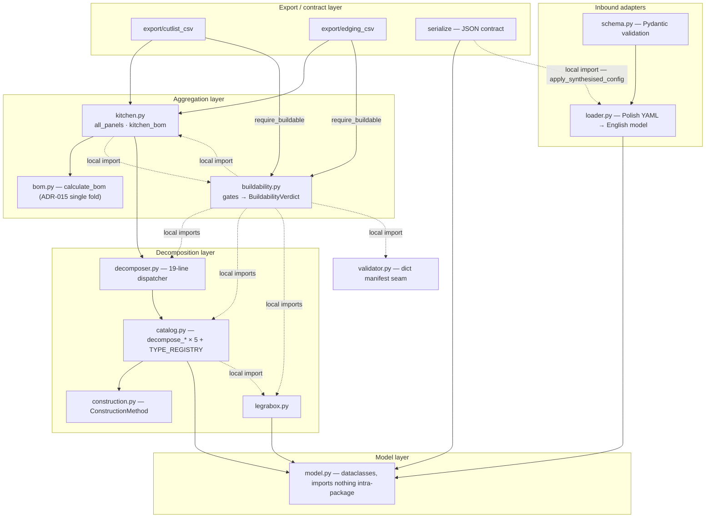
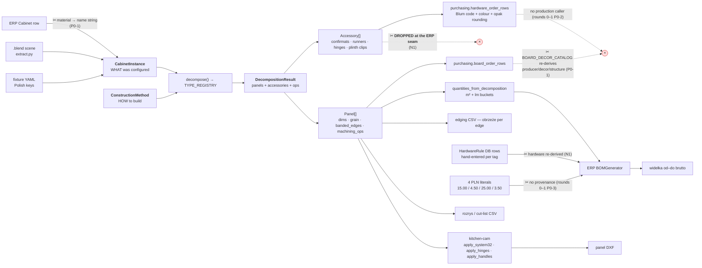
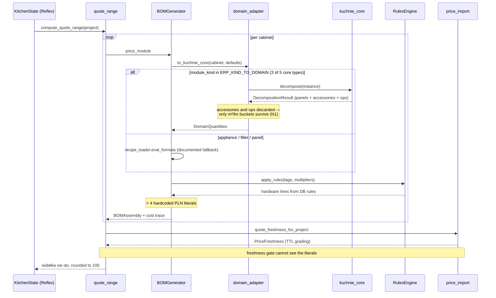
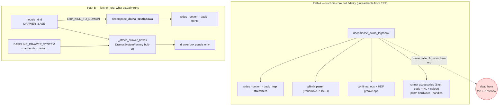

# Refactor plan: architecture review round 2 — views, diagrams, seam findings (2026-08-02)

> Reader: whoever picks up architecture work after the rounds 0–1 plan, or
> Michał deciding which seam repairs to fund | Enables: seeing the system
> from six angles without re-deriving the diagrams, and executing the three
> new seam repairs this pass justifies | Update-trigger: a listed repair
> ships (then its section is history, not plan), a listed question is
> answered by the owner, or round 3 runs and adds findings

**Companion to `architecture-refactor-plan-2026-08-02.md` (rounds 0–1).**
That document owns findings P0-1…P0-4 and P1-1…P1-2; this one does not
restate them. This is the **round 2** pass its §4 specified: module
dependency graphs, the data-flow view, the domain-model/vocabulary check,
plus one round-3 sequence diagram. It reads four of the five bodies round 2
asked for and **answers three of that document's open items** (§5 below).

**Status: round 3 has since run** (`architecture-review-round-3-2026-08-02.md`,
findings N12–N15) and the consolidated verdict is written
(`architecture-consolidated-review-2026-08-02.md`). **N5 and N6 have shipped**
— see §7 for the wave-1 outcome and §8 for the unknowns it closed. Absence of
a finding here is still not a clean bill of health.

**Evidence labels** (same scheme as rounds 0–1): `CONFIRMED` — a command was
run this session, recorded in Appendix B. `OBSERVED` — read at a cited
file:line. `INFERRED` — likely from a named signal, not proven.
`NEEDS-BODY` — answerable only by reading code not yet read.

**Diagram labels** (AGENTS.md governance rule 5): every diagram is captioned
`OBSERVED` (each arrow traced to an import or a cited line) or `PROPOSED`.

---

## 0. The three-line verdict

The macro-architecture is sound and deliberate: the dependency rule holds,
the component boundaries follow the trade's real process (`process-coverage.md`
stages 1–11), and buildability-gated exports mean you structurally cannot cut
board from an unvalidated kitchen. What round 2 adds is that the *seam*
between kitchen-erp and kuchnie-core is narrower than the architecture
implies — it passes m²/lm numbers and drops everything else, so the richest
decomposer in the domain hub is unreachable from the app that quotes and
buys. The single most valuable repair in the whole review is widening that
seam, because three separate duplications (materials, hardware, construction
method) all collapse into it.

---

## 1. Patterns and idioms this codebase actually uses

Named so future work can conform rather than invent. Each is `OBSERVED`
unless marked.

**Architecture-level**

| Pattern | Where | Note |
|---|---|---|
| Hub-and-spoke, one-way dependency | every component imports `kuchnie_core`; it imports none | the strongest property in the repo (rounds 0–1 §0, `CONFIRMED`) |
| Anti-corruption layer at each boundary | `loader.py` (Polish YAML→English model), `home-builder-adapter/src/extract.py` (`.blend`→`Kitchen`), `core/domain_adapter.py` (SQLModel row→`CabinetInstance`) | ADR-009 states the pattern explicitly |
| Ports & adapters | `materials/protocol.py` + `sqlite_repository.py`; `compositor/domain/interfaces.py` + `opencv_impl.py`; `CatalogClient` Protocols | textbook in krono; solid in core/materials |
| Versioned intermediate format as contract | `serialize.py`, `"version": "1.0"`, self-contained | ADR-004; the Expert-2 "derive once, flow forward" lesson |
| Registry / dispatch over type-switch | `TYPE_REGISTRY` + a 19-line `decomposer.py`; `ConstructionMethodRegistry`; `DrawerSystemFactory`; `HingeFactory` | `CONFIRMED` B.5 |

**Domain-level**

| Pattern | Where | Note |
|---|---|---|
| Panel is the atom | ADR-001; edges and ops are *data on* `Panel` | aggregation happens only in `export/` |
| Absence means absent | `banded_edges` dict, `machining_ops` list | no null-object ceremony |
| Construction method ≠ cabinet instance | `construction.py` vs `model.py`, joined by `catalog.py` | ADR-002; Polyboard's lesson |
| Gate → verdict, threaded through every export | `buildability.py`; `require_buildable` in `kitchen_bom`, `export_cutlist_csv`, `export_edging_csv` | commercially the highest-value idiom here |
| Strategy by material class | `PurchasingStrategy` × 4 | sheet / linear / countertop / exact |
| Sandboxed formula evaluation | `recipe.py` walks a restricted `ast`, never `eval` | mirrored (differently) in ERP — see §3, N4 |
| Single BOM fold | `calculate_bom` is walked once; `quantities_from_decomposition` is a *view* over it | ADR-015, and the docstring says so |

**Process-level** (unusual, and worth protecting)

- **Golden-first e2e**: the d60 walking skeleton diffs `generated/` against
  `reference/`; `exercise-gate.sh` pins the flagship baseline.
- **Assertions show the formula**: `assert back.width_mm == 700  # LW−38`.
- **Truth-ledger-gated work**: specs cite `tr-` fact ids; `scripts/truth
  ready` HOLDs issues whose premises died. Notably, three findings from this
  review were *already in the ledger* (`tr-fc74bc2e`, `tr-00421995`,
  `tr-b2e3dbff`) — the governance is catching its own debt.

---

## 2. The six views

### 2.1 Component map and dependency direction — `OBSERVED`

Solid = code dependency (import); dashed = data artifact or file-level
coupling. The core→catalog arrow is **data-plane only**: core reads the
catalog service's SQLite file directly, with no import and no HTTP call
(rounds 0–1 A.6; the file is real and populated, `CONFIRMED` B.3).



### 2.2 Business process, stages 1–11 with owners — `OBSERVED` (from `docs/specs/process-coverage.md`)



### 2.3 kuchnie-core internal layering — `OBSERVED`

Dotted arrows are the nine function-local imports that exist to break
cycles (rounds 0–1 P1-2). They are the reason this graph is not acyclic.



### 2.4 Data flow: one cabinet, three entry points, five outputs — `OBSERVED`

Marked ✂ at each place data is **re-derived rather than flowed** — the
Expert-2 cardinal sin, and the through-line of every P0 in both documents.



### 2.5 Offer-time sequence — `OBSERVED` (round 3 preview)



### 2.6 The two drawer-base construction paths — `OBSERVED` (this is finding N2)



---

## 3. New findings (round 2)

Numbered `N` to avoid collision with rounds 0–1's `P0-*`/`P1-*`.

### N1 — Accessories are computed from geometry, then thrown away and re-entered by hand

**Severity: P0.**

**Evidence.** `quantities_from_decomposition` returns `DomainQuantities`,
which carries six float fields — `corpus_m2`, `back_m2`, `front_m2`,
`drawer_box_m2`, `corpus_edge_lm`, `front_edge_lm`
(`domain_adapter.py:70-78`, `OBSERVED`). The word "accessor" does not appear
anywhere in `domain_adapter.py` (`CONFIRMED`, B.2). Meanwhile
`catalog.py` derives accessories *from the geometry it just computed*:
`_confirmat_accessory` counts actual confirmat ops, `_euro_screw_accessory`
counts profiles, `_plinth_hardware_accessories` emits nóżka ×4 + klips +
zaczep gated on `plinth_height_mm > 0`, `make_runner_accessory` carries the
Blum height code, NL and colour.

All of it is discarded at the seam. `BOMGenerator` then calls
`self.rules_engine.apply_rules(tags, root, multipliers)` with
`multipliers = {"has_doors": door_count, "has_drawers": drawer_count}`
(`bom_generator.py:177-186`, `OBSERVED`), pulling hardware quantities from
hand-entered `HardwareRule` database rows keyed on recipe tags.

**Why it matters.** *Expert 2:* this is the same failure as rounds 0–1 P0-1,
one level up — the domain derives the answer, the app ignores it and retypes
it. *Expert 1:* confirmat count follows from the actual joint geometry, not
from "has doors"; a 900 mm drawer base and a 300 mm one get the same
tag-derived hardware line but genuinely different confirmat and screw counts.
The runner line is worse: the ERP's rule row cannot know the NL or the
height code, so the quote prices "a runner" while purchasing needs
`ZF7M70E2` + colour suffix. *Expert 3:* `DomainQuantities` is a lossy
projection presented as a translation.

**Repair instruction.**
1. Widen `DomainQuantities` to carry `accessories: list[Accessory]` —
   pass-through, no transformation. This is a small, additive change.
2. In `BOMGenerator`, price accessories from that list when the domain path
   ran; fall back to `RulesEngine` only on the `to_kuchnie_core → None`
   branch (appliances/fillers), exactly mirroring the existing panel-quantity
   fallback that is already documented in `domain_adapter`'s module docstring.
3. Demote `HardwareRule` from *quantity + price* to *price only*, keyed on
   accessory type/code. Quantities come from geometry; prices come from the
   owner. Keep the admin UI for the price column.
4. This makes rounds 0–1 P0-2 (`hardware_order_rows` has no production
   caller) a straight wiring job — the accessory list it needs will finally
   exist on the ERP side.

**Effort M · Risk low-medium · Blast radius: `domain_adapter`,
`bom_generator`, `rules_engine`, `HardwareRule` schema + admin UI, quote
totals (they will move — that is the point).**

**First concrete step:** step 1 alone (carry the list, don't consume it yet)
with a test asserting a drawer base's confirmat count survives the seam.
Independently useful and reversible.

### N2 — The richest decomposer in the domain hub is unreachable from the app that quotes and buys

**Severity: P0.**

**Evidence.** `TYPE_REGISTRY` holds five decomposers (`CONFIRMED`, B.5):
`dolna_szufladowa`, `dolna_drzwiowa`, `dolna_legrabox`,
`dolna_narozna_slepa`, `gorna_drzwiowa`. `ERP_KIND_TO_DOMAIN` maps three
module kinds and reaches only the first, second and fifth (`CONFIRMED`, B.4):

```python
"BASE_CABINET": "dolna_drzwiowa",
"WALL_CABINET": "gorna_drzwiowa",
"DRAWER_BASE":  "dolna_szufladowa",
```

So `decompose_dolna_legrabox` — the one that emits top stretchers, the
plinth panel, confirmat ops, runner screw ops and plinth hardware — is never
invoked from kitchen-erp. `decompose_dolna_narozna_slepa` likewise.

The variant path does not rescue it. `derive_variant` calls
`to_kuchnie_core` (same three-kind map), then `_apply_parameters` sets
`drawer["typ"] = params.drawer_system` and `_attach_drawer_boxes` bolts
drawer-box panels on via `DrawerSystemFactory`
(`variant_derivation.py:104-160`, `OBSERVED`). The **cabinet type** stays
`dolna_szufladowa`, so the LEGRABOX *carcass* construction never runs — only
its drawer boxes get attached. `BASELINE_DRAWER_SYSTEM = "tandembox_antaro"`
(`variant_derivation.py:49`).

**Why it matters.** *Expert 1:* the shop's purchasing module has
`DEFAULT_LEGRABOX_COLOUR` and a `_parse_legrabox_accessory` parser — LEGRABOX
is what actually gets bought. Quoting a LEGRABOX drawer base with tandembox
geometry and a bolt-on box is not a rounding error: stretcher-vs-full-top
changes the board area, and the plinth panel is a real formatka. *Expert 3:*
two construction paths for one physical cabinet, one of them tested and one
of them used, is the definition of a load-bearing fork.

**Consequence for planned work:** `wk-31467921` (corner-blind decomposer)
targets `dolna_narozna_slepa` — which is also unreachable. Landing it without
a map entry ships a decomposer no ERP project can invoke.

**Repair instruction.**
1. Make the ERP→core type map carry the *construction method*, not just the
   kind. `DRAWER_BASE` + `drawer_system == legrabox` → `dolna_legrabox`;
   `DRAWER_BASE` + tandembox → `dolna_szufladowa`. The `Variant` drawer-system
   axis already exists; route the *cabinet type* through it, not only the
   drawer box.
2. Add the corner kinds to the map as part of `wk-31467921`, not after it —
   an unreachable decomposer cannot be acceptance-tested end to end.
3. Once (1) lands, `_attach_drawer_boxes` becomes redundant for the legrabox
   path (the decomposer already emits boxes). Delete it there rather than
   letting both run — see N3 for what happens if you don't.
4. Add a test asserting **every** `TYPE_REGISTRY` key is reachable from some
   ERP `module_kind`, or is explicitly listed as core-only. This is the
   guard that would have caught the fork.

**Effort M · Risk medium · Blast radius: `domain_adapter`,
`variant_derivation`, quote totals for drawer bases, d60 goldens if the
exercise covers a drawer base.**

**First concrete step:** answer Q5 (below). If the shop quotes LEGRABOX
today, this is urgent; if tandembox is the current default and LEGRABOX is
aspirational, it is a scheduled repair and item 4 (the reachability test)
should land now regardless.

### N3 — Latent plinth double-count, armed the moment N2 is fixed

**Severity: P1 now, P0 on the day N2 lands.**

**Evidence.** `role_bucket` routes every role that is not BACK, FRONT_*,
FILLER, DRAWER_BACK or DRAWER_BASE into the `"corpus"` bucket
(`domain_adapter.py:88-96`, `OBSERVED`) — and `PanelRole.PLINTH` is none of
those, so a plinth panel's area lands in `corpus_m2`. Independently,
`BOMGenerator` adds "Plinth board (Cokół)" and "Plinth seal (Uszczelka)" as
per-cabinet linear-metre lines for every `BASE`/`TALL` cabinet
(`bom_generator.py:190-210`, `OBSERVED`).

Today these do not collide, because the only decomposers that emit a
`PanelRole.PLINTH` panel are `decompose_dolna_legrabox` (`catalog.py:782`)
and `decompose_dolna_narozna_slepa` (`catalog.py:1005`) — precisely the two
that N2 shows are unreachable. **Fixing N2 arms this.** The same cokół would
then be priced twice: once as corpus m² through the domain path, once as a
hardcoded 25.00 PLN/lm line.

**Repair instruction.** Do this *in the same change* as N2, not after.
1. Give `role_bucket` an explicit `"plinth"` bucket and a
   `DomainQuantities.plinth_m2` field — the plinth is bought as board and cut
   like board, so it must be visible, not folded into corpus (same reasoning
   ADR-013 applied to drawer-box board, `tr-6d3edb9e`).
2. Make `BOMGenerator`'s plinth lines conditional on the domain path *not*
   having supplied a plinth panel — mirroring the existing panel-quantity
   fallback shape exactly.
3. Note the interaction with rounds 0–1 P0-3: two of its four unprovenanced
   literals are the plinth ones. If P0-3 ships first, this becomes a question
   about a `SupplierPrice` row instead of a literal, but the double-count is
   unchanged.

**Effort S (bundled with N2) · Risk low if bundled, high if N2 ships alone.**

### N4 — Two formula engines: a correction to this session's own first reading

**Severity: P2 — watch, do not repair.** Recorded because the first-pass
reading of this session was **wrong**, and the correction is worth keeping.

`kuchnie_core/recipe.py:47 evaluate_formula` and
`kitchen_erp/core/recipe_loader.py:44 eval_formula` are two independent
sandboxed AST evaluators, and `tr-fc74bc2e` records the core one as unwired.
Read cold, that looks like a duplicate-engine P0.

Reading the body says otherwise. `BOMGenerator.generate` tries the domain
path **first** and uses recipe formulas only when `to_kuchnie_core` returns
`None`, which happens only for module kinds with no construction method —
appliances, fillers, panels. The behaviour is documented in
`domain_adapter`'s module docstring and labelled ADR-011 phase 2 in an
inline comment (`bom_generator.py:56-59`, `OBSERVED`). This is a deliberate
estimate-grade fallback, not a rival engine — and per Expert 2 it is the
correct PRO100 lesson: sales-time modelling must stay fast and forgiving for
things the precise path cannot yet build.

**What to actually do:** nothing structural. Two hygiene items:
(a) label estimate-grade vs domain-grade lines in the cost trace so a quote
shows which cabinets were guessed — this matters more than deduplicating the
evaluators; (b) revisit `tr-fc74bc2e` (core's `recipe.py` unwired) — if the
core engine has no consumer at all, the cheap correct move is deleting it,
not wiring it.

**Reflection worth carrying:** a duplicate-looking pair of modules is not a
finding until the *call path* is read. Two of this session's initial three
P0s survived that test; this one did not.

### N5 — ✅ SHIPPED (`kuchnie-26s`, 2026-08-02) — `sqlite_file_name = "database.db"` is a relative path, so the ERP database depends on the working directory

**Severity: P1.**

**Evidence.** `kitchen-erp/kitchen_erp/core/database.py:5-6` (`OBSERVED`):

```python
sqlite_file_name = "database.db"
sqlite_url = f"sqlite:///{sqlite_file_name}"
```

On disk (`CONFIRMED`, B.3): `kitchen-erp/database.db` is 28 672 bytes and
dated May; `./database.db` at the repo root is **0 bytes**, dated 2026-07-12.
Two SQLite files with the same basename, one real and one empty, resolved by
whichever directory the process started in. The same shape exists on the
catalog side: `catalog/catalog.db` is 0 bytes while `catalog/db/catalog.db`
is ~949 KB and is the file `kuchnie_core.materials` documents itself against.

Compounding it: `KitchenState` runs four `_ensure_*_schema` methods
(`_ensure_cabinet_schema`, `_ensure_material_schema`, `_ensure_project_schema`,
`_ensure_projectdefaults_schema`) that `ALTER TABLE` at request time from the
UI layer, with docstrings explaining they exist because "existing local
database.db files predate" newer columns. Run the app from the wrong
directory and those migrations silently build a second, empty schema.

**Repair instruction.**
1. Resolve the path relative to the package or an explicit env var
   (`KITCHEN_ERP_DB`), never the CWD. One line, immediate.
2. Delete the two 0-byte decoys (`./database.db`, `catalog/catalog.db`) once
   (1) lands, so a wrong-directory run fails loudly instead of creating one.
3. Move the `_ensure_*_schema` runtime migrations out of the Reflex state
   class into a startup migration step in `core/database.py`. Schema
   evolution triggered by a UI event handler is the wrong seam, and rounds
   0–1 §3 explicitly reserved "domain logic found *inside* `state.py`" as the
   condition for revisiting that file — this is that condition, met.

**Effort S · Risk low · Blast radius: local dev environments; no production
deployment exists yet, which is exactly why this is cheap to fix now.**

### N6 — ✅ SHIPPED (`kuchnie-019`, 2026-08-02) — Two hand-copied HTTP catalog clients and no schema-version handshake

**Severity: P1.** Extends rounds 0–1 A.6, which flagged the core↔catalog
file coupling as `NEEDS-BODY`.

**Evidence.** `HttpCatalogClient` exists twice, in
`kitchen-erp/kitchen_erp/core/catalog_client.py` and
`krono-compositor-mvp/src/compositor/presentation/catalog_source.py`
(`CONFIRMED`, B.6) — same class name, same `_get_json` + `iter_rows` shape,
independently maintained. A third consumer, `kuchnie_core.materials.
SqliteMaterialCatalog`, writes its own SQL joins against `variants`,
`decors`, `producers`, `materials`, `material_types`, `structures` — the same
tables the FastAPI repositories query, with no shared contract.

The catalog service has schema versioning machinery (`migrate_1_5_0`,
`_migrate_if_needed`, ground truth `tr-e3c86dfd` — schema 1.5.0), but no
consumer asserts a version. A migration therefore breaks three consumers,
two of them silently: the ERP's `refresh_material_mirror` would mirror wrong
or empty rows, krono would serve its stale JSON snapshot.

**Repair instruction.**
1. Expose the schema version in the catalog's `/admin/stats` response (it
   already has a stats endpoint) and have every consumer assert compatibility
   at startup, failing loudly. This is the highest value-per-line item in this
   document.
2. Extract the HTTP client once — publishing it from `catalog/` as a tiny
   client module is cleaner than a shared library, and keeps the dependency
   direction sane (consumers already depend on the service).
3. Leave `kuchnie_core.materials` reading SQLite directly — it is correct
   that the domain hub works without a running web service. But give it and
   the API repositories a **shared contract test** over the same fixture DB,
   so schema drift fails a test rather than a kitchen.

**Effort S–M · Risk low · Blast radius: startup paths of three components.**

### N7 — Validation is spread across six modules with overlapping claims

**Severity: P1.** Already in the ledger as `tr-00421995` ("validation
scattered"); recorded here with the concrete inventory.

`schema.py` (Pydantic field + model validators) · `model.CabinetInstance.
validate` · `construction.validate_cabinet_width` · `validator.py`
(`validate_manifest` over a dict) · `legrabox.validate_height_nl` /
`validate_capacity` · `kitchen.validate_rows` — plus `buildability.py`, which
already composes most of them into gates.

The risk is not today's correctness; it is that the next rule gets added to
the wrong layer and one export path misses it. **Repair:** finish what
`buildability.py` started — declare `BuildabilityVerdict` the only public
gate API, demote the rest to private rule functions it composes, and let
every export/persist seam accept nothing but a verdict. Note rounds 0–1 §3
holds `validate_manifest` under a "do not unify before round 2 answers
whether it is a legitimate wire-format seam" caveat — that question is
**still `NEEDS-BODY`**; this pass did not read `validate_manifest`'s callers.
Treat the dict seam as out of scope for the consolidation until it is read.

---

## 4. Hotspot matrix

One matrix, per the review output contract. Ranked by blast radius.

| Component / module | Role | Dominant pattern | Main risk | Round-2 grade |
|---|---|---|---|---|
| `kuchnie_core` (whole) | domain hub | registry + gate + value objects | intra-package cycles (P1-2); `recipe.py` possibly orphaned (N4) | A− |
| `core/domain_adapter.py` | ERP→core ACL | anti-corruption layer | **the narrow seam** — N1, N2, N3 and P0-1 all live here | D |
| `core/bom_generator.py` | quote assembly | orchestrator | 4 unprovenanced literals (P0-3); tag-based hardware (N1) | C |
| `core/purchasing.py` | order documents | strategy | no production caller (P0-2); `BOARD_DECOR_CATALOG` (P0-1) | C+ |
| `ui/state.py` | Reflex state | framework-shaped | runtime schema migrations (N5); otherwise leave alone per rounds 0–1 §3 | C+ |
| `catalog` service | data service | repository-per-aggregate | 3 consumers, no version handshake (N6) | B |
| `home-builder-adapter` | scene ACL | scene walker | extraction fidelity (roadmapped, `wk-81a47ab8`) | B+ |
| `kitchen-cam` | CAM enrichment | pure functions over `Panel[]` | none structural; smallest surface in the repo | A |
| `krono-compositor-mvp` | sales visuals | textbook hexagonal | copied HTTP client (N6); otherwise well isolated | B+ |

The single actionable read of this table: **`domain_adapter.py` is 100-odd
lines and carries four of the review's seven P0s.** It is the cheapest file
in the repo to fix and the most expensive to leave.

---

## 5. Items from rounds 0–1 that this pass answered

| Rounds 0–1 item | Status after round 2 |
|---|---|
| P0-2 first step — *"read `derive_variant`, is this wiring or design?"* | **Answered: wiring.** `derive_variant` already composes `results: list[DecompositionResult]` across all carcass cabinets and folds `rozrys_rows`, `edging_rows`, `cnc_ops`, `bom_lines` from them (`OBSERVED`, B.1). `purchasing_docs_for_project` should reuse it, not open a second path — exactly as P0-2 instructed. |
| A.6 — *is the `materials` → `catalog/db/catalog.db` file path live?* | **Partly answered.** The file is real and populated (~949 KB, `CONFIRMED` B.3), so the path is not vestigial. Whether any production code constructs `SqliteMaterialCatalog` is still `NEEDS-BODY`. Escalated into N6. |
| P0-4 item 2 — *route drawer system through `DrawerSystemFactory`* | **Sharpened by N2.** Routing the drawer *system* is insufficient; the cabinet *type* must route too, or the LEGRABOX carcass decomposer stays unreachable. |
| §3 *"leave `ui/state.py` alone unless domain logic is found inside"* | **Condition met** — runtime `ALTER TABLE` migrations (N5). The rest of the file still stands as leave-alone. |
| §3 *"`catalog.py` at 1021 lines — leave alone"* | **Endorsed.** Confirmed as five per-type functions behind a flat dispatch table (B.5); it grows linearly and honestly. |
| Open question of this session — *is `record_offer` or `BOMGenerator` authoritative at offer time?* | **Dissolved — they are different concerns.** `record_offer` records an **inbound supplier offer** against a sent variant, archiving the source file (`offers.py:55-120`, `OBSERVED`). `BOMGenerator` produces the shop's **internal widełka**. No conflict; no repair needed. |

---

## 6. Questions for the owner

Rounds 0–1 asked Q1–Q4 and they still stand. Round 2 adds one, and it gates
the largest new repair.

**Q5 (gates N2, and therefore N3).** When you quote and build a drawer base
today, is it **LEGRABOX** or **TANDEMBOX**? The purchasing module defaults to
LEGRABOX (`DEFAULT_LEGRABOX_COLOUR`, a LEGRABOX accessory parser) while the
quote path is hardcoded to tandembox geometry — so one of the two is
modelling a system you do not actually buy. If the answer is "LEGRABOX for
everything", N2 is urgent and quote figures are currently wrong for every
drawer base. If it is "tandembox today, LEGRABOX later", N2 becomes scheduled
work and only the reachability test (N2 step 4) should land now.

---

## 7. Suggested execution order — **wave 1 SHIPPED 2026-08-02**

Merging both documents' repairs into one sequence. Owner questions gate the
items that depend on facts.

| # | Item | Source | Gate | Effort | Status |
|---|---|---|---|---|---|
| 1 | Fix the CWD-relative DB path; delete the 0-byte decoys | N5 (1–2) | none | S | ✅ **SHIPPED** `kuchnie-26s` |
| 2 | Catalog schema-version handshake | N6 (1) | none | S | ✅ **SHIPPED** `kuchnie-019` |
| 3 | `Finding`/`GateStatus` → leaf module, break the core cycles | P1-2 | none | S | ✅ **SHIPPED** `kuchnie-5un` |
| — | *(added)* Reachability gate + `not-yet-wired` allowlist | N12 (round 3) | none | S | ✅ **SHIPPED** `kuchnie-lh2` |
| 4 | Ask Q2 → move the 4 PLN literals into `SupplierPrice` | P0-3 | **Q2** | S | blocked on owner |
| 5 | `Material.thickness_mm` + `structure` + mirror | P0-1 step 1 | none | S | **wave 2, in flight** `kuchnie-h45` |
| 6 | Carry `accessories` across the ERP seam (no consumer yet) | N1 step 1 | none | S | ready |
| 7 | Ask Q5 → cabinet-type routing + plinth bucket, **bundled** | N2 + N3 | **Q5** | M | needs N8 first |
| — | *(inserted by the addendum)* `runner_y_mm` into the `DrawerSystem` ABC | N8 | none | M | **wave 2, in flight** `kuchnie-27b` + `kuchnie-b30` |
| 8 | Consume accessories; demote `HardwareRule` to price-only | N1 (2–4) | after 6, 7 | M | ready after 7 |
| 9 | Ask Q3 → move construction math out of the adapter | P0-4 | **Q3** | M | blocked on owner |
| 10 | ~~Ask Q4~~ → `BoardSpec` in full (expect a golden roll) | P0-1 | ~~Q4~~ **none** | L | Q4 answered — see addendum |
| 11 | Ask Q1 → wire `purchasing_docs_for_project` via `derive_variant` | P0-2 | **parked** | M | phase 3, fidelity-first |
| 12 | Consolidate validation behind `BuildabilityVerdict` | N7 | ~~after round 3~~ **unblocked** | M | ready — the dict seam is a projection |

**Wave 1 outcome (2026-08-02, commits `e043b25..313d4fc`).** Items 1–3 plus
the round-3 reachability gate shipped as four parallel agents on disjoint
file sets, then merged and independently re-verified rather than accepted
from their reports. Final state: 782 core + 248 ERP + 267 catalog + 57 cam +
33 krono + 25 adapter + 32 scripts tests green; spec-health and doc-health at
0 failures; exercise-gate byte-identical; both import-cycle findings gone
from `60-arch-smells`; `KitchenState` down 34 → 30 methods as a side effect
of the migrations leaving `state.py`.

Three things worth carrying forward from that integration:

1. **Ledger healing, not code, dominated the cost.** Merge-time
   `invalidate-scan` staled 35 claims across the integration. Every genuine
   divergence turned out to be *recipe drift*, not a changed fact — two
   claims use `grep -n`, so a single added field shifted line numbers under
   them; one begins with `cd`, which recheck refuses under ADR-009. Only
   `tr-4674581b` was a true relocation (`row_findings` moved module),
   superseded by `tr-d9722e31`.
2. **`spec-health.sh` swept `.claude/worktrees/`**, so parallel agent work
   inflated it to 125 failures across 105 specs where the truth was 25 across
   21 — and kept failing specs already fixed on main. It blocked its own fix
   through the pre-commit hook. Fixed and closed as `kuchnie-hes`; the gate
   now prunes worktrees exactly as it already pruned `.venv`.
3. **Two new findings surfaced**, both confirmed independently:
   `catalog/db/engine.py` imports `catalog.scripts.migrate_1_5_0`, which does
   not exist and genuinely raises `ModuleNotFoundError` (`kuchnie-8be`); and
   the reachability gate found a sixth orphan the four-round review missed —
   `kuchnie_core/schema.py`, which `GLOSSARY.md` calls the file of record for
   the Blender→core YAML contract but which `loader.load_kitchen` never
   validates through (`kuchnie-qrs`).

---

## 8. Unknowns — **all but one now closed**

- ~~Does any production code construct `SqliteMaterialCatalog`?~~ **CLOSED:
  no.** Answered in the addendum (its only importer is the subpackage's own
  `__init__.py`) and now *enforced* — the whole subpackage is declared in
  `docs/not-yet-wired.txt` against `kuchnie-05p`, so the reachability gate
  fails if it silently acquires or loses a consumer.
- ~~Is `validate_manifest`'s dict a wire-format seam or a second geometry
  model?~~ **CLOSED: neither — it is a projection** of the typed model.
  Answered in the addendum. **This unblocks N7**, whose consolidation was
  explicitly held pending this answer.
- Does the d60 walking-skeleton exercise cover a drawer base? **Still open.**
  Determines whether `kuchnie-lm8` forces a golden roll. `exercise-gate.sh`
  names the flagship `e2e-d60-legrabox`, which suggests yes, but that has not
  been confirmed by reading the fixture.
- ~~`RulesEngine`'s defaults vs the DB rows?~~ **CLOSED.** Read in the
  addendum: the defaults are a flat tag table seeded into `HardwareRule` via
  the admin UI, and their prices sit entirely outside the `SupplierPrice`
  freshness apparatus — which widened P0-3's scope beyond its original four
  literals.
- ~~Test-shadow map~~ **CLOSED:** built in round 3 (§4 of that document, 15
  modules), and `coverage-audit.py` reports `DARK=0`.
- Is `kuchnie_core/recipe.py` orphaned like `materials`? **RE-OPENED
  2026-08-02 — my earlier "closed: no" was wrong.** I closed it on the
  reachability gate reporting `recipe.py` reachable via
  `kuchnie_core/__init__.py`. An adversarial audit then showed that gate is
  blind to `__init__`-laundered re-exports: any module a *reachable* package
  `__init__` re-exports scores reachable whether or not a caller exists, so
  the evidence I relied on cannot distinguish "wired" from "re-exported".
  `recipe.py` has **zero** first-party non-test consumers, as do
  `geometry.py` and `export/cutlist_csv.py` — the last of which is the
  formatki cut-list writer, exactly the stage-5/7 output category N12 is
  about. `tr-fc74bc2e`'s question stands. Tracked as `kuchnie-hf8`; N4's
  suggestion to consider deleting `recipe.py` rather than wiring it is live
  again.

---

## Appendix B — verification commands run this session

Continues rounds 0–1's Appendix A. Run from the repo root.

**B.1 — `derive_variant` composes a multi-cabinet result** (expect
`results: list[DecompositionResult]` and one `decompose` call per cabinet):

```bash
sed -n '104,145p' kitchen-erp/kitchen_erp/core/variant_derivation.py
```

**B.2 — accessories never cross the ERP seam** (expect no output):

```bash
grep -n "accessor" kitchen-erp/kitchen_erp/core/domain_adapter.py
```

**B.3 — duplicate-basename database files, one real one empty** (expect
`database.db` 0 bytes vs `kitchen-erp/database.db` ~28 KB;
`catalog/catalog.db` 0 bytes vs `catalog/db/catalog.db` ~949 KB):

```bash
ls -la database.db kitchen-erp/database.db catalog/catalog.db catalog/db/catalog.db
```

**B.4 — the ERP reaches only three core cabinet types**:

```bash
grep -n "ERP_KIND_TO_DOMAIN" -A6 kitchen-erp/kitchen_erp/core/domain_adapter.py
```

**B.5 — `TYPE_REGISTRY` holds five** (the two unreachable ones are
`dolna_legrabox`, `dolna_narozna_slepa`):

```bash
sed -n '1015,1024p' kuchnie-core/src/kuchnie_core/catalog.py
```

**B.6 — `HttpCatalogClient` exists twice** (expect two files):

```bash
grep -rln "class HttpCatalogClient" --include="*.py" .
```

**B.7 — plinth panels come only from the two unreachable decomposers**
(expect hits at `catalog.py:782` inside `decompose_dolna_legrabox` and
`catalog.py:1005` inside `decompose_dolna_narozna_slepa`):

```bash
grep -n "PanelRole.PLINTH" kuchnie-core/src/kuchnie_core/catalog.py
grep -n "^def decompose_" kuchnie-core/src/kuchnie_core/catalog.py
```

---

## Addendum — second independent round-2 pass (2026-08-02, same session)

A second panel pass ran round 2 independently, without reading §§0–8 first,
then reconciled. **It converged on N1, N2 and N3 from different starting
evidence** — which is the strongest signal in this document that those three
are real. It also produced four findings this document does not contain
(N8–N11 below), and **closes two of its §8 unknowns**. Same evidence regime;
commands in Appendix C.

### N8 — The drawer stacking loop is implemented twice, because the `DrawerSystem` ABC is missing a parameter

**Severity: P1, rising to P0 while N2 is open** (it is the mechanism by which
N2's "bolt-on" produces different geometry, not merely less of it).

§2.6 names `_attach_drawer_boxes` a "DrawerSystemFactory bolt-on". It is more
specific than that: it is a **second copy of the runner-stacking loop**.

| | `catalog.decompose_dolna_legrabox:676-700` | `variant_derivation._attach_drawer_boxes:177-198` |
|---|---|---|
| Start Y | `bottom_thickness_mm + RUNNER_AXIS_OFFSET_MM` | `thickness_bottom_mm + RUNNER_AXIS_OFFSET_MM` |
| Placement | passed **in** as `runner_y_mm=` | ops **mutated after the fact**: `op.x_mm, op.y_mm = op.y_mm, runner_y` |
| Advance | `+= wysokosc or HEIGHTS[code].side_height_mm` | `+= wysokosc or system.side_height(code)` |
| Default `height_code` | `"C"` | `"M"` |

Both `OBSERVED`. The ERP copy documents its own duplication: *"Mirrors
decompose_dolna_legrabox's stacking… vertical placement is the caller's job."*

**Root cause is a signature gap** (`CONFIRMED`, C.1): the module-level
`legrabox.decompose_drawer_box` takes a keyword-only `runner_y_mm: float`
(`legrabox.py:190-191`), but the `DrawerSystem` ABC method
(`blum_drawers.py:90-101`) has neither `runner_y_mm` nor `side_thickness`.
The ERP path can only reach the ABC, so it *cannot* express vertical
placement and post-mutates instead.

**Repair.** Add `runner_y_mm` (and `side_thickness`) to the ABC; have all
three systems honour it; delete the mutation and the duplicated loop. **Do
this with the existing bead `kuchnie-b30` / `wk-a898481e` (DrawerBoxSpec
parameter object)** — both rewrite the same parameter list, and doing them
separately means two golden rolls instead of one. Sequence it **before** N2:
once the ABC can place runners, N2's cabinet-type routing deletes
`_attach_drawer_boxes` outright rather than leaving two live paths.

### N9 — Drawer-system vocabulary is split three ways, and one write is dead

**Severity: P1.** `CONFIRMED`, C.2.

- `DrawerSystemFactory` accepts exactly `tandembox_antaro`, `merivobox`,
  `legrabox` (`blum_drawers.py:335-339`).
- `to_kuchnie_core` writes `{"typ": "tandembox"}` (`domain_adapter.py:49`) —
  **not a valid factory id.** It would raise `KeyError` if it ever reached
  the factory; it never does, which is why nothing has caught it.
- `variant_derivation._apply_parameters:157` overwrites `drawer["typ"]`, but
  `_attach_drawer_boxes` is then called with `params.drawer_system` directly
  — **the dict write is never read by anything.**
- No decomposer in `catalog.py` reads `drawer["typ"]` at all; the only
  repo-wide reader is the YAML loader (`loader.py:197`), which defaults to
  `tandembox_antaro`.

*Expert 3:* one name (`typ`) carrying two vocabularies inside an untyped
`dict`, plus a write with no reader. The model already has a `DrawerSlot`
class — using it instead of raw dicts makes this class of bug impossible.
**Fold into N2's repair**, since Q5's answer sets the vocabulary anyway.

### N10 — NL is never derived from carcass depth, and the gate that would catch it cannot run

**Severity: P1 (domain correctness).**

`to_kuchnie_core` never sets `nl`, so `drawer.get("nl", 500)` means **every
ERP-derived drawer box is NL 500 regardless of `Cabinet.depth_mm`**, which is
a free float on the ERP side (`OBSERVED`).

*Expert 1:* NL must follow carcass depth — NL 500 is right in a 560 mm
carcass and does not fit a 450 mm one. This is a domain-correctness bug
waiting for the first non-standard depth, not a style issue.

Worse, the gate that would notice runs only for `cab.type == "dolna_legrabox"`
(`buildability.py:218`, `CONFIRMED` C.3) — the type N2 shows is unreachable
from the ERP. **So gate M3 never fires on any ERP-derived kitchen**, and no
NL-vs-depth rule exists anywhere regardless. Add one as part of N2, and add
the assertion that M3 actually ran.

### N11 — Edge purchase identity repeats the P0-1 shape: composed into a string, re-split by a hardcoded table

**Severity: P1.** `bom._edge_material_key` (`bom.py:12-28`) composes
`{material}_{thickness}[x{width}][_{catalog_code}]` into `BOMItem.material` —
a deliberate, documented G11 grouping key. Downstream,
`purchasing.EDGE_IDENTITY_CATALOG` (`purchasing.py:385-388`) maps
`"abs_PLYTA_BIALA_18"` → `_EdgeIdentity(producer, decor, width_mm,
order_class)` from a **two-entry hardcoded dict**.

Structured data flattened into a string, then a lookup table to recover the
structure — P0-1 for edges. Build `EdgeSpec` alongside `BoardSpec` in the
same change; the owner-confirmed identity shape is already recorded (see the
Q4 closure below).

### Two of §8's unknowns, closed

**"Is `validate_manifest` a legitimate wire-format seam or a second geometry
model?" — Neither: it is a projection.** `Kitchen.geometry_manifest()`
*derives* the dict from the typed model, and every caller repo-wide is either
`tests/test_l_layout_model.py` or `buildability._gate_manifest`
(`CONFIRMED`, C.4). No second model exists and no external producer consumes
it. **This unblocks N7's consolidation** — the dict seam can be treated as an
internal projection, not a contract to preserve. One caveat worth its own
bead: `evaluate_buildability(kitchen, manifest=None)` and **no production
caller supplies a manifest**, so the manifest gate is permanently SKIPPED
outside tests.

**"`RulesEngine` defaults vs DB rows — read `get_default_hardware_rules`
before N1 step 3." — Read** (`rules_engine.py:7-38`, `OBSERVED`). The
defaults are a flat tag table: `is_base → Cabinet legs ×4 @ 1.50`,
`has_doors → Door hinges ×2 @ 15.00` + `Handle ×1 @ 25.00`,
`has_drawers → "Drawer System (Blum/Hettich)" ×1 @ 150.00`,
`is_pullout → Cargo @ 600.00`, `is_sink → waste system @ 150.00`.

Two consequences for N1 step 3. First, **P0-3's scope is larger than four
literals** — these are prices too, and a 600 PLN cargo and a 150 PLN drawer
system are material to a quote. They reach the DB via
`initialize_default_rules` in the admin UI, after which `HardwareRule.price`
has no `valid_from` and is invisible to `assess_quote_freshness`. Hardware
pricing sits entirely outside the `SupplierPrice` apparatus. Second,
*Expert 1:* `"Drawer System (Blum/Hettich)"` at a flat 150 PLN is not an
orderable line — the decomposer already knows the system, height code and NL,
which is precisely what the Blum dealer needs. This strengthens N1's
direction: core accessories are the source, the rules engine becomes a
price-only view.

### Q4 needs no owner input — it is already answered in the ledger

§7 item 10 gates `BoardSpec` on **Q4** ("how should identity be keyed?").
That question was already answered and owner-confirmed on 2026-08-01, and the
answer is recorded in bead `kuchnie-ubc`'s notes:

> *"IDENTITY FINDING: no cross-supplier canonical SKU exists — stable
> identity is (manufacturer, decor code+structure e.g. 'U999 ST2'/'K003 PW',
> thickness_mm, width_mm) + free-text supplier_sku."*

Build `BoardSpec`/`EdgeSpec` on that shape, carrying `catalog_variant_id`
alongside as a non-identifying reference. **Item 10 is unblocked**; only Q1,
Q2, Q3 and Q5 still need the owner.

### Revisions to §7's execution order

Three changes, all sequencing:

1. **Insert N8 before item 7 (N2+N3).** The ABC signature fix is what lets
   N2 delete `_attach_drawer_boxes` instead of leaving two live paths — and
   it bundles with the already-filed `kuchnie-b30`.
2. **Item 10 (`BoardSpec`) is no longer Q4-gated** — see above. It can start
   whenever capacity allows, though it remains the largest item.
3. **N9 and N10 fold into item 7**, since Q5's answer settles the vocabulary
   and the NL rule together.

### Appendix C — verification commands for this addendum

**C.1 — the ABC signature gap** (module function has `runner_y_mm`; the ABC
has neither it nor `side_thickness`):
```bash
grep -n "def decompose_drawer_box" -A 14 kuchnie-core/src/kuchnie_core/legrabox.py
grep -n "def decompose_drawer_box" -A 12 kuchnie-core/src/kuchnie_core/blum_drawers.py
```

**C.2 — drawer-system vocabulary** (factory ids vs what is written and read):
```bash
grep -n "_SYSTEMS" -A 5 kuchnie-core/src/kuchnie_core/blum_drawers.py
grep -rn 'drawer\["typ"\]\|\.get("typ")' --include="*.py" . \
  | grep -v __pycache__ | grep -vi "front\|handle"
```

**C.3 — gate M3 runs only for the unreachable type** (expect the
`cab.type != "dolna_legrabox": continue` guard):
```bash
grep -n "_gate_drawer_systems" -A 22 kuchnie-core/src/kuchnie_core/buildability.py
```

**C.4 — the manifest is a projection** (expect only test callers plus
`buildability`):
```bash
grep -rn "geometry_manifest\|validate_manifest" --include="*.py" . \
  | grep -v __pycache__ | grep -v "def geometry_manifest\|def validate_manifest"
```
