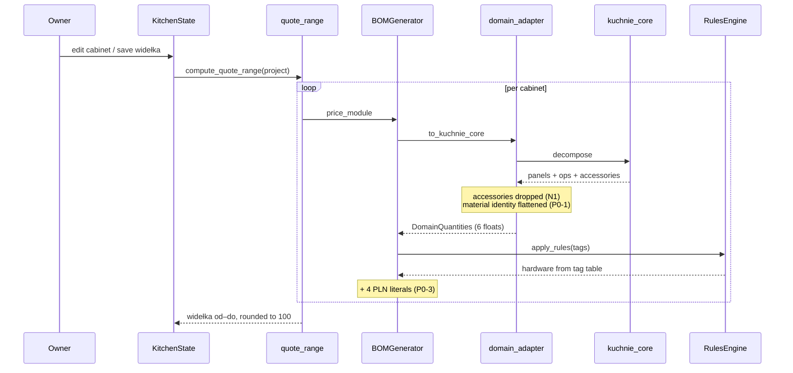
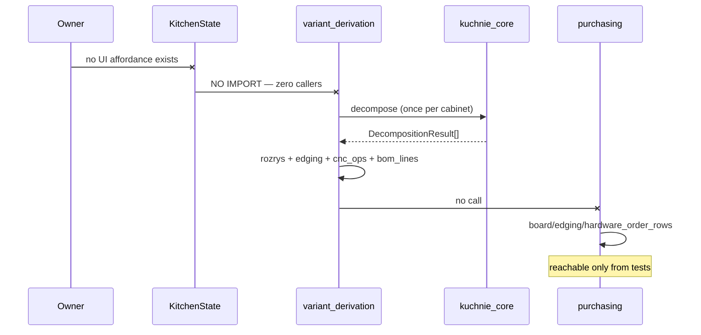
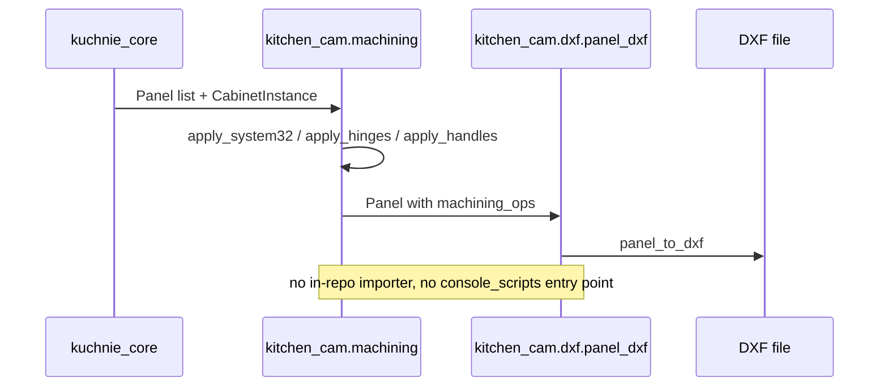

# Architecture review round 3: collaboration, hotspots, orphans, test shadow (2026-08-02)

> Reader: whoever executes the repairs from rounds 0–2, or writes the final
> consolidated review | Enables: knowing which modules are load-bearing,
> which are built-but-unreachable, and which no test names — plus the
> collaboration diagrams for the three use cases that matter |
> Update-trigger: a listed finding ships as a repair, or the final A.3
> scorecard is written

**Status: ROUND 3 COMPLETE. The four-round review is done.** What remains is
the separate consolidated review (A.3 eight-dimension scorecard + A.4
prioritised backlog), which is not a round — see §7.

Companions: `architecture-refactor-plan-2026-08-02.md` (rounds 0–1, findings
P0-1…P1-2) and `architecture-review-round-2-2026-08-02.md` (round 2, findings
N1–N11). This document adds **N12–N15** and does not restate the others.

Same evidence regime: `CONFIRMED` = a command was run this session and is
recorded in Appendix D; `OBSERVED` = read at a cited file:line;
`INFERRED` = likely from a named signal; `NEEDS-BODY` = still unread.

---

## 0. TL;DR

**The headline is not a smell, it is a disconnection.** Three ERP modules —
`variant_derivation.py`, `offers.py`, `heights.py` — have **zero importers
anywhere in the non-test codebase**, not even an `__init__` re-export. So do
both of kitchen-cam's modules. Combined with rounds 0–1 P0-2 (purchasing
order docs have no caller), the pattern is now unmistakable: **the entire
stage-5 variant/offer/purchasing subsystem and the whole of stage-7 CAM are
built, tested, ledger-tracked — and unreachable from the running
application.** The UI cannot reach a `Variant`, an offer, an `ArtifactRef` or
a DXF.

The good news is that the repo's own instruments already know most of the
rest. `coverage-audit.py` reports **DARK=0** — every module is traced by at
least one source — and the `60-arch-smells` gate independently rediscovered
both import cycles this review found by hand. The governance is working; what
it does not measure is *reachability from the application*, which is exactly
the gap N12 lives in.

---

## 1. Collaboration diagrams — three load-bearing use cases

### 1.1 UC-A: Quote a project (widełka) — the path that actually runs


*Caption: `OBSERVED` — every arrow traced to an import or call site. This is
the only end-to-end use case the UI can drive.*

### 1.2 UC-B: Derive a variant and order the board — built, unreachable


*Caption: `PROPOSED` for the internal steps (reconstructed from signatures);
the two `-X` breaks are `OBSERVED` and `CONFIRMED` (D.1, D.2). Everything
right of the first break is real, tested code with no path from the UI.*

### 1.3 UC-C: Drill a panel and emit DXF — built, unreachable


*Caption: `PROPOSED` — the flow is reconstructed from signatures and is
internally coherent; the absence of any caller is `CONFIRMED` (D.2, D.3).*

---

## 2. Hotspot table, ranked by blast radius

Counts from the repo's own `60-arch-smells` gate where it measures them
(`CONFIRMED`, D.4); line counts from `wc -l`.

| Rank | Module | Size | Measured smell | Blast radius | Round-3 read |
|---|---|---|---|---|---|
| 1 | `core/domain_adapter.py` | 122 | none measured | **P0-1, N1, N2, N3, N9, N10** | The review's centre of gravity: 122 lines carrying six findings. Cheapest file to fix, most expensive to leave. |
| 2 | `core/variant_derivation.py` | 236 | — | **orphan (N12)** | The "one decomposition" design is sound and unreachable. |
| 3 | `ui/state.py` | 1146 | god-class **34 methods** (drifted from 32) | N5, UC-A entry | Splitting tracked in `kuchnie-b669f4f5`; N5's runtime `ALTER TABLE` is the urgent part. |
| 4 | `core/purchasing.py` | 714 | — | P0-1, P0-2, N11 | Two hardcoded identity tables; no production caller. |
| 5 | `ui/admin_state.py` | 464 | god-class **36 methods** | test-shadow (N13) | Largest class in the repo *and* no test names it. |
| 6 | `core/bom_generator.py` | 255 | — | P0-3, N1, N4 | Four PLN literals + tag-derived hardware. |
| 7 | `kuchnie_core/buildability.py` | 366 | **import cycle** with `kitchen.py` | P1-2 | Gate M3 never fires on ERP kitchens (N10). |
| 8 | `kuchnie_core/blum_drawers.py` | 355 | param-bloat 10 + 8 | N8, `kuchnie-b30` | ABC signature gap is the N8 root cause. |
| 9 | `kuchnie_core/legrabox.py` | 285 | param-bloat 11 | N8 | Bundle with the ABC fix. |
| 10 | `kuchnie_core/model.py` | 689 | param-bloat 10 (`CornerLink.for_kitchen`) | — | **New**, not in the accepted baseline. |
| 11 | `ui/admin_ui.py` | 666 | — | test-shadow | Reflex view code; presentation only. |
| 12 | `core/offers.py` | 141 | param-bloat 9 (`record_offer`) | **orphan (N12)** | Already flagged in `kuchnie-3ue`. |

---

## 3. N12 — An entire subsystem is built, tested, and unreachable from the application

**Severity: P0.** This is the largest finding of the whole review.

**Evidence** (`CONFIRMED`, D.1–D.3). Modules with **zero importers** in any
non-test source file, counting `__init__.py` re-exports:

| Module | Lines | Has tests | Importers |
|---|---|---|---|
| `kitchen-erp/core/variant_derivation.py` | 236 | `test_variants.py` | **0** |
| `kitchen-erp/core/offers.py` | 141 | `test_offers.py` | **0** |
| `kitchen-erp/core/heights.py` | 12 | `test_height_parameters.py` | **0** |
| `kitchen-cam/machining.py` | 265 | 4 test files | **0** |
| `kitchen-cam/dxf/panel_dxf.py` | 92 | `test_panel_dxf.py` | **0** |
| `core/purchasing.py` order-doc generators | — | `test_purchasing_order_docs.py` | **0** (rounds 0–1 P0-2) |

And the UI confirms it from the other side: `kitchen_erp/ui/` and
`kitchen_erp.py` contain **no reference** to `Variant`, `derive_variant`,
`record_offer`, `accept_variant` or `ArtifactRef` (`CONFIRMED`, D.2 — the only
`purchasing` import is `get_strategy_for_material`, a waste-factor helper, and
the `variant="soft"` hits are Reflex component props). `kitchen-cam` declares
no `console_scripts` entry point.

**Method note — why rounds 0–2 could not see this.** Both earlier rounds
reasoned from imports *outward* ("what does this module depend on?"). N12 only
appears when you ask the inverse ("what depends on this module?"), which is
why round 2 could correctly conclude *"`derive_variant` already composes the
multi-cabinet result — P0-2 is a wiring job"* while missing that
`derive_variant` itself has no caller. The wiring job is one link longer than
round 2 stated.

**Why it matters.** *Expert 1:* stages 5 and 7 of the shop's own process map
— purchasing and CAM/drilling — cannot be executed from the software, and
those are the two stages that produce the documents the business actually
runs on: the formatki order and the drilling file. *Expert 2:* this is the
opposite of the usual failure. The pipeline stages are individually correct
and well-tested; what is missing is the conveyor between them. *Expert 3:*
tests passing on an unreachable module is the most expensive kind of green —
it buys confidence in code that cannot run.

**What this does NOT mean.** These are not dead code to delete. They are
*ahead* of the UI, deliberately: `variant_derivation` is `wk-593a317b`
increment 1, `offers` is the offer loop, `kuchnie-ubc` is in progress. The
finding is that **the reachability gap is invisible to every existing gate** —
`coverage-audit.py` scores all of them TRACED because tests and specs name
them, and `arch-smells` does not measure reachability at all.

**Repair instruction.**
1. Add a **reachability check** to the gate suite: every non-entry-point
   module must have at least one non-test importer, transitively rooted at an
   application entry point (`kitchen_erp.py`, `catalog/api/main.py`, a CLI).
   Maintain an explicit `not-yet-wired` allowlist with a bead id per entry —
   the same shape `arch-smells-baseline.txt` already uses for deferrals. This
   makes "built but unreachable" a *tracked, visible* state instead of a
   silent one.
2. Treat the wiring as one epic, not three tickets: UI → `Variant` lifecycle
   → `derive_variant` → purchasing docs → `ArtifactRef`. `kuchnie-ubc.1`
   currently describes only the last link.
3. Decide kitchen-cam's delivery shape (library consumed by the ERP, or a
   CLI the owner runs). Either is fine; neither exists today.

**Effort L (the wiring epic) · S (the gate) · Risk low · Blast radius:
kitchen-erp UI, gate suite.**

**First concrete step:** the reachability gate (item 1). It is small, needs
no owner input, and converts the whole class of problem from invisible to
tracked — including any future recurrence.

---

## 4. N13 — Test-shadow map

**Severity: P2.** Fifteen of 77 first-party source modules are named by no
test file in their own component (`CONFIRMED`, D.1). Excluding seed scripts
(run-once utilities, legitimately unshadowed):

| Module | Lines | Note |
|---|---|---|
| `kitchen_erp/ui/admin_state.py` | 464 | **36 methods — the largest class in the repo, and no test names it** |
| `kitchen_erp/ui/admin_ui.py` | 666 | Reflex views; low value to test directly |
| `kuchnie_core/materials/sqlite_repository.py` | 208 | also an orphan — see N14 |
| `kuchnie_core/materials/models.py` | — | value objects |
| `kuchnie_core/materials/exceptions.py` | — | exception types |
| `catalog/repositories/*.py` (4 files) | ~470 | exercised **indirectly** via API tests; acceptable, but drift here fails at the HTTP layer with a confusing message |
| `catalog/models/domain.py` | — | Pydantic DTOs |
| `krono/presentation/schemas.py` | — | Pydantic DTOs |

The one that matters is `admin_state.py`: 36 methods, all the material and
hardware-rule CRUD, no direct test. That is where `HardwareRule` prices are
edited (P0-3) and where `Material` identity is edited (P0-1) — both
repair targets land in an untested file.

**Repair:** when P0-1 and P0-3 touch `admin_state.py`, land tests with them
rather than as a separate effort. Do not chase the Pydantic DTO and Reflex
view files — testing those buys nothing.

---

## 5. N14 — `kuchnie_core.materials` is a complete, unreachable subsystem (closes a round-2 unknown)

**Severity: P2. This answers round 2 §8's first open question.**

Round 2 asked: *"Does any production code construct `SqliteMaterialCatalog`,
or is `kuchnie_core.materials` currently test-only? (N6 severity depends on
it.)"*

**Answer: no production code constructs it.** `sqlite_repository.py` is both
an orphan (its only importer is the subpackage's own `__init__.py`) and
test-shadowed (`CONFIRMED`, D.1, D.3). The whole subpackage — Protocol,
SQLite adapter, resolver with an LRU cache, four exception types, three value
objects — is a textbook ports-and-adapters layer with **no caller**.

**Consequence for N6:** its severity drops on the `materials` leg. The
"three consumers of the catalog DB, no version handshake" concern is really
*two* live consumers (the ERP mirror over HTTP, krono over HTTP) plus one
dormant direct-SQLite reader. The schema-version handshake (N6 item 1) is
still worth doing for the two live ones; the **shared contract test** (N6 item
3) should wait until `materials` has a consumer, or the subpackage should be
triaged adopt/attic per the `coverage-audit` DARK protocol.

*Expert 3, on the anti-over-engineering duty:* this is speculative generality
that has aged well — it is clean, it is Protocol-first, and it costs nothing
sitting there. But it should be **named** as not-yet-wired (N12's allowlist),
not quietly counted as architecture.

---

## 6. N15 — The repo's own gate has five unaccepted warnings, and one baseline entry is stale

**Severity: P3 (hygiene).** Running `60-arch-smells.sh` live (`CONFIRMED`,
D.4) returns **5 NEW findings against 6 accepted**:

- `import-cycle kuchnie_core: buildability.py <-> kitchen.py` — independently
  rediscovers P1-2
- `import-cycle kitchen_erp: models.py <-> survey.py` — likewise
- `god-class kitchen_erp/state.py: KitchenState has 34 methods` — **drifted
  from the baseline's 32**
- `param-bloat kuchnie_core/model.py: for_kitchen() takes 10 parameters` — new
- `param-bloat kitchen_erp/offers.py: record_offer() takes 9 parameters` —
  already known via `kuchnie-3ue`

Plus: *"1 baseline finding fixed — regenerate the baseline to shrink the
accepted set."*

That the gate found both cycles on its own is a genuine endorsement of the
governance. The action is small: after P1-2 lands, regenerate the baseline so
the accepted set shrinks rather than drifts.

---

## 7. What remains after round 3

The four-round review (A.2) is **complete**. One deliverable remains, and it
is not a round: the **consolidated review** (A.3/A.4) — the eight-dimension
scorecard (layering, domain alignment, pipeline integrity, collaboration
health, SOLID, anti-patterns, testability, domain red flags), each scored
sound/strained/broken, plus the final prioritised backlog and leave-it-alone
list.

Everything it needs now exists across the three documents. Its main job is
**judgement, not discovery**: reconciling that this repo has an unusually
disciplined core (dependency rule enforced, single BOM fold, golden-first
tests, a working truth ledger) with an application layer that cannot reach
half of what the core provides.

**Execution-order change from round 3** — one insertion at the top:

| # | Item | Source | Why first |
|---|---|---|---|
| **0** | **Reachability gate + `not-yet-wired` allowlist** | **N12 item 1** | **S, no owner input, and it makes the review's largest finding permanently visible instead of re-discoverable** |

The rest of the order from round 2 §7 (as revised by its addendum) stands.

---

## 8. Remaining unknowns

- Is `kuchnie_core/recipe.py` orphaned like `materials`? `tr-fc74bc2e` says
  unwired; round 2 N4 recommended deleting rather than wiring. Not
  independently re-checked here.
- Does the d60 walking-skeleton exercise cover a drawer base? Still open from
  round 2; determines whether `kuchnie-lm8` forces a golden roll.
- `catalog/repositories/*` are exercised only through API tests — whether that
  indirection has ever masked a repository bug is unmeasured.

---

## Appendix D — verification commands run this session

**D.1 — test-shadow and orphan sweep** (77 first-party modules; excludes
`.venv`, `site-packages`, `__pycache__`, tests, `__init__.py` as *modules*
but counts them as *importers*). The script is reproduced in the session log;
its two headline outputs are 15 test-shadowed and 15 orphan candidates.

**D.2 — the three ERP orphans have no importer at all** (expect empty for the
first three; `__init__` re-exports for the last two, which is why
`blum_drawers` and `sqlite_repository` are *not* application orphans):

```bash
for m in variant_derivation offers heights sqlite_repository blum_drawers; do
  echo "--- $m ---"
  grep -rnE "^\s*(from|import)\s+.*\b$m\b" --include="*.py" . \
    | grep -v __pycache__ | grep -vE "/\.venv/|site-packages" | grep -v "/tests/"
done
```

**D.3 — the UI cannot reach variants, offers or artifacts** (expect only
`get_strategy_for_material`, `catalog_variant_id` column DDL, and Reflex
`variant="soft"` props):

```bash
grep -rnE "variant|offer|purchasing|derive_|record_offer|ArtifactRef" \
  kitchen-erp/kitchen_erp/ui/ kitchen-erp/kitchen_erp/kitchen_erp.py | grep -v __pycache__
ls kitchen-cam/src/kitchen_cam/   # no cli.py; pyproject declares no console_scripts
```

**D.4 — the repo's own smell gate, live**:

```bash
bash scripts/session-gates.d/60-arch-smells.sh
```

**D.5 — coverage audit** (expect `TRACED=45 MENTIONED=32 DARK=0`; note that
TRACED does **not** imply reachable — that is precisely N12's gap):

```bash
.venv/bin/python scripts/coverage-audit.py --counts
```
