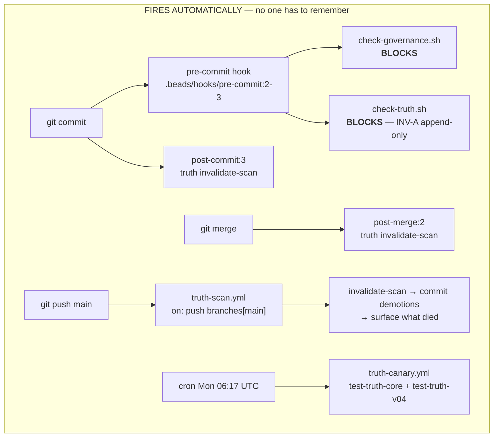
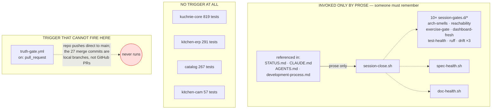
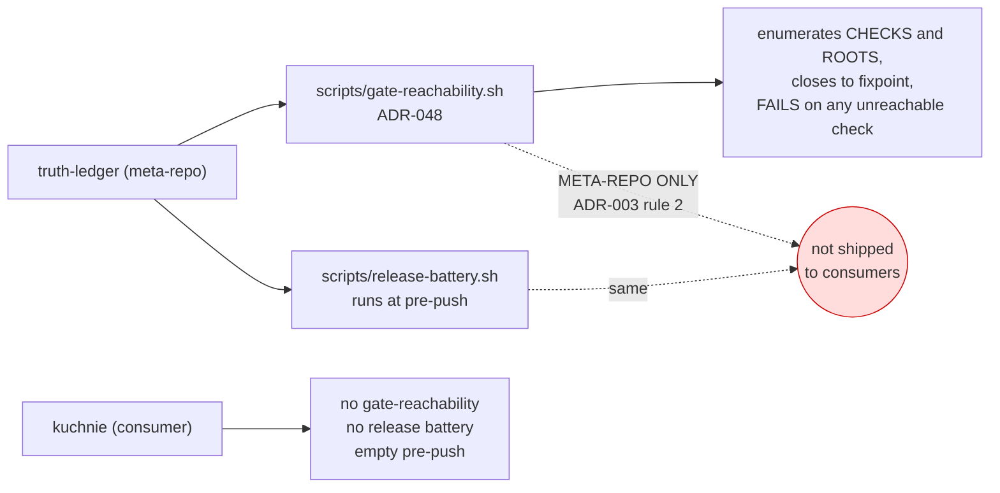

# SCRATCH — who actually drives this system, and what a newcomer must remember (2026-08-03)

> Reader: Michał asking whether the machinery steers itself, or anyone about to
> onboard someone who has never heard of the truth ledger | Enables: seeing
> which checks fire on their own and which are prose, with the evidence for
> each | Update-trigger: a hook, workflow or gate is wired or unwired
>
> **STATUS: SCRATCH.** Diagrams first, analysis second. Every claim below cites
> a file and a line; nothing here rests on recollection.

---

## 1. What fires on its own — `OBSERVED`

*Caption: `OBSERVED`. Every arrow traced to a hook line or a workflow trigger.
This is the ledger defending itself, and it works.*

## 2. What exists but nothing invokes — `OBSERVED`

*Caption: `OBSERVED`. `pre-push` in `.beads/hooks` contains nothing from this
machinery — grepped for `truth|check-|spec-health|doc-health|session-close`,
zero hits.*

## 3. The upstream built the answer — and kept it — `OBSERVED`

*Caption: `OBSERVED`. Both scripts exist upstream and both carry an explicit
META-REPO ONLY banner; neither is templated, so no consumer receives them.*

---

## 4. The evidence, line by line

### Fires automatically

| Mechanism | Trigger | Evidence |
|---|---|---|
| `check-governance.sh` (blocking) | every commit | `.beads/hooks/pre-commit:2` — `sh scripts/check-governance.sh \|\| exit 1` |
| `check-truth.sh` (blocking) | every commit | `.beads/hooks/pre-commit:3` — `bash scripts/check-truth.sh \|\| exit 1` |
| `truth invalidate-scan` | every commit | `.beads/hooks/post-commit:3` |
| `truth invalidate-scan` | every merge | `.beads/hooks/post-merge:2` |
| ledger scan + demotion commit + death report | push to `main` | `.github/workflows/truth-scan.yml` — `on: push: branches: [main]` |
| ledger's own test suites | weekly | `.github/workflows/truth-canary.yml` — `cron: "17 6 * * 1"` |

Both blocking hooks are real, not theatre: `check-governance.sh` refused a
commit of mine today because `all-signatures.md` lacked the three-question
header, and `check-truth.sh` enforces INV-A strict append-only on the ledger.

### Does not fire

| Mechanism | Why not | Evidence |
|---|---|---|
| `session-close.sh` | invoked by no code | referenced only in `STATUS.md`, `CLAUDE.md`, `AGENTS.md`, `docs/development-process.md` — all prose |
| 10 × `session-gates.d/*` | reachable only through `session-close.sh` | includes `exercise-gate`, `arch-smells`, `64-reachability`, `dashboard-fresh` |
| `spec-health.sh`, `doc-health.sh` | same | — |
| **all four domain test suites** | **no hook, no workflow runs pytest** | 819 + 291 + 267 + 57 = 1,434 tests with no automated trigger |
| `truth-gate.yml` | fires on `pull_request`; this repo pushes direct to `main` | 27 of the last 100 commits are merges, all local branch merges (`Merge branch 'worktree-agent-…'`), not GitHub PRs |
| `gate-reachability.sh` | not shipped to consumers | `../truth-ledger/scripts/gate-reachability.sh` header: *"META-REPO ONLY (ADR-003 rule 2)"* |

### The project has already diagnosed this — twice, in its own words

`../truth-ledger/scripts/release-battery.sh`, header:

> "A 2026-08-01 coverage audit found that of ten mechanisms, only three fired
> on their own: the archive freeze, the ledger gate, and invalidate-scan. The
> canary, the core suite, the version lockstep, fact-health and doc-health
> were all MANUAL — and **the core suite was failing at HEAD with nobody
> aware, because nothing ran it.**"

> "Two gates in this repo (ADR-036 citations, ADR-037 generated paths)
> reported 'clean' for weeks while checking zero files."

And the ADR-048 commit message: *"four of ours were [prose] — test-fact-health,
test-instruments, test-whisper-hook and test-session-digest ran on nobody's
schedule while ADR-046 had retired six proven canary arms INTO one of them, so
**reported numbers rose while automated coverage fell**."*

---

## 4a. CORRECTIONS AND FIXES (same day)

**One finding of mine was wrong.** §2's diagram and §4's table claim
`truth-gate.yml` fires only on `pull_request` and has therefore never run.
**False.** Its trigger block carries *both* `pull_request` and
`push: branches: [main]`, and `gh run list` shows it completing successfully
on a push event. I read the block with `grep -A 4`, which truncated it — the
same truncation family as the `tail -1` that hid a failed `bd close` earlier
in this session. The claim is withdrawn; the diagram node `NEVER` should be
read as retracted.

**Two findings were real and are now fixed.**

- `pre-push` was empty of this project's machinery. It now runs
  `scripts/pre-push-checks.sh`, appended after the beads-managed block whose
  markers are left untouched.
- The 1,434 domain tests had no trigger. They now run at push, together with
  `spec-health`, `doc-health` and the flagship `exercise-gate`.

Measured on its first real run: 7 arms, ~40 s, all green — spec-health 21
specs, doc-health 133 docs, exercise-gate byte-identical, kuchnie-core 819,
kitchen-erp 291, catalog 267, kitchen-cam 57.

**The dark-arm rule earned its keep immediately.** Its first run reported
`kuchnie-core -- ran 0 tests -- the arm is dark` and the same for `catalog`.
That was not a broken suite: it was a bug in *my own* count parser, which
required a non-digit before the number and so failed on output beginning
`819 passed`. Had the arm defaulted to "no failures found → pass", two live
suites would have been silently unchecked from day one — the exact failure
the upstream reported when two of its gates read "clean" for weeks while
examining zero files.

**And the queue is now surfaced.** The run prints, without blocking, how many
claims sit in the verdict queue and how many beads are flagged for human
judgment. That is the "reminds you when it needs something" this document
said the system lacked.

---

## 5. Answering the question

**Does the system look after itself?** For the **ledger**, yes, and well. For
the **code**, no.

The split is clean and it is not an accident — it follows what each layer can
know. The ledger's integrity is a property of one file, checkable in
milliseconds, so it sits on the commit boundary and blocks. The code's health
costs 1–60 s per gate and ~1,400 tests, so it was moved off the commit
boundary — and then never given another boundary to live on.

**Must a developer who has never heard of this machinery remember anything?**

*Nothing, to stay safe.* They cannot commit a malformed ledger, cannot
hand-edit history, cannot add an undocumented doc. Push to `main` heals the
ledger without them. That is a genuinely low-ceremony floor.

*Everything, to know they are fine.* Nothing will tell them:

- that 1,434 domain tests fail — no trigger exists
- that `exercise-gate` broke, i.e. the flagship cut-list changed — same
- that a gate went red — `session-close.sh` is documentation
- that claims went stale needing human judgment — `invalidate-scan` marks
  them, but no boundary surfaces the queue
- that owner questions are outstanding — those live in a markdown file

**Does it remind the user when it needs something?** No. `truth queue` and
`bd human list` exist and are correct, but nothing calls them at a boundary.
The reminding is done by documents that ask to be read, which is the same
mechanism as remembering.

### The sharpest single fact

This project **built** the mechanism that answers this question —
`gate-reachability.sh`, which enumerates checks and roots, closes to fixpoint,
and fails on any check no schedule reaches — and then deliberately did not ship
it, because the enumeration encodes the meta-repo's wiring. So the consumer
inherits the law (ADR-048: *"a check no scheduled root invokes is prose"*) and
none of its enforcement.

### What would close it, cheaply

1. **Put something on `pre-push`.** It is empty today, and push is the boundary
   where staleness starts reaching others — the upstream's own argument for
   siting the release battery there.
2. **Make `truth-gate.yml` fire.** Either add `push` to its triggers or adopt
   PRs. Today it is a workflow that has never run.
3. **Run the domain suites on push.** 1,434 tests with no trigger is the single
   largest dark area, and it is one workflow file.
4. **Surface the human queue at a boundary** — `truth queue` and `bd human
   list` at pre-push, printed not blocking. That is the "reminds you when it
   needs something" the system currently lacks.

None of these requires new machinery; all four wire existing checks to
existing boundaries.
