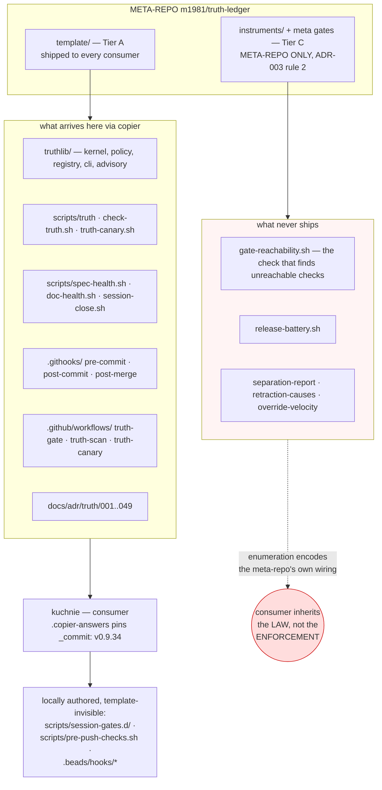
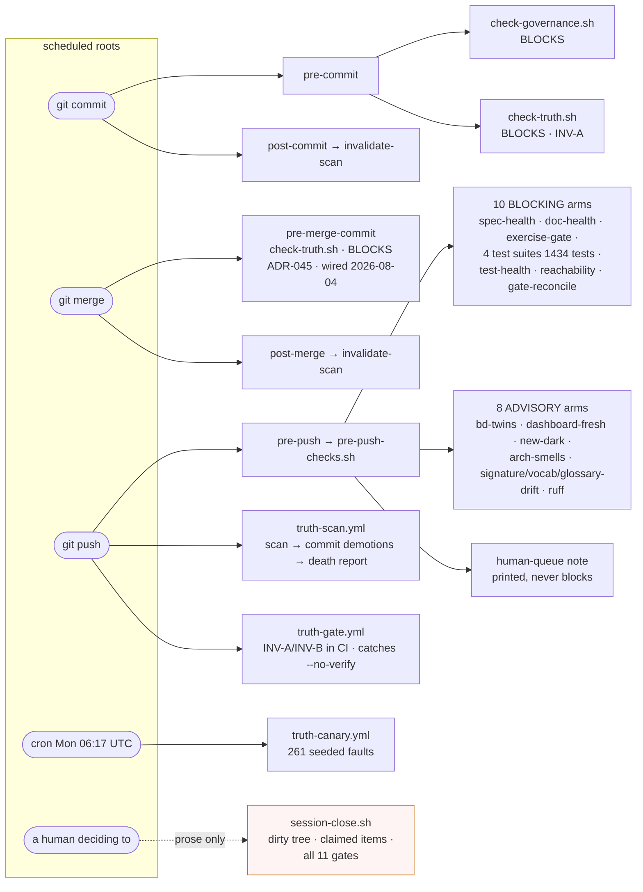
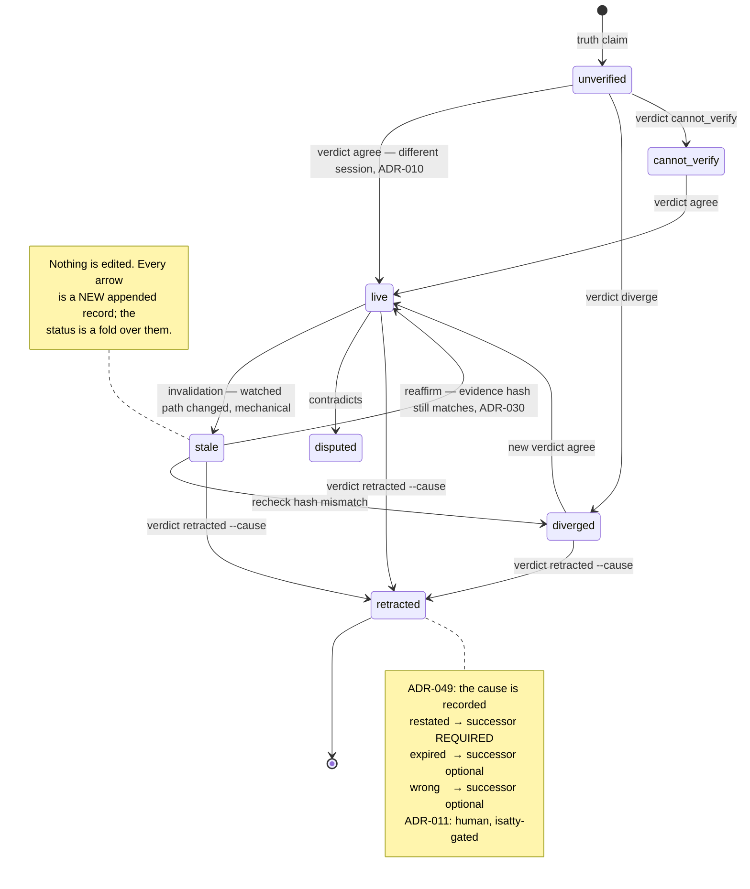
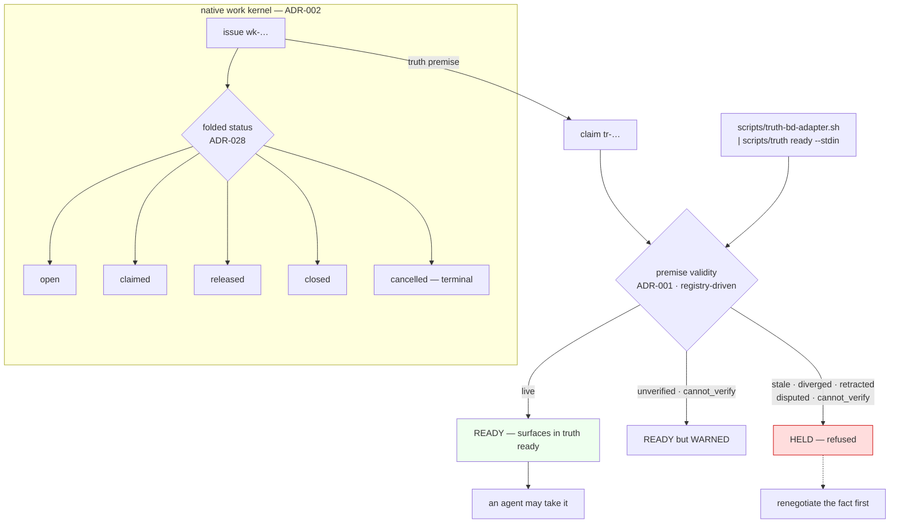
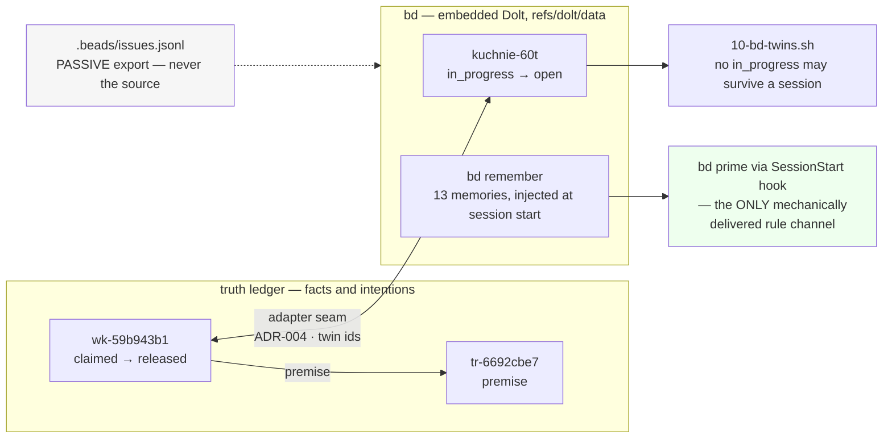
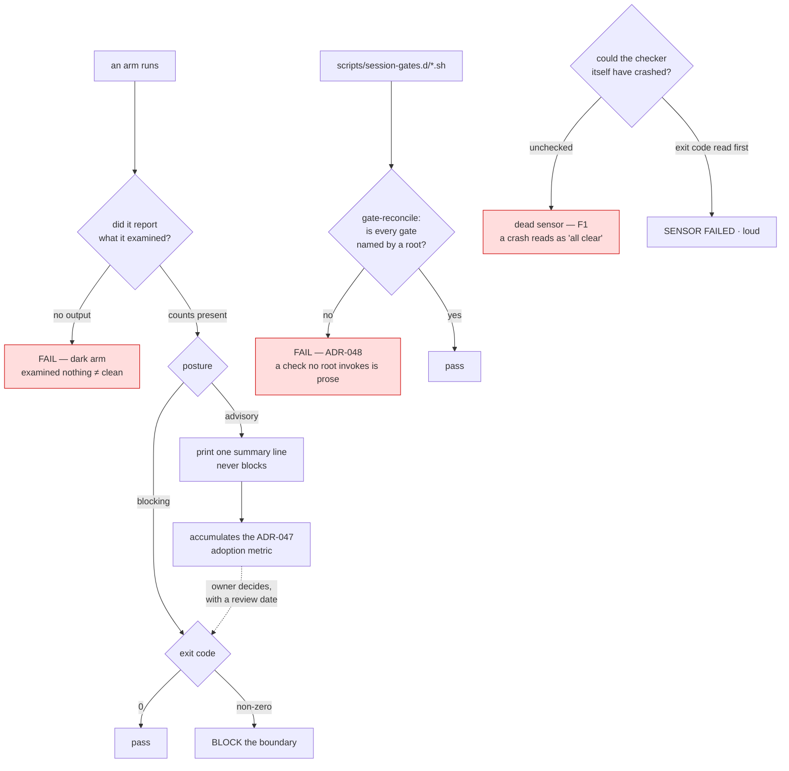
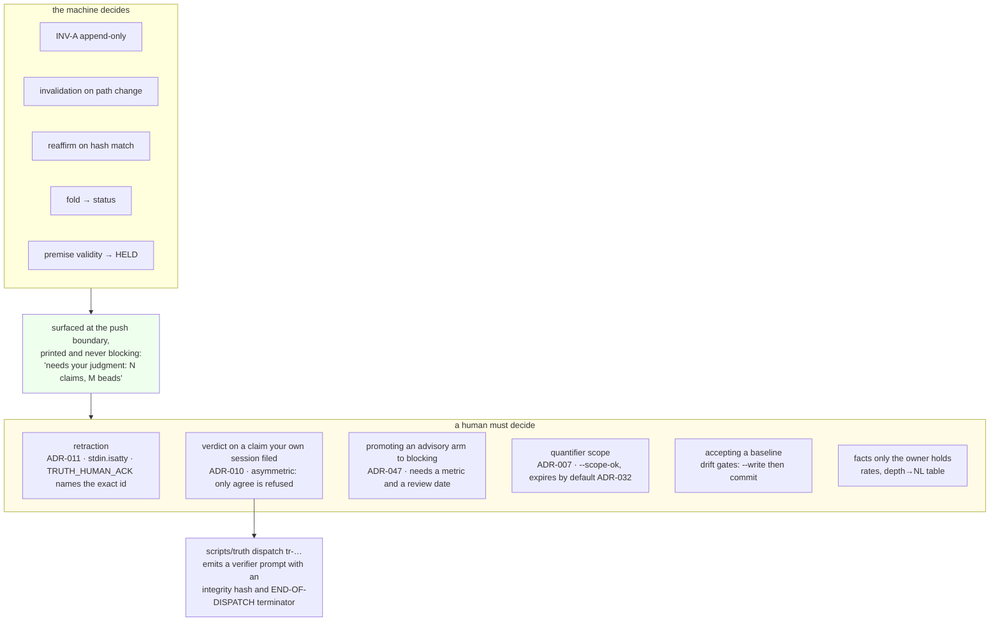
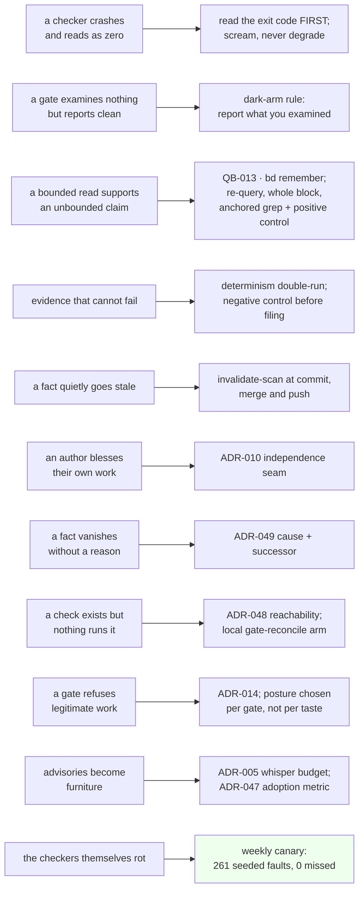

# Machinery atlas — the whole apparatus, from six angles (2026-08-04)

> Reader: Michał, or anyone who must understand what runs this repo before
> changing it | Enables: seeing the system's layers, triggers, state machines
> and human seams without reverse-engineering them from scripts a second time
> | Update-trigger: a gate, hook, workflow, verb or status is added, removed
> or repositioned
>
> **STATUS: ATLAS.** Part I is a reusable prompt carrying the vocabulary;
> Part II is the diagram set. Every diagram carries an evidence anchor and an
> `OBSERVED` / `INFERRED` label. Nothing here rests on recollection — the
> facts were re-read from disk on 2026-08-03/04, mostly while wiring the very
> gates being drawn.

---

# Part I — The prompt

Use this to regenerate, extend or audit the atlas in a fresh session. It is
written to be pasted whole. Its job is to install the vocabulary first,
because most misdrawings of this system come from using ordinary words
("check", "task", "done") where the system has precise ones.

## Role

> You are documenting a **self-governing repository**: a codebase that
> carries machinery for deciding whether its own recorded knowledge is still
> true. Two apparatuses coexist. A **truth ledger** governs *facts*, and an
> **issue tracker** governs *intentions*. They are linked, and the link is
> what makes work refusable when the ground under it has moved.
>
> Your task is to draw how it is wired: layers, triggers, state machines,
> dependencies, and — most importantly — the seams where the machine stops
> and requires a human.

## Vocabulary — use these words, not synonyms

**Ledger side.**

| Term | Meaning |
|---|---|
| **claim** (`tr-…`) | one recorded fact, with an evidence command and watched paths |
| **evidence command** | a re-runnable, read-only command whose *output hash* is the proof; screened by an allowlist (ADR-009/029/040/041) |
| **verdict** | an independent judgment on a claim: `agree`, `diverge`, `cannot_verify`, `retracted` |
| **invalidation** | a *mechanical* demotion, filed when a watched path changes — no judgment involved |
| **reaffirm** | mechanical re-confirmation when the evidence hash still matches after a staling commit (ADR-030) |
| **retraction** | the only way a fact leaves; carries a **cause** (`restated` / `expired` / `wrong`) and, for `restated`, a **successor** (ADR-049) |
| **premise** | a link from an *issue* to a *claim*: "this work stands on this fact" |
| **issue / work item** (`wk-…`) | the ledger's **native work kernel** (ADR-002), independent of any tracker |
| **bead** (`kuchnie-…`) | the same intention in the `bd` tracker; a **twin** of a `wk-` item across the **adapter seam** (ADR-004) |
| **status registry** | the authoritative status vocabulary, read at runtime via `truth vocab` — never hand-copied (ADR-043) |
| **HELD** | `truth ready`'s refusal: an issue whose premises are no longer valid |

**Gate side.**

| Term | Meaning |
|---|---|
| **gate** | a check that can refuse |
| **arm** | one independent check inside a gate script |
| **posture** | `blocking` or `advisory` — whether an arm's finding stops the boundary |
| **dark arm** | an arm that examined nothing; must be a FAILURE, never a pass |
| **root** | a scheduled invoker (hook, workflow, cron). A check no root reaches **is prose** (ADR-048) |
| **canary** | the seeded-fault suite: deliberately broken inputs that every arm must CATCH; it tests the *checkers*, not the code |
| **fault arm** | one seeded fault in the canary, named e.g. `FAULT SC`, `FAULT LK` |
| **tier** | A/B/C: what ships to consumers vs what stays in the meta-repo (ADR-046) |
| **whisper budget** | the deliberate cap on advisory output; noise trains bypass (ADR-005) |
| **adoption metric** | the measurement a blocking gate owes before it may block (ADR-047) |

**Failure vocabulary** — the named ways this system has actually failed:

- **dead sensor / F1 rule** — a checker that cannot run must *scream*, never
  read as zero. A `2>/dev/null | grep -c` turns a crashed tool into "all clear".
- **bounded read** (QB-013) — never let a bounded read support an unbounded
  claim. `tail -1`, `grep -A 4`, an unanchored substring: each has published a
  false finding here.
- **evidence that cannot fail** — a proof whose command would print the same
  thing whether or not the claim held.
- **gate that refuses legitimate work** — teaches its own bypass (ADR-014).
- **normalisation of deviance** — an advisory nobody acts on becomes furniture.

## Invariants to respect while drawing

1. **INV-A**: the ledger is strictly append-only. Status changes are *new
   records*, never edits. Any diagram showing a claim "being updated" is wrong.
2. **Fold, not database**: statuses are *derived* by a pure confluent fold over
   the record stream. Two machines folding the same file agree.
3. **Author ≠ verifier** (ADR-010), and it is **asymmetric**: self-`diverge`
   and self-`cannot_verify` are allowed because they run against interest;
   only self-`agree` is refused.
4. **Terminal acts need a human** (ADR-011), gated on `stdin.isatty()`.
5. **The template ships artifacts; it cannot ship habits.** Anything the
   consumer must *remember* is, in practice, not enforced.

## What to produce

Diagrams at these angles, each with a caption naming its evidence and an
`OBSERVED` / `INFERRED` label:

1. **Provenance** — meta-repo → template → consumer; what deliberately does
   not ship.
2. **Trigger topology** — every automatic root and its reach; what is prose.
3. **Claim lifecycle** — the status state machine and the verbs that move it.
4. **Work kernel lifecycle** — issue states, premise links, `ready` gating.
5. **Twin coupling** — ledger work kernel ↔ tracker across the adapter seam.
6. **Gate anatomy** — posture taxonomy, dark-arm rule, reachability.
7. **Human seams** — every place the machine stops and asks.
8. **Defence map** — failure family → the mechanism that catches it.
9. **Sequences** — a claim's life; a session's shape.

## Rules of the drawing

- **Cite, don't recall.** Every arrow traces to a file line, a trigger block
  or a verb. If you cannot cite it, label the node `INFERRED`.
- **Never let a bounded read support an unbounded claim.** Before writing
  "nothing invokes X", grep unfiltered *and run a positive control*.
- **Verify by re-query.** Do not conclude from a command's own output.
- **Draw the holes.** A diagram that shows only what works is marketing.

---

# Part II — The atlas

## 1. Provenance: what is inherited, and what is deliberately withheld



*`OBSERVED`. Ship list from `template/` at tag v0.9.34; withheld scripts carry
an explicit META-REPO ONLY banner. The consumer receives ADR-048 — "a check no
scheduled root invokes is prose" — and no script that enforces it. This is the
single most load-bearing asymmetry in the whole system: it is why the local
`gate-reconcile` arm had to be written by hand here.*

## 2. Trigger topology: what fires without anyone remembering



*`OBSERVED`. Hook contents read in full from `.beads/hooks/` (core.hooksPath
points there); workflow triggers read as whole blocks, not `grep -A n` — an
earlier truncation of exactly this kind produced a published false finding.
`session-close.sh` remains reachable only by prose; the push boundary now
duplicates its gate coverage, not its session-scoped checks.*

## 3. Claim lifecycle: statuses are derived, never assigned



*`OBSERVED`. Statuses and verdict mapping read from `truth vocab` at runtime,
which is the registry itself (ADR-043) rather than a copy: `verdicts:
agree->live, diverge->diverged, cannot_verify->cannot_verify,
retracted->retracted`. The `--cause` arm was exercised for the first time in
this repo on 2026-08-04, retiring two claims that asserted a superseded
template pin.*

## 4. Work kernel: how a fact can refuse a task



*`OBSERVED`. `premise_blocking: stale,diverged,cannot_verify,retracted,disputed`
and `premise_warn: unverified,cannot_verify` come from `truth vocab`. This is
the mechanism the whole apparatus exists for: **work standing on a dead fact is
not offered**. It is also why `bd ready` alone is the wrong verb here — it sees
intentions but not the ground they stand on.*

## 5. Twin coupling: two trackers, one intention



*`OBSERVED`. The A/B trial is deliberate: the ledger has a native work kernel
and `bd` runs beside it. `bd remember` is the load-bearing detail — QB-011 sat
in the question bank for five days and the failure it describes recurred
anyway, because a bank entry is read when someone opens the bank. The same
rule delivered through `bd prime` arrives unasked. **The gap was delivery, not
documentation.**

## 6. Gate anatomy: posture, darkness, reachability



*`OBSERVED`, and earned. The dark-arm rule caught three of my own bugs within
24 hours: a test-count parser that reported two live suites as dark, a probe
harness, and `10-bd-twins.sh`, which printed nothing when it was happy and so
blocked a push on its own silence. Posture is not uniform by taste: six gates
declare in their own headers "WARN-only by design … promoting this to FAIL is
Michał's call", and two carry session semantics that would refuse legitimate
mid-work pushes.*

## 7. Human seams: where the machine stops on purpose



*`OBSERVED`. The interactive guard is `sys.stdin.isatty()` in
`truthlib/shellio.py:154`; the independence seam is `truthlib/cli.py:313`, and
it inspects the **session**, not the actor — so the same person in a different
terminal passes it, which makes it a structural seam rather than an identity
check. `TRUTH_HUMAN_ACK` must name the exact id it kills, so a forgotten
`export` cannot authorise future tombstones.*

## 8. Defence map: failure family → the mechanism that catches it



*`INFERRED` as a grouping; each right-hand mechanism is individually
`OBSERVED`. The bottom row is the one that makes the rest trustworthy: without
a canary, every mechanism above is a claim about itself.*

## 9. Sequences

### 9a. A claim's whole life

```mermaid
sequenceDiagram
    autonumber
    participant A as authoring session
    participant L as ledger (append-only)
    participant H as post-commit hook
    participant V as verifier session
    participant M as Michał (TTY)

    A->>L: truth claim --evidence-cmd --paths
    Note over L: status = unverified
    A->>A: determinism double-run + negative control
    V->>L: verdict agree (different session)
    Note over L: status = live
    H->>L: invalidation — a watched path changed
    Note over L: status = stale
    V->>L: reaffirm — evidence hash still matches
    Note over L: status = live again
    H->>L: invalidation — the fact really moved
    V->>L: verdict diverge
    Note over L: status = diverged, sits in the queue
    A->>L: file the successor claim
    A--xL: retraction REFUSED — no TTY (ADR-011)
    M->>L: verdict retracted --cause expired --successor
    Note over L: status = retracted; the why is readable
```

*`OBSERVED` — this is literally the path `tr-d8e5a5ba` took, ending
2026-08-04. Step 11 is not decoration: the agent-side refusal happened twice
and wrote nothing.*

### 9b. The shape of a session

```mermaid
sequenceDiagram
    autonumber
    participant S as SessionStart hook
    participant Ag as agent
    participant R as truth ready
    participant G as pre-push-checks
    participant Q as human queue

    S->>Ag: bd prime — 13 memories, incl. bounded-reads
    Ag->>Ag: STATUS.md (§3 names the next work)
    Ag->>R: truth-bd-adapter.sh | truth ready --stdin
    R-->>Ag: READY items only; dead-premise items HELD
    Ag->>Ag: work; commit (pre-commit BLOCKS on governance + INV-A)
    Ag->>G: git push
    G-->>Ag: 10 blocking arms + 8 advisory + queue note
    G->>Q: "needs your judgment: N claims, M beads"
    Note over Ag,Q: session-close.sh is the fuller gate —<br/>and nothing invokes it
```

*`OBSERVED`. Step 3 is the load-bearing one and the easiest to get wrong: the
adapter form, not bare `bd ready`.*

---

## What the atlas shows that no single script does

**The system's competence is lopsided by construction.** Ledger integrity is a
property of one file, checkable in milliseconds, so it lives on the commit
boundary and blocks. Code health costs tens of seconds and ~1,400 tests, so it
was moved off that boundary — and until 2026-08-03 was never given another one.
The fix was not new machinery; it was wiring existing checks to an existing
boundary.

**Every enforcement layer here was bought with an incident.** The dark-arm rule
exists because two upstream gates reported "clean" for weeks while examining
zero files. ADR-011 exists because an agent could otherwise launder a human
confirmation. QB-013 exists because three bounded reads published three false
findings in one day. The atlas is, read one way, an incident history with
arrows.

**The remaining hole is delivery, not design.** `session-close.sh` — the
fullest gate in the repo — is still invoked by nothing but prose, and prose is
the same mechanism as remembering.
