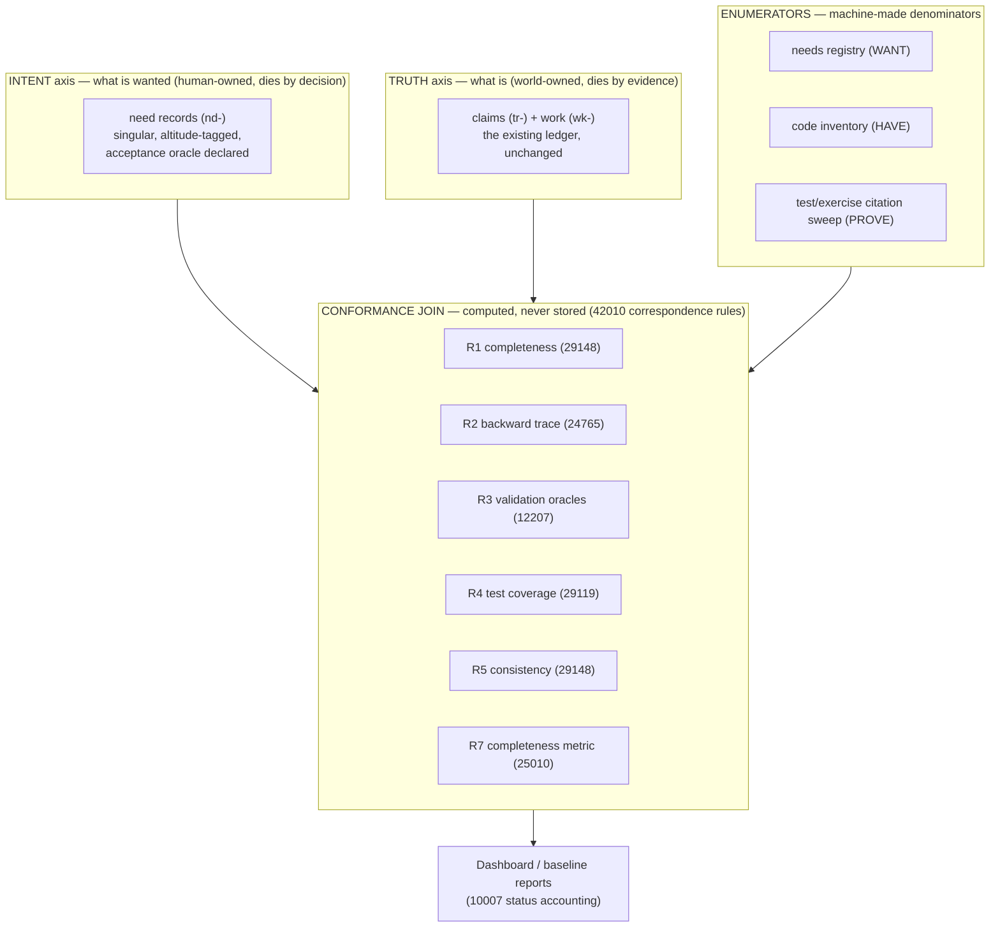
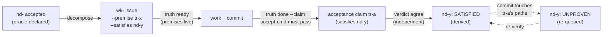

# ISO gap review of the truth ledger + the Two-Ledger Architecture concept

> Reader: anyone deciding whether/how to extend the truth-ledger regime toward
> full standards-shaped coverage, or drafting the paper's v3 | Enables: seeing
> per-standard where the ledger conforms/gaps, one coherent extension concept
> in which each standard lands in a named mechanism, and the recorded decision
> on paper v3 timing | Update-trigger: a phase-1 mechanism ships, an upstream
> issue closes, or the v3 trigger conditions (§C) are met

Reviewed artifacts: the paper v2 (`truth-ledger-paper-v2.md`, template
meta-repo — a copy was read from `~/Downloads`, see finding I.7), the
loophole map (same provenance), [docs/truth-ledger-machinery.md]
(../truth-ledger-machinery.md), [docs/beads-integration-guide.md]
(../beads-integration-guide.md). Cockburn-side companion:
[requirements-assessment-2026-07-14.md](requirements-assessment-2026-07-14.md).
Session: 2026-07-15.

Standards referenced (designations in full once, short forms after):
ISO/IEC/IEEE 29148:2018 (requirements engineering), ISO/IEC/IEEE 24765
(SEVOCAB — bidirectional traceability), ISO/IEC/IEEE 12207:2017 &
15288:2023 (life-cycle processes, V&V), ISO 10007:2017 / IEEE 828
(configuration management), ISO/IEC 25010:2023 & 25023 (SQuaRE, functional
completeness), ISO/IEC/IEEE 29119 (software testing), ISO/IEC/IEEE
42010:2022 (architecture description), with ISO 26262 / IEC 61508 as the
audit-severity lens.

---

## Part I — Where the ledger conforms, where it gaps

**Verdict in one paragraph.** The ledger is an unusually strong
implementation of configuration status accounting (ISO 10007) and
verification (12207's first V), and unusually honest about its limits
(paper §7–§8). Its gaps cluster on the other side of the standards:
everything requiring a *denominator of intent* (29148 set-completeness,
25010 functional completeness, 29119 requirement-based coverage) and
everything running *backward* from artifact to need (24765). The loophole
map's own bottom line — failure mode is "omission, never corruption" — is
precisely the failure class the standards say only a baseline can catch.
The ledger has no baseline-of-needs object, so it cannot see omission by
construction. It is an "is it still true" machine with no "is it all
there" machine.

| # | Standard concept | Ledger status | Gap / improvement |
|---|---|---|---|
| I.1 | 10007 status accounting | **Strongest conformance**: fold = status accounting derived from records; INV-A prefix gate = change control; canary suite = configuration audit | Missing verb: set-level baseline. `truth baseline <ref>` (fold both axes at a git ref) is near-free — the append-only file already holds every historical fold. Corollary already tracked: wk-ea10d199 — generated status reports (STATUS.md) must never be watched as configuration items; watch sources |
| I.2 | 24765 bidirectional traceability | Forward chain excellent (premise-at-birth, claim-at-death, ids in commits, path tripwires) | **Backward absent by construction** — the ledger knows only what was filed (curation, not enumeration; the dark-code audit found 8/9 sampled modules untraced). Fix: generalize the paper §5 doc-coverage pattern into a backward satellite; cheapest slice is `truth impact --inverse` — tracked files watched by NO active claim |
| I.3 | 29148 individual characteristics | **Mechanized**: singular (one fact/claim), unambiguous (ADR-007 quantifier gate — a machine-checked unambiguity requirement, validated by the paper §2 dominant-failure data), verifiable (evidence-cmd), traceable (ids) | Set-level characteristics unenforceable: (a) no need/requirement record kind → completeness has no denominator; (b) no consistency check — near-dup intake catches restatement, nothing catches contradiction; two incompatible live claims coexist forever. Fix: `contradicts` edge → DISPUTED fold state (declared, not NLP) |
| I.4 | 12207/15288 V&V | Verification mechanized (recheck, hash, filer≠verifier ADR-010, screened re-execution ADR-009) | **Validation on the honor system**: `truth done` takes the agent's word (loophole map item C). `--accept-cmd` (upstream truth-ledger#1) is the fix — but must accept validation oracles (golden diffs), not only verification checks, and needs its own allowlist distinct from the ADR-009 evidence screen, or every real oracle needs an unsafe override and the gate teaches its own bypass (the paper's own confused-deputy lesson) |
| I.5 | 25010/25023 functional completeness | `truth stats` measures the knowledge base's quality (half-life, divergence rates — 25023-style metrics about the ledger itself) | Cannot measure the *product's* completeness: user objectives are not enumerable from the ledger. Same denominator fix as I.3 |
| I.6 | 29119 requirement-based testing | Pinned-test convention (test cites the tr-/wk- id it pins) is conformant | **The only convention in the regime with no gate.** Missing satellite: test-health.sh — sweep test files for cited ids (exist? not retracted/diverged?), inverse-check closed wk items for a citing test. Completes the spec-health/doc-health family |
| I.7 | 42010 correspondence rules | Satellites are correspondence rules; the paper's audit instrument #1 caught representation drift twice (F1, F8) | Meta-finding: the paper and loophole map were read from `~/Downloads` — outside any repo, invisible to doc-health and to the doc-coverage mechanism the paper itself invented (§5). The loophole map pins "current: CLI v0.6.4" with no tripwire able to fire on it. They belong in the template meta-repo under doc-coverage claims; ungoverned copies get deleted (the regime's own one-home rule) |
| I.8 | 26262/61508 lens | Canary suite is a legitimate tool-qualification argument (seeded fault injection, fail-if-uncaught) | Correctly disclosed limit: filer≠verifier separates *sessions*, not *people* — never to be read as the standards' independent assessment (paper §8 item 1) |
| I.9 | 10007 single status account (cross-cutting) | — | The kuchnie regime runs BOTH native wk- issues and bd twins — dual status accounting for one item class, the guide's own §2 warns "choose one home or pin explicitly." Held together by convention + session gate; decide by ADR: kernel-only, or bd-only with `TRUTH_TRACKER_CMD` pinned |

**Post-review correction to I.7 (2026-07-15, same day):** the reviewed
copies in `~/Downloads` turned out to be byte-identical exports of
governed originals in the meta-repo
(`/Users/michal/PycharmProjects/truth-ledger/docs/`) — the review's
factual basis is intact and the "move them under a repo" recommendation
was already satisfied. What stands of I.7, verified against the
meta-repo's own ledger: the loophole map is claim-watched there (7 path
references in its `claims.jsonl`), but `truth-ledger-paper-v2.md` — the
largest contract document, and the one that *invented* the doc-coverage
mechanism (§5) — appears in zero claims: it is untripwired in its own
repo. Residual actions: file a doc-coverage claim for the paper in the
meta-repo, and delete read-only exports after use (one home per fact —
identical today is drift tomorrow).

---

## Part II — The Two-Ledger Architecture: Truth, Intent, and the Conformance Join

### II.0 The one-paragraph idea

Add a second, parallel axis — the **intent ledger** — with the same DNA
as the truth ledger (append-only, fold-derived, gate-refused, id-cited),
and make every conformance statement a **computed join between the two
axes** rather than a stored status. Neither core grows; all standards
land in the join layer, as satellites — the architecture that kept the
truth ledger auditable in the first place.

### II.1 Design axioms (inherited, non-negotiable)

1. **Derive, never store** — no field says "satisfied"; satisfaction is recomputed by the fold.
2. **Append-only, union-merge confluent** — same `(ts, id)` total order, same three per-field merge disciplines (paper §6.3).
3. **Refusal, not review** — every 29148 characteristic that can be a gate is a gate.
4. **Decay by default** — the world invalidates records; nobody has to remember to distrust.
5. **One home per fact; ids in prose** — courtesy text is never authoritative.
6. **Minimal core, satellite growth** — the fold stays a pure function small enough to model-check.

### II.2 The three planes



**The asymmetry that makes it two ledgers, not one:** truth records die
when the *world* changes (a commit, a TTL); intent records die only when
a *human decides* (supersede/withdraw — the ADR discipline, and the
ADR-011 tombstone gate reused verbatim). Facts are falsifiable; wants are
revocable. Conflating those lifecycles is why commercial ALM tools rot —
a requirement marked "done" never notices the code regressing.

### II.3 The `need` record (nd-) — 29148 mechanized

| Field | Gate at intake | Standard |
|---|---|---|
| `text` | non-empty, near-dup refused, **quantifier gate reused verbatim** (ADR-007) | 29148 unambiguous |
| `altitude` | cloud/kite/sea (Cockburn); sea-level needs must cite a kite parent (UC-) | 29148 traceable |
| `actor` | required | 29148 necessary |
| `accept_oracle` | a command or golden-diff ref (§II.5) | 29148 **verifiable** |
| `tier` | P0/P1/P2 — cost of NOT having it | prioritization |

**Lifecycle, fold-derived:** `proposed` (oracle optional — elicitation is
allowed to be vague) → `accepted` (the CLI **refuses** promotion without
oracle + altitude + actor: that refusal *is* 12207's requirements-analysis
process made syntax) → derived states below → `superseded`/`withdrawn`
(terminal, human-gated).

**Keystone rule — satisfaction is derived and decays:**

```
nd- is SATISFIED  iff  a live claim carries a `satisfies nd-…` edge
nd- is UNPROVEN   iff  that claim exists but is stale/diverged
nd- is OPEN       iff  no such claim exists
```

One new edge kind (`satisfies`, claim→need — the mirror of `premise`,
work→claim) closes the loop. Because acceptance claims carry
`evidence_paths` like any claim, **a commit that breaks a satisfied need
automatically degrades it to UNPROVEN** — functional completeness becomes
a live metric that can go *down*: regression detection at the
requirements level, riding entirely on the existing staleness machinery.

### II.4 The full closed loop



Born on live facts (premise-at-birth), dies into a demonstrated fact
(accept-cmd at death), and the demonstration itself decays — the loop the
machinery doc's §8 proposed, lifted one level up.

### II.5 Acceptance oracles — 12207's two V's, kept distinct

- **Verification oracle**: a suite/gate command — "built right."
- **Validation oracle**: a golden-diff command (e.g.
  `exercises/harness/runner.py <scenario> --strict`) — "built the right
  thing," because the golden encodes stakeholder intent, not code behavior.

Acceptance commands execute repository code by nature → they need their
**own committed allowlist** (`.truth/accept-allow`), separate from the
read-only ADR-009 evidence screen. Reusing the evidence allowlist would
force an unsafe override on every real oracle — the gate would teach its
own bypass.

### II.6 The three enumerators — machine-made denominators

| Enumerator | Produces | Feeds | Standard |
|---|---|---|---|
| **WANT**: the nd- fold | accepted-needs set | R1, R7 | 29148 baseline |
| **HAVE**: AST inventory → `code-inventory.json`, committed | artifact set | R2 | 24765 backward |
| **PROVE**: citation sweep of test/exercise files for tr-/wk-/nd- ids | proof set | R4 | 29119 |

All three are generated, committed, diffed — they cannot lie and cannot
rot silently (the doc-health philosophy applied to denominators).

### II.7 The conformance join — named, gated correspondence rules

The registry of rules is itself a committed file (42010: correspondences
are architecture artifacts, not tooling conveniences):

| Rule | Join | Verdict per item | Refuses at close when |
|---|---|---|---|
| R1 completeness | accepted nd- ⋈ (wk- ∪ satisfies-claims) | COVERED / IN-FLIGHT / **ORPHAN-NEED** | a P0 need is ORPHAN |
| R2 backward trace | inventory ⋈ (claim paths ∪ specs ∪ tests) | TRACED / MENTIONED / **DARK** | a *new* module arrives DARK |
| R3 validation | accepted nd- ⋈ oracle executability | RUNNABLE / **BROKEN-ORACLE** | any oracle exits 127 |
| R4 test coverage | satisfied nd- ⋈ PROVE sweep | PINNED / **UNPINNED** | warn, then policy |
| R5 consistency | live claims ⋈ declared `contradicts` edges | — / **DISPUTED** (both queued) | any DISPUTED at P0 |
| R6 freshness | fold ⋈ generated views | *(exists: `dashboard.py --check`)* | stale STATUS |
| R7 metric | \|satisfied\| / \|accepted\| per actor/altitude | a gauge, trended | never |

Dark-code triage stays a **human verb** with three outcomes only —
`adopt` (file nd- + wk), `attic` (tombstone note), `delete`. "Leave it
dark" is not a state the join can emit: 24765's blunt rule made syntax.

### II.8 Baselines — 10007 completed

`truth baseline <ref>`: fold both axes at a git ref, emit the frozen set
(needs by state, claims by status, R-rule verdicts). Deltas between
baselines are the release notes an auditor wants: "between v1.0 and v1.1:
+3 needs satisfied, 1 regressed to UNPROVEN, dark count 14→9."

### II.9 What deliberately stays OUT of the core

- No workflow states beyond the fold's minimum; trackers remain a
  read-only-joined view (the I.9 dual-home question gets its ADR).
- No NL semantics in gates — R5 is declared edges, not NLP; ADR-007 stays
  lexical. The moment a gate needs a model to fire, it is a review, not a
  refusal.
- No identity infrastructure — single-observer stays the disclosed limit.
- Elicitation stays human — the system proves a need-set is *internally*
  covered; it cannot know a need was never spoken.

### II.10 Standards-conformance map

| Standard concept | Mechanism |
|---|---|
| 29148 individual characteristics | nd- intake gates (quantifier gate reused) |
| 29148 set completeness | R1 against the nd- fold |
| 29148 set consistency | R5 `contradicts` → DISPUTED |
| 24765 forward trace | existing chain, unchanged |
| 24765 backward trace | R2 + `truth impact --inverse`; adopt/attic/delete only |
| 12207 verification | existing recheck/verdict machinery |
| 12207 validation | accept-cmd, validation-oracle shape, own allowlist |
| 12207 requirements analysis | the proposed→accepted promotion gate |
| 10007 status accounting | fold + generated views + `baseline <ref>` |
| 25010/25023 functional completeness | R7 — computable and *reversible* |
| 29119 requirement-based coverage | R4 over the PROVE enumerator |
| 42010 correspondence rules | the committed, gated R-registry |

### II.11 Migration path (kuchnie as pilot, again)

1. **Phase 1 — no core changes:** `impact --inverse`; test-health (R4);
   acceptance-coverage stats from `docs/specs/use-cases.md` Acceptance
   sections (proto-R1/R7); `baseline` verb.
2. **Phase 2 — upstream:** accept-cmd (truth-ledger#1) with the
   two-oracle shape and its own allowlist.
3. **Phase 3 — core, one ADR:** the nd- record kind + `satisfies` edge;
   gates reused. UC Acceptance lines convert to nd- records nearly
   mechanically — they were written as pre-formed acceptance claims
   precisely so this is possible.
4. **Phase 4:** R2 with the AST inventory + the adopt/attic/delete triage
   meeting.

**The one sentence to defend hardest:** make satisfaction a derived,
decaying state. Everything else is diligent standards engineering; that
move lifts the ledger's core invention (facts decay mechanically) to the
requirements level, where every commercial tool still stores "done" as an
immortal checkbox — and it is the cheapest of the big pieces, riding
entirely on existing staleness machinery.

---

## Part III — Paper v3: now or post-mortem? Decision: post-mortem

Recorded recommendation (2026-07-15): **do not write v3 now; write it
when the field evidence exists.** Rationale, by the paper's own rules:

1. **The paper's demarcation forbids it.** v2's structure is explicit:
   mechanism and measurement first, interpretation last (§ "How to read");
   §7 requires every claim to name its falsifier. A v3 published now
   would be a design proposal dressed as a paper — unbuilt mechanisms
   have no measurements and no falsifiers, the exact "overclaimed
   taxonomy" failure §6.1 corrects in the BFT framing.
2. **v2 already has homes for design-stage material:** §10 Future work
   and the ADR series (the paper cites ADR-001/ADR-002 without
   reproducing them). This document is the design record; upstream issues
   are the tracker. That is where an unshipped concept belongs.
3. **v3 is already implicitly scheduled.** §8 item 2 commits the first
   monthly efficacy hand-audit to "a future revision of this document"
   (due ~2026-08-08). The two-ledger results should ride that same
   revision rather than fork the paper's version history.

**Named v3 triggers** (any two of these makes a revision worth writing):

- The efficacy audit (~2026-08-08) is run and recorded — §8 item 2's own
  commitment, the anchor for any v3.
- `--accept-cmd` ships and the first `done` refusal fires in the field
  (loophole C's residual measurably closed).
- The first **decayed-satisfaction** event is observed in the wild — a
  commit degrading a SATISFIED need to UNPROVEN and the queue catching
  it. This would be the two-ledger concept's headline field result.
- R2 runs on a real repo and produces measured TRACED/MENTIONED/DARK
  counts with a completed triage (the backward-traceability claim gets a
  number).
- A falsifier from §7 trips (e.g. a confirmed fabricated claim) — which
  would force a revision regardless of this concept.

Until then, the change discipline mirrors ADRs: v2 stays immutable in
substance; new evidence accumulates in field notes and this concept doc;
v3 supersedes with measurements, not intentions. Post-mortem here means
*post-evidence*, not post-failure.
