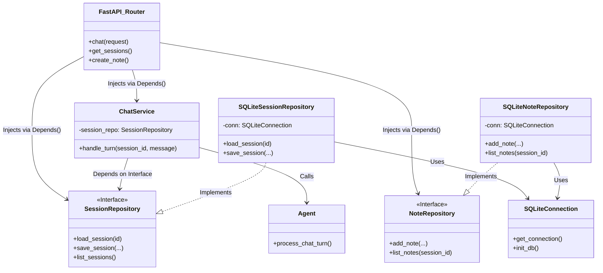
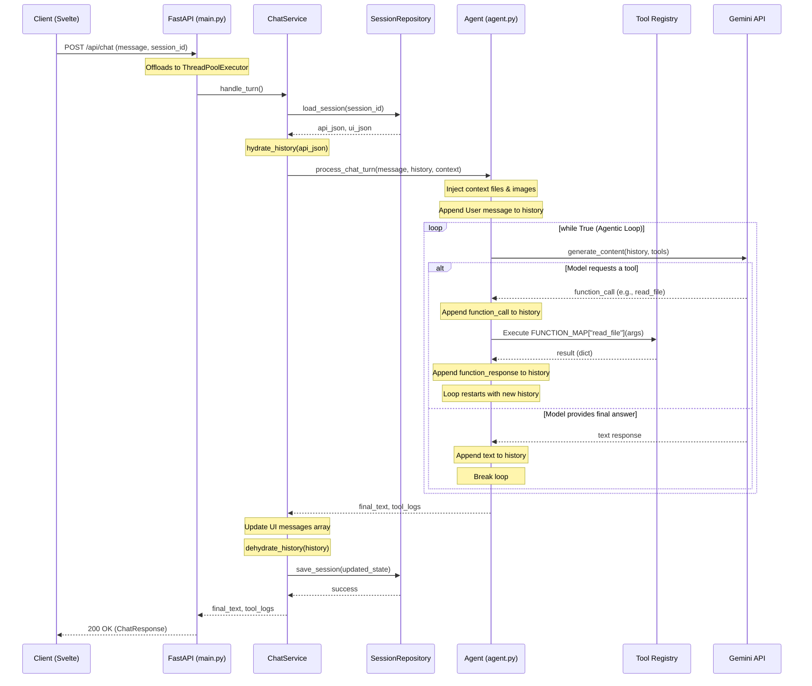

Agentic Workspace

## 1. Domain Context & User Persona

The user is a solo kitchen cabinet designer and builder based in Poland. They are actively learning the trade and managing a self-made "second brain" (knowledge base) consisting of roughly 200KB of Markdown files stored in a local Git repository.

The application serves as a highly specialized, local-only AI assistant. Because the entire knowledge base is small enough to fit into modern LLM context windows (128k+ tokens), **traditional RAG (Vector Databases, Chunking, Embeddings) is explicitly out of scope.** The agent relies entirely on full-context window ingestion and autonomous tool-calling to read, search, and update the local file system.

## 2. Core App Functionality (User Perspective)

The application acts as an integrated workspace combining a chat interface, a text editor, and an autonomous agent.

- **Bidirectional Knowledge Management:** The user can ask questions (e.g., _"What thickness of MDF do we use for back panels?"_). The agent autonomously maps the repository, reads the relevant files, and answers. Conversely, the user can command the agent to update the knowledge base.
- **Contextual Personas (Prompt Templates):** The user can switch the agent's behavior mid-conversation via a UI dropdown.
- **Transparent Reasoning:** The UI explicitly shows the user exactly which files the agent read and what raw text it extracted via expandable UI logs.
- **Safe File Operations:** The agent is strictly forbidden from overwriting entire files. It must use a precise "Search and Replace" tool to edit files.
- **Session Lineage & Notes:** Users can fork conversations to explore different design angles, and highlight text to save as discrete notes attached to a session.

## 3. Project Scope & Constraints

- **In-Scope:** Local file system manipulation (Markdown), multimodal chat (text + images), chat history branching/forking, manual text editing via UI, strict TDD backend development.
- **Out-of-Scope:** Cloud deployment, multi-user authentication, Vector Databases/Semantic Search, direct integration with CAD software.
- **Constraints:** Must run locally. Must use **Google Gemini 2.5 Flash** (via `google-genai` SDK). Must handle Gemini's strict `thought_signature` byte-encoding requirements for multi-turn tool calling.

---

## 4. Tech Stack

- **Backend:** Python 3.11, `uv` (package manager), FastAPI, `pydantic`, `structlog`, `pytest` (TDD).
- **LLM Integration:** Google Gemini 2.5 Flash via the modern `google-genai` SDK.
- **Database:** SQLite3 (Local persistence).
- **Frontend:** SvelteKit (TypeScript/JavaScript), TailwindCSS.

## 5. Current Architecture (Clean Architecture)

The backend follows commercial-grade Clean Architecture principles, strictly separating HTTP concerns from business logic and data access.

- **`src/main.py`**: FastAPI entry point. Handles HTTP routing, CORS, and dependency injection.
- **`src/chat_service.py`**: Business logic layer. Orchestrates the agent loop, prompt logging, and state persistence.
- **`src/repositories.py`**: Data access layer using the Repository Pattern (`SessionRepository`, `NoteRepository`). Abstracts SQLite away from the business logic.
- **`src/agent.py`**: The core LLM engine. Implements a `while True` loop to handle multi-step autonomous tool calling.
- **`src/schemas.py`**: Strict Pydantic DTOs for all API requests and responses.
- **`src/serializers.py`**: Dehydration/Hydration layer for complex Google `types.Content` objects.
- **`src/tools/registry.py`**: Single source of truth binding Gemini `FunctionDeclarations` to Python callables.

## 6. Implemented Features (100% Working Backend)

- **Agentic Tool Loop:** The LLM can chain multiple tools together before returning a final text response.
- **Multimodal Chat:** Supports base64 image ingestion (e.g., pasted via CTRL+V).
- **Advanced Session Lineage:** Full support for branching/forking chats (`parent_id`, `root_id`, `fork_turn_index`), returning a nested tree structure for the UI.
- **Session Management:** Archiving (soft-delete), permanent deletion (with child-dependency checks), and Markdown exporting.
- **Note-Taking:** Endpoints to save highlighted text as discrete notes attached to a session.
- **Context Injection:** Endpoints to read/write/append to local Markdown files, and inject specific files directly into the LLM context window.
- **Prompt Logging:** Automatically appends every user prompt to a running `data/prompt_log.md` file.

### 🛠️ Current LLM Tool Registry

1.  `read_file(filepath)`: Reads full content of a markdown file.
2.  `get_repo_map()`: Scans the `data/` directory and extracts `#` headers.
3.  `edit_file(filepath, search_text, replace_text)`: Safe search-and-replace.
4.  `create_file(filepath, content)`: Safely creates new files.
5.  `search_knowledge_base(query)`: Regex-based search (OR logic) across all file contents.

## 7. Database Schema (SQLite)

**Table:** `sessions`

- `id` (TEXT PRIMARY KEY)
- `title` (TEXT)
- `api_history_json` (TEXT) - Dehydrated Gemini objects.
- `ui_history_json` (TEXT) - UI-friendly chat log with tool execution results.
- `updated_at` (TIMESTAMP)
- `parent_id` (TEXT) - For forked sessions.
- `fork_turn_index` (INTEGER) - The turn index where the fork occurred.
- `root_id` (TEXT) - The ultimate ancestor of a forked tree.
- `archived_at` (TIMESTAMP) - Soft deletion tracking.

**Table:** `notes`

- `id` (TEXT PRIMARY KEY)
- `session_id` (TEXT) - Foreign key to sessions.
- `selected_text` (TEXT) - The highlighted text.
- `note` (TEXT) - User's added context.
- `source_role` (TEXT) - 'user' or 'assistant'.
- `created_at` (TIMESTAMP)

---

## 8. Planned Features & Roadmap (Next Steps)

With the backend feature-complete for the current scope, the roadmap shifts to frontend integration and backend structural maturity.

### A. Frontend Integration (SvelteKit)

- Wire up the SvelteKit UI to consume the new `/api/sessions/tree` endpoint for the sidebar.
- Implement the UI for the "Highlight -> Add Note" and "Highlight -> Append to Docs" features.
- Build the manual Markdown text editor UI consuming `GET/PUT /api/files`.

### B. Backend Refactoring & Maturity

- **API Routing:** Split `main.py` into modular FastAPI `APIRouter` files (e.g., `routers/chat.py`, `routers/sessions.py`, `routers/files.py`).
- **Database Migrations:** Replace raw `CREATE TABLE` scripts in `repositories.py` with **Alembic** to safely manage future schema changes.
- **Concurrency:** Enable SQLite WAL (Write-Ahead Logging) mode to prevent `database is locked` errors during simultaneous API calls.

