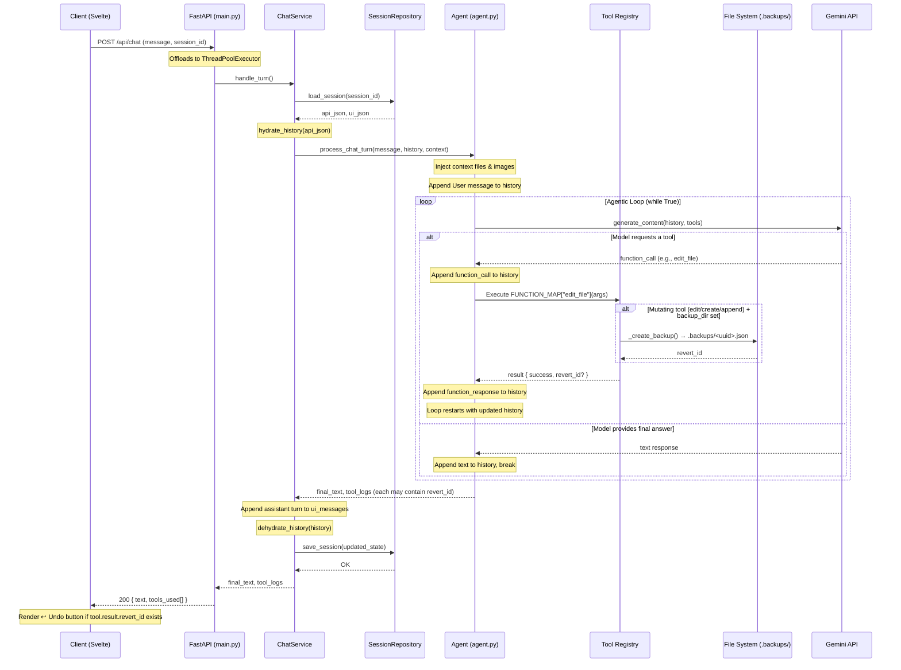
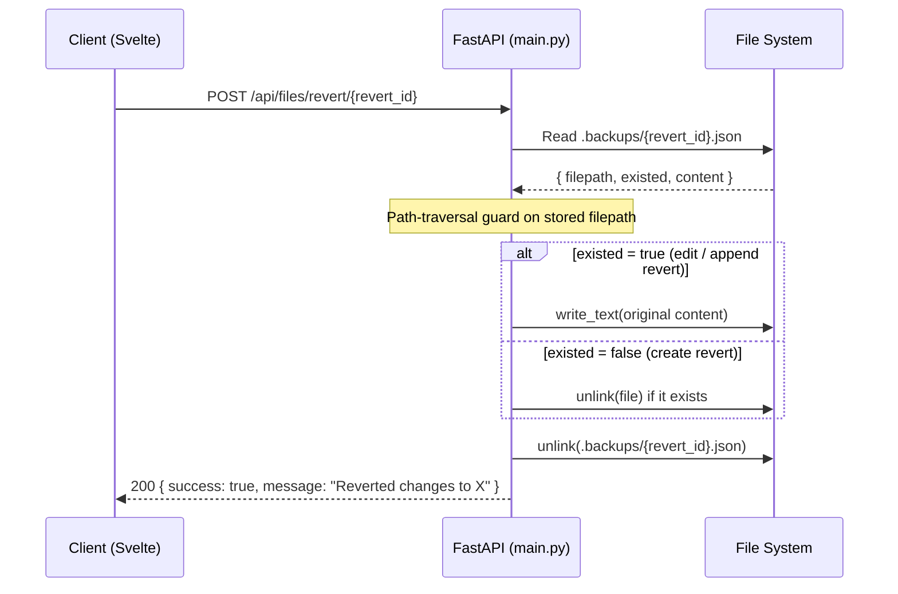

# Agentic Workspace — Architecture

## 1. Domain Context & User Persona

The user is a solo kitchen cabinet designer and builder based in Poland. They actively manage a self-made "second brain" — roughly 200 KB of Markdown files stored in a local Git repository.

The application serves as a highly specialised, local-only AI assistant. Because the entire knowledge base is small enough to fit inside modern LLM context windows (128k+ tokens), **traditional RAG (Vector Databases, Chunking, Embeddings) is explicitly out of scope.** The agent relies entirely on full-context window ingestion and autonomous tool-calling to read, search, and update the local file system.

---

## 2. Core App Functionality (User Perspective)

The application acts as an integrated workspace combining a chat interface, a text editor, and an autonomous agent.

- **Bidirectional Knowledge Management:** The user can ask questions (e.g., _"What thickness of MDF do we use for back panels?"_). The agent autonomously maps the repository, reads the relevant files, and answers. Conversely, the user can command the agent to update the knowledge base.
- **Contextual Personas (Prompt Templates):** The user can switch the agent's behaviour mid-conversation via a UI dropdown.
- **Transparent Reasoning:** The UI explicitly shows which files the agent read and what raw text it extracted via expandable tool-execution logs.
- **Safe File Operations:** The agent is strictly forbidden from overwriting entire files. It must use a precise "Search and Replace" tool to edit them. Every mutation is snapshotted and reversible via a one-click Undo button (see F03 below).
- **Session Lineage & Notes:** Users can fork conversations to explore different design angles and highlight text to save as discrete notes attached to a session.

---

## 3. Project Scope & Constraints

- **In-Scope:** Local file system manipulation (Markdown), multimodal chat (text + images), chat history branching/forking, manual text editing via UI, reversible file mutations, strict TDD backend development.
- **Out-of-Scope:** Cloud deployment, multi-user authentication, Vector Databases / Semantic Search, direct integration with CAD software.
- **Constraints:** Must run locally. Must use **Google Gemini 2.5 Flash** (via `google-genai` SDK). Must handle Gemini's strict `thought_signature` byte-encoding requirements for multi-turn tool calling.

---

## 4. Tech Stack

| Layer    | Technology                                                             |
| -------- | ---------------------------------------------------------------------- |
| Backend  | Python 3.11, `uv` (package manager), FastAPI, Pydantic v2, `structlog` |
| LLM      | Google Gemini 2.5 Flash via `google-genai` SDK                         |
| Database | SQLite3 (local persistence)                                            |
| Testing  | `pytest` + `pytest-cov` (strict TDD, ≥ 80 % branch coverage)           |
| Frontend | SvelteKit (TypeScript), TailwindCSS                                    |

---

## 5. Architecture Overview (Clean Architecture)

The backend enforces strict **separation of concerns** across four horizontal layers:

```
┌────────────────────────────────────────────────────────────────┐
│  HTTP Layer          src/main.py  (FastAPI routes, DI, CORS)   │
├────────────────────────────────────────────────────────────────┤
│  Business Logic      src/chat_service.py  (ChatService)        │
├────────────────────────────────────────────────────────────────┤
│  Domain / Tools      src/agent.py · src/tools/                 │
├────────────────────────────────────────────────────────────────┤
│  Data Access         src/repositories.py  (Repository Pattern) │
│                      SQLite via SQLiteConnection               │
└────────────────────────────────────────────────────────────────┘
```

### Module Responsibilities

| Module                  | Role                                                                                                                                                                                              |
| ----------------------- | ------------------------------------------------------------------------------------------------------------------------------------------------------------------------------------------------- |
| `src/main.py`           | FastAPI entry point — HTTP routing, CORS middleware, dependency injection, request/response validation. No business logic.                                                                        |
| `src/schemas.py`        | Pydantic DTOs for every API request and response. Single source of truth for the HTTP contract.                                                                                                   |
| `src/chat_service.py`   | Business logic — loads session history, invokes the agent loop, persists updated state, logs prompts.                                                                                             |
| `src/agent.py`          | LLM engine — drives the `while True` multi-step tool-calling loop against Gemini.                                                                                                                 |
| `src/tools/registry.py` | Single source of truth binding Gemini `FunctionDeclaration` objects to Python callables. `FUNCTION_MAP` and `DECLARATIONS` are **derived** from the same list — names can never drift.            |
| `src/tools/file_ops.py` | File-system tool implementations (`read_file`, `edit_file`, `create_file`, `append_to_file`, `search_knowledge_base`) plus the F03 backup/revert helpers.                                         |
| `src/tools/repo_map.py` | Scans `data/` and extracts `#` headings to give the LLM a lightweight map of the knowledge base.                                                                                                  |
| `src/repositories.py`   | Data access layer using the Repository Pattern. `SessionRepository` and `NoteRepository` are Python Protocols; `SQLiteSessionRepository` and `SQLiteNoteRepository` are concrete implementations. |
| `src/serializers.py`    | Dehydration/hydration of complex `google.genai.types.Content` objects for SQLite storage (handles `thought_signature` bytes).                                                                     |
| `src/prompt_logger.py`  | Appends every user prompt to a running `data/prompt_log.md` file.                                                                                                                                 |
| `src/config.py`         | `pydantic-settings` singleton (`settings`) — all knobs in one place, overridable via `.env`.                                                                                                      |
| `src/logger.py`         | Configures `structlog` for structured JSON logging.                                                                                                                                               |

---

## 6. Implemented Features

### 6.1 Agentic Tool Loop

The LLM can chain multiple tool calls within a single user turn before returning a final text response. The loop is driven in `agent.py` and offloaded to a `ThreadPoolExecutor` in the FastAPI handler so the async event loop is never blocked.

### 6.2 Multimodal Chat

Supports base64-encoded images (e.g., pasted via Ctrl+V in the UI). Images are decoded and forwarded as `types.Part.from_bytes` inside the user turn.

### 6.3 Advanced Session Lineage

Full support for branching/forking chats:

- `parent_id`, `root_id`, `fork_turn_index` columns in SQLite.
- `GET /api/sessions/tree` returns a recursive forest of `SessionNode` objects.
- A legacy-title backfill migration runs at startup to repair sessions created before the lineage columns existed.

### 6.4 Session Lifecycle

- Archiving (soft-delete via `archived_at` timestamp).
- Permanent deletion with child-dependency enforcement (returns HTTP 409 if forked children still exist).
- Markdown export (`GET /api/sessions/{id}/export`).

### 6.5 Note-Taking

Users can highlight any text in the chat and save it as a `Note` scoped to the session. Notes are stored in SQLite and exposed via full CRUD endpoints.

### 6.6 Knowledge Base File Management

Full REST API for the `data/` directory:

- `GET /api/files` — list all `.md` files.
- `GET /api/files/{path}` — read a file.
- `PUT /api/files/{path}` — write (overwrite) a file.
- `POST /api/files/append` — append a highlighted snippet to a file.
- `GET /api/repo-map` — return heading-level outline of the entire knowledge base.

All file endpoints enforce a **path-traversal guard** (`_resolve_data_path`).

### 6.7 F03 — API-Native Snapshot / Revert (Undo)

> _"When building autonomous agents, destructive actions must always have a rollback mechanism."_

Every agent-facing file mutation now creates a pre-edit snapshot before writing:

```
data/.backups/<uuid>.json
{
  "filepath": "data/notes.md",   // original posix path
  "existed":  true,              // was the file there before?
  "content":  "# Original…"     // full text (null if existed=false)
}
```

The tool result includes `"revert_id": "<uuid>"` which is saved into `ui_history_json` automatically. The frontend can render an "↩️ Undo" button per tool call.

**New endpoint:** `POST /api/files/revert/{revert_id}`

- **200** — file restored to pre-mutation state; backup JSON deleted (no double-revert).
- **404** — backup not found or already used.
- **400** — malformed backup JSON or path-traversal attempt in stored filepath.

**Design properties:**

- `backup_dir` is injected, not hard-coded — `file_ops.py` has zero dependency on `settings`.
- Backup JSON is deleted **only after** a successful restore (failed restore can be retried).
- `backup_dir=None` (default) preserves full backward compatibility — all pre-F03 tests pass unchanged.
- A path-traversal guard validates the `filepath` stored inside the backup JSON at revert time, preventing tampered backup files from writing outside `data/`.

### 6.8 Context Injection

Selected `data/` files can be injected directly into the LLM's context window via the `context_files` field on the chat request. Their content is prepended as a labelled block before the user message.

### 6.9 Prompt Logging

Every user prompt is appended to `data/prompt_log.md` for audit / review purposes.

---

## 7. LLM Tool Registry

Tools are defined once in `src/tools/registry.py` as `ToolEntry(declaration, fn)` pairs. `FUNCTION_MAP` and `DECLARATIONS` are derived from the same list — a rename in one place cannot silently break the other.

| #   | Tool name                                        | Description                                                  |
| --- | ------------------------------------------------ | ------------------------------------------------------------ | --------------------------------------------- |
| 1   | `read_file(filepath)`                            | Reads the full content of a Markdown file.                   |
| 2   | `get_repo_map()`                                 | Returns a heading-level map of the entire `data/` directory. |
| 3   | `edit_file(filepath, search_text, replace_text)` | Safe search-and-replace. Returns `revert_id`.                |
| 4   | `create_file(filepath, content)`                 | Creates a new file. Returns `revert_id`.                     |
| 5   | `search_knowledge_base(query)`                   | Regex search (OR logic via `                                 | `) across all `.md` files. Up to 200 matches. |

> `base_dir` for both `get_repo_map` and `search_knowledge_base` is fixed inside a lambda in the registry — it is never part of the public tool API surface (prevents path-traversal from the LLM).

---

## 8. Database Schema (SQLite)

### Table: `sessions`

| Column             | Type      | Notes                                            |
| ------------------ | --------- | ------------------------------------------------ |
| `id`               | TEXT PK   | UUID                                             |
| `title`            | TEXT      | Derived from first user message (≤ 30 chars)     |
| `api_history_json` | TEXT      | Dehydrated `google.genai.types.Content` objects  |
| `ui_history_json`  | TEXT      | UI-friendly chat log with tool execution results |
| `updated_at`       | TIMESTAMP |                                                  |
| `parent_id`        | TEXT      | FK → sessions.id for forked sessions             |
| `fork_turn_index`  | INTEGER   | Turn where the fork was made                     |
| `root_id`          | TEXT      | Ultimate ancestor of a fork tree                 |
| `archived_at`      | TIMESTAMP | NULL = active; set = soft-deleted                |

### Table: `notes`

| Column          | Type      | Notes                               |
| --------------- | --------- | ----------------------------------- |
| `id`            | TEXT PK   | UUID                                |
| `session_id`    | TEXT      | FK → sessions.id                    |
| `selected_text` | TEXT      | The highlighted text                |
| `note`          | TEXT      | User's added context (may be empty) |
| `source_role`   | TEXT      | `"user"` or `"assistant"`           |
| `created_at`    | TIMESTAMP |                                     |

---

## 9. API Surface Reference

### Sessions

| Method | Path                         | Description                                                             |
| ------ | ---------------------------- | ----------------------------------------------------------------------- |
| GET    | `/api/sessions`              | List all sessions (flat). `?include_archived=true` to surface archived. |
| GET    | `/api/sessions/tree`         | Nested tree of sessions (for sidebar).                                  |
| GET    | `/api/sessions/{id}`         | Load UI messages for a session.                                         |
| GET    | `/api/sessions/{id}/export`  | Export session as Markdown.                                             |
| POST   | `/api/sessions/{id}/fork`    | Fork a session at a given turn index.                                   |
| PATCH  | `/api/sessions/{id}/archive` | Soft-delete a session.                                                  |
| DELETE | `/api/sessions/{id}/archive` | Restore an archived session.                                            |
| DELETE | `/api/sessions/{id}`         | Permanently delete (404 if not found, 409 if has children).             |

### Files

| Method   | Path                                | Description                                        |
| -------- | ----------------------------------- | -------------------------------------------------- |
| GET      | `/api/files`                        | List all `.md` files in `data/`.                   |
| GET      | `/api/files/{path}`                 | Read a file.                                       |
| PUT      | `/api/files/{path}`                 | Overwrite a file.                                  |
| POST     | `/api/files/append`                 | Append a snippet to a file.                        |
| **POST** | **`/api/files/revert/{revert_id}`** | **F03 — Revert a file to its pre-mutation state.** |
| GET      | `/api/repo-map`                     | Heading-level outline of the knowledge base.       |

### Notes

| Method | Path                                 | Description                   |
| ------ | ------------------------------------ | ----------------------------- |
| POST   | `/api/sessions/{id}/notes`           | Create a note (201).          |
| GET    | `/api/sessions/{id}/notes`           | List all notes for a session. |
| DELETE | `/api/sessions/{id}/notes/{note_id}` | Delete a note (204).          |

### Chat

| Method | Path        | Description                                                                               |
| ------ | ----------- | ----------------------------------------------------------------------------------------- |
| POST   | `/api/chat` | Send a message. Returns `{text, tools_used[]}`. Each tool result may include `revert_id`. |

---

## 10. Data Flow — Chat Turn (Sequence Diagram)



---

## 11. Data Flow — File Revert (F03)



---

## 12. Class Diagram

```mermaid
classDiagram
    %% ── HTTP Layer ──────────────────────────────────────────────────────────
    class FastAPI_Router {
        +chat(request) ChatResponse
        +get_sessions() list[SessionSummary]
        +get_session_tree() list[SessionNode]
        +fork_session(id, request) ForkResponse
        +archive_session(id)
        +delete_session(id)
        +list_files() list[FileListItem]
        +read_file_endpoint(path) FileReadResponse
        +write_file_endpoint(path, request)
        +append_to_file_endpoint(request)
        +revert_file_edit(revert_id) RevertResponse
        +create_note(id, request) NoteResponse
        +list_notes(id) list[NoteResponse]
        +delete_note(id, note_id)
    }

    %% ── Business Logic ──────────────────────────────────────────────────────
    class ChatService {
        -session_repo: SessionRepository
        +handle_turn(session_id, message) tuple
    }

    %% ── Repository Interfaces ───────────────────────────────────────────────
    class SessionRepository {
        <<Protocol>>
        +load_session(id) tuple
        +save_session(...)
        +list_sessions(include_archived) list
        +get_session_tree(include_archived) list
        +archive_session(id) bool
        +unarchive_session(id) bool
        +delete_session(id)
        +fork_session(id, turn_index) str
        +export_session(id) str
    }

    class NoteRepository {
        <<Protocol>>
        +add_note(...) dict
        +list_notes(session_id) list
        +delete_note(note_id, session_id) bool
    }

    %% ── Concrete Implementations ────────────────────────────────────────────
    class SQLiteConnection {
        +db_path: str
        +get_connection() Connection
        -_init_db()
        -_backfill_legacy_fork_lineage()
    }

    class SQLiteSessionRepository {
        -db: SQLiteConnection
    }

    class SQLiteNoteRepository {
        -db: SQLiteConnection
    }

    %% ── Agent / Tools ───────────────────────────────────────────────────────
    class Agent {
        +process_chat_turn(message, history, ...) tuple
    }

    class ToolRegistry {
        +TOOLS: list[ToolEntry]
        +FUNCTION_MAP: dict
        +DECLARATIONS: list
    }

    class FileOps {
        +read_file(filepath) dict
        +edit_file(filepath, search, replace, backup_dir) dict
        +create_file(filepath, content, backup_dir) dict
        +append_to_file(filepath, content, backup_dir) dict
        +search_knowledge_base(query, base_dir) dict
        +_create_backup(target_path, backup_dir) str
        +revert_backup(revert_id, backup_dir) dict
    }

    %% ── Relationships ───────────────────────────────────────────────────────
    FastAPI_Router --> ChatService : Depends()
    FastAPI_Router --> SessionRepository : Depends()
    FastAPI_Router --> NoteRepository : Depends()
    FastAPI_Router --> FileOps : calls revert_backup()

    ChatService --> SessionRepository : uses interface
    ChatService --> Agent : calls

    Agent --> ToolRegistry : dispatches via FUNCTION_MAP
    ToolRegistry --> FileOps : wraps

    SQLiteSessionRepository ..|> SessionRepository : implements
    SQLiteNoteRepository ..|> NoteRepository : implements

    SQLiteSessionRepository --> SQLiteConnection : uses
    SQLiteNoteRepository --> SQLiteConnection : uses
```



---

## 13. Roadmap — Next Steps

### A. Frontend Integration (SvelteKit)

- Wire `GET /api/sessions/tree` to the sidebar session tree component.
- Render the `revert_id` from each `tools_used` entry as an "↩️ Undo" button next to the tool execution log.
- Implement "Highlight → Add Note" (`POST /api/sessions/{id}/notes`) and "Highlight → Append to Docs" (`POST /api/files/append`) flows.
- Build the manual Markdown editor consuming `GET /PUT /api/files/{path}`.

### B. Backend Structural Maturity

- **API Routing:** Split `main.py` into modular `APIRouter` files (`routers/chat.py`, `routers/sessions.py`, `routers/files.py`, `routers/notes.py`).
- **Database Migrations:** Replace raw `CREATE TABLE` / `ALTER TABLE` in `repositories.py` with **Alembic** for safe, auditable schema evolution.
- **Concurrency:** Enable SQLite WAL (Write-Ahead Logging) mode to prevent `database is locked` errors under simultaneous requests.
- **Backup TTL:** Add a startup / cron job to purge `.backups/` entries older than 7 days to prevent unbounded disk growth.
- **Tool backup_dir wiring:** Update `src/tools/registry.py` tool lambdas to pass `backup_dir=settings.data_dir` so the agent's `edit_file` and `create_file` calls automatically produce `revert_id` values in their results.
