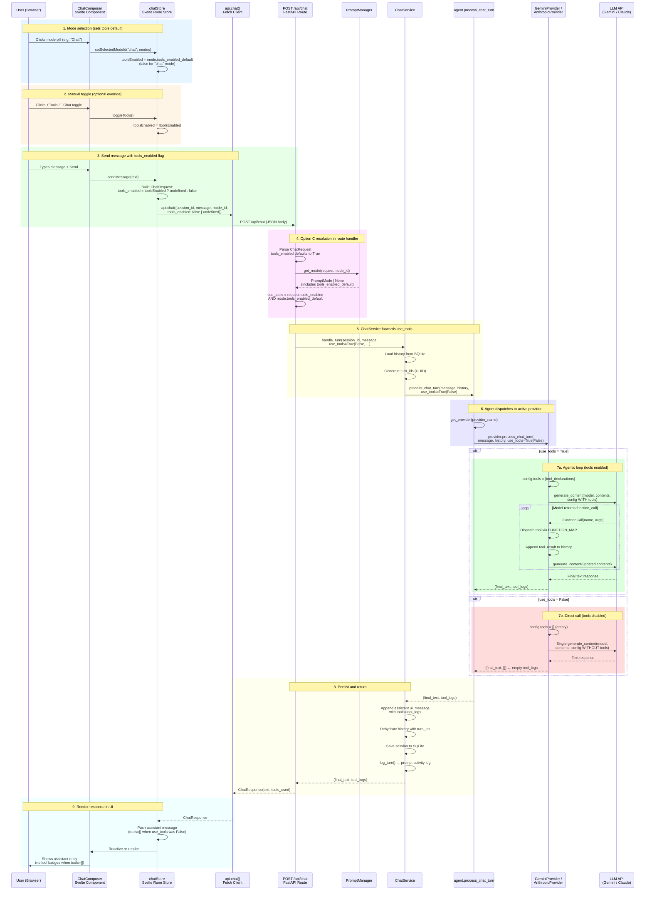
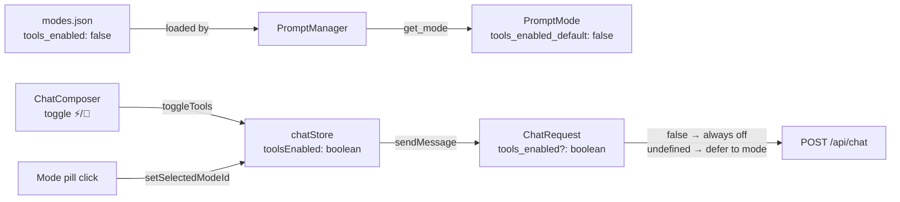
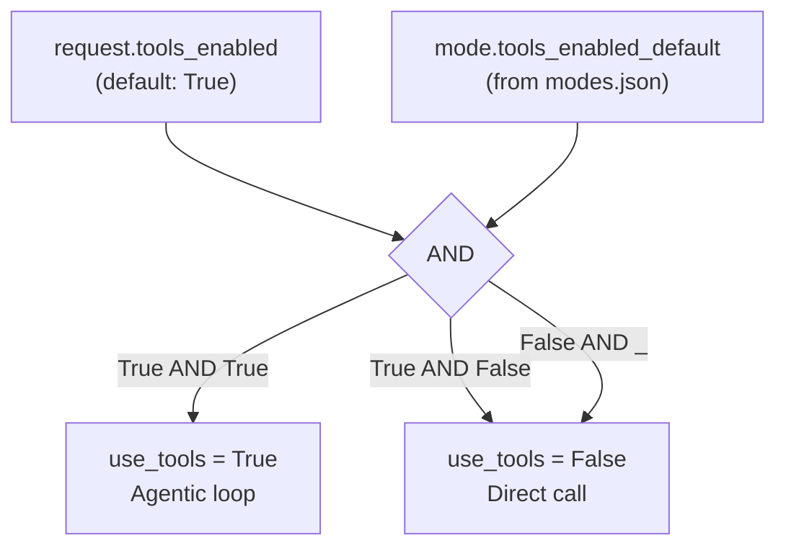
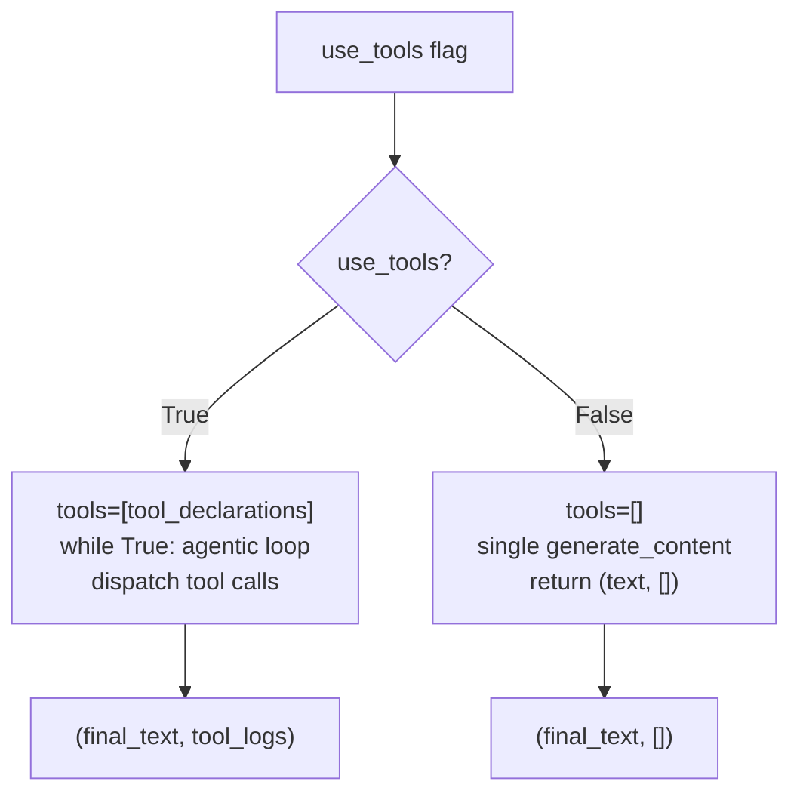

# R004 — Tools Toggle: End-to-End Sequence Diagram

## Option C Resolution Rule

```
use_tools = request.tools_enabled AND mode.tools_enabled_default
```

| request.tools_enabled | mode.tools_enabled_default | effective use_tools | Scenario                       |
| --------------------- | -------------------------- | ------------------- | ------------------------------ |
| `true` (default)      | `true` (default)           | **true**            | Normal agentic loop            |
| `true` (default)      | `false`                    | **false**           | Mode defaults to chat-only     |
| `false` (explicit)    | `true`                     | **false**           | User explicitly disabled tools |
| `false` (explicit)    | `false`                    | **false**           | Both off                       |

---

## Full Request Flow



---

## Data Flow Summary

### Frontend → Backend



### Backend Resolution



### Provider Branching



---

## Key Files

| Layer           | File                                              | Role                                    |
| --------------- | ------------------------------------------------- | --------------------------------------- |
| Config          | `prompts/modes.json`                              | `tools_enabled` per mode (optional key) |
| Schema          | `src/schemas.py` → `ChatRequest`                  | `tools_enabled: bool = True`            |
| Prompt Manager  | `src/prompt_manager.py` → `PromptMode`            | `tools_enabled_default: bool = True`    |
| Route           | `src/main.py` → `chat()`                          | Option C resolution: `AND` logic        |
| Service         | `src/chat_service.py` → `handle_turn()`           | `use_tools` param forwarded             |
| Agent           | `src/agent.py` → `process_chat_turn()`            | `use_tools` param forwarded             |
| Provider (base) | `src/providers/base.py` → `LLMProvider`           | Protocol includes `use_tools`           |
| Gemini          | `src/providers/gemini.py`                         | `use_tools=False` → direct call branch  |
| Anthropic       | `src/providers/anthropic_provider.py`             | `use_tools=False` → direct call branch  |
| Frontend store  | `frontend/src/lib/stores/chat.svelte.ts`          | `toolsEnabled` state + toggle           |
| Frontend UI     | `frontend/src/lib/components/ChatComposer.svelte` | ⚡/💬 toggle button                     |
| Frontend API    | `frontend/src/lib/api.ts` → `ChatRequest`         | `tools_enabled?: boolean`               |

---

## Validation Checklist

- [x] `prompts/modes.json` supports optional `tools_enabled` key
- [x] `PromptMode.tools_enabled_default` defaults to `True` when absent
- [x] Non-bool `tools_enabled` in modes.json coerced to `True` (safe default)
- [x] `ChatRequest.tools_enabled` defaults to `True` in Pydantic schema
- [x] `main.py` resolves `use_tools = request.tools_enabled AND mode.tools_enabled_default`
- [x] `ChatService.handle_turn(use_tools=...)` forwards to agent
- [x] `agent.process_chat_turn(use_tools=...)` forwards to provider
- [x] `LLMProvider` protocol includes `use_tools: bool = True`
- [x] `GeminiProvider`: `use_tools=False` → empty tools config + single call
- [x] `AnthropicProvider`: `use_tools=False` → empty tools list + single call
- [x] Frontend `chatStore.toolsEnabled` syncs with mode default on switch
- [x] Frontend `sendMessage` sends `tools_enabled: false` only when off
- [x] 739/739 tests pass
