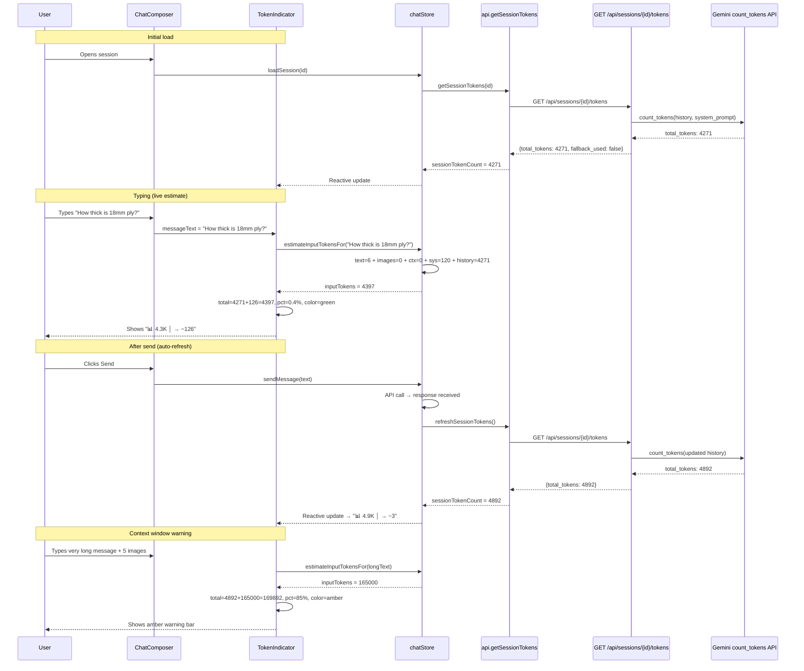

# R005 — Token Count Feature

**Date:** 2026-06-01
**Status:** Implemented, 739 backend tests + 21 frontend tests green

---

## Problem

Users have no visibility into token consumption. They need two numbers:

1. **Session tokens** — tokens already consumed in this conversation (what they've paid so far).
2. **Input tokens** — tokens that will be sent on the next message (what they'll pay when they click Send).

Without this, users cannot gauge cost before sending, know how close they are to the context
window limit, or decide whether to trim history.

---

## Design Decisions

### D1: Two distinct counts

| Count              | Meaning                    | Source                                                           | Update Trigger                               |
| ------------------ | -------------------------- | ---------------------------------------------------------------- | -------------------------------------------- |
| **Session tokens** | All tokens consumed so far | `GET /api/sessions/{id}/tokens` (exact API + heuristic fallback) | After every send; on session load            |
| **Input tokens**   | Tokens about to be sent    | Client-side heuristic (`chars / 4`)                              | Every keystroke (reactive Svelte `$derived`) |

### D2: Client-side input estimation (no API round-trip on keystrokes)

- **Text**: `Math.ceil(text.length / 4)` — mirrors backend `estimate_tokens_for_text`
- **Images**: 258 tokens per image (conservative single-tile Gemini estimate)
- **Context files**: Fetched once from backend when files change, cached in store
- **System prompt**: Fetched once on mode change, cached in store
- **History**: Uses the last known `sessionTokenCount` value

### D3: Token indicator placement

A compact bar in `ChatComposer`, between the textarea and the mode pill strip:

```
┌──────────────────────────────────────────────────┐
│ [textarea]                                 [Send]│
│──────────────────────────────────────────────────│
│ [████████░░] 25% │ 📊 4.3K │ → ~127            │
│──────────────────────────────────────────────────│
│ [🔧 General] [📐 Design] [🔨 Assembly]           │
│              [⚡ Tools] [+ New chat]              │
└──────────────────────────────────────────────────┘
```

### D4: Context window gauge

Shows percentage of context window used (`session + input` vs model's `context_k`):

- **< 80%** → green (safe)
- **80–95%** → amber (warning)
- **> 95%** → red (danger)

### D5: Backend — no changes needed

The existing endpoints are sufficient:

- `GET /api/sessions/{id}/tokens` — session count (exact + heuristic fallback)
- `POST /api/tokens/estimate` — precise input estimate (for on-demand use)

### D6: Auto-refresh session count

After `chatStore.sendMessage()` succeeds → `refreshSessionTokens()`.
On `chatStore.loadSession()` → `refreshSessionTokens()`.
On `chatStore.truncateMessages()` → `refreshSessionTokens()`.

---

## LLM Pricing Context (2026)

### Input vs Output tokens — what you pay

| Event                                        | Billed As           | When                     |
| -------------------------------------------- | ------------------- | ------------------------ |
| User sends message + history + system prompt | **Input tokens**    | Immediately on Send      |
| LLM generates response                       | **Output tokens**   | After response completes |
| Tool call round-trips (read_file, etc.)      | Both input + output | During agentic loop      |

**The "Input tokens" indicator shows what you'll pay for sure.** Output tokens depend on
the model's response length and cannot be predicted.

### Gemini Pricing

| Model            | Input (per 1M tokens) | Output (per 1M tokens) | Context Window |
| ---------------- | --------------------- | ---------------------- | -------------- |
| Gemini 2.5 Pro   | $1.25                 | $5.00                  | 1M tokens      |
| Gemini 2.5 Flash | $0.15                 | $0.60                  | 1M tokens      |

### Anthropic Pricing

| Model           | Input (per 1M tokens) | Output (per 1M tokens) | Context Window |
| --------------- | --------------------- | ---------------------- | -------------- |
| Claude Sonnet 4 | $3.00                 | $15.00                 | 200K tokens    |
| Claude Opus 4   | $15.00                | $75.00                 | 200K tokens    |

**Key insight for the UI**: Anthropic's 200K context window fills up much faster than
Gemini's 1M. The context gauge is especially important when using Claude models.

---

## Files Changed

| File                                                | Change                                                                                                                                                 | Type     |
| --------------------------------------------------- | ------------------------------------------------------------------------------------------------------------------------------------------------------ | -------- |
| `frontend/src/lib/token_estimator.ts`               | **New** — Client-side token estimation (chars/4, image tiles, formatting)                                                                              | New      |
| `frontend/src/lib/token_estimator.spec.ts`          | **New** — 20 unit tests for token estimation                                                                                                           | New      |
| `frontend/src/lib/components/TokenIndicator.svelte` | **New** — Token bar component with gauge + counts                                                                                                      | New      |
| `frontend/src/lib/api.ts`                           | Added `SessionTokensResponse`, `TokenEstimateResponse` types + `getSessionTokens()`, `estimateTokens()` methods                                        | Modified |
| `frontend/src/lib/stores/chat.svelte.ts`            | Added token state, `refreshSessionTokens()`, `refreshContextFileTokens()`, `refreshCachedSystemPrompt()`, `estimateInputTokensFor()`, `contextWindowK` | Modified |
| `frontend/src/lib/components/ChatComposer.svelte`   | Embedded `TokenIndicator` between textarea and mode strip                                                                                              | Modified |
| `doc/r005-token-count-feature.md`                   | This design document                                                                                                                                   | New      |

---

## Test Results

| Suite                               | Count | Status                  |
| ----------------------------------- | ----- | ----------------------- |
| Backend (`pytest`)                  | 739   | ✅ All pass             |
| Frontend token estimator (`vitest`) | 20    | ✅ All pass             |
| Frontend build (`svelte-check`)     | —     | ✅ 0 errors, 0 warnings |
| Frontend build (`vite build`)       | —     | ✅ Success              |

---

## Sequence Diagram



---

## Validation Checklist

- [x] Backend `GET /api/sessions/{id}/tokens` returns exact count with fallback
- [x] Backend `POST /api/tokens/estimate` returns heuristic breakdown
- [x] Frontend `token_estimator.ts` mirrors backend chars/4 heuristic
- [x] Frontend `TokenIndicator.svelte` shows session + input tokens
- [x] Frontend context window gauge with safe/warn/danger colors
- [x] `chatStore.sessionTokenCount` auto-refreshes after send
- [x] `chatStore.sessionTokenCount` auto-refreshes on session load
- [x] `chatStore.sessionTokenCount` refreshes after truncation
- [x] `chatStore.estimateInputTokensFor()` reactive on message text
- [x] `chatStore.contextWindowK` derived from provider/model selection
- [x] Context file token estimate cached and refreshed on file change
- [x] System prompt cached and refreshed on mode change
- [x] 739 backend tests pass
- [x] 20 frontend unit tests pass
- [x] svelte-check: 0 errors
- [x] vite build: success
