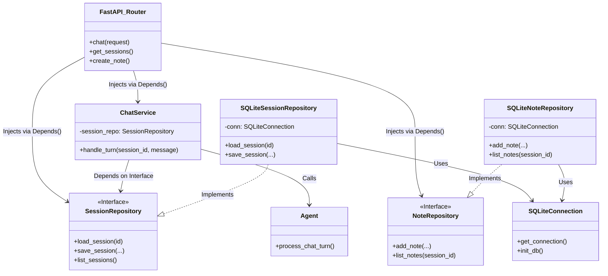

```mermaid
classDiagram
    %% HTTP Layer
    class FastAPI_Router {
        +chat(request)
        +get_sessions()
        +create_note()
    }

    %% Business Logic Layer
    class ChatService {
        -session_repo: SessionRepository
        +handle_turn(session_id, message)
    }

    %% Interfaces (Protocols) - Dependency Inversion
    class SessionRepository {
        <<Interface>>
        +load_session(id)
        +save_session(...)
        +list_sessions()
    }

    class NoteRepository {
        <<Interface>>
        +add_note(...)
        +list_notes(session_id)
    }

    %% Data Access Layer (Concrete Implementations)
    class SQLiteConnection {
        +get_connection()
        +init_db()
    }

    class SQLiteSessionRepository {
        -conn: SQLiteConnection
        +load_session(id)
        +save_session(...)
    }

    class SQLiteNoteRepository {
        -conn: SQLiteConnection
        +add_note(...)
        +list_notes(session_id)
    }

    %% External LLM Logic
    class Agent {
        +process_chat_turn()
    }

    %% Relationships
    FastAPI_Router --> ChatService : Injects via Depends()
    FastAPI_Router --> SessionRepository : Injects via Depends()
    FastAPI_Router --> NoteRepository : Injects via Depends()

    ChatService --> SessionRepository : Depends on Interface
    ChatService --> Agent : Calls

    SQLiteSessionRepository ..|> SessionRepository : Implements
    SQLiteNoteRepository ..|> NoteRepository : Implements

    SQLiteSessionRepository --> SQLiteConnection : Uses
    SQLiteNoteRepository --> SQLiteConnection : Uses
```
