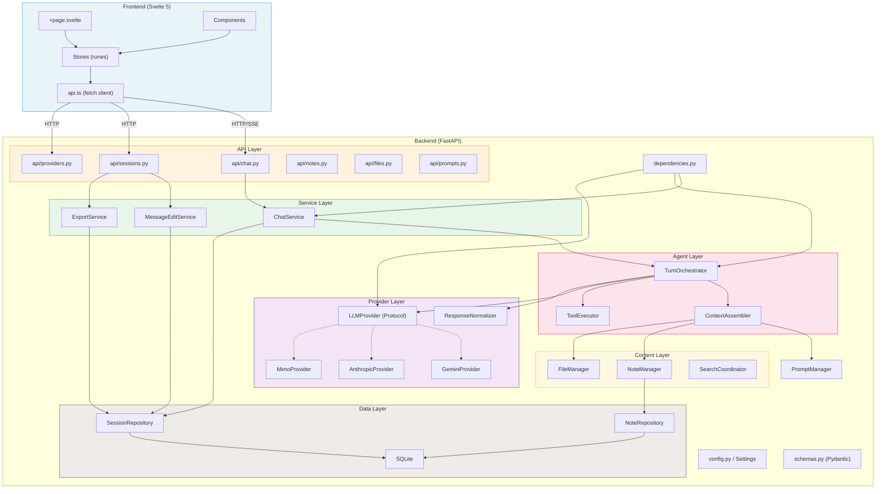
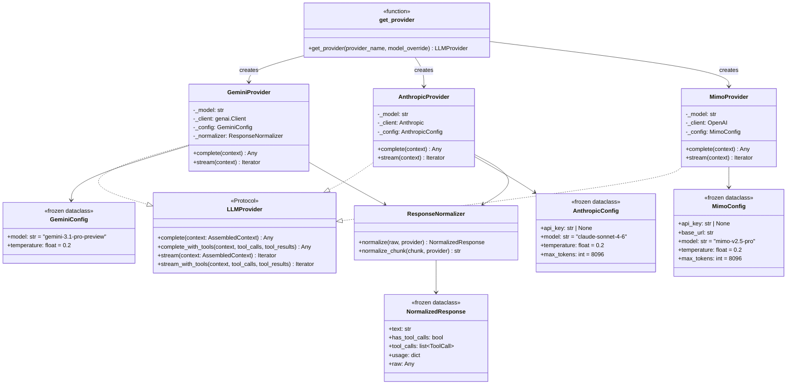
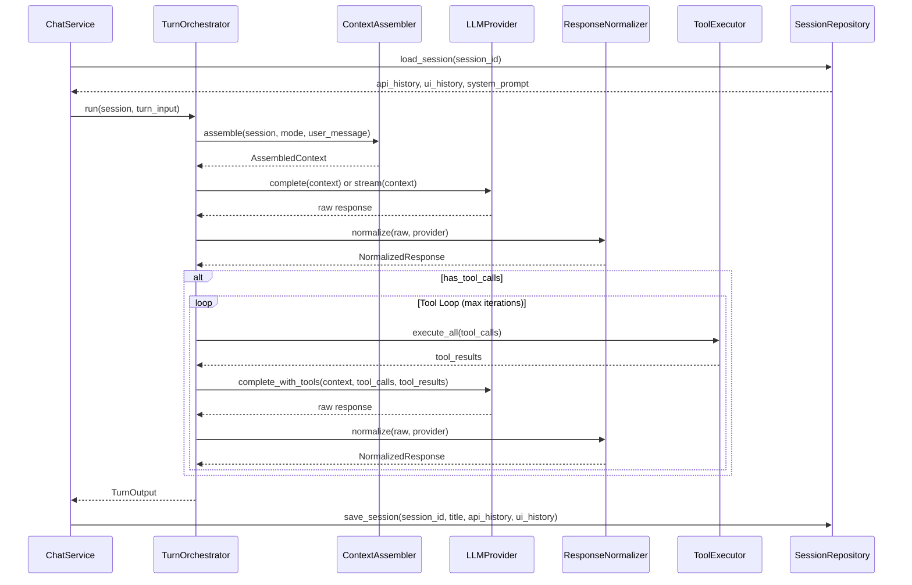
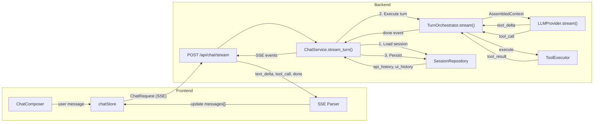
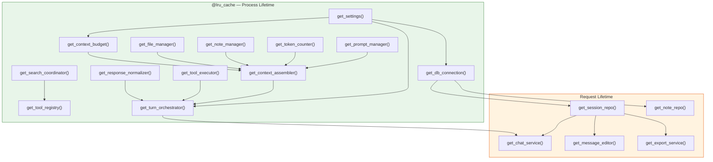

# Kitchen Agent — Architecture Diagrams

Mermaid diagrams documenting the system architecture. Render in GitHub,
GitLab, Obsidian, or any Mermaid-compatible Markdown viewer.

---

## 1. High-Level Architecture Overview

---

## 2. Provider System

---

## 3. Agent Layer — Turn Lifecycle

---

## 4. Chat Request Data Flow

---

## 5. Frontend Store Topology

```mermaid
graph TB
    subgraph Stores["Svelte 5 Rune Stores — chatStore split into 5 focused stores"]
        ChatStore["chatStore (facade)<br/><i>chat.svelte.ts</i><br/>470 lines — session, messaging"]
        ProviderStore["providerStore<br/><i>provider.svelte.ts</i><br/>120 lines — provider/model, app info"]
        PromptStore["promptStore<br/><i>prompt.svelte.ts</i><br/>130 lines — modes, tools, inspector"]
        EditorStore["editorStore<br/><i>editor.svelte.ts</i><br/>240 lines — message & prompt editing"]
        TokenStore["tokenStore<br/><i>token.svelte.ts</i><br/>110 lines — token counting"]
        SessionStore["sessionStore<br/><i>sessions.svelte.ts</i><br/>158 lines"]
        NotesStore["notesStore<br/><i>notes.svelte.ts</i><br/>106 lines"]
    end

    subgraph ChatState["chatStore owns (core only)"]
        CS_Session["sessionId, messages"]
        CS_Async["chatState (AsyncState)"]
        CS_Images["pastedImages"]
        CS_Context["contextFiles"]
    end

    subgraph ProviderState["providerStore owns"]
        PS_Providers["providers (catalog)"]
        PS_Selected["selectedProvider, selectedModel"]
        PS_App["appTitle, appDescription"]
    end

    subgraph PromptState["promptStore owns"]
        PR_Mode["selectedModeId, modesState"]
        PR_Tools["toolsEnabled"]
        PR_Inspector["promptDetail*, inspectorOpen"]
    end

    subgraph EditorState["editorStore owns"]
        ES_Edit["editingTurnId, editDraft, editState"]
        ES_System["sessionSystemPrompt (loaded on session switch)"]
    end

    subgraph TokenState["tokenStore owns"]
        TS_Count["sessionTokenCount, fallback"]
        TS_Cache["contextFileTokenEstimate, systemPromptText"]
    end

    subgraph SessionState["sessionStore owns"]
        SS_Tree["tree (SessionNode[])"]
        SS_Flat["flat (derived)"]
        SS_Active["activeId"]
    end

    subgraph NotesState["notesStore owns"]
        NS_BySession["bySession (Record&lt;string, Note[]&gt;)"]
        NS_Fetch["fetchStates"]
    end

    subgraph Consumers["Component Consumers"]
        Page["+page.svelte"]
        ChatComposer["ChatComposer"]
        TokenIndicator["TokenIndicator"]
        SessionTree["SessionTree"]
        NotePopup["NotePopup"]
        NotesPanel["NotesPanel"]
    end

    %% Facade pattern — consumers import chatStore, it delegates
    ChatStore -->|"delegates"| ProviderStore
    ChatStore -->|"delegates"| PromptStore
    ChatStore -->|"delegates"| EditorStore
    ChatStore -->|"delegates"| TokenStore
    ChatStore -->|"refresh after mutations"| SessionStore

    %% Consumer reads
    Page -->|"reads all getters"| ChatStore
    Page -->|"loadSession, startNewChat"| ChatStore
    Page -->|"refresh, setActive"| SessionStore

    ChatComposer -->|"providers, selectedProvider"| ChatStore
    ChatComposer -->|"sendMessage, addPastedImage"| ChatStore

    TokenIndicator -->|"sessionTokenCount, estimateInputTokensFor()"| ChatStore

    SessionTree -->|"tree, activeId"| SessionStore

    NotePopup -->|"create, delete"| NotesStore
    NotesPanel -->|"forSession(), load()"| NotesStore

    style ChatStore fill:#e3f2fd,stroke:#1565C0
    style ProviderStore fill:#f3e5f5,stroke:#9C27B0
    style PromptStore fill:#fce4ec,stroke:#E91E63
    style EditorStore fill:#fff8e1,stroke:#FFC107
    style TokenStore fill:#e8f5e9,stroke:#2E7D32
    style SessionStore fill:#e8f5e9,stroke:#2E7D32
    style NotesStore fill:#fff3e0,stroke:#E65100
```

---

## 6. Dependency Injection Graph

---

## Diagram Maintenance

When the architecture changes:

1. **Adding a new provider** → Update Diagram 2 (Provider System)
2. **Adding a new API endpoint** → Update Diagram 1 (High-Level) and Diagram 4 (Data Flow)
3. **Changing turn orchestration** → Update Diagram 3 (Agent Layer)
4. **Adding a new store** → Update Diagram 5 (Store Topology). chatStore is now a facade; sub-stores are providerStore, promptStore, editorStore, tokenStore
5. **Adding a new DI dependency** → Update Diagram 6 (DI Graph)
