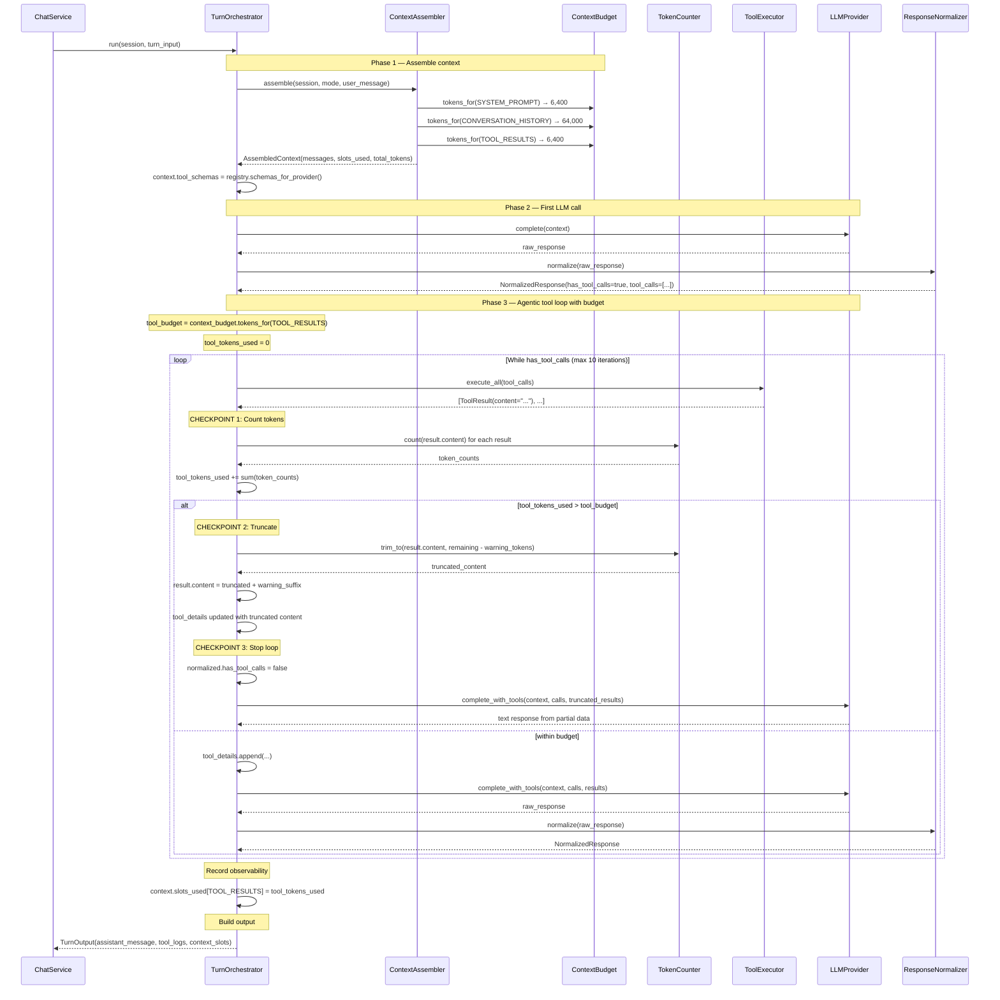
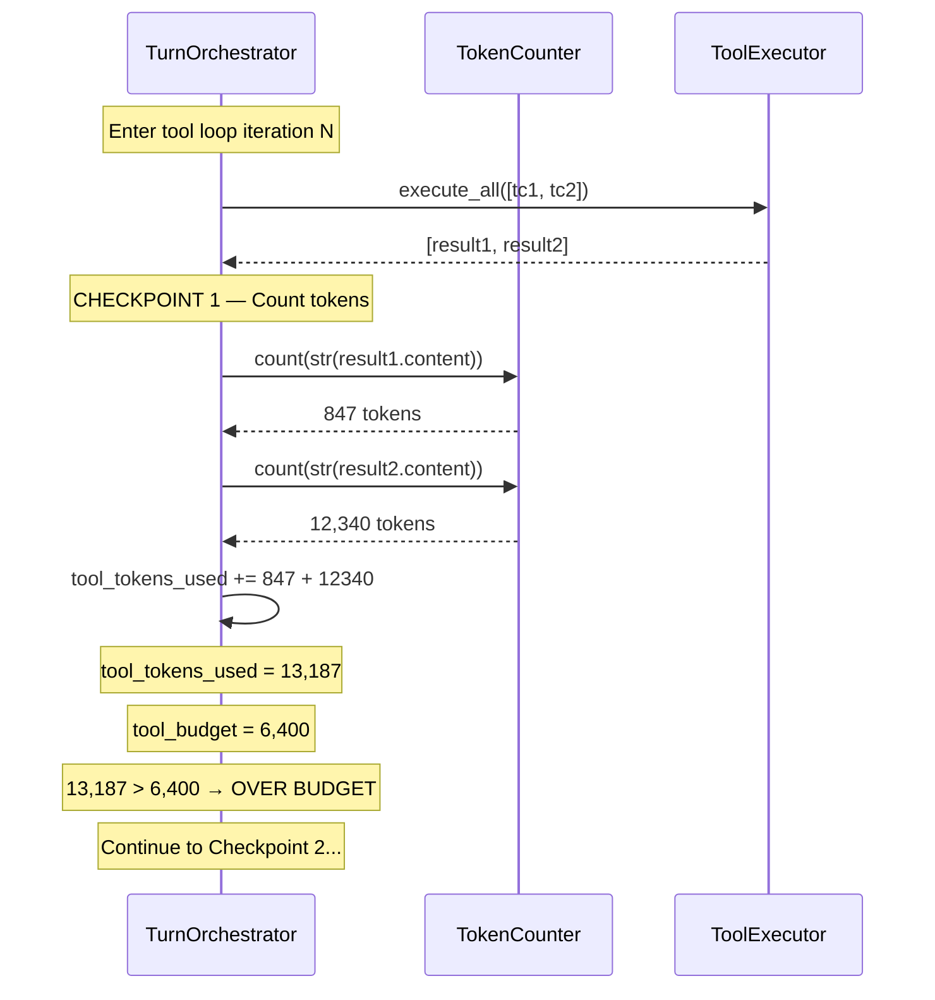
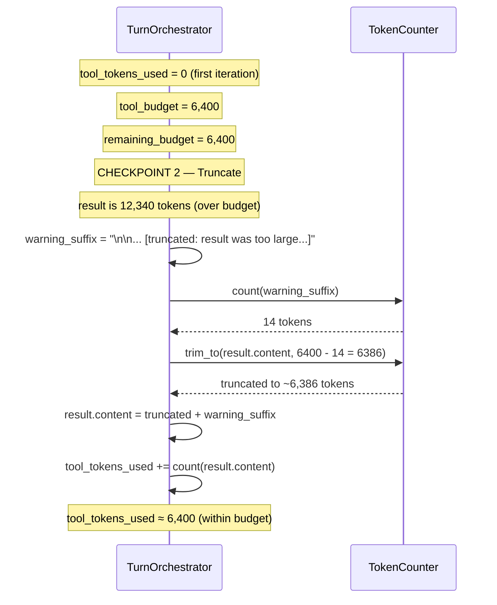
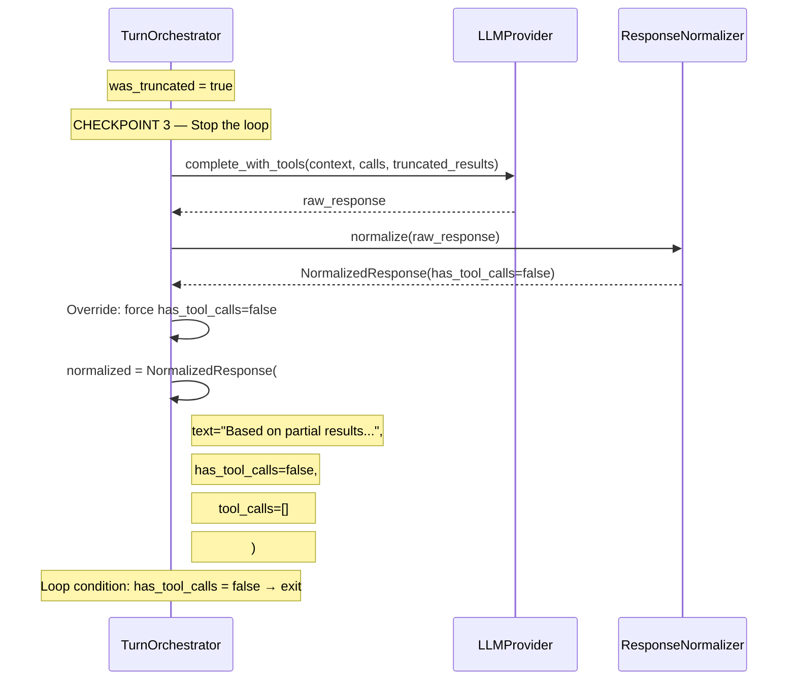

# F01 — Token Budget Enforcement in Tool Loop

Implementation specification. Documents how token budget enforcement works
in the agentic tool loop to prevent context window overflow from large tool
results.

**Status:** Implemented
**Commit:** `9f79161`
**Tests:** 12 tests in `tests/unit/agent/test_token_budget.py`

---

## Overview

The agentic tool loop counts tokens after each tool execution. When
accumulated tool results exceed the budget (from `ContextBudget.TOOL_RESULTS`),
the current result is truncated with a warning and the loop stops. The LLM
produces a best-effort response from the partial results it has.

---

## Sequence Diagram — Full Flow



---

## The Three Checkpoints

| #   | Where                         | What                                              | Effect                                      |
| --- | ----------------------------- | ------------------------------------------------- | ------------------------------------------- |
| 1   | After `_execute_tool_calls()` | `TC.count(result.content)` per result             | Accumulates `tool_tokens_used`              |
| 2   | When budget exceeded          | `TC.trim_to(content, remaining - warning_tokens)` | Truncates result, appends warning           |
| 3   | When budget exceeded          | `normalized.has_tool_calls = false`               | Stops loop — LLM responds from partial data |

---

## Detailed Sequence — Checkpoint 1 (Token Counting)



---

## Detailed Sequence — Checkpoint 2 (Truncation)



---

## Detailed Sequence — Checkpoint 3 (Loop Exit)



---

## Budget Source

Budget comes from `ContextBudget.tokens_for(ContextSlot.TOOL_RESULTS)`:

```python
# context_assembler.py
ContextSlot.TOOL_RESULTS: 0.05,  # 5% of total context
```

At 128K context = **6,400 tokens** for tool results.

| Slot                 | Allocation | Tokens (128K) | Rationale                     |
| -------------------- | ---------- | ------------- | ----------------------------- |
| SYSTEM_PROMPT        | 5%         | 6,400         | Fixed — prompt mode           |
| CONVERSATION_HISTORY | 50%        | 64,000        | Main context — most important |
| ATTACHED_NOTES       | 15%        | 19,200        | User-attached content         |
| ATTACHED_FILES       | 15%        | 19,200        | User-attached content         |
| SEARCH_RESULTS       | 10%        | 12,800        | Search tool results           |
| TOOL_RESULTS         | 5%         | 6,400         | Agent tool loop results       |

The 5% is a _budget cap_, not a target. Most tool iterations use far less.

---

## Implementation Details

### Where counting happens

Tokens are counted **in the orchestrator**, not in `ToolExecutor`. This
keeps `ToolExecutor` ignorant of token budgets — it only needs
`ToolRegistryProtocol`.

```python
# In TurnOrchestrator._count_and_truncate_tool_results():
for tr in tool_results:
    tokens = self._token_counter.count(tr.content)
    remaining_budget = tool_budget_tokens - tool_tokens_used

    if tokens > remaining_budget and remaining_budget > 0:
        truncate_budget = max(0, remaining_budget - warning_tokens)
        tr.content = self._token_counter.trim_to(tr.content, truncate_budget)
        tr.content += warning_suffix
        ...
```

### Truncation strategy

**Truncate + warn.** When a result exceeds remaining budget:

1. Reserve space for warning text (`warning_tokens`)
2. Truncate content to `remaining_budget - warning_tokens`
3. Append warning suffix: `"... [truncated: result was too large for context budget. Ask a more specific question or narrow your search.]"`
4. Stop the loop — LLM produces response from partial results

### What gets truncated

The raw `ToolResult.content` string (a stringified dict). This is
tool-agnostic — no knowledge of the tool's output format is needed.

### What the LLM sees

The truncated tool result with a clear warning:

```
{'content': '=== data/hinges.md ===
>> 5: Blum hinges are high-quality...
>> 12: For Blum CLIP top, use 71B3...

... [truncated: result was too large for context budget. Ask a more specific question or narrow your search.]'}
```

### Observability

After the tool loop, `context.slots_used[ContextSlot.TOOL_RESULTS]` is
populated with the actual token count used. This appears in `TurnOutput`
for logging and debugging.

---

## What Changed

| Component                                             | Change                                                     | Lines |
| ----------------------------------------------------- | ---------------------------------------------------------- | ----- |
| `TurnOrchestrator.__init__`                           | Added `token_counter` and `context_budget` optional params | +4    |
| `TurnOrchestrator._get_tool_budget_tokens()`          | New method — reads budget from `ContextBudget`             | +5    |
| `TurnOrchestrator._count_and_truncate_tool_results()` | New method — counts, truncates, warns                      | +35   |
| `TurnOrchestrator.run()`                              | Budget check after `_execute_tool_calls()`                 | +30   |
| `TurnOrchestrator.stream()`                           | Same budget check in streaming path                        | +35   |
| `dependencies.py`                                     | Inject `token_counter` and `context_budget`                | +2    |
| `ToolResult`                                          | **No change**                                              | 0     |
| `ToolExecutor`                                        | **No change**                                              | 0     |
| `ContextAssembler`                                    | **No change**                                              | 0     |

---

## Design Decisions

| #   | Decision            | Choice                       | Rationale                                            |
| --- | ------------------- | ---------------------------- | ---------------------------------------------------- |
| 1   | Truncation strategy | Truncate + warn              | LLM can adapt strategy; warning is ~14 tokens        |
| 2   | Where to count      | In Orchestrator              | Keeps `ToolExecutor` clean, orchestrator owns policy |
| 3   | Budget source       | `ContextBudget.TOOL_RESULTS` | Already defined at 5%, configurable                  |
| 4   | What to truncate    | Raw content string           | Tool-agnostic, no format knowledge needed            |
| 5   | Warning text        | In tool result content       | LLM sees it as part of the tool output               |
| 6   | Metric tracking     | `slots_used[TOOL_RESULTS]`   | Observability via existing `context_slots`           |

---

## Token Counting Accuracy

`ToolResult.content` is a `str(dict)`. Token counting on this string is
an approximation because providers re-serialize differently:

| Provider  | How content is used                             | Accuracy |
| --------- | ----------------------------------------------- | -------- |
| Gemini    | `FunctionResponse(response=dict)` — parsed back | ±10%     |
| Anthropic | `tool_result.content=str` — stays as string     | Exact    |
| Mimo      | `tool.content=str` — stays as string            | Exact    |

±10% is acceptable — we're preventing runaway, not optimizing.

---

## Edge Cases

| Case                              | Behavior                                         |
| --------------------------------- | ------------------------------------------------ |
| No `token_counter` injected       | Budget enforcement skipped (backward compatible) |
| No `context_budget` injected      | Budget enforcement skipped (backward compatible) |
| Single result 3x over budget      | Truncated to fit, loop stops                     |
| Two results, together over budget | First passes, second truncated, loop stops       |
| All results within budget         | No truncation, loop continues normally           |
| Budget set to 0                   | First result truncated immediately               |
| `use_tools=False`                 | Budget code never reached (tools not executed)   |

---

## Tests

12 tests in `tests/unit/agent/test_token_budget.py`:

| Class                             | Test                                        | Verifies                             |
| --------------------------------- | ------------------------------------------- | ------------------------------------ |
| `TestTokenCountingAfterExecution` | `test_tool_tokens_counted_in_output`        | `TOOL_RESULTS` slot populated        |
|                                   | `test_multiple_tool_calls_tokens_summed`    | Multiple results summed              |
| `TestTruncationWhenOverBudget`    | `test_large_result_truncated`               | Content truncated with marker        |
|                                   | `test_truncation_preserves_budget_boundary` | Fits within budget after truncation  |
| `TestWarningMessageOnTruncation`  | `test_warning_appended_to_tool_result`      | Warning in tool result content       |
| `TestLoopTerminationOnBudget`     | `test_loop_stops_when_budget_exceeded`      | Second call blocked                  |
|                                   | `test_loop_continues_when_within_budget`    | Both calls proceed                   |
| `TestNormalOperationUnaffected`   | `test_text_only_response_unchanged`         | No tools = no change                 |
|                                   | `test_small_tool_result_unchanged`          | Small results untruncated            |
| `TestTokenAccumulation`           | `test_accumulated_tokens_across_iterations` | Tokens accumulate                    |
| `TestBudgetSource`                | `test_budget_respects_allocation`           | Custom 10% allocation works          |
|                                   | `test_small_budget_triggers_truncation`     | 1% budget truncates moderate content |
