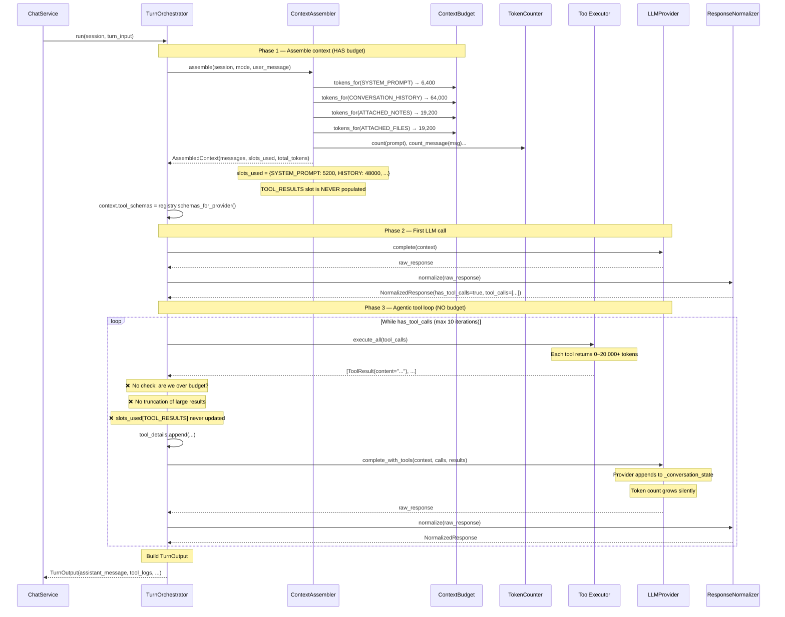
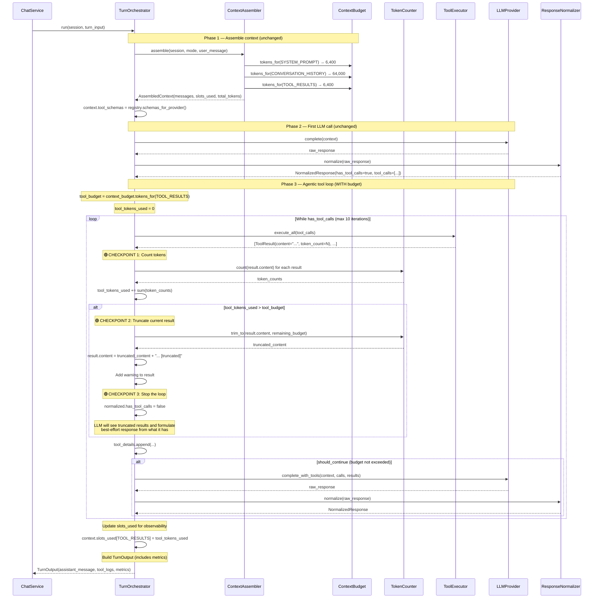
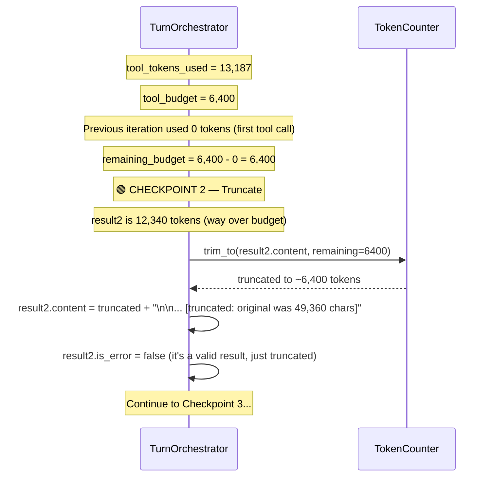
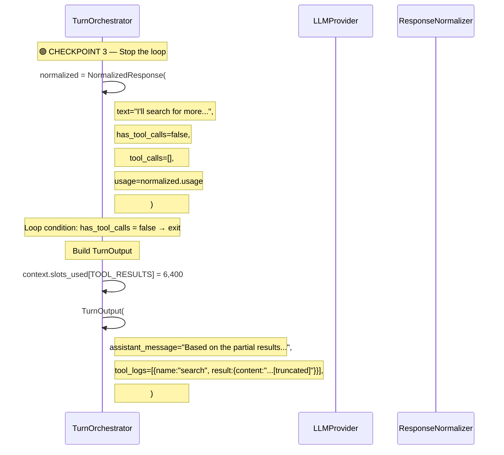
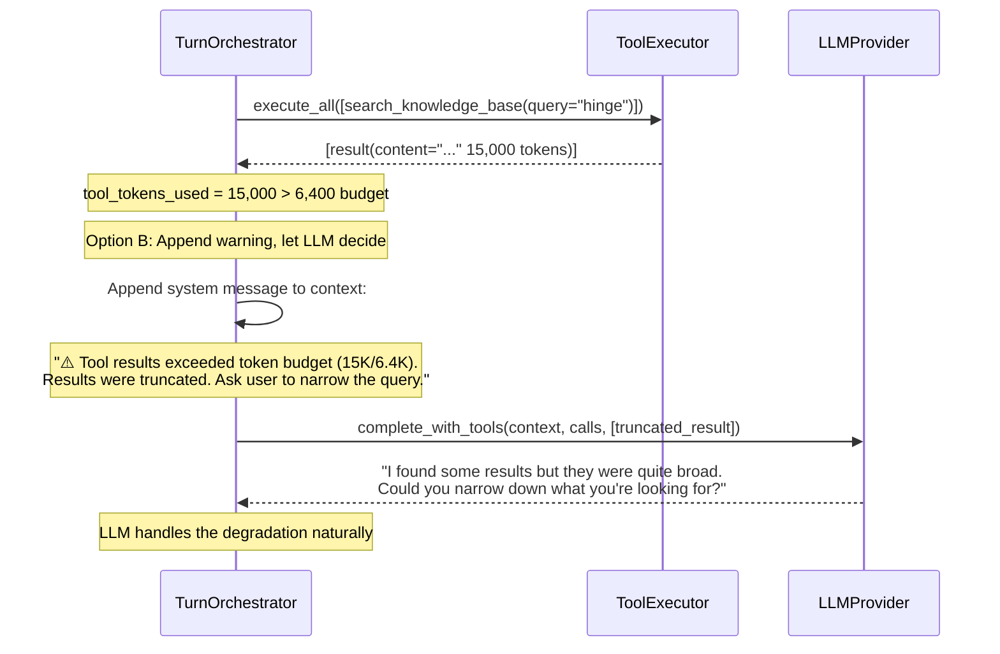

# F01 — Token Budget Enforcement in Tool Loop

Feature design document. Mermaid diagrams showing current vs proposed flow,
followed by analysis of how natural the proposed sequence is.

---

## Current Flow — No Token Budget

The tool loop has no awareness of token consumption. Tool results accumulate
in the provider's `_conversation_state` without any size check.



### What's wrong

| Problem                                                                    | Impact                                                 |
| -------------------------------------------------------------------------- | ------------------------------------------------------ |
| `search_knowledge_base` returns up to 200 matches, each with context lines | Can easily exceed 15,000 tokens per call               |
| 3 tool iterations × 15K tokens = 45K tokens of tool results alone          | Blows past the 5% budget (6,400 tokens)                |
| LLM receives bloated context with redundant tool results                   | Wastes input tokens, increases latency, increases cost |
| Model may lose track of the original question in the noise                 | Degrades response quality                              |
| No way to observe or debug tool token usage                                | Can't optimize without data                            |

---

## Proposed Flow — With Token Budget Enforcement

Three insertion points (marked with 🟢). Each is small and independent.



### The three checkpoints

| #    | Where                         | What                                    | Effect                                                     |
| ---- | ----------------------------- | --------------------------------------- | ---------------------------------------------------------- |
| 🟢 1 | After `_execute_tool_calls()` | `TC.count(result.content)` per result   | Observability — populates `tool_tokens_used`               |
| 🟢 2 | When budget exceeded          | `TC.trim_to(result.content, remaining)` | Truncates the _current_ result to fit remaining budget     |
| 🟢 3 | When budget exceeded          | `normalized.has_tool_calls = false`     | Breaks the loop — LLM formulates response from what it has |

---

## Detailed Sequence — Checkpoint 1 (Token Counting)


---

## Detailed Sequence — Checkpoint 2 (Truncation)



---

## Detailed Sequence — Checkpoint 3 (Loop Exit)



---

## Alternative: Graceful Degradation (No Truncation)

Instead of truncating mid-result, we can **warn the LLM and let it decide**.



### Which approach is more natural?

| Approach                     | Pros                                           | Cons                                             |
| ---------------------------- | ---------------------------------------------- | ------------------------------------------------ |
| **Truncate + stop loop**     | Deterministic, bounded, predictable cost       | LLM may not know results were truncated          |
| **Truncate + warn LLM**      | LLM can adapt its strategy                     | Adds a message to context, slightly more complex |
| **Truncate + continue loop** | LLM gets partial results and can ask follow-up | May waste iterations on incomplete data          |

**Recommendation:** Truncate + warn LLM. The warning message is cheap
(~50 tokens) and lets the model adapt. If the model asks a follow-up
tool call, it will be a _narrower_ query that fits within budget.

---

## Where Budget Comes From

The `ContextBudget` already defines this:

```python
# context_assembler.py line 73
ContextSlot.TOOL_RESULTS: 0.05,  # 5% of total context
```

At 128K context = **6,400 tokens** for tool results.

This is intentionally conservative. The reasoning:

| Slot                 | Allocation | Tokens (128K) | Rationale                     |
| -------------------- | ---------- | ------------- | ----------------------------- |
| SYSTEM_PROMPT        | 5%         | 6,400         | Fixed — prompt mode           |
| CONVERSATION_HISTORY | 50%        | 64,000        | Main context — most important |
| ATTACHED_NOTES       | 15%        | 19,200        | User-attached content         |
| ATTACHED_FILES       | 15%        | 19,200        | User-attached content         |
| SEARCH_RESULTS       | 10%        | 12,800        | Search tool results           |
| TOOL_RESULTS         | 5%         | 6,400         | Agent tool loop results       |

The 5% is a _budget cap_, not a target. Most tool iterations will use
far less. The cap prevents runaway accumulation.

---

## Naturalness Analysis

### Is this sequence natural?

**Yes — with caveats.** Here's why:

#### ✅ Natural: Budget already exists but is unused

`ContextSlot.TOOL_RESULTS` is defined, allocated 5%, but never populated.
The orchestrator doesn't even import `ContextSlot`. The budget is _already
designed for this_ — we just need to enforce it.

#### ✅ Natural: TokenCounter already exists and is injected

`TokenCounterProtocol` has `count(text) -> int`. It's already a dependency
of `ContextAssembler`. Making it a dependency of `TurnOrchestrator` too is
a minor DI addition, not a new abstraction.

#### ✅ Natural: Truncation is a standard pattern

Anthropic's docs explicitly recommend truncating tool results when they
exceed context budget. The OpenAI Agents SDK does this automatically.
This is not a novel pattern — it's expected behavior.

#### ⚠️ Slightly awkward: Where to count

The `ToolResult.content` is a `str(dict)` — the stringified version of
the tool's return dict. Counting tokens on this string is an approximation
because the provider will re-serialize it differently:

- Gemini: `FunctionResponse(response=dict)` — the dict is parsed back
- Anthropic: `tool_result.content=str` — stays as string
- Mimo: `tool.content=str` — stays as string

Counting on the string form is good enough for budget enforcement (±10%).
Perfect accuracy isn't needed — we're preventing runaway, not optimizing.

#### ⚠️ Slightly awkward: Truncation point

When we truncate `result.content`, we're truncating the _stringified dict_.
This means the truncation might cut mid-key or mid-value. The LLM will
see something like:

```
{'content': '=== data/hinges.md ===\n>> 5: Blum hinges are high-quality...
>> 12: For Blum CLIP top, use 71B3...  ... [truncated: original was 49,360
```

This is... fine. The LLM can parse partial content. The alternative —
truncating at the _file level_ (dropping whole files from results) — would
require understanding the tool's output format, which violates the
tool-agnostic design.

#### ⚠️ Slightly awkward: Breaking the loop mid-iteration

When we set `normalized.has_tool_calls = false` mid-loop, we're
_overriding_ what the LLM said. The LLM asked for more tool calls,
but we're saying "no." This is a form of guardrail — the LLM doesn't
know about token budgets, so the orchestrator enforces them.

This is the same pattern as `max_tool_iterations` — a hard cap the LLM
doesn't see but benefits from. The warning message makes it transparent.

#### ❌ Not natural: ToolResult.token_count

Adding `token_count` to `ToolResult` means the `ToolExecutor` now needs
a `TokenCounter`. Currently it only needs a `ToolRegistryProtocol`. This
increases coupling.

**Alternative:** Count tokens in the orchestrator after execution, not in
the executor. The orchestrator already has access to `TokenCounter` (via
DI). This keeps `ToolExecutor` ignorant of token budgets.

```python
# In orchestrator, after _execute_tool_calls():
for tr in results:
    tokens = self._token_counter.count(tr.content)
    tool_tokens_used += tokens
```

This is cleaner — `ToolExecutor` stays focused on execution, orchestrator
handles budget policy.

---

## Revised Design — What Changes

| Component                   | Change                                                      | Lines affected |
| --------------------------- | ----------------------------------------------------------- | -------------- |
| `TurnOrchestrator.__init__` | Add `token_counter` + `context_budget` params               | 5 lines        |
| `TurnOrchestrator.run()`    | Add budget check after `_execute_tool_calls()`              | ~20 lines      |
| `TurnOrchestrator.stream()` | Same budget check                                           | ~20 lines      |
| `dependencies.py`           | Inject `token_counter` + `context_budget` into orchestrator | 2 lines        |
| `ToolResult`                | **No change** — keep as-is                                  | 0 lines        |
| `ToolExecutor`              | **No change** — keep as-is                                  | 0 lines        |
| `ContextAssembler`          | **No change** — budget already defined                      | 0 lines        |

Total: ~47 lines of new code, 0 changes to existing classes.

---

## Decision Points

Before coding, these decisions need to be made:

| #   | Question            | Options                                                 | Recommendation                             |
| --- | ------------------- | ------------------------------------------------------- | ------------------------------------------ |
| 1   | Truncation strategy | Truncate + stop / Truncate + warn / Truncate + continue | **Truncate + warn**                        |
| 2   | Where to count      | In ToolExecutor / In Orchestrator                       | **In Orchestrator** (keeps executor clean) |
| 3   | Budget source       | Hardcoded / From ContextBudget / From Settings          | **From ContextBudget** (already defined)   |
| 4   | What to truncate    | Raw content string / Parsed dict values                 | **Raw string** (tool-agnostic)             |
| 5   | Warning message     | Silent / Log only / Append to context                   | **Append to context** (LLM can adapt)      |
| 6   | Metric tracking     | No / Yes (tool_tokens_used in TurnOutput)               | **Yes** (observability)                    |
