# Kitchen Agent — Frontend Architecture Diagrams

Mermaid diagrams documenting the Svelte 5 frontend architecture.
Generated from `svelte-map` analysis, updated 2026-06-16.

---

## 1. Component Hierarchy

```mermaid
graph TB
    subgraph Routes["SvelteKit Routes"]
        Layout["+layout.svelte<br/>favicon, global head"]
        RootPage["+page.svelte<br/>redirect → /chat/{uuid}"]
        ChatPage["chat/[id]/+page.svelte<br/>402 lines — main orchestrator"]
    end

    subgraph ChatArea["Chat Area (left panel)"]
        ChatHeader["ChatHeader<br/>148 lines — title, mode badge"]
        ChatMessageList["ChatMessageList<br/>308 lines — scrollable messages"]
        ChatComposer["ChatComposer<br/>492 lines — input orchestrator"]
    end

    subgraph Sidebar["Sidebar (right panel)"]
        SessionTree["SessionTree<br/>271 lines — session forest + folders"]
        ContextSidebar["ContextSidebar<br/>188 lines — files + notes"]
    end

    subgraph ComposerSubs["Composer Sub-Components"]
        ModelSelector["ModelSelector<br/>118 lines — optgroup select"]
        TokenIndicator["TokenIndicator<br/>107 lines — token bar"]
    end

    subgraph MessageSubs["Message Sub-Components"]
        MessageActions["MessageActions<br/>306 lines — edit/delete/fork"]
        MessageEditor["MessageEditor<br/>94 lines — inline edit"]
        SystemPromptBubble["SystemPromptBubble<br/>255 lines — prompt display"]
        Markdown["Markdown<br/>49 lines — parsed markdown"]
    end

    subgraph SessionSubs["Session Sub-Components"]
        DraggableSession["DraggableSession<br/>54 lines — drag wrapper"]
        FolderTree["FolderTree<br/>127 lines — folder list + drop zones"]
        FolderItem["FolderItem<br/>210 lines — single folder + sessions"]
        SessionTreeNode["SessionTreeNode<br/>163 lines — recursive tree node"]
        SessionContextMenu["SessionContextMenu<br/>262 lines — right-click menu"]
        CreateFolderDialog["CreateFolderDialog<br/>161 lines — new folder modal"]
    end

    subgraph SidebarSubs["Sidebar Sub-Components"]
        NotesPanel["NotesPanel<br/>205 lines — notes list"]
        NotePopup["NotePopup<br/>136 lines — create note"]
        FileEditor["FileEditor<br/>116 lines — edit context file"]
    end

    subgraph Shared["Shared / Utility"]
        ConfirmDialog["ConfirmDialog<br/>81 lines — modal confirm"]
        ProviderPicker["ProviderPicker<br/>107 lines — provider select"]
    end

    %% Route hierarchy
    Layout --> RootPage
    Layout --> ChatPage

    %% Page composition
    ChatPage --> ChatHeader
    ChatPage --> ChatMessageList
    ChatPage --> ChatComposer
    ChatPage --> SessionTree
    ChatPage --> ContextSidebar
    ChatPage --> NotePopup

    %% Chat area composition
    ChatMessageList --> MessageActions
    ChatMessageList --> MessageEditor
    ChatMessageList --> SystemPromptBubble
    ChatMessageList --> Markdown
    ChatMessageList --> ConfirmDialog

    ChatComposer --> ModelSelector
    ChatComposer --> TokenIndicator

    %% Session tree composition
    SessionTree --> DraggableSession
    SessionTree --> FolderTree
    SessionTree --> SessionTreeNode
    FolderTree --> FolderItem
    FolderTree --> CreateFolderDialog
    SessionTreeNode --> SessionContextMenu

    %% Context sidebar composition
    ContextSidebar --> NotesPanel
    ContextSidebar --> FileEditor

    %% NotePopup is a portal (renders at page level)
    NotePopup -.->|"portal"| ChatPage

    style Routes fill:#e8f4f8,stroke:#2196F3
    style ChatArea fill:#e3f2fd,stroke:#1565C0
    style Sidebar fill:#fff3e0,stroke:#FF9800
    style ComposerSubs fill:#f3e5f5,stroke:#9C27B0
    style MessageSubs fill:#fce4ec,stroke:#E91E63
    style SessionSubs fill:#e8f5e9,stroke:#4CAF50
    style SidebarSubs fill:#fff8e1,stroke:#FFC107
    style Shared fill:#efebe9,stroke:#795548
```

---

## 2. Store Architecture

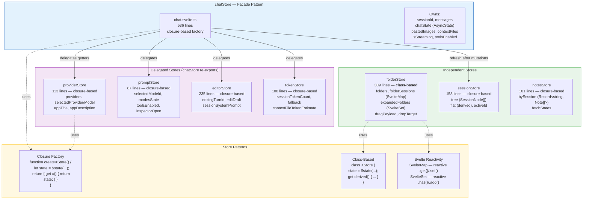

---

## 3. Store → Component Consumer Map

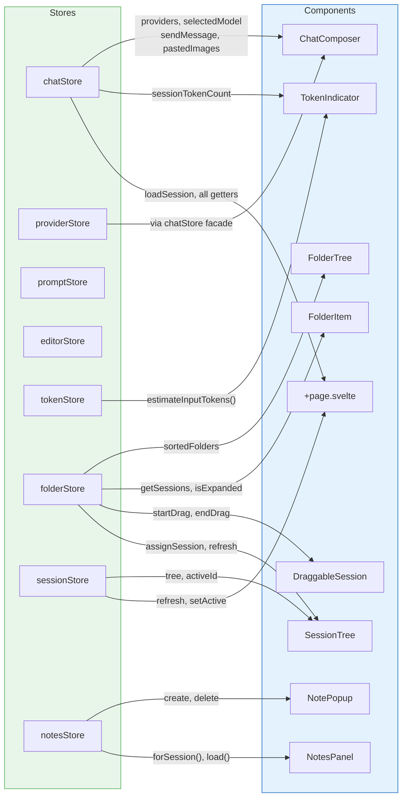

---

## 4. Chat Data Flow (Send → Stream → Display)

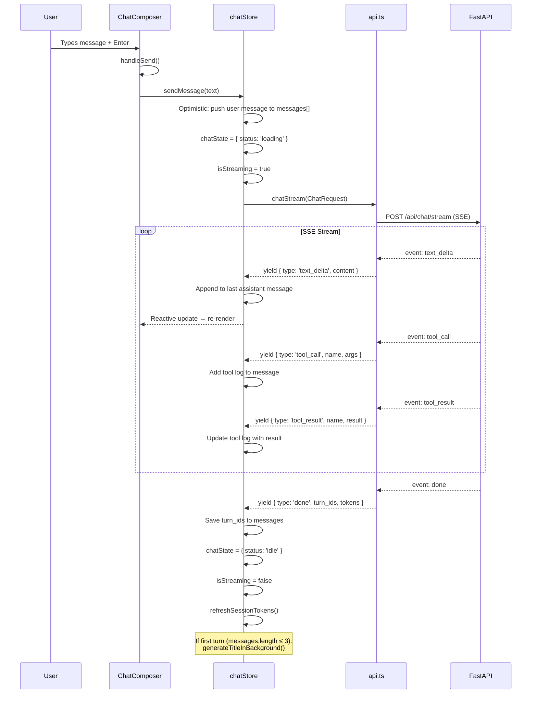

---

## 5. Sidebar Architecture (Sessions + Folders + Drag-Drop)

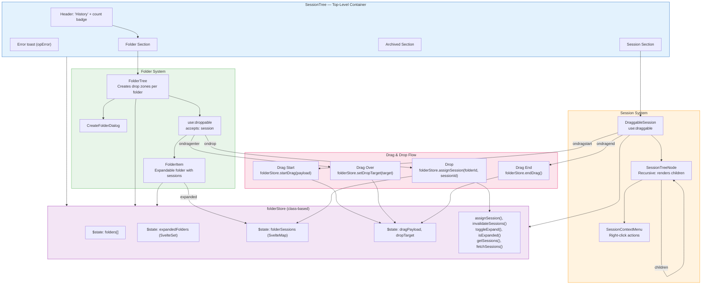

---

## 6. Svelte 5 Features Usage Map

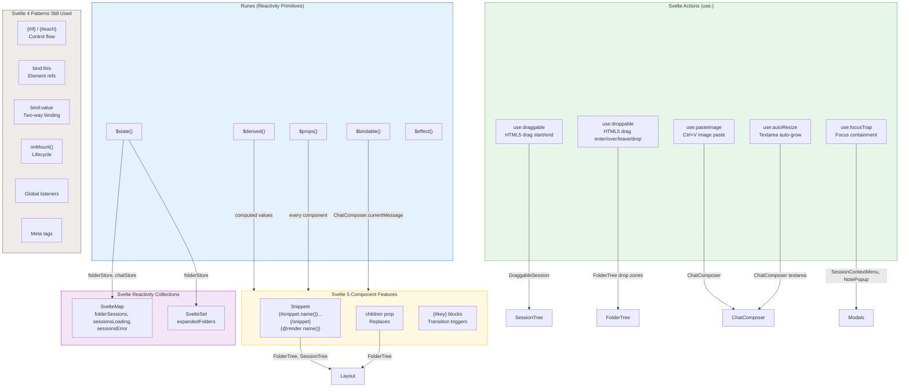

---

## 7. Route Structure & Navigation

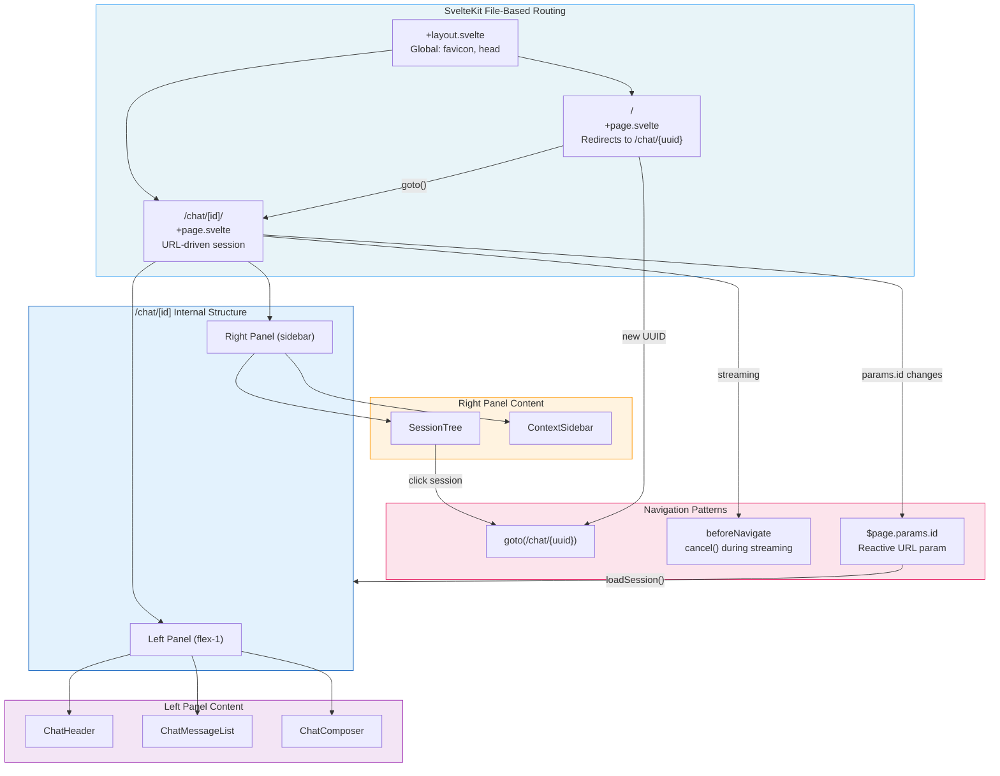

---

## 8. Component Responsibility Matrix

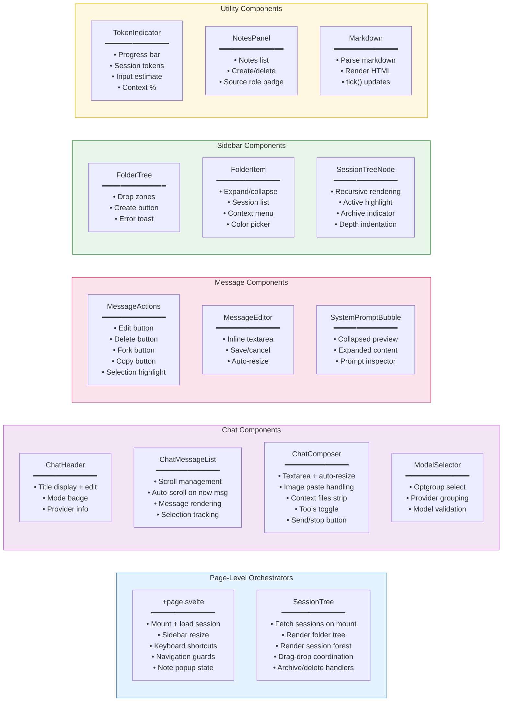

---

## 9. Hotspot Analysis (Import Frequency)

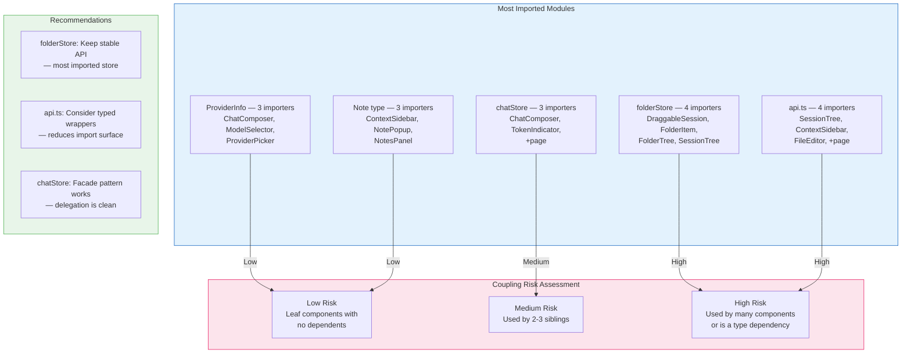

---

## 10. File Size Distribution

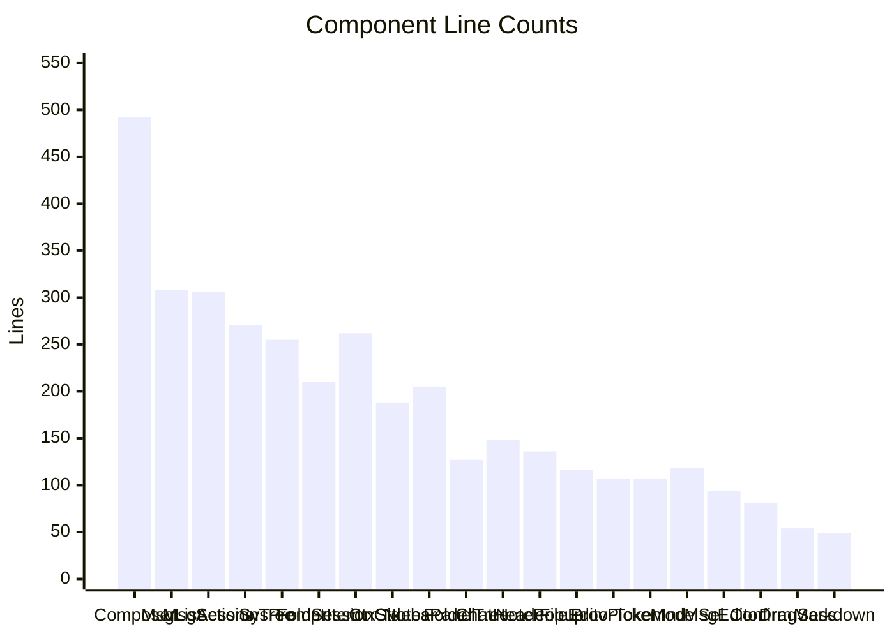

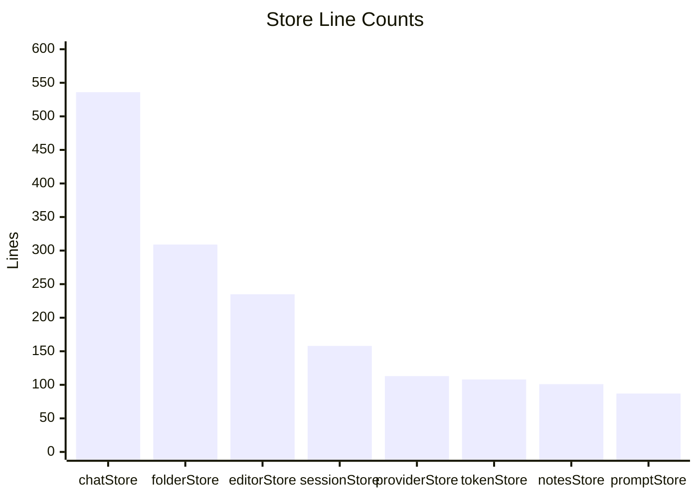

---

## 11. Shared Types Architecture

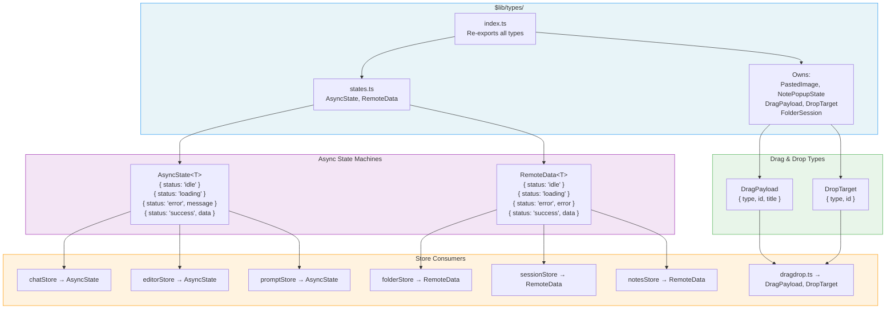

---

## Diagram Maintenance

| Change | Diagrams to Update |
|--------|-------------------|
| New component | 1 (Hierarchy), 8 (Responsibility), 10 (Size) |
| New store | 2 (Architecture), 3 (Consumer Map), 10 (Size) |
| New route | 7 (Routes) |
| New action (use:) | 6 (Svelte 5 Features) |
| New type | 11 (Shared Types) |
| Store refactor | 2 (Architecture), 3 (Consumer Map), 9 (Hotspots) |
| Component refactor | 1 (Hierarchy), 8 (Responsibility), 10 (Size) |
| Drag-drop changes | 5 (Sidebar Architecture) |
| Chat flow changes | 4 (Chat Data Flow) |

### Last Updated

| Date | Change | Diagrams |
|------|--------|----------|
| 2026-06-16 | Initial creation from svelte-map analysis | All (new) |
