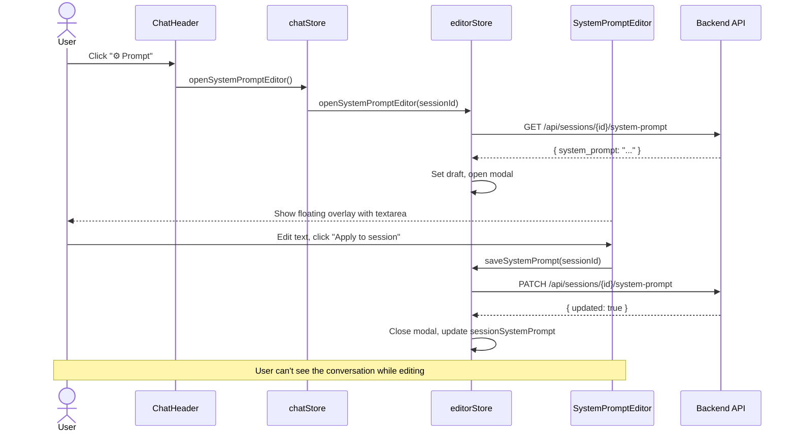
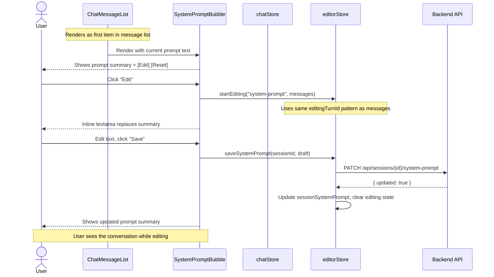

# Feature Spec: Inline System Prompt Editing

## Problem Statement

The current system prompt override uses a **floating modal popup**
(`SystemPromptEditor.svelte`) that:

- Requires a context switch — user leaves the chat flow
- Hides the conversation while editing — can't see what the prompt affects
- Uses a separate UX pattern from message editing — inconsistent
- Requires a header button to discover — low discoverability

## Goal

Replace the popup with an **inline system prompt bubble** rendered as
the first item in the chat message list. The user edits the prompt
in-place using the same UX as editing any other message.

---

## Current Flow (Popup)



---

## Proposed Flow (Inline Bubble)



---

## Component Design

### SystemPromptBubble.svelte

Renders the system prompt as a special message bubble at the top of
the chat list. Two states: **summary** and **editing**.

#### Summary State (default)

```
┌─────────────────────────────────────────────────────────────────┐
│ ⚙️ System Prompt (general mode)                  [Edit] [Reset] │
│                                                                 │
│ You are a kitchen design assistant. Help the user with their    │
│ projects, provide accurate measurements, and suggest materials… │
│                                                                 │
│ Session override active • click Edit to customize               │
└─────────────────────────────────────────────────────────────────┘
```

- Shows first ~200 chars of the prompt with "..." truncation
- "Edit" button → switches to editing state
- "Reset" button → clears override, reverts to mode default
- Badge shows if override is active or using mode default

#### Editing State

```
┌─────────────────────────────────────────────────────────────────┐
│ ⚙️ System Prompt (general mode)                       [Cancel]  │
│                                                                 │
│ ┌─────────────────────────────────────────────────────────────┐ │
│ │ You are a kitchen design assistant. Help the user with      │ │
│ │ their projects, provide accurate measurements, and suggest  │ │
│ │ materials. Always consider ergonomics and workflow...        │ │
│ │                                                             │ │
│ │ (textarea, resizable)                                       │ │
│ └─────────────────────────────────────────────────────────────┘ │
│                                                                 │
│ Leave empty to use mode default                                 │
│                                          [Save] [Clear Override] │
└─────────────────────────────────────────────────────────────────┘
```

- Full textarea (same styling as MessageEditor)
- "Save" → PATCH override to backend
- "Clear Override" → PATCH empty string (revert to mode default)
- "Cancel" → discard changes, return to summary state
- Escape key → cancel

---

## State Changes

### editorStore modifications

**Remove:**

- `systemPromptEditorOpen` — no longer needed (no modal)
- `systemPromptDraft` — replaced by inline draft

**Keep:**

- `sessionSystemPrompt` — the actual override value from DB
- `systemPromptState` — async state for loading/saving

**Add:**

- `systemPromptEditing` — boolean, true when inline editor is open
- `systemPromptDraft` — string, the inline edit draft (same name, different lifecycle)

### chatStore modifications

**Remove:**

- `systemPromptEditorOpen` getter
- `openSystemPromptEditor()` method
- `closeSystemPromptEditor()` method

**Keep:**

- `sessionSystemPrompt` getter (delegated to editorStore)
- `systemPromptDraft` getter (delegated to editorStore)
- `systemPromptState` getter (delegated to editorStore)
- `saveSystemPrompt()` method
- `clearSystemPrompt()` method

### +page.svelte modifications

**Remove:**

- `SystemPromptEditor` import
- `{#if chatStore.systemPromptEditorOpen}` block
- `hasSystemPromptOverride` derived
- `isSystemPromptLoading` derived
- `systemPromptError` derived

**Keep:**

- `ChatHeader` still shows the ⚡ badge (visual indicator)

### ChatHeader.svelte modifications

**Remove:**

- `hasSystemPromptOverride` prop
- `oneditprompt` prop
- "⚙️ Prompt" button

**Keep:**

- The ⚡ "Prompt override" badge (still useful as visual indicator)

### ChatMessageList.svelte modifications

**Add:**

- Import `SystemPromptBubble`
- Render as first item before `{#each messages}`

```svelte
<!-- System prompt bubble — always first -->
<SystemPromptBubble
    systemPrompt={chatStore.sessionSystemPrompt}
    draft={chatStore.systemPromptDraft}
    isEditing={chatStore.systemPromptEditing}
    isLoading={chatStore.systemPromptState.status === 'loading'}
    errorMessage={...}
    modeId={chatStore.selectedModeId}
    onedit={() => chatStore.startEditingSystemPrompt()}
    oncancel={() => chatStore.cancelEditingSystemPrompt()}
    onsave={() => chatStore.saveSystemPrompt()}
    onclear={() => chatStore.clearSystemPrompt()}
    ondraftchange={(text) => chatStore.setSystemPromptDraft(text)}
/>

<!-- Regular messages -->
{#each messages as message, i (message.turn_id)}
    ...
{/each}
```

---

## API Contract (unchanged)

```
GET  /api/sessions/{id}/system-prompt
     → { session_id, system_prompt: string | null }

PATCH /api/sessions/{id}/system-prompt
     Body: { system_prompt: string }
     → { updated: true }
     Empty string clears the override (reverts to mode default)
```

---

## Backend Resolution (unchanged)

```python
# In chat_service.py — _load_session()
system_prompt = request.system_prompt or saved_system_prompt

# Priority:
#   1. request.system_prompt (explicit per-request override)
#   2. saved_system_prompt (DB session override)
#   3. PromptManager.get_system_instruction(mode_id) (mode default)
```

---

## Migration Path

1. Create `SystemPromptBubble.svelte` component
2. Add inline editing state to `editorStore` (`systemPromptEditing`)
3. Wire bubble into `ChatMessageList.svelte`
4. Remove `SystemPromptEditor.svelte` and modal wiring
5. Simplify `ChatHeader.svelte` (remove edit button)
6. Update `+page.svelte` (remove modal block)
7. Update `editorStore` (remove `systemPromptEditorOpen`)

---

## Testing

- E2E: Verify system prompt loads on session switch
- E2E: Verify inline edit → save → prompt persists
- E2E: Verify clear override → reverts to mode default
- E2E: Verify escape key cancels editing
- Unit: Verify `editorStore.startEditingSystemPrompt()` sets draft from `sessionSystemPrompt`
- Unit: Verify `editorStore.saveSystemPrompt()` calls API and updates state
