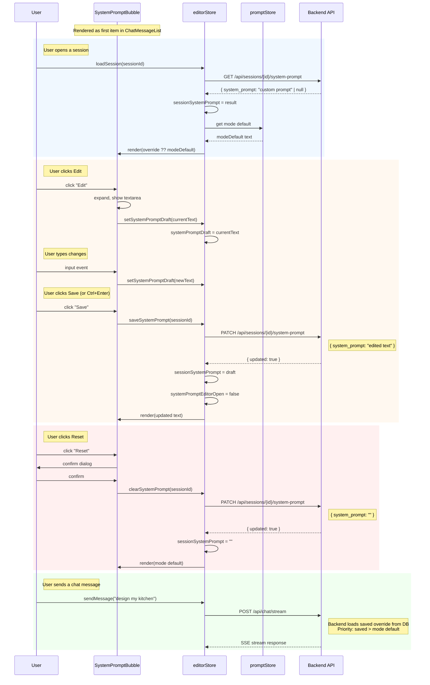

# System Prompt Bubble — Feature Specification

## Overview

The system prompt is displayed as a special message bubble at the top of the
chat conversation. It shows the active system instruction for the current
session and can be edited inline, using the same UX pattern as editing any
other chat message.

---

## Visual Design

```
┌─────────────────────────────────────────────────────────────────────────────┐
│  Chat Messages                                                              │
│                                                                             │
│  ┌─────────────────────────────────────────────────────────────────────┐    │
│  │ ⚙️ System Prompt                          [✏️ Edit] [🔄 Reset]     │    │
│  │─────────────────────────────────────────────────────────────────────│    │
│  │ You are a kitchen design assistant specializing in modern layouts.  │    │
│  │ Help the user plan their kitchen renovation with attention to...    │    │
│  │                                                                     │    │
│  │ mode: general • custom for this session                             │    │
│  └─────────────────────────────────────────────────────────────────────┘    │
│                                                                             │
│  ┌─────────────────────────────────────────────────────────────────────┐    │
│  │ 👤                                                                │    │
│  │ Design a modern kitchen with an island...                           │    │
│  └─────────────────────────────────────────────────────────────────────┘    │
│                                                                             │
│  ┌─────────────────────────────────────────────────────────────────────┐    │
│  │ 🤖                                                                │    │
│  │ Here's a modern kitchen design concept...                           │    │
│  └─────────────────────────────────────────────────────────────────────┘    │
└─────────────────────────────────────────────────────────────────────────────┘
```

### States

| State                          | Appearance                     | Actions                              |
| ------------------------------ | ------------------------------ | ------------------------------------ |
| **Default** (read-only)        | Collapsed to 3 lines with fade | `Edit`, `Reset` (if override active) |
| **Editing**                    | Full textarea, inline          | `Save`, `Cancel`                     |
| **Loading**                    | Skeleton pulse                 | None                                 |
| **Override active**            | Accent border-left highlight   | `Edit`, `Reset`                      |
| **No override** (mode default) | Muted style                    | `Edit`                               |

### Styling

- **Container**: `bg-panel/60 border border-line rounded-lg`
- **Override active**: `border-l-4 border-l-accent` (accent left stripe)
- **No override**: `border-l-4 border-l-line` (muted left stripe)
- **Label**: `text-xs font-semibold text-muted uppercase tracking-wide`
- **Content**: `text-sm text-ink font-mono` (monospace for prompt readability)
- **Metadata**: `text-xs text-muted` (mode name, override status)
- **Collapsed**: `max-h-[4.5rem] overflow-hidden` with bottom gradient fade

---

## Behavior

### 1. Display

- The system prompt bubble is always the **first item** in the message list
- It renders above all user/assistant messages
- Content is truncated to 3 lines by default (collapsed state)
- Clicking the content area expands to full height
- Clicking again collapses back to 3 lines

### 2. Edit Flow

```
User clicks "Edit"
    → Bubble switches to editing state
    → Textarea appears with current prompt text
    → User edits
    → User clicks "Save" or presses Ctrl+Enter
    → PATCH /api/sessions/{id}/system-prompt { system_prompt: "..." }
    → Bubble updates with new text, returns to default state
    → Badge in ChatHeader updates ("⚡ Prompt override")
```

### 3. Reset Flow

```
User clicks "Reset"
    → Confirm: "Revert to mode default?"
    → PATCH /api/sessions/{id}/system-prompt { system_prompt: "" }
    → Bubble shows mode-resolved default (read-only)
    → Override badge in ChatHeader disappears
```

### 4. Mode Change

```
User switches mode (e.g., general → design)
    → Bubble updates to show new mode's default prompt
    → If session had an override, it persists (override takes precedence)
    → Metadata line updates: "mode: design"
```

---

## Data Flow

### Load on Session Switch

```
chatStore.loadSession(sessionId)
    → editorStore.loadSystemPrompt(sessionId)
        → GET /api/sessions/{id}/system-prompt
        → Returns { system_prompt: string | null }
        → null = no override, use mode default
        → string = custom override for this session
    → promptStore loads modes (already done on mount)
    → Bubble resolves display text:
        override ?? modeDefault
```

### Resolve Display Text

```typescript
function resolveDisplayPrompt(
    sessionOverride: string | null,
    modeDefault: string
): { text: string; isOverride: boolean } {
    if (sessionOverride !== null && sessionOverride !== '') {
        return { text: sessionOverride, isOverride: true };
    }
    return { text: modeDefault, isOverride: false };
}
```

### Save Edit

```
User edits in textarea → local draft state
User clicks Save
    → PATCH /api/sessions/{id}/system-prompt { system_prompt: draft }
    → editorStore.sessionSystemPrompt = draft
    → Bubble re-renders with new text
    → Next chat send uses the new override
```

### Reset

```
User clicks Reset
    → PATCH /api/sessions/{id}/system-prompt { system_prompt: "" }
    → editorStore.sessionSystemPrompt = "" (empty = cleared)
    → Bubble shows mode default
```

---

## Sequence Diagram



---

## Component API

### SystemPromptBubble.svelte

```typescript
type Props = {
    /** Current system prompt text (resolved: override ?? modeDefault). */
    text: string;
    /** Whether the displayed text is a session-specific override. */
    isOverride: boolean;
    /** Current mode label (e.g., "general", "design"). */
    modeLabel: string;
    /** Whether a save/load operation is in progress. */
    isBusy: boolean;
    /** Error message from the last operation, or empty. */
    errorMessage: string;
    /** Called when user saves an edited prompt. */
    onsave: (newText: string) => void;
    /** Called when user resets to mode default. */
    onreset: () => void;
};
```

### Events

| Event     | Trigger                        | Payload            |
| --------- | ------------------------------ | ------------------ |
| `onsave`  | User clicks Save or Ctrl+Enter | Edited prompt text |
| `onreset` | User confirms Reset            | (none)             |

---

## Keyboard Shortcuts

| Key                        | Action                           |
| -------------------------- | -------------------------------- |
| `Ctrl+Enter` / `Cmd+Enter` | Save edit                        |
| `Escape`                   | Cancel edit, return to read-only |
| `Tab`                      | Insert 2 spaces in textarea      |

---

## Edge Cases

| Case                                | Behavior                                  |
| ----------------------------------- | ----------------------------------------- |
| Empty override, mode has default    | Show mode default, "Reset" hidden         |
| Empty override, mode has no default | Show "No system prompt set", Edit only    |
| Very long prompt (>500 chars)       | Collapse to 3 lines, click to expand      |
| Save fails (network error)          | Show error banner, keep draft in textarea |
| Session switch while editing        | Discard draft, load new session's prompt  |
| Mode change while override active   | Override persists, metadata updates       |

---

## Files to Create/Modify

| File                                                    | Action                                       |
| ------------------------------------------------------- | -------------------------------------------- |
| `frontend/src/lib/components/SystemPromptBubble.svelte` | **Create** — new component                   |
| `frontend/src/lib/components/ChatMessageList.svelte`    | **Modify** — render bubble as first item     |
| `frontend/src/lib/stores/editor.svelte.ts`              | **Modify** — add `loadSystemPrompt()` method |
| `frontend/src/lib/components/SystemPromptEditor.svelte` | **Delete** — replaced by bubble              |
| `frontend/src/routes/+page.svelte`                      | **Modify** — remove popup wiring             |
| `frontend/src/lib/components/ChatHeader.svelte`         | **Modify** — remove "⚙️ Prompt" button       |
