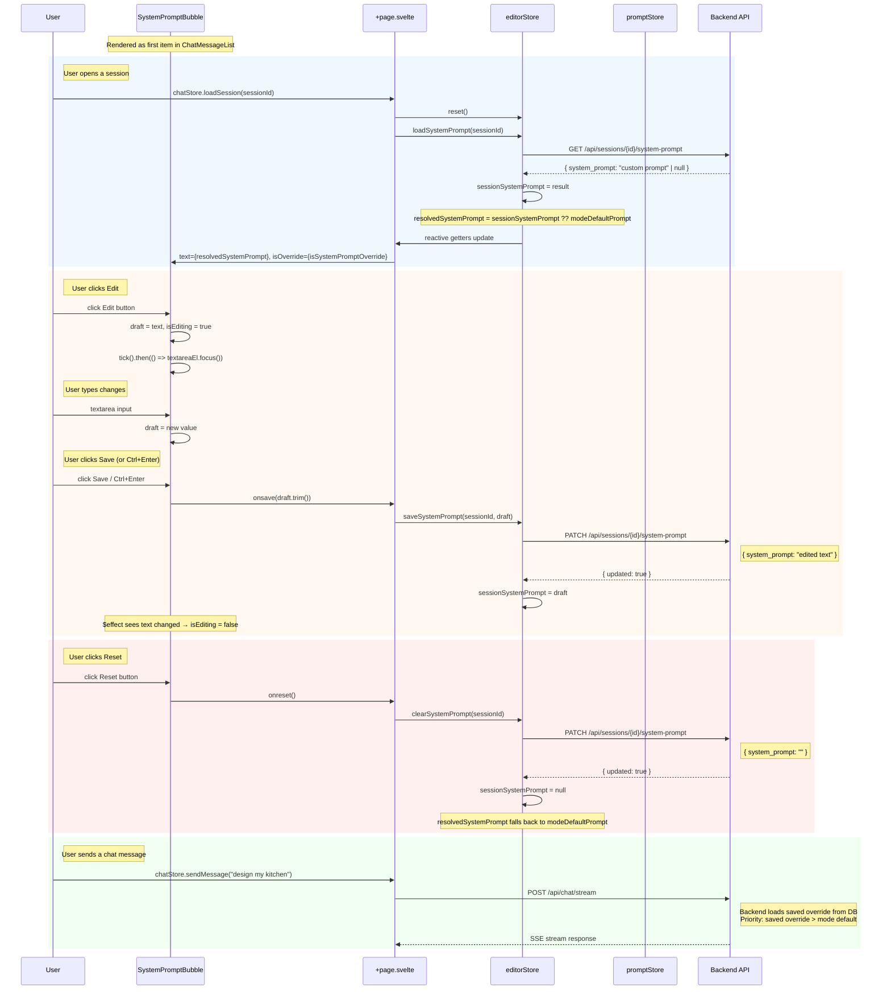

# System Prompt Bubble — Feature Specification

## Overview

The system prompt is displayed as a special message bubble at the top of the
chat conversation. It shows the active system instruction for the current
session and can be edited inline, using the same UX pattern as editing any
other chat message.

---

## Visual Design

```
┌─────────────────────────────────────────────────────────────────────────────┐
│  Chat Messages                                                              │
│                                                                             │
│  ┌─────────────────────────────────────────────────────────────────────┐    │
│  │ ⚙️ System Prompt                          [✏️ Edit] [🔄 Reset]     │    │
│  │─────────────────────────────────────────────────────────────────────│    │
│  │ You are a kitchen design assistant specializing in modern layouts.  │    │
│  │ Help the user plan their kitchen renovation with attention to...    │    │
│  │                                                                     │    │
│  │ general • custom                                                   │    │
│  └─────────────────────────────────────────────────────────────────────┘    │
│                                                                             │
│  ┌─────────────────────────────────────────────────────────────────────┐    │
│  │ 👤                                                                │    │
│  │ Design a modern kitchen with an island...                           │    │
│  └─────────────────────────────────────────────────────────────────────┘    │
│                                                                             │
│  ┌─────────────────────────────────────────────────────────────────────┐    │
│  │ 🤖                                                                │    │
│  │ Here's a modern kitchen design concept...                           │    │
│  └─────────────────────────────────────────────────────────────────────┘    │
└─────────────────────────────────────────────────────────────────────────────┘
```

### States

| State                          | Appearance                                   | Actions                              |
| ------------------------------ | -------------------------------------------- | ------------------------------------ |
| **Default** (read-only)        | Collapsed to ~300 chars with overflow hidden | `Edit`, `Reset` (if override active) |
| **Expanded** (read-only)       | Full height, "Show less" button              | `Edit`, `Reset` (if override active) |
| **Editing**                    | Full textarea, inline                        | `Save`, `Cancel`                     |
| **Override active**            | Accent border-left highlight                 | `Edit`, `Reset`                      |
| **No override** (mode default) | Muted left stripe                            | `Edit`                               |

### Styling

- **Container**: `rounded-lg border bg-panel/60 shadow-sm`
- **Override active**: `border-l-4 border-l-accent border-line` (accent left stripe)
- **No override**: `border-l-4 border-l-line border-line` (muted left stripe)
- **Header**: `flex items-center justify-between gap-2 border-b border-line px-4 py-2.5`
- **Label**: `text-xs font-semibold tracking-[0.14em] text-muted uppercase`
- **Content**: `whitespace-pre-wrap break-words font-mono text-xs leading-5 text-ink`
- **Collapsed**: `max-h-[4.5rem] overflow-hidden`
- **Action buttons**: 28×28px rounded, `text-muted` → `text-ink` on hover
- **Textarea**: `w-full resize-y rounded-md border border-accent bg-surface px-3 py-2 font-mono text-xs leading-5 text-ink`

---

## Behavior

### 1. Display

- The system prompt bubble is always the **first item** in the message list
- It renders above all user/assistant messages
- Content longer than 300 characters is truncated with `…` in collapsed state
- Clicking "Show more" expands to full height
- Clicking "Show less" collapses back

### 2. Edit Flow

```
User clicks "Edit"
    → Bubble switches to editing state
    → Textarea appears with current prompt text (via tick().then(focus))
    → User edits
    → User clicks "Save" or presses Ctrl+Enter
    → onsave(draft.trim()) callback fires
    → Parent (chatStore) calls editorStore.saveSystemPrompt(sessionId, text)
    → PATCH /api/sessions/{id}/system-prompt { system_prompt: "..." }
    → editorStore.sessionSystemPrompt = text
    → $effect resets isEditing = false when text changes
    → Badge in ChatHeader updates ("⚡ Prompt override")
```

### 3. Reset Flow

```
User clicks "Reset"
    → onreset() callback fires
    → Parent (chatStore) calls editorStore.clearSystemPrompt(sessionId)
    → PATCH /api/sessions/{id}/system-prompt { system_prompt: "" }
    → editorStore.sessionSystemPrompt = null
    → Bubble shows mode-resolved default (read-only)
    → Override badge in ChatHeader disappears
```

### 4. Mode Change

```
User switches mode (e.g., general → design)
    → chatStore.setSelectedModeId() calls editorStore.loadModeDefaultPrompt(modeId)
    → GET /api/prompts/modes/{mode_id}
    → editorStore.modeDefaultPrompt = detail.content
    → Bubble updates to show new mode's default prompt
    → If session had an override, it persists (override takes precedence)
```

---

## Data Flow

### Load on Session Switch

```
chatStore.loadSession(sessionId)
    → editorStore.reset()  // clears sessionSystemPrompt, draft, state
    → editorStore.loadSystemPrompt(sessionId)
        → GET /api/sessions/{id}/system-prompt
        → Returns { system_prompt: string | null }
        → null = no override, use mode default
        → string = custom override for this session
    → promptStore modes already loaded (done on mount)
    → editorStore.modeDefaultPrompt already populated
    → Bubble resolves display text via editorStore.resolvedSystemPrompt:
        sessionSystemPrompt ?? modeDefaultPrompt
```

### Resolve Display Text

```typescript
// In editorStore:
get resolvedSystemPrompt(): string {
    return sessionSystemPrompt ?? modeDefaultPrompt;
}

/**
 * Whether the displayed text is a session-specific override.
 * An override is only active when the saved prompt is non-null,
 * non-empty, AND differs from the mode default.
 */
get isSystemPromptOverride(): boolean {
    if (sessionSystemPrompt === null || sessionSystemPrompt === '') return false;
    return sessionSystemPrompt !== modeDefaultPrompt;
}
```

### Save Edit

```
User edits in textarea → local draft state (component-level $state)
User clicks Save
    → onsave(draft.trim()) callback
    → chatStore.saveSystemPrompt(text)
    → editorStore.saveSystemPrompt(sessionId, text)
        → PATCH /api/sessions/{id}/system-prompt { system_prompt: text }
        → sessionSystemPrompt = text
    → $effect in component resets isEditing = false
    → Next chat send uses the new override
```

### Reset

```
User clicks Reset
    → onreset() callback
    → chatStore.clearSystemPrompt()
    → editorStore.clearSystemPrompt(sessionId)
        → PATCH /api/sessions/{id}/system-prompt { system_prompt: "" }
        → sessionSystemPrompt = null
    → Bubble shows mode default via resolvedSystemPrompt
```

---

## Sequence Diagram



---

## Component API

### SystemPromptBubble.svelte

```typescript
type Props = {
    /** Current system prompt text (resolved: override ?? modeDefault). */
    text: string;
    /** Whether the displayed text is a session-specific override. */
    isOverride: boolean;
    /** Current mode label (e.g., "general", "design"). */
    modeLabel: string;
    /** Async state for loading/saving operations. */
    saveState: AsyncState<void>;
    /** Error message from the last operation, or empty. */
    errorMessage: string;
    /** Called when user saves an edited prompt. */
    onsave: (newText: string) => void;
    /** Called when user resets to mode default. */
    onreset: () => void;
};
```

### Local State (component-level)

```typescript
let isEditing = $state(false);
let isExpanded = $state(false);
let draft = $state('');
let textareaEl = $state<HTMLTextAreaElement | null>(null);
```

### Derived Values

```typescript
const isBusy = $derived(saveState.status === 'loading');
const isLong = $derived(text.length > 300);
const displayText = $derived(isExpanded || !isLong ? text : text.slice(0, 300) + '…');
```

### Events

| Event     | Trigger                        | Payload            |
| --------- | ------------------------------ | ------------------ |
| `onsave`  | User clicks Save or Ctrl+Enter | Edited prompt text |
| `onreset` | User clicks Reset              | (none)             |

---

## Keyboard Shortcuts

| Key                        | Action                           |
| -------------------------- | -------------------------------- |
| `Ctrl+Enter` / `Cmd+Enter` | Save edit                        |
| `Escape`                   | Cancel edit, return to read-only |

---

## Edge Cases

| Case                                | Behavior                                                  |
| ----------------------------------- | --------------------------------------------------------- |
| Empty override, mode has default    | Show mode default, "Reset" hidden                         |
| Empty override, mode has no default | Show "No system prompt set for this session.", Edit only  |
| Long prompt (>300 chars)            | Collapse with overflow hidden, "Show more" button appears |
| Save fails (network error)          | Error banner shown via errorMessage prop, draft preserved |
| Session switch while editing        | $effect resets isEditing on text change                   |
| Mode change while override active   | Override persists, modeDefaultPrompt updates              |

---

## Store Architecture

### editorStore (frontend/src/lib/stores/editor.svelte.ts)

```typescript
// State
sessionSystemPrompt    = $state<string | null>(null);
modeDefaultPrompt      = $state<string>('');
systemPromptState      = $state<AsyncState<void>>({ status: 'idle' });

// Getters
get resolvedSystemPrompt(): string        // sessionSystemPrompt ?? modeDefaultPrompt
get isSystemPromptOverride(): boolean     // true only when non-null, non-empty, AND differs from modeDefault
get systemPromptError(): string           // error message or ''

// Methods
async loadModeDefaultPrompt(modeId: string)     // GET /api/prompts/modes/{mode_id}
async loadSystemPrompt(sessionId: string)        // GET /api/sessions/{id}/system-prompt
async saveSystemPrompt(sessionId: string, text)  // PATCH /api/sessions/{id}/system-prompt
async clearSystemPrompt(sessionId: string)        // PATCH with empty string
reset()                                           // clears session state, keeps modeDefault
```

### chatStore facade (frontend/src/lib/stores/chat.svelte.ts)

```typescript
// Delegated getters
get sessionSystemPrompt()    { return editorStore.sessionSystemPrompt; }
get resolvedSystemPrompt()   { return editorStore.resolvedSystemPrompt; }
get isSystemPromptOverride() { return editorStore.isSystemPromptOverride; }
get systemPromptState()      { return editorStore.systemPromptState; }
get systemPromptError()      { return editorStore.systemPromptError; }

// Delegated methods
async loadSystemPrompt()              { return editorStore.loadSystemPrompt(sessionId); }
async saveSystemPrompt(text: string)  { return editorStore.saveSystemPrompt(sessionId, text); }
async clearSystemPrompt()             { return editorStore.clearSystemPrompt(sessionId); }

// Mode change triggers reload
setSelectedModeId(id, modes) {
    promptStore.setSelectedModeId(id, modes);
    void editorStore.loadModeDefaultPrompt(promptStore.selectedModeId);
}
```

---

## Backend API

### Endpoints

| Method  | Path                               | Request                     | Response                                        |
| ------- | ---------------------------------- | --------------------------- | ----------------------------------------------- |
| `GET`   | `/api/sessions/{id}/system-prompt` | —                           | `{ session_id, system_prompt: string \| null }` |
| `PATCH` | `/api/sessions/{id}/system-prompt` | `{ system_prompt: string }` | `{ updated: true }`                             |
| `GET`   | `/api/prompts/modes/{mode_id}`     | —                           | `{ id, label, eyebrow, content }`               |

### Schemas (Pydantic)

```python
class SystemPromptResponse(BaseModel):
    session_id: str
    system_prompt: str | None

class SystemPromptUpdateRequest(BaseModel):
    system_prompt: str  # empty string clears override

class SystemPromptUpdateResponse(BaseModel):
    updated: bool
```

### Persistence

- System prompt stored in `sessions` table alongside `api_history_json` and `ui_history_json`
- `null` = no override (use mode default)
- Empty string `""` = explicitly cleared (same as null for display)
- `MessageEditService.update_system_prompt()` handles upsert for new sessions
- `_load_session()` uses `is not None` check to distinguish between "not provided" (`None`) and "explicitly cleared" (`""`)

---

## Files

| File                                                    | Role                                                 |
| ------------------------------------------------------- | ---------------------------------------------------- |
| `frontend/src/lib/components/SystemPromptBubble.svelte` | **Component** — inline bubble with edit/reset        |
| `frontend/src/lib/components/ChatMessageList.svelte`    | **Parent** — renders bubble as first item            |
| `frontend/src/lib/stores/editor.svelte.ts`              | **Store** — system prompt state management           |
| `frontend/src/lib/stores/chat.svelte.ts`                | **Facade** — delegates to editorStore                |
| `frontend/src/routes/+page.svelte`                      | **Page** — wires props and callbacks                 |
| `frontend/src/lib/components/ChatHeader.svelte`         | **Header** — shows override badge                    |
| `frontend/src/lib/api.ts`                               | **API client** — getSystemPrompt, updateSystemPrompt |
| `src/api/sessions.py`                                   | **Backend routes** — GET/PATCH endpoints             |
| `src/message_editor.py`                                 | **Backend service** — persistence logic              |
| `src/schemas.py`                                        | **Backend schemas** — Pydantic models                |
