# kitchen-cam — Architecture

> **This is the authoritative architecture document.**
> Last updated: 2026-06-23
>
> For domain specifications, see:
>
> - [LEGRABOX Specification](specs/legrabox-spec.md)
> - [Poradnik Kompleksowy](archive/comprehensive-guide.md)
> - [Panel Configurator Analysis](archive/configurator-analysis.md)

---

## 1. Current Architecture (As-Is)

### 1.1 Component Overview

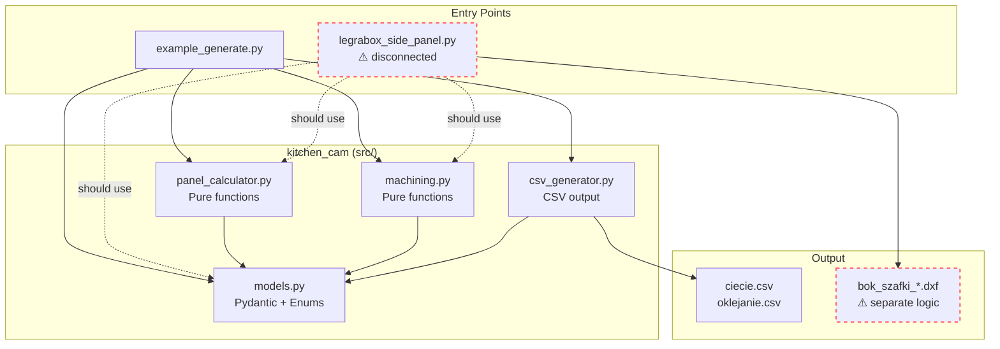

### 1.2 Data Flow (Current)

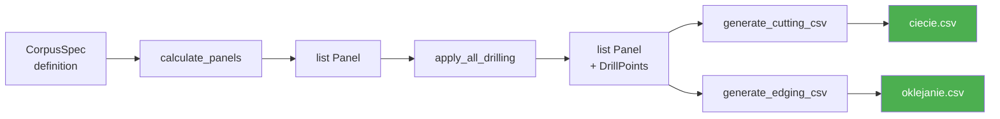

---

## 2. Target Architecture (To-Be)

### 2.1 Component Overview — Full System

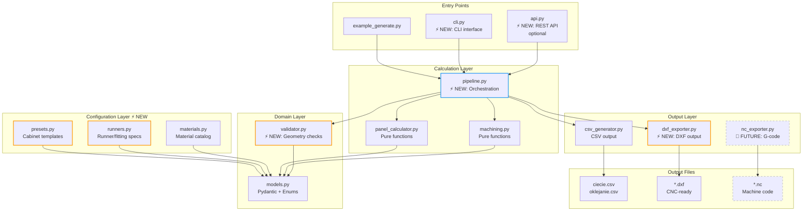

### 2.2 Data Flow — Full Pipeline

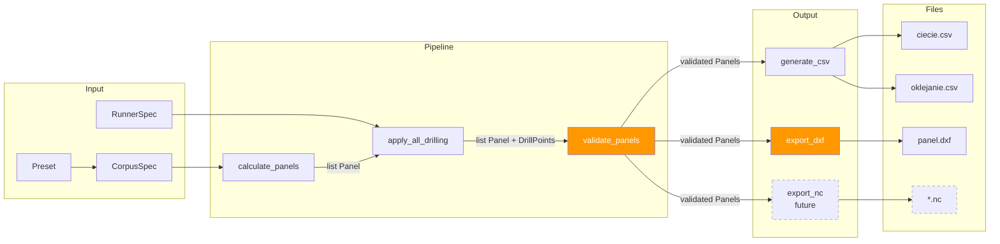

---

## 3. Module Details

### 3.1 Domain Model — Class Diagram

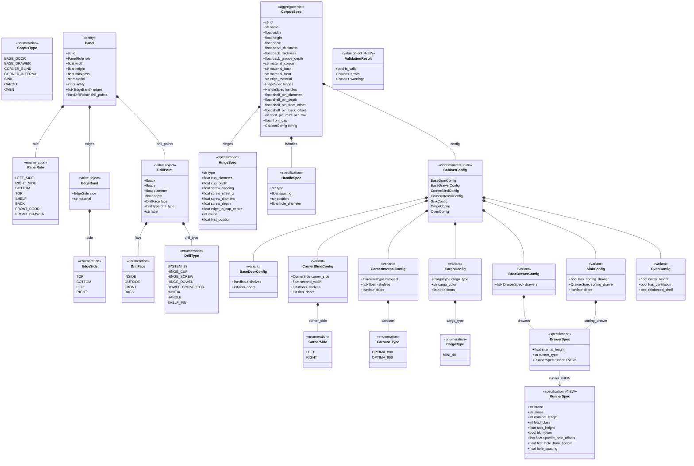

### 3.2 Pipeline — Sequence Diagram

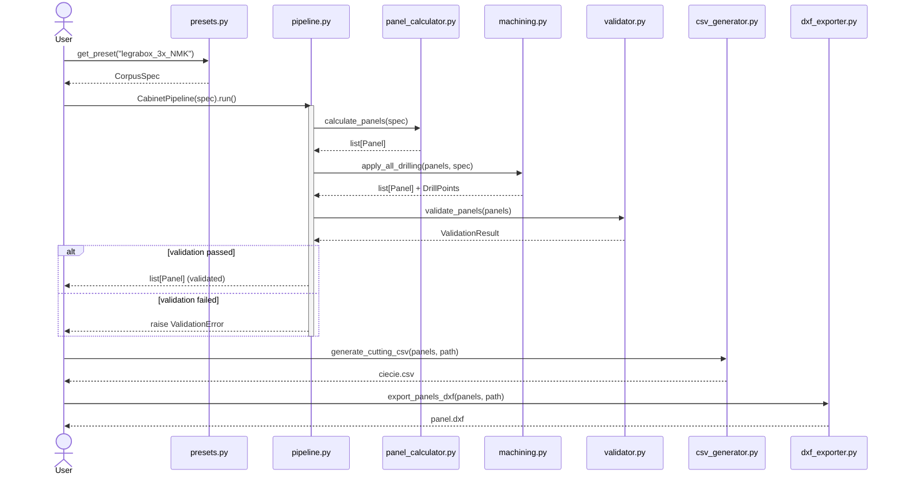

### 3.3 Runner System — Class Diagram

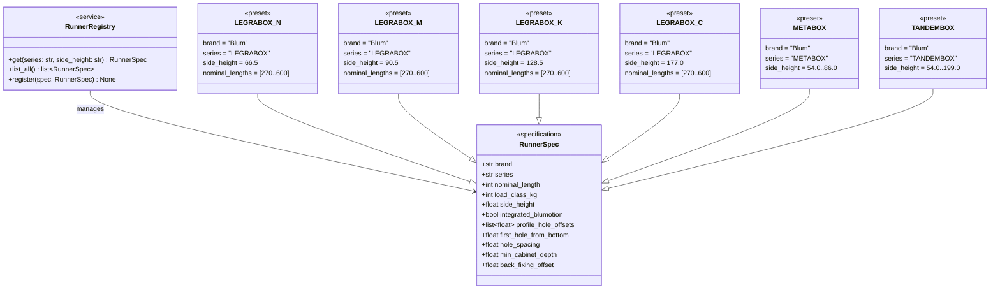

### 3.4 Cabinet Presets — Class Diagram

```mermaid
classDiagram
    direction TB

    class PresetRegistry {
        <<service>>
        +get(name: str) CorpusSpec
        +list_all() list~str~
        +register(name: str, spec: CorpusSpec) None
    }

    class CorpusSpec {
        <<aggregate>>
    }

    class base_door_800 {
        <<preset>>
        config = BaseDoorConfig(shelves=[352], doors=[2])
        width = 800
        height = 720
        depth = 510
    }

    class base_drawer_600 {
        <<preset>>
        config = BaseDrawerConfig(drawers=[N, M, K])
        width = 600
        height = 720
        depth = 510
    }

    class wall_door_800 {
        <<preset>>
        config = BaseDoorConfig(shelves=[352], doors=[2])
        width = 800
        height = 720
        depth = 300
    }

    class corner_blind_900 {
        <<preset>>
        config = CornerBlindConfig(corner_side=LEFT, second_width=510)
        width = 900
        height = 720
        depth = 510
    }

    class oven_600 {
        <<preset>>
        config = OvenConfig(cavity_height=600)
        width = 600
        height = 2000
        depth = 560
    }

    PresetRegistry --> CorpusSpec : creates
    base_door_800 --|> CorpusSpec
    base_drawer_600 --|> CorpusSpec
    wall_door_800 --|> CorpusSpec
    corner_900 --|> CorpusSpec
    tall_cabinet_600 --|> CorpusSpec
```

---

## 4. DXF Export Layer

### 4.1 DXF Exporter — Component Diagram

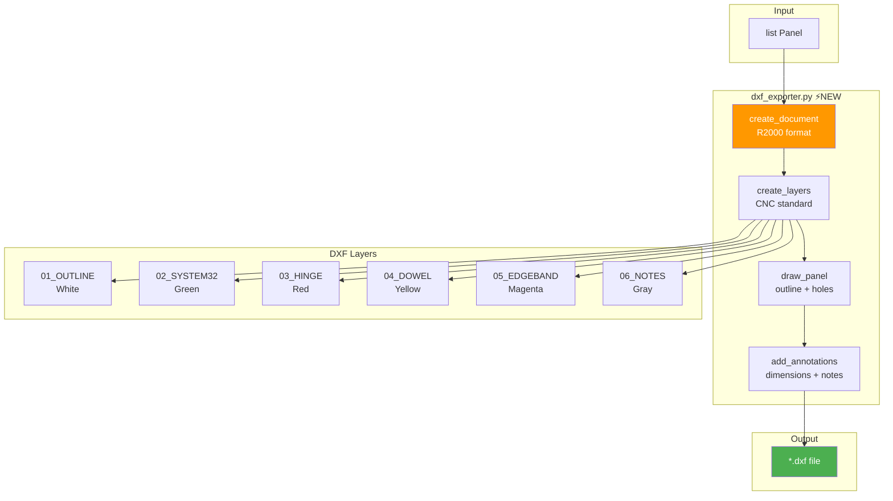

### 4.2 DXF Export — Sequence Diagram

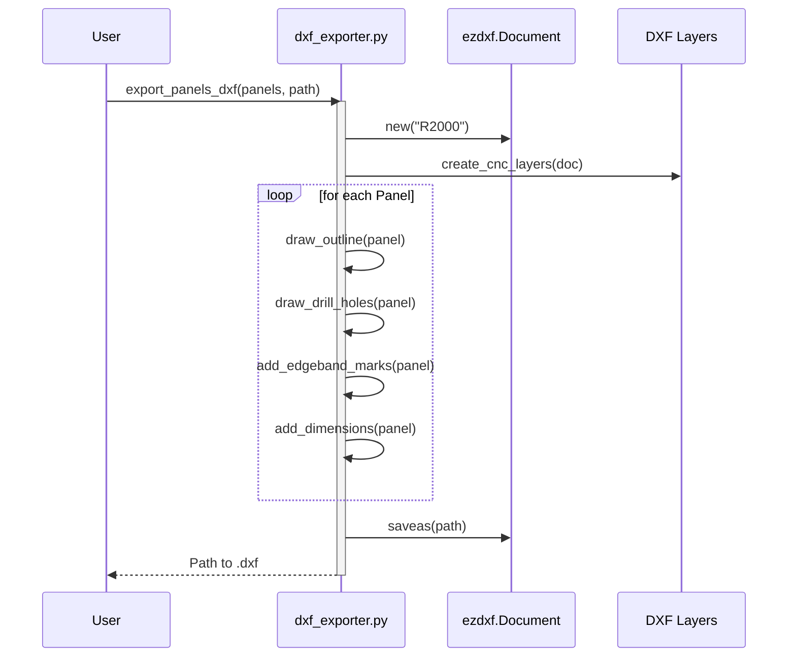

---

## 5. Validator — Geometry Checks

### 5.1 Validation Flow

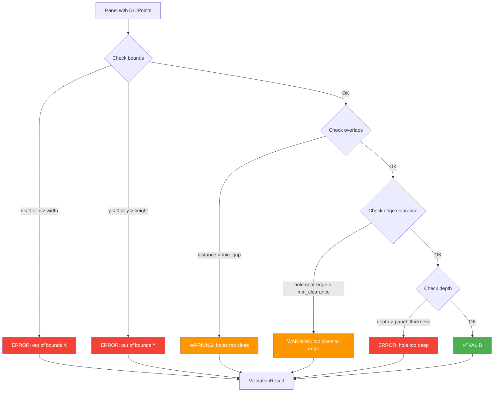

---

## 6. CLI Interface (Future)

### 6.1 CLI Commands

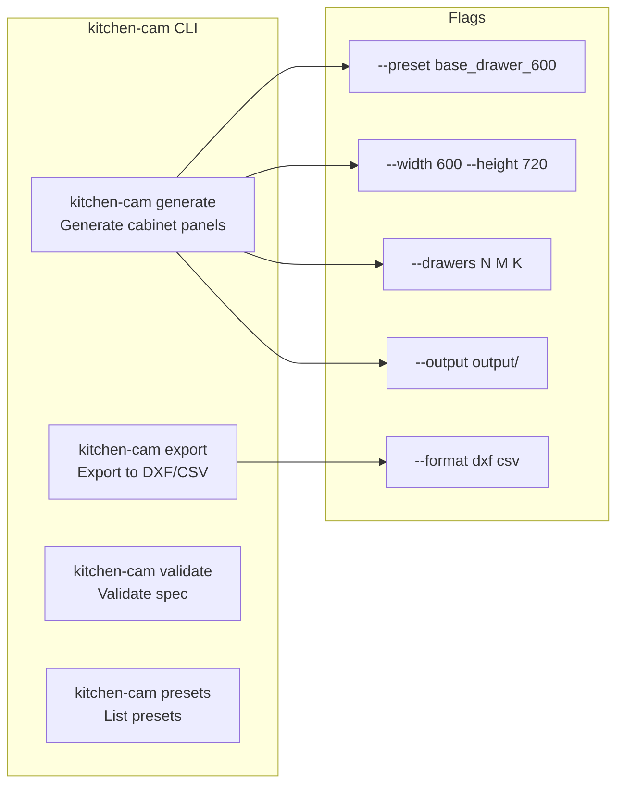

---

## 7. File Structure — Target

```
kitchen-cam/
├── src/kitchen_cam/
│   ├── __init__.py
│   ├── models.py              # Domain models (existing)
│   ├── panel_calculator.py    # Geometry calculations (existing)
│   ├── machining.py           # Machining operations (existing)
│   ├── csv_generator.py       # CSV output (existing)
│   │
│   ├── runners.py             # ⚡ Runner specifications (LEGRABOX, METABOX...)
│   ├── materials.py           # ⚡ Material catalog (EGGER, Kronospan...)
│   ├── presets.py             # ⚡ Cabinet preset library
│   ├── validator.py           # ⚡ Geometry validation
│   ├── pipeline.py            # ⚡ Pipeline orchestration
│   ├── dxf_exporter.py        # ⚡ DXF output
│   │
│   ├── cli.py                 # 🔮 CLI interface (future)
│   └── nc_exporter.py         # 🔮 G-code output (future)
│
├── generators/                # Standalone generators (refactored)
│   └── legrabox_side_panel.py # Should use pipeline.py
│
├── tests/
│   ├── test_models.py
│   ├── test_panel_calculator.py
│   ├── test_machining.py
│   ├── test_csv_generator.py
│   ├── test_runner_registry.py    # ⚡ NEW
│   ├── test_presets.py            # ⚡ NEW
│   ├── test_validator.py          # ⚡ NEW
│   └── test_dxf_exporter.py       # ⚡ NEW
│
├── output/
│   ├── *.dxf                  # Generated DXF files
│   └── *.csv                  # Generated CSV files
│
├── docs/
│   ├── architecture-diagrams.md   # This file
│   ├── LEGRABOX_SPEC.md
│   └── poradnik-kompleksowy.md
│
└── example_generate.py
```

---

## 8. Technology Decisions

| Component          | Choice         | Rationale                                           |
| ------------------ | -------------- | --------------------------------------------------- |
| **Domain models**  | Pydantic v2    | Validation, serialization, IDE support              |
| **DXF generation** | ezdxf          | Pure Python, R2000 support, no AutoCAD needed       |
| **CLI**            | Typer / Click  | Type-safe, auto-generated help                      |
| **Testing**        | pytest         | Already in project                                  |
| **Future NC**      | G-code strings | Simple text format, machine-specific postprocessors |

---

## 9. Migration Path

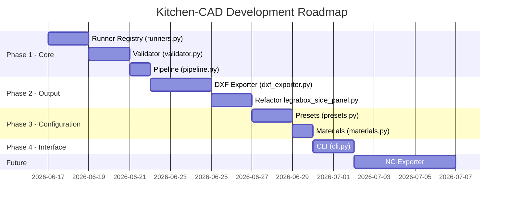

---

_Generated: 2026-06-17_
_Version: 1.0_
