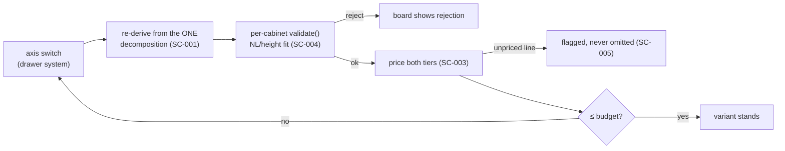

# Spec: Drawer-system substitution — UC-1's budget walk, axis by axis

> Reader: whoever implements or reviews the comparison board's
> drawer-system axis, or prices a substitution | Enables: judging what
> a substitution MUST re-derive, reject, and surface — without
> re-reading UC-1's prose | Update-trigger: a new drawer system enters
> the catalog, the derivation path changes, or an SC row below gains
> or loses a test

Status: DRAFT (2026-09-01, written jointly operator+agent as the first
post-freeze spec). Post-freeze convention note: the v1 ledger is an
archive (`.truth/FROZEN.md`), so load-bearing facts here carry
**tl2 capsules** (Ground truths below) instead of new `tr-` ids —
same tripwire duty, live mechanism. Frozen `tr-` ids remain citable
as history. Before editing this file: `./scripts/tl2 whisper
kitchen-erp/docs/specs/drawer-substitution.md`.

## The story (prose — context, carries no load)

At the client's table the budget lands below "od" (UC-1 ext 1a,
`docs/specs/use-cases.md:160`). The owner walks the substitution axes
on the comparison board — decor, drawer system, hinge, worktop — until
the price fits. The drawer-system axis is the sharpest one: three
selectable systems (tandembox_antaro, merivobox, legrabox) differ in
hardware cost, machining pattern, and mounting screws — and the
2026-08-02 regression proved a "fix" can silently reach one system of
three (bead kuchnie-c7l: screws 1/1/4, LEGRABOX default masking the
other two). This spec exists so that substitution is a re-derivation,
never a patch.

## Promises (SC — each line must have a citing test; `tl2 mirror` guards both directions)

- [ ] [SC-drsub-001] Switching the drawer-system axis re-derives
  rozrys, CNC ops and BOM from the single decomposition; no artifact
  of the previous system survives into the substituted variant.
- [ ] [SC-drsub-002] Substitution reaches EVERY selectable system: for
  the same cabinet, each of tandembox_antaro, merivobox and legrabox
  yields its own machining pattern and its own screws-per-runner
  count (the kuchnie-c7l regression class, pinned).
- [ ] [SC-drsub-003] A substituted variant is priced in both tiers,
  and the budget walk terminates: either a variant with price ≤ the
  client's budget, or an explicit "no fit on this axis" — never a
  silent dead end.
- [ ] [SC-drsub-004] A drawer stack that violates NL/height fit after
  substitution is REJECTED by per-cabinet validate() (UC-1 ext 3a,
  `docs/specs/use-cases.md:253`) — rejection, not silent
  re-dimensioning.
- [ ] [SC-drsub-005] An unpriced line produced by substitution
  surfaces flagged on the board; it is never silently omitted from
  the total (the UC-1 ext 2a pattern).
- [ ] [SC-drsub-006] Substitution proposals come only from
  catalog-verified registry entries (`docs/specs/use-cases.md:428`);
  a free-typed replacement is not offered.

## OPEN (named honestly, no prose posing as decisions)

- **OPEN** — recompute latency budget for one axis switch: no number
  exists anywhere (screens.md carries the same OPEN for the board);
  proposal SC-scrn-001-style p95 awaits an operator ruling.
- **OPEN** — what the walk does when NO axis combination fits the
  budget (ext 1a names walking, not exhaustion).

## Flow (diagram — guarded by the Ground-truth capsules below)

## Ground truths (facts this spec stands on — capsuled, not prose)

Capsules filed in this installation's `capsules.jsonl`; `tl2 check`
recomputes their status, `tl2 whisper` names them before edits:

- the three drawer systems exist as first-party modules
  (blum_drawers, legrabox in kuchnie-core) — capsule watches those
  modules and this spec.
- the variant-derivation path exists in kitchen-erp
  (`kitchen_erp/core/variant_derivation.py`) — capsule watches it and
  this spec.
- Frozen history (citable, not live): ADR-015 (BOM folds
  consolidated, single decomposition feeds every downstream artifact);
  `tr-6692cbe7` (variants re-derive from one decomposition) — frozen
  2026-09-01 per `.truth/FROZEN.md`.

## Work

- Tests for SC-drsub-001..006: none yet — `tl2 mirror` will report
  six GAPs until they land, and that red list IS the implementation
  debt, honestly visible (run: `./scripts/tl2 mirror --manifest
  kitchen-erp/docs/specs/drawer-substitution.sc.txt --root
  kitchen-erp`).
