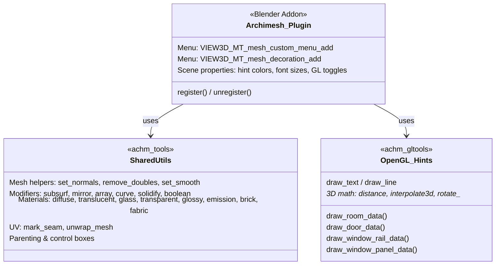
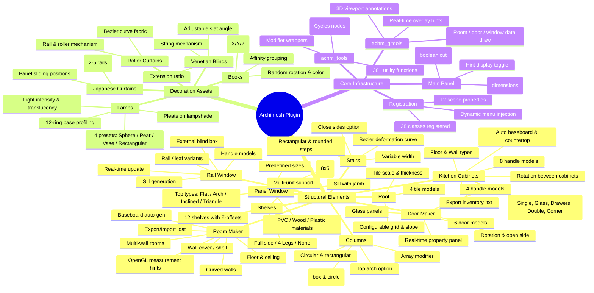
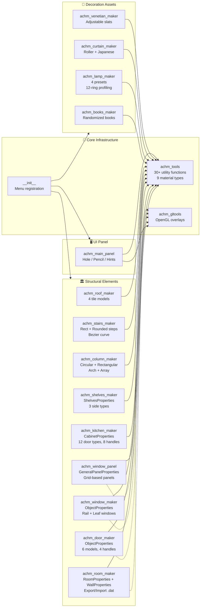

📐 Project Overview

Archimesh is a parametric architectural elements generator for Blender. It adds a custom menu under Mesh > Add with  
 two categories: Structural elements and Decoration assets. Each feature generates editable, parameterized 3D mesh  
 objects with optional Cycles materials.

Author: Antonio Vazquez (antonioya) | License: GPL-2.0-or-later | 17 Python files, ~30 classes

────────────────────────────────────────────────────────────────────────────────

🏗️ Architecture Overview (Mermaid Class Diagram)



────────────────────────────────────────────────────────────────────────────────

🗂️ Feature Map (Mermaid Diagram)



────────────────────────────────────────────────────────────────────────────────

🔗 Module Dependency Graph



────────────────────────────────────────────────────────────────────────────────

📊 Feature Property Summary Table

```mermaid
  ---
  config:
    theme: base
    themeVariables:
      primaryColor: "#e8f4fd"
  ---
  graph TD
      subgraph Features["Feature Property Counts"]
          direction LR
          A["🏠 Room Maker<br/>━━━━━━━━━━<br/>• 15+ wall params<br/>• 5 room-level params<br/>• Curved wall
support<br/>• Import/Export .dat"]
          B["🚪 Door Maker<br/>━━━━━━━━━━<br/>• 14 frame params<br/>• 6 door models<br/>• 4 handle models<br/>•
OpenGL points"]
          C["🪟 Window Maker<br/>━━━━━━━━━━<br/>• 16 frame params<br/>• 4 open types<br/>• Sill + Blind<br/>• OpenGL
points"]
          D["🍳 Kitchen<br/>━━━━━━━━━━<br/>• 14 global params<br/>• 15 cabinet params<br/>• 12 door types<br/>• 8
handle models"]
          E["🪜 Stairs<br/>━━━━━━━━━━<br/>• 12 step params<br/>• 2 step models<br/>• Bezier curve<br/>• Variable
width"]
          F["📚 Books<br/>━━━━━━━━━━<br/>• 3 dimensions<br/>• 3 randomness axes<br/>• Rotation + Affinity<br/>• Color
random"]
          G["💡 Lamp<br/>━━━━━━━━━━<br/>• 12 ring radii<br/>• 12 Z-shift factors<br/>• 4 presets<br/>• Pleats
option"]
          H["🪟 Venetian<br/>━━━━━━━━━━<br/>• 7 slat params<br/>• Angle 0-85°<br/>• Extension %<br/>• Color picker"]
      end
```

────────────────────────────────────────────────────────────────────────────────

📁 File Structure

```
  kitchen-plugin/
  └── archimesh/
      └── source/
          ├── __init__.py              # Registration & menus (28 classes)
          ├── achm_tools.py            # 30+ mesh/material/modifier utilities
          ├── achm_gltools.py          # OpenGL overlay drawing functions
          ├── achm_main_panel.py       # Main UI panel, Hole, Pencil, Hints
          ├── achm_room_maker.py       # Room generator (1600+ lines)
          ├── achm_door_maker.py       # Door generator (2000+ lines)
          ├── achm_window_maker.py     # Rail/Leaf window (2300+ lines)
          ├── achm_window_panel.py     # Panel window (1900+ lines)
          ├── achm_kitchen_maker.py    # Kitchen cabinets (2600+ lines)
          ├── achm_shelves_maker.py    # Shelf units
          ├── achm_column_maker.py     # Columns + arches
          ├── achm_stairs_maker.py     # Staircase generator
          ├── achm_roof_maker.py       # Roof tiles
          ├── achm_books_maker.py      # Decorative books
          ├── achm_lamp_maker.py       # Parametric lamps
          ├── achm_curtain_maker.py    # Roller + Japanese curtains
          └── achm_venetian_maker.py   # Venetian blinds
```
