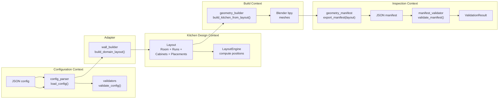

# Kitchen Plugin Architecture

## Overview

The kitchen plugin generates 3D kitchen cabinet models from JSON configuration
files. It supports I, L, and U kitchen layouts with European frameless
construction standards.

**Primary output:** A structured JSON geometry manifest for inspection and
validation. Visual export (.blend) is optional.

---

## Design Principles

| Principle                        | Rule                                                                                   |
| -------------------------------- | -------------------------------------------------------------------------------------- |
| **Manifest-first**               | Every build produces a JSON manifest with exact geometry. Visual formats are optional. |
| **Inspect where it's generated** | Validate geometry at the source (bpy output), not after lossy format export.           |
| **No unit guessing**             | All data carries explicit units. Never multiply by 1000 and hope.                      |
| **Dependencies point down**      | `core/ ← kitchen/ ← builder/ ← adapters/`. Never reverse.                              |
| **Immutable by default**         | Frozen dataclasses. No accidental mutation.                                            |
| **Z-up, right-hand**             | Architectural/BIM standard. Documented once, enforced everywhere.                      |

---

## Layer Architecture

```
┌─────────────────────────────────────────────────────────────────────────────┐
│                                                                             │
│  Layer 5: Entry Points                                                      │
│  ┌──────────────────────────────────────────────────────────────────────┐   │
│  │ main.py (CLI)                    tests/ (pytest)                     │   │
│  └──────────────────────────────────────────────────────────────────────┘   │
│       │                         │                    │                      │
│  ┌────▼─────────────────────────▼────────────────────▼──────────────────┐   │
│  │ Layer 4: Adapters (External)                                         │   │
│  │ ┌────────────────────┐ ┌──────────────┐ ┌─────────────────────────┐  │   │
│  │ │ geometry_builder.py│ │ exporters.py │ │ geometry_manifest.py    │  │   │
│  │ │ Blender mesh       │ │ .blend       │ │ JSON manifest export    │  │   │
│  │ │ creation (bpy)     │ │ (optional)   │ │ (PRIMARY output)        │  │   │
│  │ └────────────────────┘ └──────────────┘ └─────────────────────────┘  │   │
│  │ ┌────────────────────┐ ┌──────────────────────────────────────────┐  │   │
│  │ │ material_manager.py│ │ manifest_validator.py                    │  │   │
│  │ │ Cycles materials   │ │ Expected-vs-actual, topology checks      │  │   │
│  │ └────────────────────┘ └──────────────────────────────────────────┘  │   │
│  └──────────────────────────────────────────────────────────────────────┘   │
│       │                                                                     │
│  ┌────▼──────────────────────────────────────────────────────────────────┐   │
│  │ Layer 3: Builder (Config Parsing)                                     │   │
│  │ ┌──────────────────┐ ┌──────────────┐ ┌────────────────────────┐      │   │
│  │ │ config_parser.py │ │ validators.py│ │ wall_builder.py        │      │   │
│  │ │ JSON loading     │ │ Semantic     │ │ Config → Wall/Cabinet  │      │   │
│  │ │ defaults         │ │ validation   │ │ conversion             │      │   │
│  │ └──────────────────┘ └──────────────┘ └────────────────────────┘      │   │
│  └──────────────────────────────────────────────────────────────────────┘   │
│       │                                                                     │
│  ┌────▼──────────────────────────────────────────────────────────────────┐   │
│  │ Layer 2: Kitchen (Domain Logic)                                       │   │
│  │ ┌──────────┐ ┌───────────────┐ ┌──────────────┐ ┌─────────────────┐  │   │
│  │ │ wall.py  │ │ cabinet.py    │ │ layout.py    │ │ standards.py    │  │   │
│  │ │ Wall     │ │ Cabinet       │ │ Run          │ │ KitchenStandards│  │   │
│  │ │ Room     │ │ CabinetPlacem.│ │ LayoutEngine │ │ EUROPEAN_STD    │  │   │
│  │ └──────────┘ └───────────────┘ └──────────────┘ └─────────────────┘  │   │
│  └──────────────────────────────────────────────────────────────────────┘   │
│       │                                                                     │
│  ┌────▼──────────────────────────────────────────────────────────────────┐   │
│  │ Layer 1: Core (Pure Math)                                             │   │
│  │ ┌────────────────┐ ┌───────────────┐ ┌──────────────────────────┐     │   │
│  │ │ geometry.py    │ │ tolerances.py │ │ types.py                 │     │   │
│  │ │ Vector2D       │ │ Named         │ │ Direction                │     │   │
│  │ │ Vector3D       │ │ tolerances    │ │ CabinetType              │     │   │
│  │ │ BoundingBox    │ │               │ │ CabinetLevel             │     │   │
│  │ │ Transform2D    │ │               │ │ Dimensions               │     │   │
│  │ └────────────────┘ └───────────────┘ └──────────────────────────┘     │   │
│  └──────────────────────────────────────────────────────────────────────┘   │
│                                                                             │
└─────────────────────────────────────────────────────────────────────────────┘
```

---

## Dependency Rule

```
  core/ ← kitchen/ ← builder/ ← adapters/ ← main.py
    │         │           │           │
    └─────────┴───────────┴───────────┘
        Never reverse arrows
```

| Layer       | Depends on          | External deps                             |
| ----------- | ------------------- | ----------------------------------------- |
| `core/`     | —                   | None                                      |
| `kitchen/`  | `core/`             | None                                      |
| `builder/`  | `core/`, `kitchen/` | JSON                                      |
| `adapters/` | `core/`, `kitchen/` | bpy (geometry_builder), stdlib (manifest) |
| `main.py`   | all                 | bpy, sys                                  |

---

## Data Flow

```
  JSON config
      │
      ▼
  ┌──────────────────┐
  │ config_parser.py  │  Load, apply defaults, validate schema
  └────────┬─────────┘
           │
           ▼
  ┌──────────────────┐
  │ wall_builder.py   │  Config → Wall + Cabinet objects
  └────────┬─────────┘
           │
           ▼
  ┌──────────────────┐
  │ LayoutEngine      │  Calculate positions, detect corners
  └────────┬─────────┘
           │
           ▼
  ┌──────────────────────────────────────────────────────┐
  │ geometry_builder.py (bpy)                             │
  │                                                       │
  │  Builds Blender meshes per frameless construction:    │
  │  • Carcass (4 separate boards with technical gaps)    │
  │    - Side panels (full height × depth × thickness)   │
  │    - Top/bottom panels (between sides)               │
  │  • Back panel (in groove at rear)                     │
  │  • Front panels (doors/drawers)                       │
  │  • Countertop (with overhangs)                        │
  │  • Fillers, plinths                                   │
  │                                                       │
  │  Each board is a separate solid box (8 verts, 6 faces)│
  │  Technical gaps between all boards — no shared surfaces│
  │                                                       │
  │  Applies transforms:                                  │
  │  • Position along wall (accumulated offset)           │
  │  • Rotation for wall direction (0°/90°/180°/270°)    │
  │  • Z placement (plinth, wall-mount, floor)            │
  └────────┬─────────────────────────────────────────────┘
           │
           ├──────────────────────────────────────────────────────────┐
           ▼                                                          ▼
  ┌────────────────────────────┐                       ┌──────────────────────┐
  │ geometry_manifest.py       │  ← PRIMARY OUTPUT     │ exporters.py         │
  │                            │                       │                      │
  │ Exports JSON with:         │                       │                      │
  │ • Local + world vertices   │                       │ .blend (for visual   │
  │ • Object hierarchy         │                       │   inspection)        │
  │ • Expected vs actual dims  │                       │                      │
  │ • Layout metadata          │                       │                      │
  │ • Inline validation        │                       │                      │
  │ • Units, coord system      │                       │                      │
  └────────┬───────────────────┘                       └──────────────────────┘
           │
           ▼
  ┌────────────────────────────┐
  │ manifest_validator.py      │
  │                            │
  │ Reads manifest, checks:    │
  │ • Dimension tolerance      │
  │ • No overlaps              │
  │ • Walkway clearances       │
  │ • Standard widths          │
  │ • Topology (vertex count)  │
  └────────┬───────────────────┘
           │
           ▼
  ┌────────────────────────────┐
  │ LLM Agent / CI / Human     │
  │ reads structured JSON      │
  └────────────────────────────┘
```

### Why Manifest-First

The old pipeline exported geometry to OBJ/glTF, then re-parsed those formats
to check correctness. This was lossy — OBJ carries no units, no hierarchy, no
metadata. glTF is Y-up with abstract units.

OBJ and glTF exports have been removed. The manifest captures geometry
**directly from bpy** with full fidelity:

| What                | Manifest                    |
| ------------------- | --------------------------- |
| Units               | ✅ `"units": "meters"`      |
| Coordinate system   | ✅ Z-up (our convention)    |
| Object hierarchy    | ✅ parent + layout metadata |
| Local coordinates   | ✅ both local AND world     |
| Rotation            | ✅ exact Euler              |
| Expected dimensions | ✅ inline pass/fail         |
| LLM readability     | ✅ plain JSON               |

**Rule: Validation reads the manifest. Visual inspection opens .blend.**

### Data Flow Diagram (Mermaid)



---

## Coordinate System

```
  Z (height, up)
  │
  │   Y (depth, into room)
  │  /
  │ /
  └───────── X (width, left to right)
```

| Axis  | Direction             |
| ----- | --------------------- |
| **X** | Width (left to right) |
| **Y** | Depth (into room)     |
| **Z** | Height (up)           |

**Convention:** Z-up, right-hand rule. Documented once, enforced everywhere.
Wall normal points into room. Cabinet origin at back face (wall face).

### Coordinate Spaces

```
  World Coordinates          Wall-Local              Cabinet-Local
  ─────────────────          ──────────              ─────────────
  X: east +X                 dir: along wall         +X: width (left→right)
  Y: north +Y                normal: into room       +Y: depth (front→back)
  Z: up +Z                   origin: wall start      +Z: height (bottom→top)
                                                    origin: back-left-bottom
  Transforms:                Transform2D              wall.transform applied
  layout_engine applies      (2D rotation +           then wall-local offset
  wall positions             translation)
```

---

## Manifest Schema (v2.0)

The manifest schema defines the structure of the primary output. See
`schemas/manifest_v2.schema.json` for the JSON Schema definition.

```json
{
    "format": "kitchen-geometry-manifest",
    "version": "2.0",
    "units": "meters",
    "coordinate_system": {
        "type": "Z-up",
        "handedness": "right",
        "x": "width (left to right)",
        "y": "depth (into room)",
        "z": "height (up)"
    },
    "source_config": "configs/<name>.json",
    "settings": {
        "...": "mirrors KitchenStandards fields — see european-kitchen-standards.md"
    },
    "layout": {
        "type": "I-shape | L-shape | U-shape",
        "run_count": "<int>",
        "total_cabinets": "<int>",
        "runs": [
            {
                "label": "<wall_label>",
                "index": 0,
                "direction": "<direction>",
                "turn": "left | right | null",
                "start_position_mm": ["<x>", "<y>"],
                "end_position_mm": ["<x>", "<y>"],
                "total_width_mm": "<int>",
                "cabinets": ["<cabinet_name>", "..."]
            }
        ]
    },
    "objects": [
        {
            "name": "<run>_<level>_<index>_<type>",
            "type": "MESH",
            "classification": "carcass | door_front | drawer_front | back_panel | ...",
            "level": "base | upper | tall",
            "run_label": "<wall_label>",
            "run_index": "<int>",
            "cabinet_index": "<int>",
            "parent": null,
            "transform": {
                "location_m": ["<x>", "<y>", "<z>"],
                "rotation_euler_rad": ["<rx>", "<ry>", "<rz>"],
                "scale": [1, 1, 1]
            },
            "local_bounds": {
                "min_m": [0, 0, 0],
                "max_m": ["<width_m>", "<depth_m>", "<height_m>"]
            },
            "local_dimensions_mm": ["<width>", "<depth>", "<height>"],
            "world_bounds": {
                "min_m": ["..."],
                "max_m": ["..."]
            },
            "world_dimensions_mm": ["<width>", "<depth>", "<height>"],
            "vertex_count": "<int>",
            "face_count": "<int>",
            "construction": {
                "corpus_thickness_mm": "<from settings>",
                "back_thickness_mm": "<from settings>",
                "front_thickness_mm": "<from settings>",
                "internal_width_mm": "<computed: W - 2T>",
                "internal_depth_mm": "<computed: D - T - back>",
                "internal_height_mm": "<computed: H - 2T>"
            },
            "children": [
                {
                    "name": "<parent>_left",
                    "type": "board",
                    "local_dimensions_mm": ["<T>", "<D>", "<H>"]
                },
                {
                    "name": "<parent>_right",
                    "type": "board",
                    "local_dimensions_mm": ["<T>", "<D>", "<H>"]
                },
                {
                    "name": "<parent>_top",
                    "type": "board",
                    "local_dimensions_mm": ["<W-2T>", "<D-T>", "<T>"]
                },
                {
                    "name": "<parent>_bottom",
                    "type": "board",
                    "local_dimensions_mm": ["<W-2T>", "<D-T>", "<T>"]
                },
                {
                    "name": "<parent>_back",
                    "type": "back_panel",
                    "local_dimensions_mm": ["<W-2T>", "<back_T>", "<H-2T>"]
                },
                {
                    "name": "<parent>_<front_type>",
                    "type": "door_front | drawer_front",
                    "local_dimensions_mm": ["<W + overlay>", "<front_T>", "<H + overlay>"]
                }
            ],
            "validation": {
                "width_ok": true,
                "depth_ok": true,
                "height_ok": true,
                "vertex_count_ok": true,
                "face_count_ok": true,
                "issues": []
            }
        }
    ],
    "validation_summary": {
        "total_objects": "<int>",
        "passed": "<int>",
        "failed": "<int>",
        "warnings": "<int>",
        "issues": [
            {
                "severity": "error | warning",
                "object": "<object_name>",
                "check": "width | position | vertex_count | ...",
                "message": "<human-readable description>",
                "expected_mm": "<number or null>",
                "actual_mm": "<number or null>"
            }
        ]
    }
}
```

### Schema Rules

1. **All lengths in meters** in the manifest. Display tools convert to mm.
2. **`local_dimensions_mm`** is the object's own size (no parent transform).
3. **`world_dimensions_mm`** is the size after all transforms are applied.
4. **`validation`** is per-object inline. No separate pass needed.
5. **`layout`** preserves the config's run structure for spatial reasoning.
6. **`construction`** exposes board thicknesses for manufacturing validation.

---

## Module Details

### Layer 1: Core (Pure Math)

```
  Vector2D          — 2D point/vector (x, y)
  Vector3D          — 3D point/vector (x, y, z)
  BoundingBox       — Axis-aligned bounding box (min, max)
  Transform2D       — 2D rigid transform (rotation + translation)
  Direction         — Enum: EAST, NORTH, WEST, SOUTH
  CabinetType       — Enum: base-door, wall-drawers, corner-blind, ...
  CabinetLevel      — Enum: BASE, UPPER, TALL
  Dimensions        — Named tuple: width, depth, height
```

**Files:**

- `src/core/geometry.py`
- `src/core/tolerances.py`
- `src/core/types.py`

**Rule:** No imports from `kitchen/`, `adapters/`, or `bpy`. Pure math only.

---

### Layer 2: Kitchen (Domain Logic)

```
  Wall              — Line segment with start/end (Vector2D), direction, normal
  Room              — Collection of walls
  CornerReference   — Links two walls at a corner (aliased as CornerCabinet)
  WallCabinet       — Cabinet positioned by wall_id + offset + dimensions
  BoxVertices       — Box vertex generator for back-face origin convention
  Cabinet           — Parametric cabinet definition (type, width, wall_id)
  CabinetPlacement  — Cabinet + world position + rotation
  Countertop        — Countertop with overhangs
  Run               — Sequence of cabinets along one wall
  LayoutEngine      — Calculates positions from runs
  Layout            — Complete result: room + runs + corners + placements
```

**Files:**

- `src/kitchen/wall.py`
- `src/kitchen/cabinet.py`
- `src/kitchen/layout.py`
- `src/kitchen/standards.py`
- `src/kitchen/cabinet_geometry.py` — Board-level construction math

**Rule:** No imports from `adapters/` or `bpy`. Domain logic only.

---

### Layer 3: Builder (Config Parsing)

```
  config_parser     — Load JSON, apply defaults, return config dict
  validators        — Check semantic rules (dimension ranges, gaps, room fit)
  wall_builder      — Convert config dict → Wall + Cabinet objects
```

**Files:**

- `src/config_parser.py`
- `src/validators.py`
- `src/wall_builder.py`

**Rule:** No imports from `adapters/` or `bpy`. Config → domain objects only.

---

### Layer 4: Adapters (External)

```
  geometry_builder     — bpy mesh creation (carcasses, panels, fronts)
  material_manager     — Cycles materials
  exporters            — .blend save, wireframe render (optional visual)
  geometry_manifest    — JSON manifest export (PRIMARY output)
  manifest_validator   — Read manifest, run validation checks
```

**Files:**

- `src/geometry_builder.py`
- `src/material_manager.py`
- `src/exporters.py`
- `src/geometry_manifest.py`
- `src/manifest_validator.py`

**Rule:** Only layer allowed to import `bpy`. Manifest export reads bpy data
but outputs stdlib JSON (no bpy dependency in output format).

---

### Layer 5: Entry Points

```
  main.py           — CLI: parse args, orchestrate build + export
  tests/            — pytest suite
```

**CLI flags:**

```
  blender --background --python src/main.py -- configs/kitchen.json \
      --validate                 # Run manifest validation after export
      --no-manifest              # Skip manifest export (not recommended)
      --no-materials             # Skip Cycles materials (faster)
      --render-wireframe         # PNG wireframe render
      --export-blend             # Save .blend to output/meshes/
```

---

## Validation Architecture

### Three-Level Validation Pipeline

```
  Level 1: SYNTAX              Level 2: SEMANTIC           Level 3: GEOMETRIC
  ─────────────────            ──────────────────          ────────────────────
  config_parser.py             validators.py               geometry_manifest.py
  manifest_validator.py        manifest_validator.py       manifest_validator.py

  "Is this valid JSON          "Do cabinets overlap?"      "Are dimensions within
   with required fields?"      "Is clearance sufficient?"   tolerance?"
                                "Do widths match            "Is vertex count correct
                                 standard sizes?"           for construction type?"
```

### Validation Runs on the Manifest, Not on Exported Formats

```
  BEFORE (lossy, indirect):
    bpy → OBJ/glTF → parse → guess units → compare dims → report

  AFTER (direct, lossless):
    bpy → manifest JSON → read manifest → check dims → report
          (exact data)    (structured,    (inline validation)
                           self-documenting)
```

### Validation Checks

| Check                             | Level     | What it catches                      |
| --------------------------------- | --------- | ------------------------------------ |
| Dimension within tolerance        | Geometric | Cabinet built wrong size             |
| No object overlaps                | Semantic  | Cabinets placed on top of each other |
| Walkway clearance sufficient      | Semantic  | Kitchen not walkable                 |
| Standard widths only              | Semantic  | Non-standard cabinet width           |
| Vertex count matches construction | Geometric | Missing faces, degenerate mesh       |
| Face count correct                | Geometric | Open box, missing wall               |
| World bounds within room          | Geometric | Cabinet outside room boundary        |
| Countertop overhang correct       | Geometric | Wrong overhang amount                |
| Front overlay matches settings    | Geometric | Door too small/large                 |
| Run direction continuity          | Semantic  | Broken turn logic                    |

### Tolerances

All tolerance values are defined in `src/core/tolerances.py` (`Tolerances`
dataclass) and documented in [cad-principles.md](cad-principles.md).
Validation code reads these values — never hardcodes tolerances.

---

## European Kitchen Standards

All standard dimensions, tolerances, and construction details are defined in
[european-kitchen-standards.md](european-kitchen-standards.md) and implemented
in `src/kitchen/standards.py` (`KitchenStandards` dataclass).

The architecture defers to those sources as the single source of truth for
numerical values. This document covers **structure**, not measurements.

---

## Carcass Construction

Each cabinet carcass is built as **4 separate solid boards** with technical
gaps between them, matching European frameless construction.

```
  ┌──┐                     ┌──┐
  │  │                     │  │
  │  │  ┌───────────────┐  │  │
  │L │  │  top panel     │  │R │
  │  │  └───────────────┘  │  │
  │  │                     │  │
  │  │  ┌───────────────┐  │  │
  │  │  │ bottom panel   │  │  │
  │  │  └───────────────┘  │  │
  └──┘                     └──┘
```

Board dimensions are computed in `src/kitchen/cabinet_geometry.py`
(`CabinetGeometry` dataclass) from the cabinet's external dimensions and
board thickness. See [european-kitchen-standards.md](european-kitchen-standards.md)
for standard thicknesses.

**Construction rules:**

- Each board is a separate Blender object (8 vertices, 6 faces)
- Top/bottom panels sit **between** side panels (butt joint)
- Technical gap between all boards — no shared surfaces
- Back panel sits in groove at rear (separate object)
- Front is open (door/drawer covers it)
- Parent empty groups all boards for a cabinet

**Why separate boards:**

- Matches real-world construction (each board is cut separately)
- Enables BOM extraction (count boards, not faces)
- Allows material assignment per board
- Validates against cut list (board dimensions = cut dimensions)
- No shared surfaces = no z-fighting in renders

---

## Test Architecture

```
                    ╱╲
                   ╱  ╲         Visual regression (few)
                  ╱────╲        .blend snapshots, render comparison
                 ╱      ╲
                ╱────────╲     Integration: Config → Mesh → Manifest → Validate
               ╱          ╲
              ╱────────────╲   Unit: Pure geometry math (many)
```

### Test Suites

| Suite                              | Tests | Requires bpy | What it covers                      |
| ---------------------------------- | ----- | ------------ | ----------------------------------- |
| `test_core_geometry.py`            | 36    | No           | Vector, BoundingBox, Transform math |
| `test_kitchen.py`                  | 22    | No           | Wall, Cabinet, Layout domain logic  |
| `test_wall_centric_model.py`       | 21    | No           | Wall-local positioning              |
| `test_wall_builder.py`             | 15    | No           | Config → domain object conversion   |
| `test_config_parser.py`            | 17    | No           | JSON loading, defaults              |
| `test_positions.py`                | 6     | No           | World position calculation          |
| `test_l_shape.py`                  | 11    | No           | L-layout correctness                |
| `test_u_shape.py`                  | 11    | No           | U-layout correctness                |
| `test_p0_gap_semantics.py`         | 18    | No           | Gap semantics                       |
| `test_p0_coordinate_system.py`     | 19    | No           | Coordinate system conventions       |
| `test_p1_tolerance_model.py`       | 11    | No           | Tolerance model                     |
| `test_p1_drawer_validation.py`     | 15    | No           | Drawer validation                   |
| `test_p2_room_validation.py`       | 10    | No           | Room validation                     |
| `test_p2_schema_version.py`        | 14    | No           | Schema versioning                   |
| `test_p2_materials.py`             | 15    | No           | Material validation                 |
| `test_cabinet_construction.py`     | 22    | No           | Board-level construction            |
| `test_manifest_schema.py`          | 20    | No           | Manifest schema compliance          |
| `test_manifest_objects.py`         | 32    | No           | Manifest object details             |
| `test_manifest_validation.py`      | 30    | No           | Manifest validation logic           |
| `test_manifest_layout.py`          | 33    | No           | Manifest layout metadata            |
| `test_geometry_builder_cabinet.py` | 13    | Yes          | bpy mesh creation (skipped in CI)   |
| `test_geometry_validator.py`       | 10    | Yes          | Geometry validation with bpy        |

**Total: 401 collected, 384 passing, 17 skipped (bpy-dependent tests skipped without Blender)**

### Manifest Round-Trip Test

```python
def test_manifest_round_trip():
    """Config → Build → Manifest → Validate → All checks pass."""
    config = load_config("configs/ref_i_shape.json")
    objects = build_kitchen(config)
    manifest = export_manifest(objects, settings=config["settings"])

    # Verify manifest structure
    assert manifest["version"] == "2.0"
    assert manifest["units"] == "meters"

    # Verify all objects present
    assert len(manifest["objects"]) > 0

    # Verify dimensions match expected
    for obj in manifest["objects"]:
        v = obj["validation"]
        assert v["width_ok"], f"{obj['name']}: width mismatch"
        assert v["depth_ok"], f"{obj['name']}: depth mismatch"
        assert v["height_ok"], f"{obj['name']}: height mismatch"

    # Verify no overlaps
    assert manifest["validation_summary"]["failed"] == 0
```

---

## File Structure

```
kitchen-plugin/
├── src/
│   ├── core/                        # Layer 1: Pure math
│   │   ├── __init__.py
│   │   ├── geometry.py             # Vector2D, Vector3D, BoundingBox, Transform2D
│   │   ├── tolerances.py           # Named tolerances
│   │   └── types.py                # Direction, CabinetType, CabinetLevel, Dimensions
│   │
│   ├── kitchen/                     # Layer 2: Domain logic
│   │   ├── __init__.py
│   │   ├── wall.py                 # Wall, Room, WallCabinet, CornerReference, BoxVertices
│   │   ├── cabinet.py              # Cabinet, CabinetPlacement, Countertop
│   │   ├── cabinet_geometry.py     # Board-level construction math
│   │   ├── layout.py               # Run, LayoutEngine, Layout
│   │   └── standards.py            # KitchenStandards, EUROPEAN_STANDARDS
│   │
│   ├── config_parser.py             # Layer 3: JSON loading, defaults
│   ├── validators.py                # Layer 3: Semantic validation
│   ├── wall_builder.py              # Layer 3: Config → domain objects (uses kitchen/wall)
│   │
│   ├── geometry_builder.py          # Layer 4: Blender mesh creation
│   ├── material_manager.py          # Layer 4: Cycles materials
│   ├── exporters.py                 # Layer 4: .blend save, wireframe render (optional)
│   ├── geometry_manifest.py         # Layer 4: JSON manifest export (PRIMARY)
│   ├── manifest_validator.py        # Layer 4: Manifest validation checks
│   │
│   └── main.py                      # Layer 5: CLI entry point
│
├── scripts/
│   ├── validate_manifest.py         # Standalone manifest validation (no bpy)
│   └── summarize_manifest.py        # Human/LLM-friendly manifest summary
│
├── tests/
│   ├── test_core_geometry.py
│   ├── test_kitchen.py
│   ├── test_wall_centric_model.py
│   ├── test_wall_builder.py
│   ├── test_config_parser.py
│   ├── test_positions.py
│   ├── test_l_shape.py
│   ├── test_u_shape.py
│   ├── test_p0_*.py
│   ├── test_p1_*.py
│   ├── test_p2_*.py
│   ├── test_cabinet_construction.py
│   ├── test_manifest_schema.py
│   ├── test_manifest_objects.py
│   ├── test_manifest_validation.py
│   ├── test_manifest_layout.py
│   ├── test_geometry_builder_cabinet.py  # Requires bpy
│   └── test_geometry_validator.py        # Requires bpy
│
├── configs/
│   ├── ref_i_shape.json
│   ├── ref_l_shape.json
│   └── ref_u_shape.json
│
├── output/
│   ├── meshes/                      # .blend, _manifest.json
│   └── renders/
│
├── schemas/
│   └── manifest_v2.schema.json      # JSON Schema for manifest
│
└── docs/
    ├── architecture.md              # This file
    ├── 3d-format-strategy.md        # Format comparison & rationale
    ├── config-syntax.md             # JSON config reference
    ├── wall-centric-model.md        # Positioning model
    ├── european-kitchen-standards.md # Kitchen domain reference
    ├── cad-principles.md            # CAD principles and conventions
    ├── ddd-strategic-design.md      # DDD subdomains, contexts, language
    ├── geometry-inspection-tools.md # Manifest validation workflow
    ├── roadmap-production-cad.md    # Production CAD roadmap
    ├── reference/                   # Cheatsheets and reference material
    │   └── sketchup-shortcuts.md
    └── archive/                     # Completed plans and historical docs
        └── implementation-plan.md   # Manifest-first migration (completed)
```

---

## Design Decisions

| Decision                         | Rationale                                                     |
| -------------------------------- | ------------------------------------------------------------- |
| **Manifest is primary output**   | Exact data from bpy, no lossy format conversion, LLM-readable |
| **OBJ/glTF removed**             | Manifest replaced them; .blend for visual inspection only     |
| **.blend for visual inspection** | Full fidelity, no format conversion, open in Blender          |
| **Validation on manifest**       | Structured, self-documenting, no unit guessing                |
| **Z-up coordinates**             | Architectural/BIM industry standard                           |
| **Wall-centric positioning**     | Same model as IKEA, professional kitchen CAD                  |
| **Frozen dataclasses**           | Immutable = thread-safe, no accidental mutation               |
| **Named tolerances**             | Self-documenting, configurable per check                      |
| **Units in meters internally**   | Blender's native unit; manifest declares explicitly           |
| **Expected dims in manifest**    | Self-validating — manifest tells you what's wrong             |

---

## Deprecated / Removed

The following scripts have been removed and replaced by the manifest pipeline:

| Old script                          | Replacement                       | Status  |
| ----------------------------------- | --------------------------------- | ------- |
| `scripts/analyze_reference_obj.py`  | Manifest + `validate_manifest.py` | Removed |
| `scripts/convert_obj_to_gltf.py`    | Not needed (manifest is direct)   | Removed |
| `scripts/analyze_gltf_v2.py`        | Manifest + `validate_manifest.py` | Removed |
| `scripts/compare_with_reference.py` | Manifest validation (inline)      | Removed |
| `scripts/validate_obj.py`           | Manifest validation (inline)      | Removed |
| `src/geometry_inspector.py`         | `src/geometry_manifest.py`        | Removed |
| `src/geometry_validator.py`         | `src/manifest_validator.py`       | Removed |

These scripts existed to work around OBJ/glTF limitations (no units, no
hierarchy, no metadata). The manifest carries all that information natively.

---

## Class Diagram

Auto-generated by `py-diagram`. Shows all 28 classes and their relationships.

```mermaid
classDiagram
    %% ── Core (Shared Kernel) ──────────────────────────────────────
    class Vector2D {
        +float x
        +float y
        +length() float
        +normalized() Vector2D
    }
    class Vector3D {
        +float x
        +float y
        +float z
        +length() float
        +to_mm() Vector3D
        +to_m() Vector3D
    }
    class BoundingBox {
        +Vector3D min_point
        +Vector3D max_point
        +width() float
        +depth() float
        +height() float
    }
    class Transform2D {
        +float cos, sin, tx, ty
        +apply_to_point(Vector2D) Vector2D
    }
    class Tolerances {
        +float position, dimension, angle
        +float vertex_merge, normal_tolerance
    }
    class Direction {
        <<enum>>
        EAST, NORTH, WEST, SOUTH
        +dx() float
        +dy() float
        +turn(str) Direction
    }
    class CabinetType {
        <<enum>>
        16 variants
        +level() CabinetLevel
        +is_corner() bool
    }
    class CabinetLevel {
        <<enum>>
        BASE, UPPER, TALL
    }
    class Dimensions {
        +float width, depth, height
    }

    %% ── Kitchen (Domain) ─────────────────────────────────────────
    class Wall {
        +str id
        +Vector2D start, end
        +direction() Vector2D
        +angle_rad() float
        +point_at_offset(float) Vector2D
    }
    class Room {
        +List~Wall~ walls
        +get_wall(str) Wall
    }
    class Cabinet {
        +str id, wall_id
        +CabinetType cabinet_type
        +float offset
        +Dimensions dimensions
        +is_corner() bool
        +bounding_box_local() BoundingBox
    }
    class CabinetPlacement {
        +Cabinet cabinet
        +Vector3D world_position
        +float rotation_rad
    }
    class Countertop {
        +str wall_id
        +float start_offset, end_offset
        +float thickness, overhang_front, overhang_end
    }
    class Run {
        +str label
        +Direction direction
        +List~Cabinet~ cabinets
        +Countertop countertop
        +total_width() float
    }
    class Layout {
        +Room room
        +List~Run~ runs
        +List~CabinetPlacement~ placed_cabinets
    }
    class LayoutEngine {
        +calculate_layout(runs, ...) Layout
    }
    class KitchenStandards {
        +22 standard values
        +is_standard_width(float) bool
        +get_dimensions(str) Dimensions
    }
    class CornerReference {
        +str primary_wall_id, secondary_wall_id
        +float blind_depth, width
    }

    %% ── Adapter (wall_builder) ───────────────────────────────────
    class ResolvedCabinet {
        +str wall_id, level, cabinet_type
        +float offset, width, depth, height
        +float world_x, world_y, world_z, rotation
    }
    class WallBuilderResult {
        +Room room
        +List~ResolvedCabinet~ cabinets
        +List~CornerReference~ corners
    }

    %% ── Relationships ────────────────────────────────────────────
    BoundingBox *-- Vector3D
    Transform2D --> Vector2D
    Wall *-- Vector2D : start, end
    Room *-- Wall
    Cabinet *-- CabinetType
    Cabinet *-- Dimensions
    CabinetPlacement *-- Cabinet
    CabinetPlacement *-- Vector3D
    Run *-- Direction
    Run *-- Cabinet
    Run *-- Countertop
    Layout *-- Room
    Layout *-- Run
    Layout *-- CabinetPlacement
    Layout *-- CornerReference
    LayoutEngine --> Run : produces Layout
    WallBuilderResult *-- Room
    WallBuilderResult *-- ResolvedCabinet
    WallBuilderResult *-- CornerReference
```



---

## Future Work

| Priority   | Task                                               | Effort    |
| ---------- | -------------------------------------------------- | --------- |
| **Medium** | Enhance manifest with `construction` metadata      | 1 day     |
| ✅ Done    | Standalone `validate_manifest.py` (no bpy needed)  | —         |
| ✅ Done    | Standalone `summarize_manifest.py` (no bpy needed) | —         |
| **Low**    | Add 3MF export for manufacturing interop           | 2–3 days  |
| **Low**    | Add STEP export for B-Rep topology validation      | 1 week    |
| **Low**    | Blender-free 3D preview (three.js from manifest)   | 1–2 weeks |
