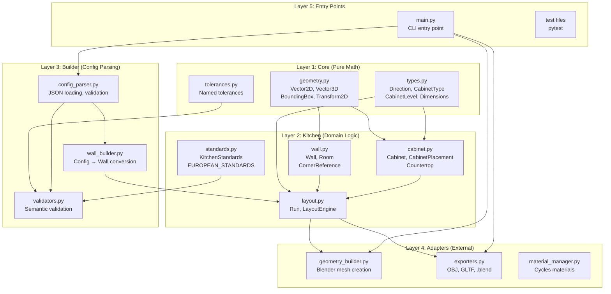
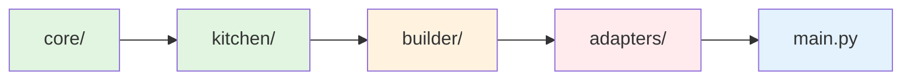
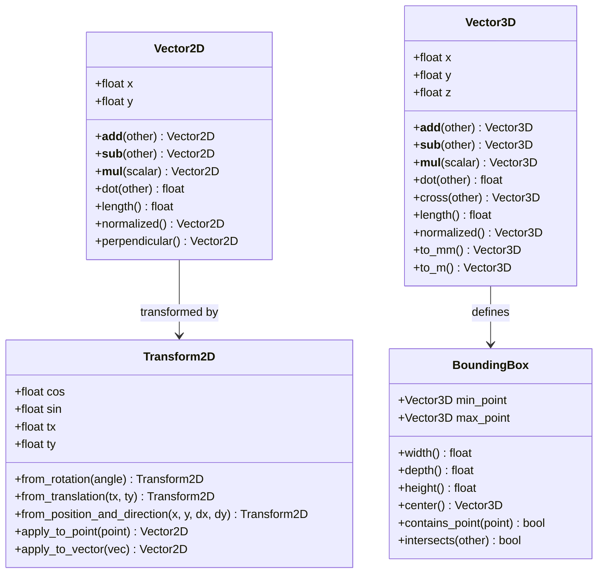
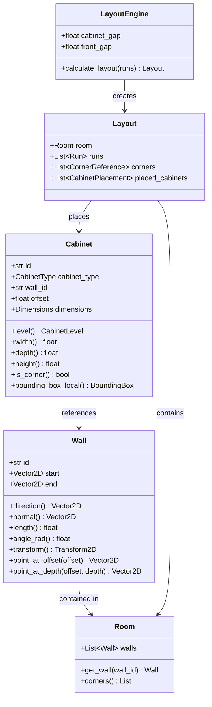
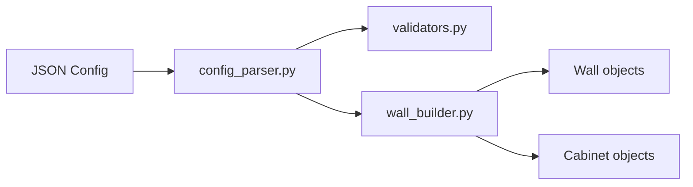
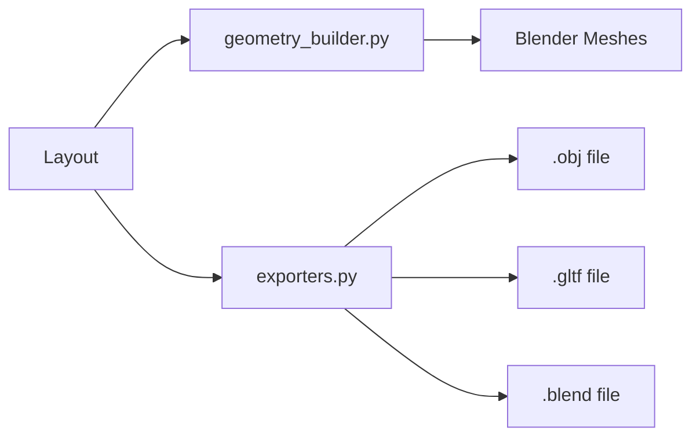
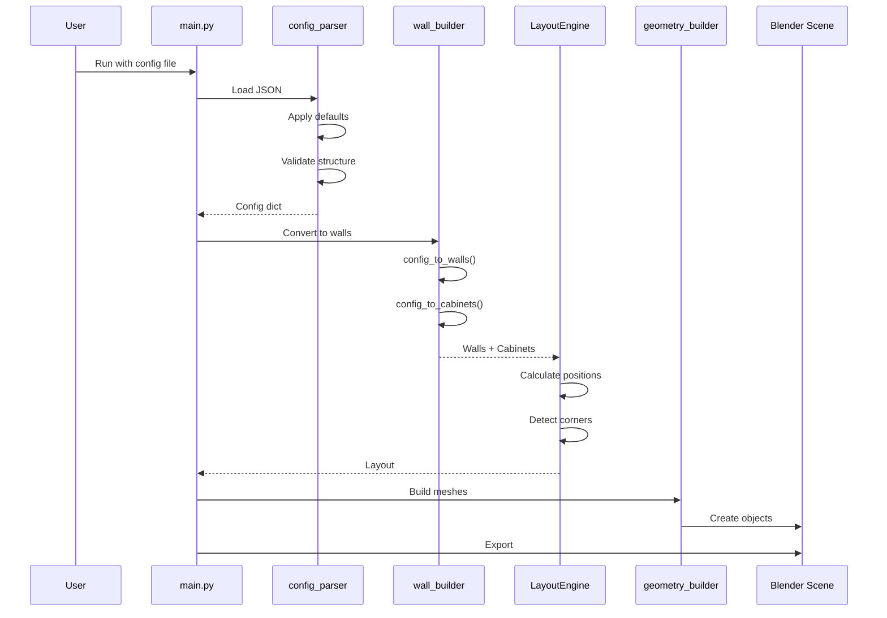
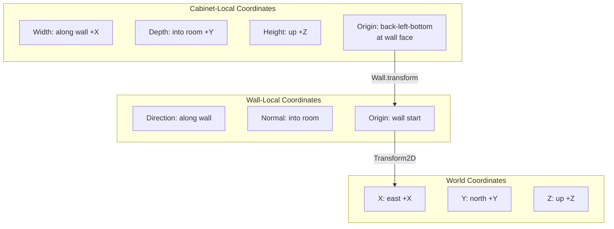
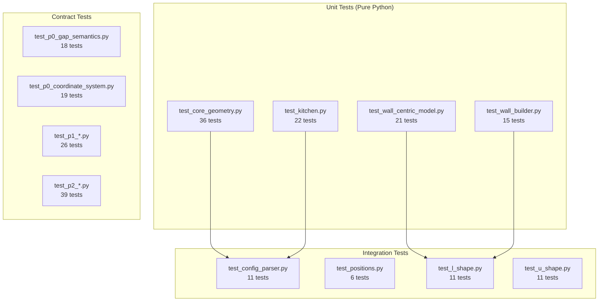

# Kitchen Plugin Architecture

## Overview

The kitchen plugin follows **SOLID principles** and **CAD best practices**
to generate 3D kitchen cabinet models from JSON configuration files.

---

## Layer Architecture



---

## Dependency Rule



**Rule:** Dependencies point DOWN only. Never reverse.

| Layer | Dependencies | External |
|---|---|---|
| core/ | None | None |
| kitchen/ | core/ | None |
| builder/ | core/, kitchen/ | JSON |
| adapters/ | core/, kitchen/ | bpy |
| main.py | all | bpy, sys |

---

## Module Details

### Layer 1: Core (Pure Math)



**Files:**
- `src/core/geometry.py` — Vector2D, Vector3D, BoundingBox, Transform2D
- `src/core/tolerances.py` — Tolerances (position, dimension, gap, etc.)
- `src/core/types.py` — Direction, CabinetType, CabinetLevel, Dimensions

---

### Layer 2: Kitchen (Domain Logic)



**Files:**
- `src/kitchen/wall.py` — Wall, Room, CornerReference
- `src/kitchen/cabinet.py` — Cabinet, CabinetPlacement, Countertop
- `src/kitchen/layout.py` — Run, LayoutEngine, Layout
- `src/kitchen/standards.py` — KitchenStandards, EUROPEAN_STANDARDS

---

### Layer 3: Builder (Config Parsing)



**Files:**
- `src/config_parser.py` — JSON loading, defaults, validation
- `src/validators.py` — Semantic validation (dimensions, gaps, room fit)
- `src/wall_builder.py` — Config → Wall/Cabinet conversion

---

### Layer 4: Adapters (External)



**Files:**
- `src/geometry_builder.py` — bpy mesh creation
- `src/material_manager.py` — Cycles materials
- `src/exporters.py` — OBJ, GLTF, .blend export

---

## Data Flow



---

## Coordinate System



**Convention:**
- Z-up (architectural/BIM standard)
- Right-hand rule
- Wall normal points into room
- Cabinet origin at back face (wall face)

---

## Test Architecture



**Total: 218 passing, 17 skipped (bpy required)**

---

## File Structure

```
kitchen-plugin/
├── src/
│   ├── core/                    # Layer 1: Pure math
│   │   ├── __init__.py
│   │   ├── geometry.py         # Vector2D, Vector3D, BoundingBox, Transform2D
│   │   ├── tolerances.py       # Named tolerances
│   │   └── types.py            # Direction, CabinetType, CabinetLevel
│   │
│   ├── kitchen/                 # Layer 2: Domain logic
│   │   ├── __init__.py
│   │   ├── wall.py             # Wall, Room, CornerReference
│   │   ├── cabinet.py          # Cabinet, CabinetPlacement, Countertop
│   │   ├── layout.py           # Run, LayoutEngine, Layout
│   │   └── standards.py        # KitchenStandards, EUROPEAN_STANDARDS
│   │
│   ├── config_parser.py         # Layer 3: Config parsing
│   ├── validators.py            # Layer 3: Validation
│   ├── wall_builder.py          # Layer 3: Config → Wall conversion
│   │
│   ├── geometry_builder.py      # Layer 4: Blender mesh creation
│   ├── material_manager.py      # Layer 4: Cycles materials
│   ├── exporters.py             # Layer 4: OBJ, GLTF, .blend
│   │
│   └── main.py                  # Layer 5: CLI entry point
│
├── tests/
│   ├── test_core_geometry.py    # 36 tests
│   ├── test_kitchen.py          # 22 tests
│   ├── test_wall_centric_model.py # 21 tests
│   ├── test_wall_builder.py     # 15 tests
│   ├── test_config_parser.py    # 11 tests
│   ├── test_positions.py        # 6 tests
│   ├── test_l_shape.py          # 11 tests
│   ├── test_u_shape.py          # 11 tests
│   ├── test_p0_*.py             # 37 tests
│   ├── test_p1_*.py             # 26 tests
│   └── test_p2_*.py             # 39 tests
│
├── configs/
│   ├── ref_i_shape.json
│   ├── ref_l_shape.json
│   └── ref_u_shape.json
│
├── output/
│   ├── meshes/
│   └── renders/
│
└── docs/
    ├── architecture.md          # This file
    ├── f02-kitchen-config-syntax.md
    ├── handoff-prompt.md
    └── wall-centric-model.md
```

---

## Design Decisions

| Decision | Rationale |
|---|---|
| **Frozen dataclasses** | Immutable = thread-safe, no accidental mutation |
| **Z-up coordinates** | Industry standard for architecture/BIM |
| **Wall-centric positioning** | Same as IKEA, professional CAD software |
| **Back-face origin** | Natural for wall attachment |
| **Separate core/ layer** | No bpy dependency = testable without Blender |
| **Named tolerances** | Self-documenting, configurable |

---

## Future Work

| Priority | Task | Effort |
|---|---|---|
| High | Integrate kitchen/ with geometry_builder | Medium |
| High | Switch to back-face origin in mesh creation | Medium |
| Medium | Add countertop generation to LayoutEngine | Small |
| Medium | Add wall gap validation | Small |
| Low | Add 3D preview without Blender | Large |
| Low | Add interactive GUI | Very Large |
