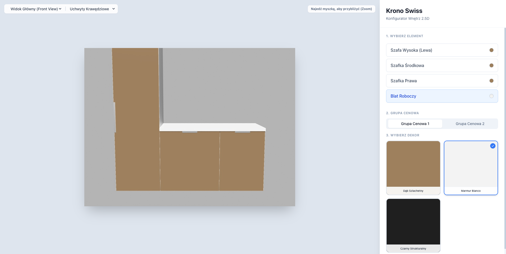
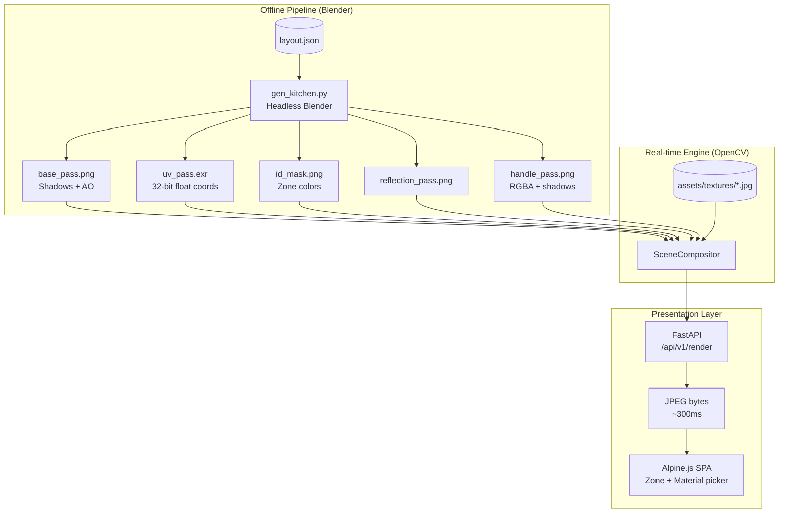
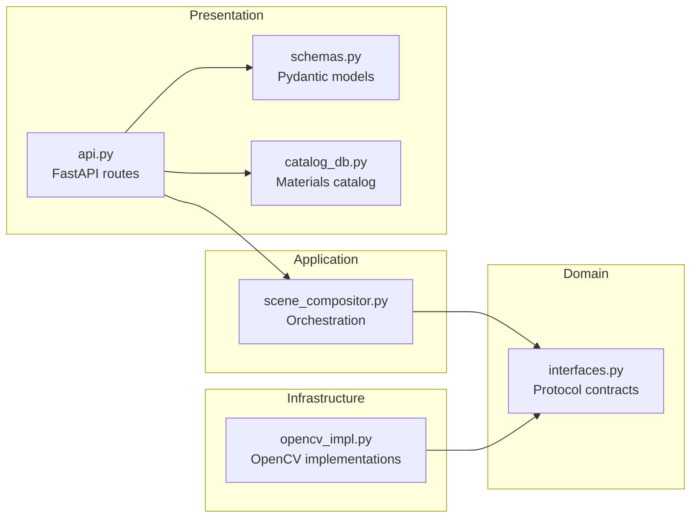
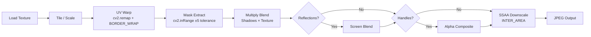

> Type: C+F | Status: frozen 2026-07 (see /docs/freeze/MIGRATION-STATUS-2026-07.md) | Role: Sales tool — first-visit 2.5D previews + decor picker | ADRs: 008, 011

# Krono Compositor MVP

A **2.5D image compositing engine** for real-time kitchen interior visualization. Users interactively swap materials (wood, marble, stone) on pre-rendered 3D kitchen scenes and see photorealistic results in ~500ms.



## How It Works

The system splits the work into two phases:

1. **Offline (Blender)** — A headless Blender script generates 5 render passes from a JSON kitchen layout: base lighting, UV coordinates, ID masks, reflections, and handle shadows.
2. **Real-time (OpenCV)** — A FastAPI server reads those passes and composites new textures on-the-fly using UV warping, masking, and blend modes — no 3D re-rendering needed.

The frontend is a lightweight Alpine.js SPA that sends zone/material selections to the API and displays the result with mouse-zoom.

## Architecture



### Clean Architecture Layers



### Compositing Pipeline



## Quick Start

```bash
# Install dependencies
uv sync

# Run the server (serves frontend at http://localhost:8000)
uv run python main.py

# Run tests
uv run pytest -v
```

### Regenerating Scene Assets

If you have Blender installed, regenerate the 3D passes from `layout.json`:

```bash
blender -b -P gen_kitchen.py
```

## Project Structure

```
src/compositor/
├── domain/          # Protocol interfaces (no dependencies)
├── infrastructure/  # OpenCV implementations
├── application/     # SceneCompositor orchestration
└── presentation/    # FastAPI routes, Pydantic schemas, catalog

gen_kitchen.py       # Headless Blender script (5-pass renderer)
static/index.html    # Alpine.js + Tailwind frontend
layout.json          # Kitchen scene definition (cabinets, countertop, zones)
assets/              # Textures and rendered scene passes
```

## Key Design Decisions

- **Physical UV Scaling** — 1.0 UV unit = 1000mm. Textures repeat based on real-world dimensions, not arbitrary scale factors.
- **Synchronous FastAPI routes** — OpenCV is CPU-bound; `async` would block the event loop. FastAPI routes `def` (not `async def`) to a thread pool automatically.
- **Strict 500 errors** — Missing textures raise errors instead of falling back to defaults. Silent failures hide configuration problems.
- **Art vs Math separation** — Blender renders Art passes (Base, Reflections) with denoising/AA, and Math passes (UV, ID Mask) with filter=0.0 and dithering=0.0.

## Documentation

| Document                                                   | Description                                                                           |
| ---------------------------------------------------------- | ------------------------------------------------------------------------------------- |
| [Architecture](docs/architecture.md)                       | Architectural decisions, layered design, and key implementation choices               |
| [Blender Scene Reference](docs/specs/blender-scene-ref.md) | Camera, lighting, geometry, and render pass settings for `gen_kitchen.py`             |
| [Pipeline Rules](docs/specs/pipeline-rules.md)                   | Strict rules for separating Art passes from Math passes in the 3D→2D pipeline         |
| [Conflicting Paradigms](docs/archive/conflicting_paradigms.md)     | Why Blender's visual approximation and OpenCV's exact math require careful separation |
| [Rendering Improvements](docs/archive/rendering-improvements.md)   | Phased plan and status for improving render quality                                   |

### Reference Materials

| Document                                        | Description                                                                       |
| ----------------------------------------------- | --------------------------------------------------------------------------------- |
| [Blender Script Prompt](docs/archive/prompt_blender.md) | Prompt used to generate `gen_kitchen.py` — useful for understanding design intent |
| [Frontend UX Spec](docs/archive/prompt_web.md)          | UX requirements and layout that drove the Alpine.js frontend                      |

## Tech Stack

- **Backend**: Python 3.11, FastAPI, OpenCV, NumPy
- **Frontend**: Alpine.js, Tailwind CSS (CDN, zero build steps)
- **3D Pipeline**: Blender (headless, `bpy` Python API)
- **Testing**: pytest, pytest-cov

## License

MIT
