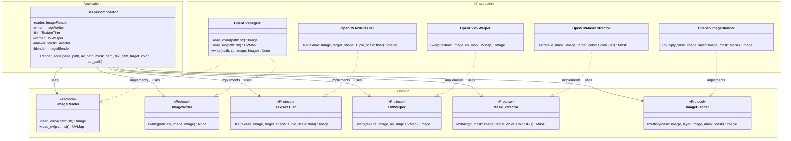

```mermaid
classDiagram
    %% Domain Layer (Interfaces)
    namespace Domain {
        class ImageReader {
            <<Protocol>>
            +read_color(path: str) Image
            +read_uv(path: str) UVMap
        }
        class ImageWriter {
            <<Protocol>>
            +write(path: str, image: Image) None
        }
        class TextureTiler {
            <<Protocol>>
            +tile(texture: Image, target_shape: Tuple, scale: float) Image
        }
        class UVWarper {
            <<Protocol>>
            +warp(texture: Image, uv_map: UVMap) Image
        }
        class MaskExtractor {
            <<Protocol>>
            +extract(id_mask: Image, target_color: ColorBGR) Mask
        }
        class ImageBlender {
            <<Protocol>>
            +multiply(base: Image, layer: Image, mask: Mask) Image
        }
    }

    %% Application Layer
    namespace Application {
        class SceneCompositor {
            -reader: ImageReader
            -writer: ImageWriter
            -tiler: TextureTiler
            -warper: UVWarper
            -masker: MaskExtractor
            -blender: ImageBlender
            +render_zone(base_path, uv_path, mask_path, tex_path, target_color, out_path)
        }
    }

    %% Infrastructure Layer (Concrete Implementations)
    namespace Infrastructure {
        class OpenCVImageIO {
            +read_color(path: str) Image
            +read_uv(path: str) UVMap
            +write(path: str, image: Image) None
        }
        class OpenCVTextureTiler {
            +tile(texture: Image, target_shape: Tuple, scale: float) Image
        }
        class OpenCVUVWarper {
            +warp(texture: Image, uv_map: UVMap) Image
        }
        class OpenCVMaskExtractor {
            +extract(id_mask: Image, target_color: ColorBGR) Mask
        }
        class OpenCVImageBlender {
            +multiply(base: Image, layer: Image, mask: Mask) Image
        }
    }

    %% Relationships
    SceneCompositor --> ImageReader : uses
    SceneCompositor --> ImageWriter : uses
    SceneCompositor --> TextureTiler : uses
    SceneCompositor --> UVWarper : uses
    SceneCompositor --> MaskExtractor : uses
    SceneCompositor --> ImageBlender : uses

    OpenCVImageIO ..|> ImageReader : implements
    OpenCVImageIO ..|> ImageWriter : implements
    OpenCVTextureTiler ..|> TextureTiler : implements
    OpenCVUVWarper ..|> UVWarper : implements
    OpenCVMaskExtractor ..|> MaskExtractor : implements
    OpenCVImageBlender ..|> ImageBlender : implements
```
