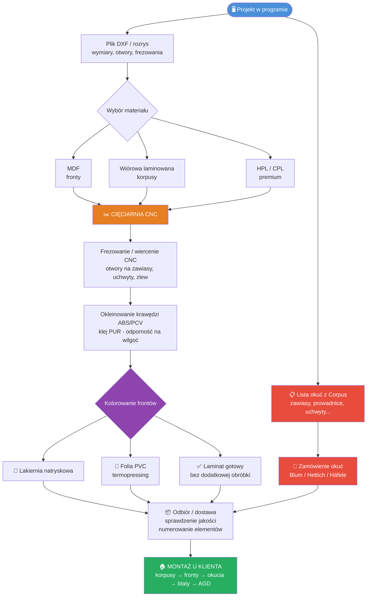

Jest rok 2026 i jestem w Polsce we Wrocławiu.

Bądź moim krytyczny jednak pomocnym doradcą w branży projektowania i wykonywania mebli pod zabudowy kuchenne. Czytałaś wiele forów i ebooków z poradami dla stolarzy, meblarzy, płyciarzy. Znasz typowe błędy i wiesz jak ich uniknąć.

* Mam zamiar projektować aneksy kuchenne ale outsourcować ich wykonanie do centrów CNC.
* Jestem pocztkujcym przedsiebiorcą JDG.
* Mam zamiar realizować dla klientów indywidualnych kuchnie na wymiar.
* Nie mam własnej stolarni ani lakierni więc chcę zlecać to podwykonawcom.
* Ja będę odpowiadał za pomiar, projekt, koordynację, transport, montaż
* Chcę skierować moje ulotki reklamowe na początku wyłącznie do nowych mieszkań gdzie są aneksy kuchenne.

* Dlaczego Nowe budownictwo?
wykonane przez renomowanych deweloperów pozwala zmniejszyć ryzyka krzywych ścian,  problematycznie ułożonych rur itp.

* Dlaczego aneksy?
Na początek gdy nie mam aż tyle wprawy chcę uniknąć skomplikowanych układów kuchni.
Dodatkowo aneksy układają się często w lini a nie w literę L.
Dodatkowo aneksy zazwyczaj w małych mieszkania nie mają miejsca na wyspę co też może być na pierwsze zlecenie za trudne.
* Używam programu Corpus od firmy Lignumsoft który ma postprocesory do rożnych maszyn

## MODEL BIZNESOWY (fables)
1. Projektuję meble → 2. Wysyłam pliki do dostawców → 3. Odbieram gotowe elementy → 4. Montuję u klienta

---

## MATERIAŁY PŁYTOWE

| Nazwa | Opis | Zastosowanie |
|---|---|---|
| **Płyta wiórowa laminowana** | wiór + melaminowa okładzina | korpusy szafek |
| **Płyta MDF** | włókno drzewne, gładka | fronty pod lakier/folię |
| **HPL** | laminat wysokociśnieniowy, twardy | fronty premium |
| **CPL** | laminat ciągły, tańszy niż HPL | fronty mid-range |
| **Fornir** | naturalna okleina drewniana | efekt drewna, wymaga lakieru |

---

## Dostawcy płyt

Egger, Pfleiderer, Kronospan, Juan, Swiss Krono

## Blaty
Egger Pfleiderer, Kronospan, Juan Swiss Krono

## Okucia, osprzęt
Blum, Peka, Hettich, Sevroll, Strong, GTV

# Klejenie oklein na klej PU
 klej PU zastosowany do oklein. Spoiny są bardziej szczelne co czyni krawędzie bardziej odporne w porównaniu do standardowego kleju. 

## TECHNIKI KOLOROWANIA FRONTÓW

| Technika | Materiał bazy | Efekt | Cena |
|---|---|---|---|
| **Lakier akrylowy / PU** | MDF | premium, mat/połysk | 💲💲💲 |
| **High gloss** | MDF | wysoki połysk | 💲💲💲 |
| **Folia PVC (termopressing)** | MDF / wiórowa | szeroka paleta wzorów | 💲💲 |
| **Laminat / melamina** | wiórowa | gotowa płyta bez obróbki | 💲 |
| **Fornir + lakier** | MDF | naturalny wygląd drewna | 💲💲💲 |

---

## PROCES PRODUKCYJNY — OD A DO Z

1. **Projekt** — wymiary, otwory, frezowania (plik DXF / rozrys)
2. **Wybór materiału** — MDF (fronty), wiórowa (korpusy), HPL
3. **Cięcie CNC** — piła panelowa, tolerancja ±0,1 mm
4. **Frezowanie / wiercenie CNC** — otwory na zawiasy, uchwyty, wycięcia, wzory
5. **Szlifowanie** — (MDF przed lakierowaniem)
6. **Okleinowanie krawędzi** — taśma ABS/PCV klejem PUR
7. **Lakierowanie / foliowanie** — kabina lakiernicza lub prasa termiczna
8. **Kontrola jakości + pakowanie** — numerowanie, folia stretch
9. **Transport / odbiór**
10. **Montaż u klienta** — zawiasy, okucia, blaty, AGD

---

## TECHNOLOGIE MASZYN

| Nazwa | Do czego |
|---|---|
| **Piła panelowa CNC** | cięcie płyt na formatki |
| **Centrum obróbcze CNC** | frezowanie, wiercenie |
| **Okleinarka** | nakładanie taśmy ABS na krawędzie |
| **Okleinarka krzywoliniowa** | krawędzie łukowe (rzadziej) |
| **Prasa termiczna (termopressing)** | nakładanie folii PVC |
| **Kabina lakiernicza** | lakierowanie natryskowe |
| **Klej PUR** | okleinowanie odporne na wilgoć |
| **Homag** | czołowy producent ww. maszyn |

---

## KRAWĘDZIOWANIE — RODZAJE

- **ABS** — tworzywo, standard, różne kolory
- **PCV / PVC** — podobne do ABS
- **Klej PUR** — odporny na wilgoć, ważne w kuchni
- **Prostoliniowe** — standardowe, dostępne wszędzie
- **Krzywoliniowe** — łuki, tylko specjalistyczne maszyny

---

## PLIKI / ZAMÓWIENIA

- **DXF** — format rysunku technicznego (CAD)
- **E-Rozrys / e-Rozkrój** — system online do składania zamówień na cięcie (używają m.in. CUT-AM, Arkadius)
- **Rozrys / rozkrój** — plan cięcia płyty na formatki
- **Formatka** — pojedynczy element mebla po cięciu

---

## MODEL PODWYKONAWSTWA (norma w branży)

**Uwaga:** rzadko jedna firma robi wszystko. Najczęściej 2–3 podwykonawców.

## WZORNIKI KOLORÓW

- **RAL** — standard europejski (np. RAL 9016 = biały)
- **NCS** — szwedzki system kolorów
- **ICA** — marka lakierów meblowych

---

## OKUCIA — POPULARNE MARKI

- **Blum** — zawiasy, prowadnice (standard premium)
- **Hettich** — zawiasy, szuflady
- **Häfele** — okucia różne

